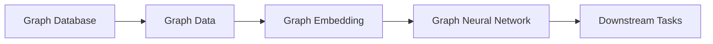
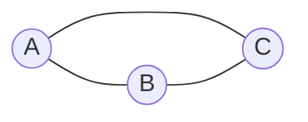

# 图神经网络的图数据存储与图数据管理

关键词：图神经网络、图数据存储、图数据管理、图数据库、图嵌入、GNN

## 1. 背景介绍 
### 1.1 问题的由来
随着大数据时代的到来,越来越多的数据呈现出图结构的特点,传统的关系型数据库已经无法满足复杂的图数据存储和管理需求。图神经网络(Graph Neural Networks, GNNs)作为一种新兴的深度学习模型,在处理图结构数据方面表现出色。然而,GNN的训练和推理都需要高效的图数据存储和管理作为支撑。

### 1.2 研究现状
目前,针对图数据的存储和管理,主要有以下几种方案:
- 关系型数据库:将图数据映射到二维表,但难以表达复杂的图拓扑结构
- NoSQL数据库:采用键值对、文档等方式存储图数据,支持横向扩展,但查询效率较低
- 图数据库:专门为图数据设计的数据库,支持高效的图查询和遍历,代表有Neo4j、JanusGraph等
- 分布式图处理框架:如Pregel、GraphX等,在分布式集群上对大规模图数据进行并行计算

在GNN领域,目前缺乏统一高效的图数据存储和管理方案,导致GNN的落地应用受到限制。

### 1.3 研究意义
探索适合GNN的图数据存储和管理方案,对于推动GNN技术的发展和应用具有重要意义:
- 提高GNN的训练和推理效率,让GNN模型能够处理更大规模的图数据
- 方便GNN应用的开发和部署,减少开发者的工作量
- 促进GNN技术与图数据库、分布式计算等领域的融合创新
- 拓展GNN的应用场景,如知识图谱、社交网络、推荐系统等

### 1.4 本文结构
本文将围绕图神经网络的图数据存储与管理展开,主要内容包括:
- 第2部分: 介绍图神经网络、图数据库等核心概念
- 第3部分: 分析图同构网络算法的原理和实现步骤
- 第4部分: 介绍图数据的数学建模方法和常用公式
- 第5部分: 给出图数据存储和查询的代码实例
- 第6部分: 探讨图数据管理在GNN中的典型应用场景
- 第7部分: 推荐图数据相关的工具和学习资源
- 第8部分: 总结全文,展望图数据管理的未来发展方向和挑战
- 第9部分: 附录,回答图数据管理的常见问题

## 2. 核心概念与联系
在讨论GNN中的图数据存储和管理之前,首先需要明确几个核心概念:
- 图(Graph):由节点(Node)和边(Edge)组成的数据结构,用于表示事物之间的关系。常见的图类型有无向图、有向图、加权图等。
- 图数据库(Graph Database):专门用于存储和管理图数据的数据库系统。图数据库采用节点、关系(边)作为基本的存储单元,支持图的CRUD操作和图算法。代表有Neo4j、JanusGraph、ArangoDB等。
- 图神经网络(GNN):一种深度学习模型,能够直接在图结构数据上进行端到端学习。GNN通过迭代聚合邻居节点的特征,学习出节点的嵌入表示,再完成下游任务。常见的GNN模型有GCN、GAT、GraphSAGE等。
- 图嵌入(Graph Embedding):将图的节点映射到低维向量空间,同时保留图的结构信息。图嵌入是GNN的核心操作,使得神经网络能够处理非欧空间的图数据。TransE、Node2Vec、GraphSAGE等都是常用的图嵌入方法。

图数据库为GNN提供了原生的图数据存储和查询能力。GNN在训练和推理过程中,需要不断地对图数据进行采样、聚合等操作,高效的图数据供给是保证GNN性能的关键。同时,图嵌入作为GNN的前置步骤,也需要图数据库的支持。因此,图数据库、GNN和图嵌入技术是紧密相连、相辅相成的。



## 3. 核心算法原理 & 具体操作步骤
### 3.1 算法原理概述
图同构网络(Graph Isomorphism Network, GIN)是一种强大的GNN模型,它基于WL图同构测试,能够区分任意图结构。GIN的核心思想是:如果两个图在聚合邻居信息后节点表示仍然相同,那么这两个图就是同构的。

### 3.2 算法步骤详解
GIN的前向传播过程可以分为以下步骤:
1. 初始化节点表示: $h_v^{(0)} = X_v$
2. 迭代K轮聚合更新
   
   for k = 1...K do
   
   $h_v^{(k)} = MLP^{(k)}((1+\epsilon^{(k)}) \cdot h_v^{(k-1)} + \sum_{u \in N(v)} h_u^{(k-1)})$
3. 图表示: $h_G = READOUT({h_v^{(K)}|v \in G})$
4. 下游任务: $y = CLASSIFIER(h_G)$

其中,$h_v^{(k)}$表示第k轮聚合后节点v的嵌入表示,$\epsilon$是可学习的参数,MLP是多层感知机,READOUT是图层面的池化操作,如求和/平均。

### 3.3 算法优缺点
GIN的优点在于:
- 图同构性:理论上证明了GIN对图同构的判别能力与WL测试等价
- 可学习性:引入可学习参数,增强了模型的表达能力
- 归纳偏置:假设节点聚合可以由MLP拟合,符合归纳学习范式

GIN的缺点包括:  
- 计算复杂度较高,需要在每个节点上执行MLP
- 超参数较多,如聚合轮数K,不易调优
- 对异构图、动态图的建模能力有限

### 3.4 算法应用领域  
GIN及其变体在图分类、图回归、图匹配等任务上取得了不错的效果,已成为GNN领域的主流模型之一。典型的应用有:
- 分子属性预测:将分子视为图,原子为节点,化学键为边,用GIN预测分子的理化性质
- 社交网络分析:用GIN刻画用户之间的社交关系,预测用户的社群归属、购买意向等
- 代码表示学习:将源代码抽象为抽象语法树,用GIN提取代码的语义表示,助力代码理解与生成

## 4. 数学模型和公式 & 详细讲解 & 举例说明
### 4.1 数学模型构建
图神经网络可以看作是在图信号上的卷积操作,其数学模型为:

$$H^{(k)} = \sigma(\tilde{D}^{-\frac{1}{2}} \tilde{A} \tilde{D}^{-\frac{1}{2}} H^{(k-1)}W^{(k-1)})$$

其中,$H^{(k)}$是第k层的节点表示矩阵,$\tilde{A}=A+I_N$是加入自环的邻接矩阵,$\tilde{D}$为$\tilde{A}$的度矩阵,$W$是可学习的权重矩阵,$\sigma$是激活函数。

### 4.2 公式推导过程
以上公式可以从图信号处理的角度推导得到。将图看作一个N维空间,节点的特征就是定义在图上的信号。图卷积的定义为:

$$g_\theta * x = Ug_\theta U^Tx$$

其中, $U$是图拉普拉斯矩阵$L$的特征向量矩阵。考虑到$L$的特征分解计算代价较大,因此用一阶近似:

$$g_\theta * x \approx \theta_0x + \theta_1(L-I_N)x$$

再进一步简化并引入可学习参数,就得到了GCN的最终形式。

### 4.3 案例分析与讲解
下面以一个简单的图为例,手工计算GCN的前向传播过程。


上图中有三个节点{A,B,C},两两之间都有边相连。假设初始节点特征为:

$$X=\begin{bmatrix}
1 & 0 \\
0 & 1 \\
1 & 1 \\
\end{bmatrix}$$

邻接矩阵为:
$$A=\begin{bmatrix}
0 & 1 & 1 \\ 
1 & 0 & 1\\
1 & 1 & 0\\
\end{bmatrix}$$

加入自环后:
$$\tilde{A}=\begin{bmatrix}
1 & 1 & 1 \\ 
1 & 1 & 1\\
1 & 1 & 1\\
\end{bmatrix}$$

度矩阵:
$$\tilde{D}=\begin{bmatrix}
3 & 0 & 0 \\ 
0 & 3 & 0\\
0 & 0 & 3\\
\end{bmatrix}$$

假设权重矩阵为$W=\begin{bmatrix} 1 & 1 \\ 1 & 1\end{bmatrix}$,代入GCN公式可得:

$$H^{(1)} = \tilde{D}^{-\frac{1}{2}} \tilde{A} \tilde{D}^{-\frac{1}{2}}XW$$

$$=\begin{bmatrix}
\frac{1}{\sqrt{3}} & 0 & 0\\ 
0 & \frac{1}{\sqrt{3}} & 0\\
0 & 0 & \frac{1}{\sqrt{3}}\\
\end{bmatrix}
\begin{bmatrix}
1 & 1 & 1\\ 
1 & 1 & 1\\
1 & 1 & 1\\  
\end{bmatrix}
\begin{bmatrix}
\frac{1}{\sqrt{3}} & 0 & 0\\ 
0 & \frac{1}{\sqrt{3}} & 0\\
0 & 0 & \frac{1}{\sqrt{3}}\\
\end{bmatrix}
\begin{bmatrix}
1 & 0\\ 
0 & 1\\
1 & 1\\
\end{bmatrix}
\begin{bmatrix}
1 & 1\\ 
1 & 1\\
\end{bmatrix}$$

$$=\begin{bmatrix}
1 & 1\\ 
1 & 1\\
1 & 1\\
\end{bmatrix}$$

可见,此时所有节点的嵌入表示都收敛到了相同的值。这直观地展示了GCN的平滑效应。

### 4.4 常见问题解答
Q: 为什么要在邻接矩阵中加入自环?
A: 加自环等价于在聚合时考虑节点自身的特征,能够缓解过度平滑问题,提高收敛稳定性。

Q: 为什么要用对称归一化的拉普拉斯矩阵?
A: 对称归一化保证了传播矩阵的谱半径为1,使得梯度下降过程更加平稳。同时有助于减小度数较大节点的影响。

Q: GCN能否处理有向图和带权图?
A: GCN假设边是无向且同质的,但通过修改邻接矩阵的定义,是可以处理有向图和带权图的。如GAT利用注意力机制赋予边不同的权重。

## 5. 项目实践：代码实例和详细解释说明
### 5.1 开发环境搭建
推荐使用Python作为GNN项目的开发语言,需要安装以下库:
- PyTorch: Facebook开源的深度学习框架
- PyTorch Geometric (PyG): 专门用于图神经网络的库,封装了大量数据集和算法
- NetworkX: 用于图数据处理和分析的库
- NumPy, SciPy, Pandas: 常用的科学计算库

### 5.2 源代码详细实现
下面给出用PyG实现GIN的核心代码:

```python
import torch
import torch.nn as nn
import torch.nn.functional as F
from torch_geometric.nn import GINConv, global_add_pool

class GIN(nn.Module):
    def __init__(self, input_dim, hidden_dim, output_dim, num_layers):
        super(GIN, self).__init__()
        self.num_layers = num_layers
        self.convs = nn.Mo