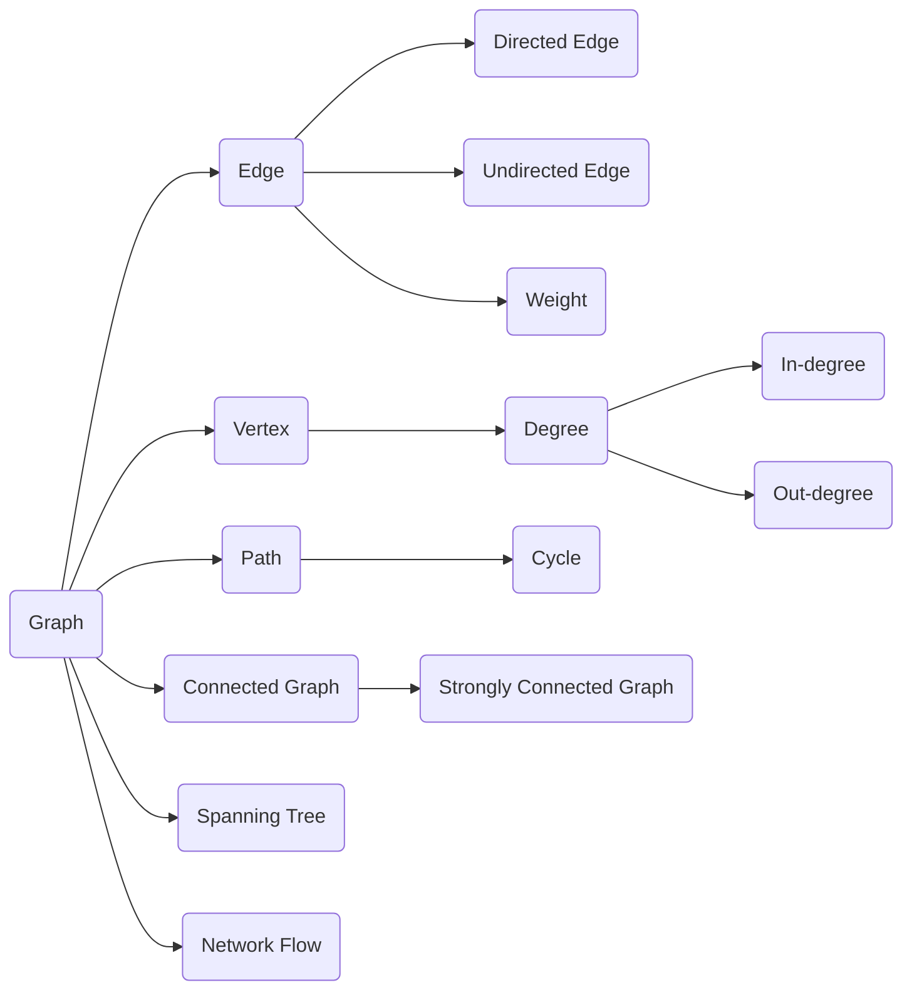

# 图算法 原理与代码实例讲解

作者：禅与计算机程序设计艺术 / Zen and the Art of Computer Programming

## 1. 背景介绍

### 1.1 问题的由来

图是一种非常重要的数据结构,在计算机科学、数学、物理学、生物学、社会学等众多领域都有广泛应用。许多实际问题都可以抽象和建模成图论问题,如最短路径、最小生成树、网络流等。图算法是用来解决这些问题的重要工具。

### 1.2 研究现状

目前,图算法的研究已经取得了长足的进步。经典的图算法如 Dijkstra 算法、Floyd 算法、Kruskal 算法等在理论和实践中都得到了广泛应用。近年来,随着大数据、人工智能等技术的发展,图算法在图神经网络、知识图谱、推荐系统等领域展现出了新的应用前景。

### 1.3 研究意义

深入研究图算法,对于解决实际问题、优化算法性能、拓展应用场景都具有重要意义。一方面,图算法是算法设计与分析中的重要内容,研究图算法有助于提高算法思维和编程能力。另一方面,图算法在诸多领域有着广泛应用,深入理解图算法原理,对于解决实际问题具有指导意义。

### 1.4 本文结构

本文将围绕图算法展开深入探讨。首先介绍图论的核心概念和基本术语。然后重点讲解几种经典图算法的原理、步骤、数学模型、代码实现以及应用实例。接着总结图算法的发展趋势与面临的挑战。最后提供一些学习资源和常见问题解答,帮助读者进一步学习和掌握图算法。

## 2. 核心概念与联系

在讨论图算法之前,我们先来了解一下图论的一些核心概念:

- 图(Graph):由顶点(Vertex)和边(Edge)组成的数据结构。
- 顶点/节点(Vertex/Node):图中的基本元素,代表事物。
- 边(Edge):连接两个顶点,表示它们之间的关系。
- 有向边(Directed Edge):有方向的边,用有向线段表示。
- 无向边(Undirected Edge):没有方向的边,用直线段表示。
- 权重(Weight):边上的数值,表示两个顶点之间的距离或成本。
- 度(Degree):与一个顶点相连的边数。
- 入度(In-degree):指向某顶点的边数。
- 出度(Out-degree):从某顶点出发的边数。
- 路径(Path):由边连接的一系列顶点。
- 环路(Cycle):起点和终点为同一个顶点的路径。
- 连通图(Connected Graph):任意两个顶点之间都存在路径。
- 强连通图(Strongly Connected Graph):有向图中任意两个顶点之间都存在方向路径。
- 生成树(Spanning Tree):连通图的极小连通子图,含有图中全部顶点,但边数最少。
- 网络流(Network Flow):在一个网络上从源点到汇点的流量。

下面是这些概念之间的联系图:



理解这些概念之间的联系,对于学习图算法非常重要。在下文中,我们将应用这些概念来讲解几种常见的图算法。

## 3. 核心算法原理 & 具体操作步骤

### 3.1 算法原理概述

图算法主要用于解决图上的各种问题,如最短路径、最小生成树、拓扑排序、关键路径等。这些算法都基于图的基本性质和特点,利用不同的策略来实现高效计算。下面我们重点介绍几种经典图算法的原理。

### 3.2 算法步骤详解

#### 3.2.1 Dijkstra 最短路径算法

Dijkstra 算法是一种用于计算带权有向图中单源最短路径的贪心算法。其基本步骤如下:

1. 初始化:
   - 创建距离数组 dist,记录源点到每个顶点的最短距离,初始化为无穷大。
   - 创建访问数组 visited,记录每个顶点是否已访问,初始化为 false。
   - 将源点的 dist 值设为0,加入优先队列。
2. 循环直到优先队列为空:  
   - 取出 dist 最小的未访问顶点 u。
   - 将 u 标记为已访问。
   - 遍历 u 的所有邻居 v:
     - 如果 v 未访问 且 dist[u] + w(u,v) < dist[v]:
       - 更新 dist[v] = dist[u] + w(u,v)
       - 将 v 加入优先队列
3. 返回 dist 数组,即为源点到每个顶点的最短距离。

算法的时间复杂度为 $O((V+E)logV)$,其中 V 为顶点数,E 为边数。

#### 3.2.2 Floyd 最短路径算法 

Floyd 算法是一种用于计算带权有向图中任意两点间最短路径的动态规划算法。其基本步骤如下:

1. 初始化距离矩阵 dist:
   - 如果 i = j,dist[i][j] = 0
   - 如果 i 和 j 之间有边,dist[i][j] = w(i,j)
   - 否则,dist[i][j] = 无穷大
2. 三重循环:
   - 遍历中间点 k,从0到 V-1
   - 遍历起点 i,从0到 V-1  
   - 遍历终点 j,从0到 V-1
     - 如果 dist[i][k] + dist[k][j] < dist[i][j]
       - 更新 dist[i][j] = dist[i][k] + dist[k][j]
3. 返回 dist 矩阵,dist[i][j] 即为顶点 i 到顶点 j 的最短距离。

算法的时间复杂度为 $O(V^3)$,其中 V 为顶点数。

#### 3.2.3 Kruskal 最小生成树算法

Kruskal 算法是一种用于寻找加权无向连通图的最小生成树的贪心算法。其基本步骤如下:

1. 创建边集数组 edges,将图的所有边加入数组。
2. 对 edges 数组按照权重从小到大排序。
3. 初始化一个空的生成树 mst。
4. 遍历排序后的 edges 数组:
   - 取出权重最小的边 e。
   - 如果 e 的两个顶点不在同一个连通分量中:
     - 将 e 加入 mst
     - 合并 e 两个顶点所在的连通分量
5. 返回 mst,即为最小生成树。

算法的时间复杂度为 $O(ElogE)$,其中 E 为边数。

#### 3.2.4 拓扑排序算法

拓扑排序是对有向无环图(DAG)的顶点进行排序,使得对于每条有向边 (u,v),u 都排在 v 之前。其基本步骤如下:

1. 创建入度数组 indegree,记录每个顶点的入度,初始化为0。
2. 遍历图中的所有边 (u,v):  
   - indegree[v]++
3. 创建一个队列 queue,将所有入度为0的顶点加入队列。
4. 创建一个空的排序结果数组 result。
5. 当 queue 不为空时:
   - 取出队首顶点 u
   - 将 u 加入 result
   - 遍历 u 的所有邻居 v:
     - indegree[v]--
     - 如果 indegree[v] = 0,将 v 加入 queue
6. 如果 result 包含了图的所有顶点,返回 result 作为拓扑排序结果,否则图中存在环,无法进行拓扑排序。

算法的时间复杂度为 $O(V+E)$,其中 V 为顶点数,E 为边数。

### 3.3 算法优缺点

- Dijkstra 算法:
  - 优点:可以高效地求解单源最短路径。
  - 缺点:要求图中不存在负权边。
- Floyd 算法:  
  - 优点:可以求解任意两点间的最短路径。
  - 缺点:时间复杂度较高,不适合大规模图。
- Kruskal 算法:
  - 优点:可以高效地求解最小生成树。
  - 缺点:不能处理带负权边的图。
- 拓扑排序算法:
  - 优点:可以判断图是否有环,得到顶点的拓扑顺序。
  - 缺点:只适用于有向无环图。

### 3.4 算法应用领域

图算法在许多领域都有广泛应用,例如:

- 交通运输:最短路径规划、交通流量控制。
- 通信网络:网络路由、流量工程。
- 社交网络:好友推荐、影响力分析。
- 电子商务:商品推荐、用户行为分析。
- 生物信息:基因序列比对、蛋白质互作网络。
- 人工智能:知识图谱、语义分析。

## 4. 数学模型和公式 & 详细讲解 & 举例说明

### 4.1 数学模型构建

在图论中,我们通常使用邻接矩阵或邻接表来表示一个图。

- 邻接矩阵:用一个 $n*n$ 的矩阵 A 表示一个有 n 个顶点的图 G。当顶点 i 和 j 之间有边时,A[i][j]=1,否则为0。如果是带权图,A[i][j] 为边的权重。
- 邻接表:用一个长度为 n 的数组 Adj 表示图 G,每个元素是一个链表,存储顶点 i 的所有邻居。

例如,下图用邻接矩阵和邻接表表示:

```
  1——2    
  |  | \    
  |  |  3
  |  | /
  4——5
```

邻接矩阵:
$$
\begin{bmatrix}
0 & 1 & 0 & 1 & 0\\
1 & 0 & 1 & 0 & 1\\
0 & 1 & 0 & 0 & 1\\
1 & 0 & 0 & 0 & 1\\
0 & 1 & 1 & 1 & 0
\end{bmatrix}
$$

邻接表:
```
1: [2, 4]
2: [1, 3, 5]  
3: [2, 5]
4: [1, 5]
5: [2, 3, 4]
```

### 4.2 公式推导过程

以 Dijkstra 算法为例,我们来推导其数学公式。

设 dist[i] 表示源点 s 到顶点 i 的最短距离,对于边 (u,v),其权重为 w(u,v)。则有:

$$
dist[v]=
\begin{cases}
0 & v=s \\
min\{dist[v], dist[u]+w(u,v)\} & v\neq s
\end{cases}
$$

即源点到自身的距离为0,到其他顶点的距离要么保持不变,要么可以通过 u 进行松弛。

根据这个公式,我们可以得到 Dijkstra 算法的核心松弛操作:

$$dist[v]=min\{dist[v], dist[u]+w(u,v)\}$$

通过不断执行松弛操作,最终得到源点到所有顶点的最短距离。

### 4.3 案例分析与讲解

我们以上面的无向图为例,用 Dijkstra 算法求顶点1到其他顶点的最短距离。

初始状态:
```
dist: [0, ∞, ∞, ∞, ∞]
visited: [false, false, false, false, false]
```

第一次松弛:
```
选择顶点1,标记为已访问
dist[2] = min{∞, 0+1} = 1
dist[4] = min{∞, 0+1} = 1
dist: [0, 1, ∞, 1, ∞]
```

第二次松弛:
```  
选择顶点2,标记为已访问
dist[3] = min{∞, 1+1} = 2
dist