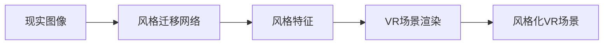

# 基于生成对抗网络的图像风格迁移在虚拟现实中的应用

作者：禅与计算机程序设计艺术 / Zen and the Art of Computer Programming

关键词：生成对抗网络、图像风格迁移、虚拟现实、深度学习、计算机视觉

## 1. 背景介绍

### 1.1 问题的由来

随着虚拟现实(Virtual Reality, VR)技术的不断发展,人们对沉浸式体验的追求越来越高。如何在虚拟场景中呈现出更加逼真、艺术感十足的视觉效果,成为了VR领域亟待解决的问题。传统的图像渲染方法往往需要大量的人工设计和调试,难以快速生成多样化的艺术风格。近年来,以生成对抗网络(Generative Adversarial Networks, GANs)为代表的深度学习算法为这一难题提供了新的思路。

### 1.2 研究现状

生成对抗网络自2014年被提出以来,在图像生成、风格迁移等任务上取得了瞩目成果。Goodfellow等人提出的原始GAN通过生成器和判别器的对抗学习,可以生成逼真的图像[1]。此后,各种改进的GAN模型如DCGAN[2]、CycleGAN[3]等被相继提出,不断刷新着图像生成的质量。Gatys等人开创性地将卷积神经网络应用于图像风格迁移,实现了将一幅图像的风格迁移到另一幅图像的内容中[4]。Johnson等人进一步提出了一种快速的风格迁移模型,大幅提升了生成速度[5]。这些研究成果为将风格迁移应用于VR领域奠定了基础。

### 1.3 研究意义

将基于GAN的图像风格迁移技术应用于VR,有望显著提升虚拟场景的艺术表现力,为用户带来更加沉浸的视觉体验。传统VR场景的构建需要美术设计师的大量参与,而风格迁移可以自动将现实世界的图像转换为各种艺术风格,大大降低了内容生产成本。此外,风格迁移的多样性有助于创造出千变万化的VR场景,让用户在虚拟世界中获得更加丰富多彩的体验。因此,深入研究图像风格迁移在VR中的应用具有重要的理论和实践意义。

### 1.4 本文结构

本文将围绕基于GAN的图像风格迁移在VR中的应用展开深入探讨。第2节介绍风格迁移和VR的核心概念及二者的联系。第3节重点阐述风格迁移的核心算法原理,并给出详细的操作步骤。第4节建立风格迁移的数学模型,推导相关公式,并通过案例加以说明。第5节给出风格迁移在VR中的代码实现,并对关键部分进行解读。第6节讨论风格迁移技术在VR领域的实际应用场景和未来前景。第7节推荐相关的学习资源、开发工具和文献。第8节总结全文,并对未来的研究方向进行展望。

## 2. 核心概念与联系

图像风格迁移指的是将一幅图像的风格特征迁移到另一幅图像中,使其在保留原始内容的同时呈现出目标风格的视觉效果。其核心是分别提取内容图像的内容特征和风格图像的风格特征,并将二者融合到一起,生成风格迁移后的图像。

虚拟现实是利用计算机模拟产生一个三维空间的虚拟世界,提供沉浸式的用户体验。它需要逼真的视觉渲染作为重要支撑。将图像风格迁移应用到VR中,可以自动生成各种艺术风格的虚拟场景图像,替代传统的手工建模渲染,从而极大地丰富VR场景的视觉表现力。

风格迁移和VR的结合,实质上是计算机视觉和计算机图形学的交叉融合。风格迁移负责从现实图像中学习提取多样的风格特征,VR则利用这些风格特征对虚拟场景进行渲染,二者相辅相成,共同创造出艺术感十足的沉浸式虚拟体验。下图展示了将风格迁移应用于VR的整体架构:

## 3. 核心算法原理 & 具体操作步骤

### 3.1 算法原理概述

基于GAN的图像风格迁移的核心思想是将风格迁移问题建模为一个图像到图像的翻译问题,通过生成器网络G学习将内容图像x映射为具有目标风格特征的图像y,再通过判别器网络D判断生成图像与真实风格图像的相似程度,并引导G生成更加逼真的风格化图像。整个过程通过生成器和判别器的对抗学习来实现。

### 3.2 算法步骤详解

1. 准备数据集,包括内容图像和风格图像。
2. 设计并训练生成器网络G,它接收内容图像x作为输入,生成风格化图像G(x)。通常采用编码器-解码器架构,并使用残差块等结构。
3. 设计并训练判别器网络D,它接收真实风格图像y和生成图像G(x),输出二者的真假概率。通常采用卷积神经网络分类器。
4. 训练过程中,固定G,优化D,使其能够准确判别真实风格图像和生成图像。
5. 固定D,优化G,使其能够生成更加逼真的风格化图像以欺骗D。
6. 交替训练D和G,直到模型收敛,得到最终的风格迁移模型G。
7. 测试阶段,对任意内容图像x,通过G(x)生成其风格化版本,再将其用于VR场景渲染。

### 3.3 算法优缺点

优点:
- 端到端的训练方式,不需要预先定义风格特征,可以自适应地学习各种风格。  
- 生成效果逼真,能够同时保留内容图像的语义信息和风格图像的纹理特征。
- 一次训练,可多次使用,适合大规模生成各种风格的VR场景图像。

缺点:  
- 训练过程需要大量数据和计算资源,对硬件要求较高。
- 难以精细控制生成图像的细节,有时会出现伪影等问题。
- 不同风格之间的过渡效果欠佳,难以实现连续的风格变换。

### 3.4 算法应用领域

基于GAN的图像风格迁移除了在VR领域有广泛应用前景外,还可应用于以下领域:

- 艺术创作:自动生成各种艺术风格的图像,辅助艺术家进行创作。
- 游戏设计:快速生成不同风格的游戏场景,丰富游戏画面表现力。
- 电影特效:为电影镜头添加特定的艺术风格,增强视觉冲击力。
- 用户交互:让用户自定义图像风格,提供个性化的交互体验。

## 4. 数学模型和公式 & 详细讲解 & 举例说明

### 4.1 数学模型构建

设内容图像为x,风格图像为y,生成器为G,判别器为D。风格迁移的目标是学习一个生成器G,使得G(x)在内容上接近x,在风格上接近y。用数学语言描述如下:

$$\min_G \max_D \mathcal{L}_{GAN}(G, D) + \lambda_c \mathcal{L}_{content}(G) + \lambda_s \mathcal{L}_{style}(G)$$

其中,$\mathcal{L}_{GAN}$是生成器和判别器的对抗损失,$\mathcal{L}_{content}$是内容损失,$\mathcal{L}_{style}$是风格损失,$\lambda_c$和$\lambda_s$是平衡三个损失项的权重系数。

对抗损失$\mathcal{L}_{GAN}$定义为:

$$\mathcal{L}_{GAN}(G, D) = \mathbb{E}_{y}[\log D(y)] + \mathbb{E}_{x}[\log (1 - D(G(x)))]$$

其中,$\mathbb{E}$表示期望。该损失函数鼓励生成器生成更加逼真的风格化图像以欺骗判别器。

内容损失$\mathcal{L}_{content}$定义为:

$$\mathcal{L}_{content}(G) = \mathbb{E}_{x,y}[\|f(G(x)) - f(x)\|_2^2]$$

其中,$f$表示预训练的卷积神经网络提取的特征图,$\|\cdot\|_2$表示L2范数。该损失函数鼓励生成图像与内容图像在卷积特征上接近,保留内容信息。

风格损失$\mathcal{L}_{style}$定义为:  

$$\mathcal{L}_{style}(G) = \mathbb{E}_{x,y}[\|G(f(x)) - f(y)\|_2^2]$$

该损失函数鼓励生成图像与风格图像在卷积特征上接近,获得风格特征。

### 4.2 公式推导过程

以内容损失$\mathcal{L}_{content}$为例,推导其梯度表达式。首先将其展开:

$$\mathcal{L}_{content}(G) = \mathbb{E}_{x,y}[\sum_i(f_i(G(x)) - f_i(x))^2]$$

其中,$i$表示特征图的通道索引。对生成器G求梯度,得:

$$\nabla_G \mathcal{L}_{content}(G) = \mathbb{E}_{x,y}[\sum_i 2(f_i(G(x)) - f_i(x)) \nabla_G f_i(G(x))]$$

根据链式法则,有:

$$\nabla_G f_i(G(x)) = \frac{\partial f_i}{\partial G(x)} \frac{\partial G(x)}{\partial G}$$

将其代入,得到内容损失对生成器G的梯度:

$$\nabla_G \mathcal{L}_{content}(G) = 2 \mathbb{E}_{x,y}[\sum_i (f_i(G(x)) - f_i(x)) \frac{\partial f_i}{\partial G(x)} \frac{\partial G(x)}{\partial G}]$$

同理可推导出对抗损失和风格损失的梯度表达式。

### 4.3 案例分析与讲解

下面以一个具体的风格迁移案例来说明模型的训练过程。假设我们要将梵高的《星夜》的风格迁移到一张城市街景图像上。

首先,我们准备好训练数据集,包括大量的城市街景图像作为内容图像,以及梵高的多幅画作作为风格图像。然后,我们设计并初始化生成器G和判别器D的网络结构。

在训练过程中,我们交替优化G和D。对于生成器G,我们从数据集中随机采样一批内容图像,将其输入G生成相应的风格化图像。然后,我们通过内容损失、风格损失和对抗损失来计算G的损失函数,并用梯度下降法更新G的参数,使其能够生成更加逼真的梵高风格画。对于判别器D,我们从数据集中随机采样一批真实的梵高画作和G生成的风格化图像,将其输入D进行真假判别。我们通过对抗损失来计算D的损失函数,并用梯度上升法更新D的参数,使其能够更好地区分真实画作和生成图像。

经过多轮的交替训练后,生成器G能够将任意城市街景图像转换为梵高风格的画作,实现了风格迁移。我们可以用训练好的模型G对新的城市图像进行风格化处理,再将生成的图像应用到VR场景的渲染中,从而获得具有梵高艺术风格的沉浸式VR体验。

### 4.4 常见问题解答

Q: 训练风格迁移模型需要多少数据和时间?
A: 这取决于所用的数据集和模型复杂度。通常需要上千张内容图像和风格图像,并在GPU上训练数小时到数天不等。

Q: 一个训练好的风格迁移模型能否适用于多种风格?
A: 通常一个模型只能学习一种特定的风格。要实现多风格迁移