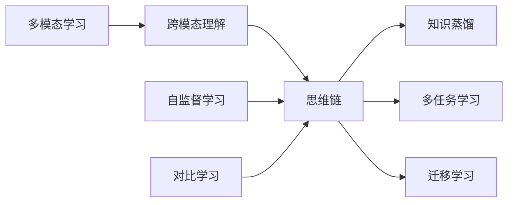

# 多模态大模型：技术原理与实战 思维链方法

关键词：多模态大模型、跨模态理解、思维链、自监督学习、对比学习、知识蒸馏、多任务学习、迁移学习

## 1. 背景介绍
### 1.1  问题的由来
随着人工智能技术的飞速发展,单模态的深度学习模型已经在各自领域取得了巨大的成功。然而,现实世界中的信息往往以多种模态形式存在,如文本、图像、音频、视频等。单模态模型难以有效利用不同模态之间的互补信息,无法实现对现实世界的全面理解。因此,研究多模态大模型,实现跨模态理解和生成,成为了人工智能领域的重要课题。

### 1.2  研究现状
目前,多模态大模型的研究主要集中在以下几个方面:

1. 多模态表示学习:通过自监督学习、对比学习等方法,学习不同模态数据的统一表示,实现跨模态理解。代表工作有CLIP、ALIGN等。

2. 多模态融合:探索不同模态信息的融合方式,如早期融合、晚期融合、交互式融合等,提高模型的跨模态理解能力。

3. 多模态生成:利用生成式模型,如VAE、GAN等,实现从一种模态到另一种模态的转换生成,如文本到图像、语音到文本等。

4. 多模态迁移学习:利用已有的大规模单模态预训练模型,通过迁移学习的方式,快速构建多模态模型,减少训练成本。

### 1.3  研究意义
多模态大模型的研究具有重要的理论和实践意义:

1. 推动人工智能向通用智能迈进:多模态大模型能够实现对不同模态信息的理解和生成,是构建通用人工智能系统的重要基础。

2. 拓展人机交互的边界:多模态大模型可以支持更加自然、灵活的人机交互方式,如语音对话、图像问答等,极大地提升用户体验。

3. 赋能行业应用:多模态大模型可以应用于智能客服、医疗影像分析、视频内容理解等众多领域,为行业智能化升级提供新的技术支撑。

### 1.4  本文结构
本文将围绕多模态大模型的技术原理和实战应用展开讨论。首先,介绍多模态大模型的核心概念和关键技术。然后,重点阐述多模态大模型的思维链方法,包括其数学模型、算法原理和实现步骤。接着,通过代码实例和应用场景分析,展示多模态大模型的实际应用价值。最后,总结多模态大模型的研究现状,展望其未来发展趋势和面临的挑战。

## 2. 核心概念与联系
多模态大模型涉及以下核心概念:

1. 多模态学习:旨在处理和理解来自多个模态的信息,实现跨模态的信息融合和知识迁移。

2. 跨模态理解:指模型能够理解不同模态数据之间的语义关联,如文本与图像、音频与文本等。

3. 思维链:一种多模态大模型的实现范式,通过构建模态间的思维链接,实现跨模态理解和生成。

4. 自监督学习:无需人工标注,通过设计合适的任务,让模型自主学习数据的内在结构和规律。

5. 对比学习:通过最大化正样本对的相似度,最小化负样本对的相似度,学习数据的有效表示。

6. 知识蒸馏:将大型复杂模型的知识迁移到小型模型中,实现模型压缩和加速。

7. 多任务学习:同时学习多个相关任务,利用任务之间的相关性,提升模型的泛化能力。

8. 迁移学习:将已有模型在大规模数据上学习到的知识迁移到新任务中,减少训练成本。

这些概念之间紧密相关,共同构成了多模态大模型的理论基础。通过思维链方法,利用自监督学习、对比学习等技术,实现跨模态理解。在此基础上,通过知识蒸馏、多任务学习、迁移学习等手段,进一步提升模型性能,拓展应用场景。

## 3. 核心算法原理 & 具体操作步骤 
### 3.1  算法原理概述
思维链方法的核心思想是通过构建模态间的思维链接,实现跨模态理解和生成。具体而言,思维链方法包括以下几个关键步骤:

1. 模态特征提取:使用预训练的编码器,如BERT、ResNet等,提取不同模态数据的特征表示。

2. 思维链构建:通过自监督学习和对比学习,在不同模态特征之间建立思维链接,学习跨模态对齐。

3. 多模态融合:将不同模态的特征表示进行融合,生成统一的多模态表示。

4. 任务学习:基于多模态表示,针对具体任务进行微调,如分类、生成等。

### 3.2  算法步骤详解
1. 模态特征提取:
   - 对于文本模态,使用BERT等预训练语言模型,将文本转换为词向量序列。
   - 对于图像模态,使用ResNet等预训练视觉模型,将图像转换为特征向量。
   - 对于音频模态,使用Wav2Vec等预训练音频模型,将音频转换为特征序列。

2. 思维链构建:
   - 使用自监督学习,设计合适的预测任务,如掩码语言建模、图像重建等,让模型学习模态内的结构信息。
   - 使用对比学习,构建跨模态的正负样本对,最大化正样本对的相似度,最小化负样本对的相似度,实现跨模态对齐。
   - 通过注意力机制,建立不同模态之间的思维链接,实现信息交互和融合。

3. 多模态融合:
   - 使用多头注意力机制,将不同模态的特征表示进行融合,生成统一的多模态表示。
   - 可以采用早期融合、晚期融合或交互式融合等策略,根据任务需求选择合适的融合方式。

4. 任务学习:
   - 根据具体任务,设计相应的损失函数,如交叉熵损失、生成对抗损失等。
   - 利用多模态表示,对模型进行微调,优化任务性能。
   - 可以采用多任务学习,同时学习多个相关任务,提升模型的泛化能力。

### 3.3  算法优缺点
思维链方法的优点包括:

1. 实现了跨模态理解和生成,突破了单模态模型的局限性。
2. 通过自监督学习和对比学习,减少了对大规模标注数据的依赖。
3. 利用预训练模型,可以快速构建多模态模型,减少训练成本。

思维链方法的缺点包括:

1. 模型复杂度高,训练和推理成本较大。
2. 对数据质量和数据规模要求较高,需要大量的多模态数据支撑。
3. 跨模态对齐的效果有待进一步提升,特别是对于语义差异较大的模态。

### 3.4  算法应用领域
思维链方法可以应用于多个领域,包括:

1. 智能问答:支持文本-图像、文本-视频等跨模态问答。
2. 信息检索:实现跨模态的信息检索,如以图搜文、以文搜图等。
3. 内容生成:支持文本到图像、音频到文本等跨模态内容生成。
4. 机器翻译:实现多语言、多模态的机器翻译,如语音翻译、图像翻译等。

## 4. 数学模型和公式 & 详细讲解 & 举例说明
### 4.1  数学模型构建
思维链方法的数学模型可以表示为:

$$
\begin{aligned}
\mathbf{z}_i &= f_i(\mathbf{x}_i), \quad i \in \{1, 2, ..., N\} \\
\mathbf{h} &= g(\mathbf{z}_1, \mathbf{z}_2, ..., \mathbf{z}_N) \\
\hat{\mathbf{y}} &= p(\mathbf{h})
\end{aligned}
$$

其中,$\mathbf{x}_i$表示第$i$个模态的输入数据,$f_i$表示第$i$个模态的特征提取器,$\mathbf{z}_i$表示第$i$个模态提取的特征表示,$g$表示多模态融合函数,$\mathbf{h}$表示融合后的多模态表示,$p$表示任务学习函数,$\hat{\mathbf{y}}$表示预测结果。

### 4.2  公式推导过程
1. 模态特征提取:
对于第$i$个模态,特征提取过程可以表示为:

$$
\mathbf{z}_i = f_i(\mathbf{x}_i)
$$

其中,$f_i$可以是预训练的BERT、ResNet等模型。

2. 思维链构建:
使用自监督学习,设计预测任务,优化如下损失函数:

$$
\mathcal{L}_{self} = -\sum_{i=1}^N \log p(\mathbf{x}_i | \mathbf{z}_i)
$$

使用对比学习,构建跨模态正负样本对,优化如下损失函数:

$$
\mathcal{L}_{contrast} = -\sum_{i=1}^N \sum_{j=1}^N \log \frac{\exp(\text{sim}(\mathbf{z}_i, \mathbf{z}_j) / \tau)}{\sum_{k=1}^N \exp(\text{sim}(\mathbf{z}_i, \mathbf{z}_k) / \tau)}
$$

其中,$\text{sim}$表示相似度函数,$\tau$表示温度超参数。

3. 多模态融合:
使用多头注意力机制,融合不同模态的特征表示:

$$
\mathbf{h} = \text{MultiHead}(\mathbf{z}_1, \mathbf{z}_2, ..., \mathbf{z}_N)
$$

4. 任务学习:
基于多模态表示$\mathbf{h}$,优化任务特定的损失函数:

$$
\mathcal{L}_{task} = \mathcal{L}(\hat{\mathbf{y}}, \mathbf{y})
$$

其中,$\mathbf{y}$表示真实标签。

最终的优化目标为:

$$
\mathcal{L} = \mathcal{L}_{self} + \mathcal{L}_{contrast} + \mathcal{L}_{task}
$$

### 4.3  案例分析与讲解
以文本-图像检索任务为例,说明思维链方法的应用。

给定一个文本查询$\mathbf{x}_t$和一组图像$\{\mathbf{x}_{i1}, \mathbf{x}_{i2}, ..., \mathbf{x}_{iM}\}$,目标是从图像集合中检索出与文本查询最相关的图像。

1. 使用BERT对文本查询$\mathbf{x}_t$进行编码,得到文本特征$\mathbf{z}_t$。
2. 使用ResNet对图像$\mathbf{x}_{ij}$进行编码,得到图像特征$\mathbf{z}_{ij}$。
3. 通过自监督学习和对比学习,在文本特征$\mathbf{z}_t$和图像特征$\mathbf{z}_{ij}$之间建立思维链接。
4. 使用多头注意力机制,融合文本特征和图像特征,得到多模态表示$\mathbf{h}_{tj}$。
5. 计算文本查询与每个图像的相关性得分:

$$
s_{tj} = \text{sim}(\mathbf{z}_t, \mathbf{h}_{tj})
$$

6. 选择得分最高的图像作为检索结果:

$$
\hat{\mathbf{x}}_i = \arg\max_j s_{tj}
$$

通过上述步骤,思维链方法实现了文本到图像的跨模态检索。

### 4.4  常见问题解答
1. 问:思维链方法中的自监督学习和对比学习有什么区别?
   答:自监督学习侧重于学习模态内的结构信息,通过设计预测任务,让模型自主学