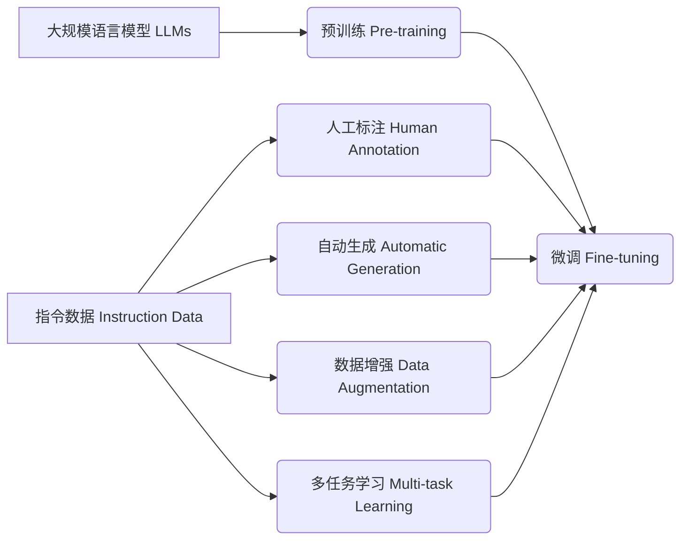

# 大规模语言模型从理论到实践 指令数据的构建

关键词：大规模语言模型, 指令数据, 预训练, 微调, 人工标注, 自动生成, 数据增强, 多任务学习

## 1. 背景介绍
### 1.1  问题的由来
近年来,随着深度学习技术的快速发展,大规模语言模型(Large Language Models, LLMs)在自然语言处理领域取得了突破性进展。从GPT系列到BERT, RoBERTa等模型,LLMs展现出了惊人的语言理解和生成能力,在问答、对话、摘要、翻译等任务上取得了超越人类的表现。然而,训练一个高质量的LLM需要海量的高质量语料数据,尤其是指令数据(Instruction Data),即以指令-响应(Instruction-Response)形式呈现的数据。构建大规模高质量的指令数据是实现LLM从理论走向实践应用的关键。

### 1.2  研究现状
目前,主流的指令数据构建方法可分为人工标注和自动生成两大类。人工标注能够获得高质量的指令数据,但成本高、效率低。自动生成方法如基于规则、模板的方法,或利用现有的QA数据集转化等,效率高但质量不够理想。此外,一些研究尝试利用增强学习、对比学习等技术,从无监督数据中挖掘指令信息,但效果有限。总的来说,LLM指令数据的构建仍面临质量和规模的双重挑战。

### 1.3  研究意义
高质量的指令数据集对于LLM的训练至关重要。数据质量的高低直接影响模型是否能真正理解自然语言指令并给出符合人类偏好的响应。同时,海量的指令数据也是模型泛化和鲁棒性的基础。因此,探索构建大规模高质量LLM指令数据的有效方法,对于推动LLM在实际场景中的应用具有重要意义。这不仅能够提升LLM的性能,还能拓展其应用边界,为智能助理、知识问答、内容创作等领域带来革命性变化。

### 1.4  本文结构
本文将重点探讨LLM指令数据构建的理论基础和实践方法。第2节介绍相关的核心概念。第3节重点阐述指令数据生成的算法原理和操作步骤。第4节给出形式化的数学建模和公式推导。第5节通过代码实例演示指令数据生成的完整流程。第6节讨论指令数据在实际应用中的场景和案例。第7节推荐相关工具和学习资源。第8节总结全文,展望未来研究方向和挑战。第9节的附录解答一些常见问题。

## 2. 核心概念与联系

在探讨LLM指令数据构建之前,我们首先需要明确几个核心概念:  

- 大规模语言模型(LLMs): 以Transformer为基础的大规模预训练语言模型,如GPT、BERT、T5、PaLM等,具有强大的语言理解和生成能力。
- 指令数据(Instruction Data): 由指令和对应响应组成的数据,通常形如"Instruction: xxx; Response: xxx"的结构化形式。指令描述了任务需求,响应则是符合指令要求的自然语言文本。  
- 预训练(Pre-training): 在大规模无监督语料上进行自监督学习,让LLM学习通用的语言知识和模式。常见的预训练任务有语言建模、掩码语言建模等。
- 微调(Fine-tuning): 在特定任务的标注数据上对预训练LLM进行监督学习,使其适应任务的输入输出格式和目标函数。指令微调即在指令数据上进行微调。
- 人工标注(Human Annotation): 由人类标注人员根据指令手动撰写对应的响应,获得高质量但成本高的指令数据。 
- 自动生成(Automatic Generation): 利用规则、模板、现有数据转化、无监督挖掘等自动化方法批量生成指令数据,提高数据构建的效率。
- 数据增强(Data Augmentation): 对已有指令数据进行变换、组合、扰动等操作,生成更多泛化性强的指令数据样本。
- 多任务学习(Multi-task Learning): 将多个不同指令任务的数据混合在一起联合训练,提升LLM的通用性和鲁棒性。

这些概念之间环环相扣,共同构成了LLM指令数据构建的理论和方法体系。下图展示了它们之间的关系:

可以看到,LLM先在无监督语料上进行预训练,学习通用语言知识;然后在指令数据上进行微调,习得执行指令的能力。而指令数据的构建可以通过人工标注、自动生成、数据增强等多种方式进行,并采用多任务学习范式提升模型的通用性。

## 3. 核心算法原理 & 具体操作步骤
### 3.1  算法原理概述
LLM指令数据的生成可以看作一个条件语言生成任务。给定指令 $I$,我们希望生成符合该指令的自然语言响应 $R$。形式化地,我们要最大化如下条件概率:

$$P(R|I) = \prod_{t=1}^{n} P(r_t|r_1, r_2, ..., r_{t-1}, I)$$

其中 $r_t$ 表示响应 $R$ 的第 $t$ 个token。这个概率可以用Transformer语言模型参数化,然后在指令数据上进行极大似然估计。

### 3.2  算法步骤详解
1. 指令数据格式定义与统一
   
   将原始指令数据统一为"Instruction: xxx; Response: xxx"的格式,指令和响应用分隔符隔开。对于没有现成格式的数据,可以设计一些模板先转化为这种形式。

2. 指令数据清洗与过滤

   对指令数据进行清洗,去除噪声、错误、敏感内容等。根据长度、词频等特征过滤掉低质量数据。保证数据的安全性、合规性。

3. 指令-响应数据增强
   
   利用回译、同义替换、句法变换等方法,从原有的指令-响应对生成更多等价的数据。引入随机性,增强数据的多样性和鲁棒性。

4. 指令数据分层抽样
   
   将指令数据划分为不同领域、任务、难度等层次,在每个层次内进行平衡抽样,防止数据分布不均衡。

5. 指令数据编码与向量化
   
   将文本形式的指令数据转化为LLM可以处理的向量形式。可以使用预训练词向量、Tokenizer等工具完成编码。

6. 指令数据批次化
   
   将向量化后的指令数据组织成批次(Batch),便于模型进行批量训练。

7. 指令数据加载与输入
   
   将批次化的指令数据通过数据加载器输入给LLM。
   
8. 计算损失函数
   
   以负对数似然损失函数(Negative Log Likelihood Loss)为目标,计算模型在指令数据上的损失。
   
9. 梯度反向传播与参数更新
   
   利用损失函数对模型参数求梯度,然后通过优化器(如Adam)进行梯度下降,更新模型参数。
   
10. 模型评估与选择

    在验证集指令数据上评估模型效果,选择性能最优的模型进行后续的推理。
    
### 3.3  算法优缺点
优点:
- 理论基础扎实,方法直观易懂
- 数据驱动,可以自动学习指令-响应映射关系
- 通过预训练-微调范式,减少了对大规模标注数据的依赖

缺点:  
- 对指令数据的质量要求高,需要人工把关  
- 模型泛化性有限,容易过拟合到训练指令
- 对低频指令、复杂推理的建模能力不足

### 3.4  算法应用领域
- 智能对话系统:如聊天机器人、智能助手
- 问答系统:基于知识库、文档的问答
- 文本生成系统:摘要、改写、创作等
- 信息检索与推荐:搜索、推荐、广告投放等

## 4. 数学模型和公式 & 详细讲解 & 举例说明
### 4.1  数学模型构建
我们将指令数据生成任务形式化为一个条件语言生成问题。记指令空间为 $\mathcal{I}$,响应空间为 $\mathcal{R}$,我们要学习一个条件概率分布 $P(R|I), I \in \mathcal{I}, R \in \mathcal{R}$。

假设响应由 $n$ 个token组成,即 $R=(r_1,\ldots,r_n)$,则条件概率可以表示为token的联合概率:

$$P(R|I) = \prod_{t=1}^{n} P(r_t|r_1, r_2, ..., r_{t-1}, I)$$

我们用一个参数为 $\theta$ 的Transformer语言模型来建模这个条件概率。模型的输入为指令和响应的拼接,输出为响应的概率。记Transformer的输出为 $\hat{P}$,则有:

$$\hat{P}(r_t|r_1, r_2, ..., r_{t-1}, I) = \text{Transformer}_{\theta}(I, r_1, r_2, ..., r_{t-1})$$

模型的目标是最小化负对数似然损失函数:

$$\mathcal{L}(\theta) = -\sum_{(I,R)\in \mathcal{D}} \log \hat{P}(R|I)$$

其中 $\mathcal{D}$ 为指令-响应对的数据集。这个损失函数可以通过随机梯度下降进行优化。

### 4.2  公式推导过程
对于一个指令-响应对 $(I,R)$,其负对数似然损失为:

$$-\log \hat{P}(R|I) = -\log \prod_{t=1}^{n} \hat{P}(r_t|r_1, r_2, ..., r_{t-1}, I)$$
$$= -\sum_{t=1}^{n} \log \hat{P}(r_t|r_1, r_2, ..., r_{t-1}, I)$$

将其代入整体损失函数:

$$\mathcal{L}(\theta) = -\sum_{(I,R)\in \mathcal{D}} \log \hat{P}(R|I)$$
$$= -\sum_{(I,R)\in \mathcal{D}} \sum_{t=1}^{n} \log \hat{P}(r_t|r_1, r_2, ..., r_{t-1}, I)$$
$$= -\sum_{(I,R)\in \mathcal{D}} \sum_{t=1}^{n} \log \text{Transformer}_{\theta}(I, r_1, r_2, ..., r_{t-1})$$

对 $\theta$ 求梯度:

$$\nabla_{\theta} \mathcal{L}(\theta) = -\sum_{(I,R)\in \mathcal{D}} \sum_{t=1}^{n} \nabla_{\theta} \log \text{Transformer}_{\theta}(I, r_1, r_2, ..., r_{t-1})$$

然后用随机梯度下降优化即可:

$$\theta \leftarrow \theta - \alpha \nabla_{\theta} \mathcal{L}(\theta)$$

其中 $\alpha$ 为学习率。

### 4.3  案例分析与讲解
我们以一个简单的指令-响应对为例,演示模型的训练过程。

指令 $I$: "请用一句话介绍爱因斯坦"
响应 $R$: "爱因斯坦是一位伟大的科学家,他提出了相对论和质能方程"

首先将 $I$ 和 $R$ 拼接并编码为向量序列:

$$X = [\text{编码}(I), \text{编码}(R)] = [x_1, x_2, ..., x_m]$$

然后将 $X$ 输入Transformer模型,得到输出概率分布序列:

$$[\hat{P}(r_1|I), \hat{P}(r_2|r_1,I), ..., \hat{P}(r_n|r_1,\ldots,r_{n-1},I)] = \text{