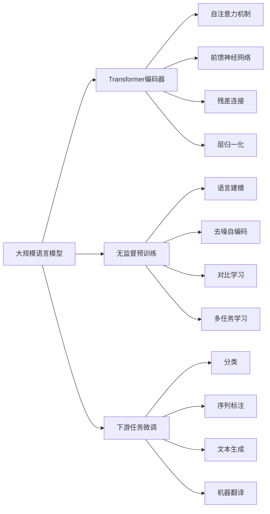
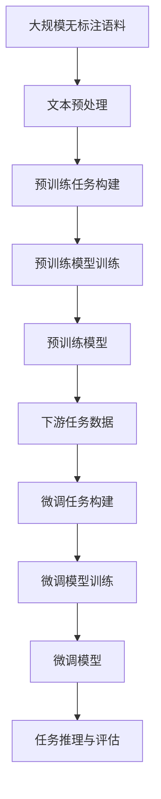

# 大规模语言模型从理论到实践 数据收集与训练策略

关键词：大规模语言模型, 预训练, 数据收集, 训练策略, 迁移学习, 超参数优化, 模型压缩

## 1. 背景介绍
### 1.1  问题的由来
近年来,随着深度学习技术的快速发展,大规模语言模型(Large Language Models, LLMs)在自然语言处理(Natural Language Processing, NLP)领域取得了突破性的进展。LLMs通过在海量文本数据上进行无监督预训练,能够学习到丰富的语言知识和通用语义表示,在下游NLP任务上表现出色。然而,训练LLMs面临着诸多挑战,包括高质量语料的获取、计算资源的消耗、训练效率的提升等。如何高效地收集数据并优化训练策略,成为了LLMs研究的重要课题。

### 1.2  研究现状 
目前,业界主流的LLMs如GPT系列[1]、BERT[2]、RoBERTa[3]等,都采用了基于Transformer[4]的编码器结构,并在大规模无标注语料上进行预训练。这些模型在多个NLP任务上取得了state-of-the-art的性能,证明了预训练范式的有效性。为了进一步提升LLMs的性能,研究者们开始探索更大规模的模型和更多样化的预训练任务。例如,GPT-3[5]的参数量高达1750亿,远超此前模型;ERNIE 3.0[6]融合了编码器和解码器结构,引入了多粒度语义单元的预训练任务。

尽管取得了瞩目的成绩,但训练LLMs所需的计算资源也在急剧增长。以GPT-3为例,其训练成本估计高达数百万美元[7]。为了提高训练效率并降低成本,一些研究提出了参数高效的模型结构[8]、梯度压缩技术[9]、混合精度训练[10]等优化方法。同时,模型压缩技术如知识蒸馏[11]、量化[12]、剪枝[13]等也被用于减小LLMs的体积,便于实际部署应用。

### 1.3  研究意义
LLMs蕴含着强大的语言理解和生成能力,有望在智能问答、机器翻译、文本摘要、对话系统等领域发挥重要作用,推动人机交互的进步。不过,训练LLMs需要海量的数据和算力,对中小型机构和个人研究者构成了较高的门槛。探索数据收集和训练优化策略,有助于降低LLMs的开发成本,让更多研究者参与其中,加速LLMs技术的进步和普及。此外,LLMs的训练过程本身也是复杂的工程和科学问题,涉及分布式计算、数值优化、高性能计算等诸多领域,对这些问题的研究也将产生广泛的学术价值和工程意义。

### 1.4  本文结构
本文将全面探讨LLMs从理论到实践的关键问题。第2节介绍LLMs的核心概念和技术基础。第3节重点阐述数据收集的策略和实践。第4节详细讨论LLMs的训练算法和优化技术。第5节通过实例演示LLMs的开发流程。第6节展望LLMs的应用场景和发展前景。第7节推荐LLMs领域的学习资源和工具。第8节总结全文,并分析LLMs未来的机遇和挑战。

## 2. 核心概念与联系

在深入探讨LLMs的技术细节之前,我们有必要对其核心概念进行必要的说明和梳理,以便读者更好地把握后续内容。图1展示了LLMs涉及的核心概念及其联系。

图1 大规模语言模型的核心概念与联系

- 大规模语言模型(LLMs):利用深度神经网络从海量文本语料中学习通用语言知识和语义表示的模型。当前主流LLMs基于Transformer编码器结构,通过无监督预训练和下游任务微调的范式进行训练和应用。

- Transformer编码器:一种基于自注意力机制的神经网络结构,通过计算输入序列中元素之间的相关性,提取上下文相关的特征表示。Transformer编码器通常由若干个相同的模块堆叠而成,每个模块包含自注意力层、前馈神经网络、残差连接和层归一化等组件。

- 无监督预训练:利用无需人工标注的海量文本数据,通过自监督学习任务训练语言模型,使其学习到语言的统计规律和语义知识。常见的预训练任务包括语言建模、去噪自编码、对比学习、多任务学习等。预训练得到的模型可以作为下游任务的特征提取器或参数初始化。

- 下游任务微调:在特定的NLP任务(如分类、序列标注、文本生成等)上,利用预训练模型的参数作为初始化,在少量标注数据上进行监督学习,使模型适应具体任务。微调一般只需训练较少的轮数,且只更新模型的部分参数。

- 自注意力机制:Transformer的核心组件,通过计算序列中每个元素与其他元素的相关性,生成权重矩阵,并用其对序列进行加权求和,得到上下文相关的表示。自注意力机制能够捕捉序列中长距离的依赖关系,且计算高度并行。

- 前馈神经网络:Transformer中的一个组件,对自注意力层的输出进行非线性变换,提高模型的表达能力。前馈网络一般由两个全连接层组成,中间用激活函数(如ReLU)进行非线性映射。

- 残差连接:将某一层网络的输入直接传递到后面层的机制,使得网络更容易优化。Transformer中的残差连接一般用于自注意力层和前馈网络之后,将它们的输出与输入相加。

- 层归一化:对神经网络某一层的输出进行归一化的方法,可以加速模型收敛并提高泛化性能。Transformer中的层归一化在自注意力层和前馈网络之后使用,将输出的均值和方差分别归一化到0和1。

- 语言建模:一种常见的无监督预训练任务,通过最大化文本序列的概率来训练模型。语言模型可以是单向的(如GPT)或双向的(如BERT),分别只能利用文本的左侧或双侧上下文。

- 去噪自编码:以被部分遮挡或噪声污染的文本作为输入,训练模型复原原始文本,使其学习到鲁棒的语义表示。BERT采用的掩码语言模型任务就是一种去噪自编码。

- 对比学习:通过最小化正样本对的距离和最大化负样本对的距离,训练模型学习到有区分性的语义表示。对比学习可以在句子级或词级进行,如SimCSE[14]、ELECTRA[15]等。

- 多任务学习:将多个不同的自监督任务联合训练,提高模型的通用性和鲁棒性。如ERNIE 3.0同时使用了编码器和解码器结构,在多粒度语义单元上进行预训练。

## 3. 核心算法原理 & 具体操作步骤
### 3.1  算法原理概述
LLMs的训练主要分为两个阶段:无监督预训练和有监督微调。预训练旨在利用大规模无标注语料学习通用语言知识,为下游任务提供良好的初始化参数。微调则在特定任务的标注数据上进一步训练模型,使其适应具体任务。图2展示了LLMs训练的整体流程。

图2 大规模语言模型训练流程图

### 3.2  算法步骤详解

1. 文本预处理
   - 对原始语料进行清洗,去除噪声和无意义内容
   - 进行分词、词性标注、命名实体识别等基础的文本处理
   - 将文本转换为数值化的输入序列,如BPE[16]、WordPiece[17]等

2. 预训练任务构建
   - 根据预训练任务的类型,对输入序列进行变换构建训练样本
   - 语言建模:随机遮挡一定比例的词元,让模型预测被遮挡位置的词元
   - 去噪自编码:随机对输入序列添加噪声(如删除、替换、置换等),让模型复原原始序列
   - 对比学习:基于输入序列构建正样本对和负样本对,让模型最小化正样本对的距离、最大化负样本对的距离
   - 多任务学习:将不同粒度的语言单元(如词、短语、实体、句子等)构建为多个预训练任务

3. 预训练模型训练  
   - 选择合适的模型结构(如BERT、GPT、RoBERTa等)和超参数(如批大小、学习率、训练轮数等)
   - 利用分布式训练框架(如Horovod[18]、DeepSpeed[19]等)和硬件设施(如GPU、TPU集群)进行大规模训练
   - 采用优化器如AdamW[20]、LAMB[21]等,对模型参数进行更新优化
   - 监控训练过程中的损失函数值变化,必要时调整超参数或终止训练

4. 微调任务构建
   - 将下游任务的标注数据转换为模型可接受的输入形式
   - 根据任务类型,在预训练模型的基础上添加额外的层(如分类层、序列标注层等)
   - 设计合适的微调目标函数,如交叉熵损失、CRF损失等

5. 微调模型训练
   - 加载预训练模型的参数作为初始化
   - 利用下游任务的标注数据,进行梯度下降等优化算法的训练  
   - 相比预训练阶段,微调通常需要更小的学习率和更少的训练轮数
   - 根据任务的验证集性能,选择最优的微调模型参数

6. 任务推理与评估
   - 利用微调后的模型,对测试集或实际应用场景的数据进行推理预测
   - 根据任务的评价指标(如准确率、F1值、BLEU等),评估模型的性能表现
   - 分析模型预测的错误样本,总结模型的局限性和可改进之处
   - 必要时,回到数据收集和训练阶段,迭代优化模型

### 3.3  算法优缺点

LLMs的预训练-微调范式具有以下优点:
- 通过在大规模语料上学习通用语言知识,可以显著提升下游任务性能,实现更强的语言理解和生成能力。
- 预训练模型可以作为不同任务的统一特征提取器,减少任务特定的特征工程,简化下游任务开发流程。  
- 预训练阶段不需要人工标注的数据,可以充分利用无标注语料,突破有标注数据规模的限制。
- 微调阶段只需少量标注数据和训练轮数,大大降低了任务适应的成本。
- 同一个预训练模型可以应用于多个不同领域和任务,具有很好的通用性和迁移性。

但LLMs也存在一些局限性和挑战:
- 预训练需要海量的计算资源和时间成本,对算力和存储提出了很高的要求,并非所有机构和个人都能负担。
- 不同任务和领域对语言知识的需求有所差异,通用的预训练模型可能不能完全满足特定领域的需求。
- 模型的可