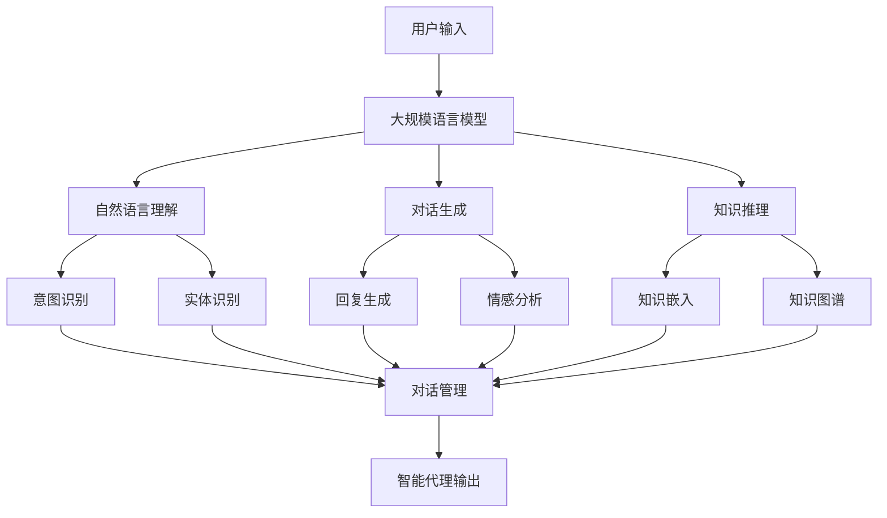

# 大规模语言模型从理论到实践 智能代理

关键词：大规模语言模型、智能代理、Transformer、自然语言处理、深度学习、知识表示、推理、对话系统

## 1. 背景介绍
### 1.1 问题的由来
随着人工智能技术的快速发展,自然语言处理领域取得了巨大的突破。特别是近年来,大规模语言模型的出现为构建智能对话系统和知识推理系统开辟了新的道路。传统的自然语言处理方法难以处理语言的复杂性和多样性,而大规模语言模型能够从海量文本数据中学习语言知识,为智能代理的实现提供了强大的技术支持。

### 1.2 研究现状
目前,业界已经提出了多种大规模语言模型,如GPT系列、BERT、XLNet等。这些模型在多个自然语言处理任务上取得了显著的性能提升。同时,研究者们也在探索如何利用大规模语言模型构建智能代理系统。微软的小冰、OpenAI的GPT-3 API等都是利用大规模语言模型实现的智能对话系统的典型案例。

### 1.3 研究意义
大规模语言模型为智能代理的实现提供了新的思路和方法。通过利用大规模语言模型,我们可以构建出更加智能、自然、灵活的对话系统和知识推理系统。这不仅可以提升人机交互的体验,还可以在智能客服、智能教育、智能助手等领域产生广泛的应用价值。深入研究大规模语言模型在智能代理中的应用,对于推动人工智能技术的发展具有重要意义。

### 1.4 本文结构
本文将围绕大规模语言模型在智能代理中的应用展开深入探讨。首先,我们将介绍大规模语言模型的核心概念和原理。然后,重点阐述大规模语言模型的训练算法和实现细节。接着,我们将通过数学模型和代码实例,详细说明如何利用大规模语言模型构建智能代理系统。最后,总结大规模语言模型在智能代理领域的应用现状和未来发展趋势,并提供相关的学习资源和工具推荐。

## 2. 核心概念与联系
大规模语言模型是指在大规模文本数据上训练的深度神经网络模型,旨在学习语言的统计规律和语义表示。与传统的自然语言处理方法不同,大规模语言模型不需要人工设计复杂的特征工程,而是通过端到端的方式直接从原始文本中学习语言知识。

大规模语言模型的核心是基于Transformer架构的深度神经网络。Transformer采用了自注意力机制和位置编码,能够捕捉文本序列中的长距离依赖关系。通过堆叠多层Transformer模块,大规模语言模型可以学习到更加丰富和抽象的语言表示。

在智能代理领域,大规模语言模型主要用于以下几个方面:

1. 自然语言理解:通过对用户输入的文本进行编码,大规模语言模型可以理解用户意图和语义,为后续的对话生成和知识推理提供基础。

2. 对话生成:大规模语言模型可以根据上下文信息生成自然、连贯的对话回复。通过fine-tuning技术,可以将大规模语言模型适配到特定领域的对话任务中。

3. 知识推理:大规模语言模型可以从文本数据中学习到丰富的世界知识。通过知识嵌入和知识图谱技术,可以实现基于大规模语言模型的知识推理和问答。

4. 多轮对话:大规模语言模型可以通过记忆机制和上下文编码,实现多轮对话的上下文理解和一致性维护。

下图展示了大规模语言模型在智能代理中的应用架构:

## 3. 核心算法原理 & 具体操作步骤
### 3.1 算法原理概述
大规模语言模型的核心算法是基于Transformer的自注意力机制和位置编码。Transformer通过自注意力机制捕捉文本序列中的长距离依赖关系,通过位置编码引入序列的位置信息。

具体来说,Transformer的编码器由多个自注意力层和前馈神经网络层组成。每个自注意力层包括三个线性变换:Query、Key和Value。对于输入序列中的每个位置,通过计算该位置与其他位置之间的注意力权重,得到该位置的上下文表示。

Transformer的解码器也由多个自注意力层和前馈神经网络层组成,但在解码器的自注意力层之间还引入了编码器-解码器注意力层。解码器根据编码器的输出和已生成的序列,预测下一个token。

### 3.2 算法步骤详解
大规模语言模型的训练过程可以分为以下几个步骤:

1. 数据准备:收集大规模的文本数据,进行清洗、标注和预处理。

2. 模型构建:根据任务需求,选择合适的模型架构(如GPT、BERT等)。初始化模型参数。

3. 预训练:在大规模无标注数据上进行自监督学习,通过掩码语言模型(MLM)或自回归语言模型(ALM)的方式训练模型,使其学习通用的语言表示。

4. 微调:根据具体任务,在预训练模型的基础上进行微调。通过引入任务特定的目标函数和训练数据,使模型适应特定领域。

5. 推理应用:将训练好的模型部署到实际应用中,进行在线推理和生成。

### 3.3 算法优缺点
大规模语言模型的优点包括:

1. 强大的语言表示能力:通过在大规模数据上学习,模型可以捕捉语言的复杂语义和结构信息。

2. 通用性:预训练的语言模型可以适用于各种自然语言处理任务,通过微调实现快速迁移学习。

3. 端到端学习:无需复杂的特征工程,模型可以直接从原始文本中学习语言知识。

但大规模语言模型也存在一些局限性:

1. 计算和存储开销大:训练和推理大规模语言模型需要大量的计算资源和存储空间。

2. 可解释性差:模型学习到的语言知识是隐式的,难以直接解释。

3. 偏见和安全风险:模型可能学习到数据中的偏见,生成有害或不恰当的内容。

### 3.4 算法应用领域
大规模语言模型在智能代理领域有广泛的应用,包括:

1. 智能客服:通过自然语言交互,为用户提供咨询、问答和服务支持。

2. 智能助手:协助用户完成日常任务,如日程管理、信息查询等。

3. 智能教育:提供个性化的学习辅导和知识推荐。

4. 智能写作:辅助用户进行文本创作,如文章生成、对话写作等。

5. 智能搜索:基于语义理解和知识推理,提供更加精准和人性化的搜索服务。

## 4. 数学模型和公式 & 详细讲解 & 举例说明
### 4.1 数学模型构建
大规模语言模型的数学模型可以用以下公式表示:

给定一个文本序列 $X=(x_1,x_2,...,x_n)$,语言模型的目标是估计该序列的概率分布 $P(X)$。根据链式法则,序列的概率可以分解为:

$$P(X)=\prod_{i=1}^n P(x_i|x_1,x_2,...,x_{i-1})$$

其中,$P(x_i|x_1,x_2,...,x_{i-1})$ 表示在给定前 $i-1$ 个token的条件下,第 $i$ 个token的条件概率。

在Transformer模型中,序列的概率通过自注意力机制和位置编码来建模。对于第 $i$ 个位置,其上下文表示 $h_i$ 可以通过自注意力机制计算得到:

$$h_i=\sum_{j=1}^n \alpha_{ij}(x_jW^V)$$

其中,$\alpha_{ij}$ 是第 $i$ 个位置对第 $j$ 个位置的注意力权重,可以通过以下公式计算:

$$\alpha_{ij}=\frac{\exp(e_{ij})}{\sum_{k=1}^n \exp(e_{ik})}$$

$$e_{ij}=\frac{(x_iW^Q)(x_jW^K)^T}{\sqrt{d_k}}$$

$W^Q$,$W^K$,$W^V$ 是可学习的参数矩阵,$d_k$ 是向量维度。

位置编码 $PE$ 用于引入序列的位置信息,可以通过以下公式计算:

$$PE(pos,2i)=\sin(pos/10000^{2i/d_{model}})$$

$$PE(pos,2i+1)=\cos(pos/10000^{2i/d_{model}})$$

其中,$pos$ 表示位置索引,$i$ 表示维度索引,$d_{model}$ 是模型的维度。

最终,Transformer的输出通过softmax层映射为下一个token的概率分布:

$$P(x_i|x_1,x_2,...,x_{i-1})=\text{softmax}(h_iW^O)$$

其中,$W^O$ 是输出层的参数矩阵。

### 4.2 公式推导过程
以上公式的推导过程如下:

1. 链式法则:将序列的联合概率分解为条件概率的乘积。

2. 自注意力机制:通过Query、Key、Value的线性变换和注意力权重的计算,得到每个位置的上下文表示。

3. 位置编码:使用正弦和余弦函数,根据位置索引和维度索引,生成位置编码向量。

4. Softmax输出:将上下文表示通过线性变换和softmax函数,得到下一个token的概率分布。

### 4.3 案例分析与讲解
以一个简单的句子"I love natural language processing"为例,说明大规模语言模型的工作原理。

首先,将句子转化为token序列:["I","love","natural","language","processing"]。

然后,通过Transformer的编码器,计算每个位置的上下文表示。以"language"这个token为例,其上下文表示通过以下步骤得到:

1. 计算"language"与其他token的注意力权重,得到一个注意力分布。

2. 根据注意力分布,对其他token的Value向量进行加权求和,得到"language"的上下文表示。

3. 将上下文表示与位置编码相加,得到最终的表示向量。

最后,通过解码器预测下一个token。以预测"processing"为例:

1. 将"processing"之前的token序列输入解码器,得到解码器的输出表示。

2. 在解码器的自注意力层中,根据已生成的token序列计算注意力权重和上下文表示。

3. 在编码器-解码器注意力层中,根据编码器的输出和解码器的上下文表示,计算注意力权重和上下文表示。

4. 将解码器的输出表示通过线性变换和softmax函数,得到下一个token的概率分布。

5. 选择概率最高的token"processing"作为预测结果。

通过以上步骤,大规模语言模型可以根据上下文预测下一个token,生成连贯的句子。

### 4.4 常见问题解答
1. 问:大规模语言模型的参数量有多大?
   答:大规模语言模型的参数量通常在亿到千亿量级。例如,GPT-3模型有1750亿个参数。

2. 问:大规模语言模型的训练需要多少数据和计算资源?
   答:训练大规模语言模型需要海量的文本数据和强大的计算资源。例如,GPT-3的训练数据包括4500亿个token,训练时间达到了数周,使用了数千个GPU。

3. 问:大规模语言模型如何处理未登录词?
   答:大规模语言模型