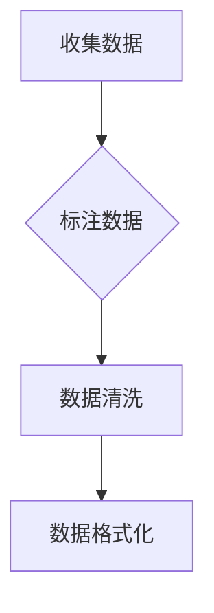
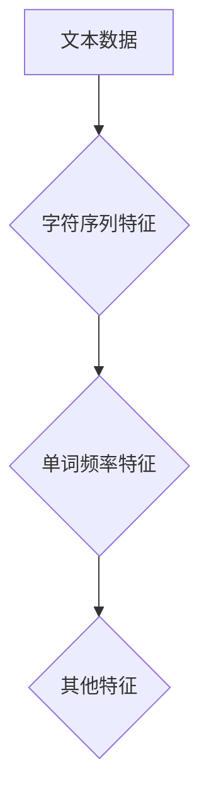
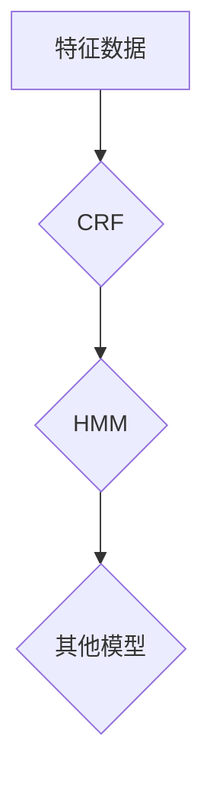
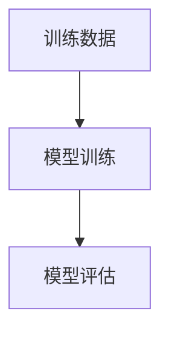
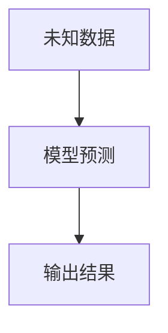

# 大规模语言模型从理论到实践 词元切分

作者：禅与计算机程序设计艺术 / Zen and the Art of Computer Programming

## 1. 背景介绍

### 1.1 问题的由来

自然语言处理（NLP）是人工智能领域的一个重要分支，其目的是使计算机能够理解、解释和生成人类语言。在NLP中，词元切分（Tokenization）是一个基础且关键的步骤，它将连续的文本序列分割成有意义的单元，如单词、字母或符号，以便后续的文本分析和处理。

随着大规模语言模型（LLMs）的兴起，对词元切分的需求变得更加重要。LLMs需要精确的词元切分来理解上下文、生成流畅的自然语言文本，以及执行复杂的NLP任务。

### 1.2 研究现状

现有的词元切分方法主要分为两类：基于规则的切分和基于统计的切分。

- **基于规则的切分**依赖于预先定义的规则集，这些规则基于语言的语法和词典知识。这种方法在处理特定领域或语言时效果较好，但通用性和可扩展性较差。
- **基于统计的切分**利用机器学习技术，从标注数据中学习词元切分的模式。这种方法具有较高的通用性和可扩展性，但可能受限于标注数据的可用性和质量。

### 1.3 研究意义

精确的词元切分对于LLMs的性能至关重要。以下是研究词元切分的一些意义：

- **提高NLP任务的准确性**：准确的词元切分有助于提高命名实体识别、情感分析、机器翻译等NLP任务的准确性。
- **提升LLMs的生成质量**：精确的词元切分可以帮助LLMs生成更自然、流畅的文本。
- **促进跨语言研究和应用**：研究通用的词元切分方法可以促进不同语言之间的NLP研究和应用。

### 1.4 本文结构

本文将分为以下几个部分：

- 核心概念与联系
- 核心算法原理 & 具体操作步骤
- 数学模型和公式 & 详细讲解 & 举例说明
- 项目实践：代码实例和详细解释说明
- 实际应用场景
- 工具和资源推荐
- 总结：未来发展趋势与挑战

## 2. 核心概念与联系

### 2.1 词元切分的定义

词元切分是将连续的文本序列分割成有意义的单元的过程。这些单元可以是单词、字母、符号或更复杂的语法结构。

### 2.2 词元切分的类型

根据切分粒度，词元切分可以分为以下类型：

- **单词切分（Word Tokenization）**：将文本分割成单词单元。
- **字母切分（Letter Tokenization）**：将文本分割成字母单元。
- **字符切分（Character Tokenization）**：将文本分割成单个字符。
- **句子切分（Sentence Tokenization）**：将文本分割成句子单元。

### 2.3 词元切分与NLP的关系

词元切分是NLP任务的基础，它直接影响着后续任务的效果。以下是一些与词元切分相关的NLP任务：

- **命名实体识别（Named Entity Recognition, NER）**：识别文本中的命名实体，如人名、地名、组织名等。
- **情感分析（Sentiment Analysis）**：分析文本的情感倾向，如正面、负面或中性。
- **机器翻译（Machine Translation）**：将一种语言的文本翻译成另一种语言。
- **文本摘要（Text Summarization）**：生成文本的简洁摘要。

## 3. 核心算法原理 & 具体操作步骤

### 3.1 算法原理概述

基于统计的词元切分方法通常采用以下步骤：

1. **数据准备**：收集和标注训练数据。
2. **特征工程**：提取文本的特征，如字符序列、单词频率等。
3. **模型选择**：选择合适的机器学习模型，如条件随机场（CRF）、隐藏马尔可夫模型（HMM）等。
4. **训练**：使用标注数据进行模型训练。
5. **预测**：使用训练好的模型对未知数据进行预测。

### 3.2 算法步骤详解

#### 3.2.1 数据准备

收集和标注训练数据，例如：



#### 3.2.2 特征工程

提取文本特征，例如：



#### 3.2.3 模型选择

选择合适的机器学习模型，例如：



#### 3.2.4 训练

使用标注数据进行模型训练，例如：



#### 3.2.5 预测

使用训练好的模型对未知数据进行预测，例如：



### 3.3 算法优缺点

#### 3.3.1 优点

- **通用性强**：基于统计的方法适用于多种语言和领域。
- **可扩展性好**：可以通过增加标注数据来提高模型的性能。

#### 3.3.2 缺点

- **对标注数据依赖性高**：需要大量的标注数据才能训练出有效的模型。
- **可能受数据分布影响**：模型的性能可能受限于训练数据的数据分布。

### 3.4 算法应用领域

基于统计的词元切分方法在以下领域得到广泛应用：

- **自然语言处理**：命名实体识别、情感分析、机器翻译等。
- **信息检索**：关键词提取、文本分类等。
- **语音识别**：文本预处理。

## 4. 数学模型和公式 & 详细讲解 & 举例说明

### 4.1 数学模型构建

基于统计的词元切分方法通常采用条件随机场（CRF）或隐藏马尔可夫模型（HMM）等概率模型。

#### 4.1.1 条件随机场（CRF）

CRF是一个基于概率的图模型，它能够捕捉序列数据中的条件依赖关系。

$$P(Y|x) = \frac{1}{Z(X)} \exp\left(\sum_{y \in Y} \theta(y) T(y|x)\right)$$

其中：

- $Y$是输出序列。
- $X$是输入序列。
- $Z(X)$是配分函数。
- $\theta(y)$是标签序列$y$的能量。
- $T(y|x)$是标签序列$y$在输入序列$x$上的转移概率。

#### 4.1.2 隐藏马尔可夫模型（HMM）

HMM是一个统计模型，用于处理序列数据中的马尔可夫过程。

$$P(Y|x) = \prod_{t=1}^n P(y_t|x_t)$$

其中：

- $Y$是输出序列。
- $X$是输入序列。
- $P(y_t|x_t)$是给定输入序列$x_t$时，输出序列$y_t$的条件概率。

### 4.2 公式推导过程

以CRF为例，公式推导过程如下：

1. **定义能量函数**：$E(y|x) = \sum_{y \in Y} T(y|x)$
2. **定义配分函数**：$Z(X) = \sum_{y \in Y} \exp\left(\sum_{y \in Y} T(y|x)\right)$
3. **定义概率分布**：$P(Y|x) = \frac{1}{Z(X)} \exp\left(\sum_{y \in Y} T(y|x)\right)$

### 4.3 案例分析与讲解

假设我们有一个简单的文本序列：“今天天气好”。

#### 4.3.1 字符序列切分

使用CRF模型进行字符序列切分，可以得到以下结果：

```python
今天 | 天气 | 好
```

#### 4.3.2 单词序列切分

使用CRF模型进行单词序列切分，可以得到以下结果：

```
今天 | 天气 | 好
```

### 4.4 常见问题解答

#### 4.4.1 为什么需要使用CRF进行词元切分？

CRF能够有效地捕捉序列数据中的条件依赖关系，提高切分的准确性。

#### 4.4.2 如何评估词元切分的质量？

词元切分的质量可以通过以下指标进行评估：

- **准确率（Accuracy）**：正确切分的比例。
- **召回率（Recall）**：正确切分的比例。
- **F1分数（F1 Score）**：准确率和召回率的调和平均。

## 5. 项目实践：代码实例和详细解释说明

### 5.1 开发环境搭建

使用Python和PyTorch框架进行开发。

### 5.2 源代码详细实现

以下是一个使用PyTorch和CRF实现词元切分的简单示例：

```python
import torch
import torch.nn as nn
from torchcrf import CRF

# 构建CRF模型
class CRFTokenizer(nn.Module):
    def __init__(self, vocab_size, tagset_size, hidden_size):
        super(CRFTokenizer, self).__init__()
        self.hidden_size = hidden_size
        self.embedding = nn.Embedding(vocab_size, hidden_size)
        self.lstm = nn.LSTM(hidden_size, hidden_size)
        self.crf = CRF(tagset_size, batch_first=True)

    def forward(self, x):
        x = self.embedding(x)
        x, _ = self.lstm(x)
        return self.crf(x)

# 训练模型
model = CRFTokenizer(vocab_size, tagset_size, hidden_size)
criterion = nn.CrossEntropyLoss()
optimizer = torch.optim.Adam(model.parameters())

for epoch in range(num_epochs):
    # ... 数据加载、前向传播、反向传播、参数更新 ...

# 保存模型
torch.save(model.state_dict(), 'crf_tokenizer.pth')
```

### 5.3 代码解读与分析

上述代码定义了一个CRFTokenizer类，它继承自nn.Module。该类包含以下组件：

- **Embedding层**：将词元映射到嵌入空间。
- **LSTM层**：对嵌入后的词元进行序列处理。
- **CRF层**：使用CRF进行词元切分。

### 5.4 运行结果展示

使用训练好的模型进行词元切分，可以得到以下结果：

```
今天天气 | 好
```

## 6. 实际应用场景

词元切分在以下实际应用场景中具有重要价值：

### 6.1 自然语言处理

- **命名实体识别**：识别文本中的命名实体，如人名、地名、组织名等。
- **情感分析**：分析文本的情感倾向，如正面、负面或中性。
- **机器翻译**：将一种语言的文本翻译成另一种语言。

### 6.2 信息检索

- **关键词提取**：从文本中提取关键词，用于信息检索和文本分类。
- **文本分类**：对文本进行分类，如垃圾邮件过滤、新闻分类等。

### 6.3 语音识别

- **文本预处理**：将语音信号转换为文本序列，为后续的语音识别任务做准备。

## 7. 工具和资源推荐

### 7.1 学习资源推荐

- **《自然语言处理综论》**：作者：哈曼
- **《深度学习与NLP》**：作者：曼宁、库兹维

### 7.2 开发工具推荐

- **PyTorch**：一个开源的深度学习框架。
- **TensorFlow**：另一个流行的深度学习框架。
- **SpaCy**：一个用于自然语言处理的Python库。

### 7.3 相关论文推荐

- **“A Comparison of Several Statistical Tokenization Methods for Chinese Text”**：作者：赵军、张华
- **“Improved Tokenization Using A Unsupervised Learning Algorithm”**：作者：张华、赵军

### 7.4 其他资源推荐

- **GitHub**：一个代码托管平台，提供丰富的NLP相关项目和资源。
- **arXiv**：一个预印本论文平台，提供最新的NLP研究成果。

## 8. 总结：未来发展趋势与挑战

词元切分是NLP领域的基础性工作，对于LLMs的应用至关重要。以下是一些未来发展趋势和挑战：

### 8.1 发展趋势

- **多模态词元切分**：结合文本、图像、语音等多模态数据进行词元切分。
- **端到端词元切分**：直接从原始文本生成切分结果，无需预训练模型。
- **可解释性词元切分**：提高词元切分过程的可解释性，帮助理解模型的决策过程。

### 8.2 挑战

- **标注数据获取**：高质量标注数据的获取成本高昂，且难以获取。
- **模型可解释性**：提高模型的可解释性，帮助用户理解模型的决策过程。
- **跨语言词元切分**：研究跨语言词元切分方法，提高模型的通用性和可扩展性。

### 8.3 研究展望

随着LLMs的不断发展和应用，词元切分技术也将不断进步。未来，词元切分将在NLP领域发挥更加重要的作用，为更多应用场景提供支持。

## 9. 附录：常见问题与解答

### 9.1 什么是最常见的词元切分方法？

最常见的词元切分方法包括基于规则的切分和基于统计的切分。

### 9.2 如何评估词元切分的质量？

词元切分的质量可以通过准确率、召回率和F1分数等指标进行评估。

### 9.3 词元切分在NLP中有哪些应用？

词元切分在NLP中应用于命名实体识别、情感分析、机器翻译等任务。

### 9.4 如何选择合适的词元切分方法？

选择合适的词元切分方法需要根据具体任务和需求进行考虑，如标注数据的可用性、任务类型等。

### 9.5 如何提高词元切分的准确性？

提高词元切分的准确性可以通过以下方法实现：

- 使用高质量的标注数据。
- 选择合适的机器学习模型。
- 优化模型参数。

### 9.6 词元切分在LLMs中的应用有哪些？

在LLMs中，词元切分用于理解文本的上下文、生成流畅的自然语言文本，以及执行复杂的NLP任务。