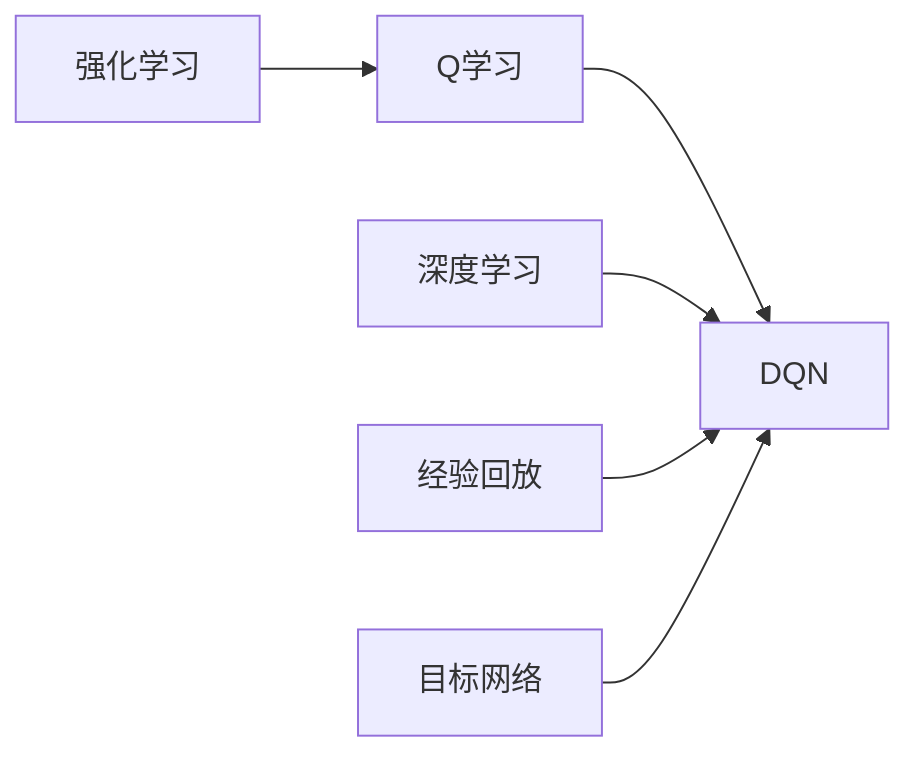

# 大语言模型原理与工程实践：DQN 训练：完整算法

## 1. 背景介绍
### 1.1 问题的由来
随着人工智能技术的飞速发展,深度强化学习(Deep Reinforcement Learning,DRL)已成为当前研究的热点。DRL通过将深度学习与强化学习相结合,使得智能体能够在复杂环境中学习到优秀的策略。其中,深度Q网络(Deep Q-Network,DQN)作为DRL的代表性算法之一,在游戏、机器人等领域取得了突破性进展。

### 1.2 研究现状
自从2013年DeepMind提出DQN并在Atari游戏中取得惊人表现后,DQN迅速成为了DRL领域的研究热点。此后,众多学者对DQN进行了改进和扩展,如Double DQN、Dueling DQN、Rainbow等变体相继问世。同时DQN也被应用到了机器人控制、自然语言处理等诸多领域。

### 1.3 研究意义
DQN的提出开创了深度强化学习的新纪元。一方面,DQN证明了深度神经网络可以用于逼近最优Q值函数,突破了传统Q学习的瓶颈;另一方面,DQN巧妙地引入了经验回放和目标网络等技巧,有效解决了数据相关性和不稳定性等问题。深入研究DQN的原理和实现,对于理解现代DRL技术和推动其发展具有重要意义。

### 1.4 本文结构
本文将全面介绍DQN算法的原理与实践。第2节阐述DQN的核心概念;第3节详细讲解DQN算法的原理和步骤;第4节介绍DQN所基于的数学模型和公式;第5节给出DQN的代码实现与讲解;第6节讨论DQN的应用场景;第7节推荐DQN相关的工具和资源;第8节总结全文并展望未来;第9节附录了一些常见问题与解答。

## 2. 核心概念与联系

DQN涉及的核心概念包括:
- 强化学习(Reinforcement Learning):一种让智能体通过与环境交互来学习最优策略的机器学习范式。
- Q学习(Q-Learning):一种无模型的异策略时序差分学习算法,通过迭代更新动作价值函数(Q函数)来逼近最优策略。
- 深度学习(Deep Learning):一类基于多层神经网络的机器学习方法,能够自动学习数据的层次化特征表示。
- 经验回放(Experience Replay):一种打破数据相关性的技术,通过随机抽取历史转移数据进行训练。
- 目标网络(Target Network):一种提高训练稳定性的技术,通过缓慢更新目标Q网络来减少目标值的波动。

下图展示了这些概念之间的联系:



## 3. 核心算法原理 & 具体操作步骤 
### 3.1 算法原理概述
DQN的核心思想是使用深度神经网络来逼近最优Q函数。与传统Q学习使用查找表存储Q值不同,DQN直接使用神经网络Q(s,a;θ)来表示Q函数,其中s为状态,a为动作,θ为网络参数。通过最小化TD误差来训练Q网络:
$$
L(\theta)=\mathbb{E}_{(s,a,r,s')\sim D}[(r+\gamma \max_{a'}Q(s',a';\theta^-)-Q(s,a;\theta))^2]
$$
其中D为经验回放池,存储了过去的转移数据(s,a,r,s');θ^-为目标网络参数,定期从Q网络复制得到。

### 3.2 算法步骤详解
DQN算法的主要步骤如下:
1. 初始化Q网络参数θ,目标网络参数θ^-=θ,经验回放池D。
2. for episode = 1 to M do
3.  初始化初始状态s_1
4.  for t = 1 to T do
5.   根据ε-greedy策略选择动作a_t
6.   执行动作a_t,观察奖励r_t和下一状态s_{t+1} 
7.   将转移数据(s_t,a_t,r_t,s_{t+1})存入D
8.   从D中随机抽取一批转移数据(s,a,r,s')
9.   计算目标值:y=r+\gamma \max_{a'}Q(s',a';\theta^-)
10.  最小化TD误差:L(\theta)=(y-Q(s,a;\theta))^2
11.  每C步同步目标网络参数:θ^-=θ
12. end for
13. end for

### 3.3 算法优缺点
DQN的主要优点有:
- 使用神经网络逼近Q函数,可处理高维状态空间
- 引入经验回放,打破了数据相关性
- 使用目标网络,提高了训练稳定性

DQN的主要缺点有:  
- 训练不够稳定,对超参数敏感
- 只适用于离散动作空间,难以扩展到连续动作
- 使用ε-greedy进行探索,样本效率不高

### 3.4 算法应用领域
DQN在以下领域得到了广泛应用:
- 游戏: Atari游戏、星际争霸、Dota等
- 机器人控制: 机械臂操纵、四足机器人等  
- 自然语言处理: 对话系统、文本生成等
- 推荐系统: 电商推荐、广告投放等

## 4. 数学模型和公式 & 详细讲解 & 举例说明
### 4.1 数学模型构建
马尔可夫决策过程(MDP)是强化学习的标准数学模型。一个MDP由状态空间S、动作空间A、转移概率P、奖励函数R和折扣因子γ组成。智能体与环境交互的过程可以用如下的MDP描述:

在每个时间步t,智能体根据当前状态s_t∈S选择一个动作a_t∈A,环境接收动作后转移到下一状态s_{t+1}∼P(⋅|s_t,a_t),同时反馈给智能体一个标量奖励r_t=R(s_t,a_t)。智能体的目标是最大化累积期望奖励:
$$
\max_{\pi} \mathbb{E} [\sum_{t=0}^{\infty} \gamma^t r_t | \pi]
$$
其中π为智能体的策略,γ∈[0,1]为折扣因子。

Q学习算法基于动作价值函数(Q函数)来寻找最优策略。Q函数定义为在状态s下采取动作a,然后遵循策略π的期望累积奖励:
$$
Q^{\pi}(s,a)=\mathbb{E}[\sum_{t=0}^{\infty} \gamma^t r_t | s_0=s,a_0=a,\pi]
$$

最优Q函数满足贝尔曼最优方程:
$$
Q^*(s,a)=\mathbb{E}_{s'\sim P}[R(s,a)+\gamma \max_{a'} Q^*(s',a')]
$$

因此,Q学习的目标就是通过不断迭代来逼近最优Q函数:
$$
Q(s,a) \leftarrow Q(s,a)+\alpha[R(s,a)+\gamma \max_{a'} Q(s',a')-Q(s,a)]
$$
其中α为学习率。

### 4.2 公式推导过程
DQN将神经网络引入Q学习,直接使用网络Q(s,a;θ)来逼近Q*(s,a)。考虑到最小化TD误差等价于最大化对数似然,DQN的损失函数可以推导如下:

令Q*(s,a)为真实Q值,Q(s,a;θ)为网络预测Q值,则TD误差为:
$$
\delta=R(s,a)+\gamma \max_{a'} Q^*(s',a')-Q(s,a;\theta)
$$

假设预测Q值服从高斯分布,则最大化对数似然等价于最小化均方误差:
$$
\begin{aligned}
L(\theta) &= -\log p(Q^*(s,a)|Q(s,a;\theta)) \\
&= -\log \frac{1}{\sqrt{2\pi}\sigma}\exp(-\frac{(Q^*(s,a)-Q(s,a;\theta))^2}{2\sigma^2}) \\
&= \frac{1}{2\sigma^2}(Q^*(s,a)-Q(s,a;\theta))^2+\log \sqrt{2\pi}\sigma \\
&\propto (Q^*(s,a)-Q(s,a;\theta))^2
\end{aligned}
$$

由于真实Q值Q*(s,a)无法直接获得,因此DQN使用TD目标值r+γ max_{a'} Q(s',a';θ^-)来代替,最终得到损失函数:
$$
L(\theta)=\mathbb{E}_{(s,a,r,s')\sim D}[(r+\gamma \max_{a'}Q(s',a';\theta^-)-Q(s,a;\theta))^2]
$$

### 4.3 案例分析与讲解
下面我们以一个简单的迷宫游戏为例来说明DQN的训练过程。如下图所示,智能体(蓝色)需要从起点S出发,尽量避开陷阱(灰色),到达目标G。

```
+---+---+---+
| S |   |   |
+---+---+---+
|   | X | G |
+---+---+---+
```

我们可以将迷宫抽象为一个5状态(S,A,B,X,G)、4动作(上下左右)的MDP。使用一个两层的MLP来表示Q网络,输入为one-hot状态向量,输出为各动作的Q值。

在训练开始时,智能体对环境一无所知,Q值随机初始化。通过与环境不断交互,智能体逐步积累经验数据,并用其训练Q网络。例如,当智能体从状态S执行向右,到达状态A并获得奖励r=0时,将(S,右,0,A)加入经验池。

之后智能体从经验池中随机抽取一批数据,计算TD目标值。例如,对于转移(S,右,0,A),若下一状态A的最大Q值为1.5,则TD目标值为0+0.9*1.5=1.35。然后最小化网络预测Q值与目标值的均方差,更新网络参数。

随着训练的进行,Q网络逐渐收敛,学会了正确的Q值,从而得到最优策略。最终智能体能够顺利地走出迷宫,到达目标位置。

### 4.4 常见问题解答
**Q:** DQN能否处理连续动作空间?
**A:** DQN只适用于离散动作空间,无法直接处理连续动作。对于连续动作空间,可以考虑使用DDPG、SAC等基于策略梯度的算法。

**Q:** DQN的收敛性如何?训练需要多久?  
**A:** DQN理论上能够收敛到最优策略,但实际训练中受探索策略、网络结构、超参数等因素影响,难以保证收敛性。训练时间取决于任务复杂度,一般需要几十万到几百万步交互。

**Q:** DQN如何进行探索?  
**A:** DQN使用ε-greedy进行探索,以概率ε随机选择动作,以概率1-ε选择Q值最大的动作。一般初始ε设为1,然后随训练进行逐渐衰减。

**Q:** DQN能否处理部分可观察状态?
**A:** 原始DQN假设环境是完全可观察的,无法处理部分可观察问题。对于这类问题,可以考虑使用基于RNN的DQN变体,将历史观察序列编码为网络输入。

## 5. 项目实践：代码实例和详细解释说明
### 5.1 开发环境搭建
首先安装必要的依赖包,包括PyTorch、OpenAI Gym等:
```bash
pip install torch gym matplotlib
```

接下来导入相关的库:
```python
import torch
import torch.nn as nn
import torch.optim as optim
import numpy as np
import random
from collections import deque
import gym
import matplotlib.pyplot as plt
```

### 5.2 源代码详细实现
下面给出DQN算法的PyTorch实现:

```python
class DQN(nn.Module):
    def __init__(self, state_dim, action_dim, hidden_dim=64, lr=0.001):
        super(DQN, self).__init__()
        self.fc1 = nn.Linear(state_dim, hidden_dim)
        self.fc2 = nn.Linear(hidden_dim, hidden_dim)  
        self.fc3 = nn.Linear(hidden_dim, action_dim)
        self.optimizer = opt