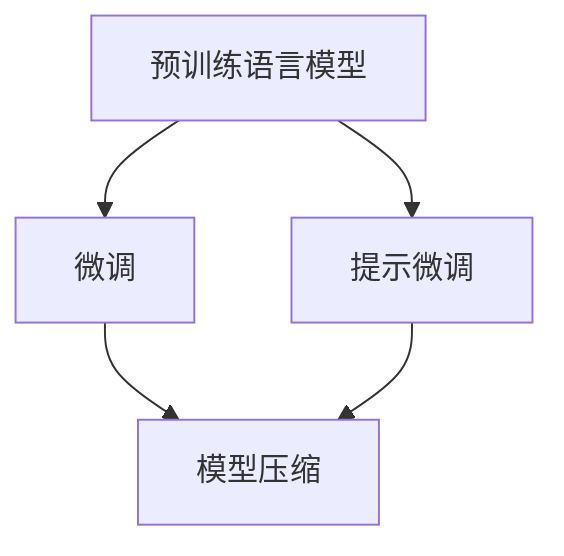

# 大语言模型原理与工程实践：大语言模型微调的探索与展望

## 1. 背景介绍

### 1.1 问题的由来

随着人工智能技术的不断发展,大型语言模型(Large Language Models, LLMs)已经成为自然语言处理(Natural Language Processing, NLP)领域的关键技术之一。这些模型通过在海量文本数据上进行预训练,能够捕捉到丰富的语言知识和语义信息,为下游任务提供强大的语言理解和生成能力。

然而,直接将预训练的大型语言模型应用于特定任务通常会遇到一些挑战。首先,这些通用模型是在海量无标注数据上训练的,难以完全满足特定任务的需求。其次,直接微调这些庞大的模型在计算资源和时间成本上都存在很大的瓶颈。因此,如何有效地利用预训练语言模型,并将其适应于特定任务,成为了当前研究的重点。

### 1.2 研究现状

为了解决上述问题,研究人员提出了多种大型语言模型微调(Fine-tuning)的方法。其中,一种广为人知的方法是在目标任务的标注数据上对预训练模型进行进一步的微调训练。这种方式可以有效地将通用语言知识转移到特定任务上,提高模型的性能。然而,由于标注数据的缺乏,以及微调过程的计算成本高昂,该方法在某些情况下可能会受到限制。

另一种流行的方法是提示微调(Prompt-tuning),它通过设计特定的提示模板,将任务信息注入到预训练模型中,从而实现任务适应。这种方法不需要对整个模型进行微调,只需要学习一个较小的提示模型,因此计算成本相对较低。但是,提示模板的设计对模型性能有很大影响,需要进行大量的人工探索和调优。

除了上述两种主流方法外,还有一些其他的微调技术,如模型蒸馏(Model Distillation)、模型剪枝(Model Pruning)等,它们旨在减小模型的计算复杂度,提高推理效率。

### 1.3 研究意义

大型语言模型微调技术的研究对于自然语言处理领域具有重要意义。首先,它可以有效地利用预训练模型的语言知识,提高下游任务的性能。其次,通过合理的微调策略,可以降低计算资源的消耗,使得大型语言模型在实际应用中更加高效和可行。此外,探索新颖的微调方法也有助于我们更好地理解和利用这些强大的语言模型。

### 1.4 本文结构

本文将全面探讨大型语言模型微调的原理和实践。我们将首先介绍微调的核心概念和算法原理,包括传统的微调方法和最新的提示微调技术。接下来,我们将详细阐述这些算法的数学模型和公式推导过程,并通过案例分析加深读者的理解。

此外,我们还将提供一个完整的项目实践,包括开发环境搭建、源代码实现和运行结果展示,帮助读者掌握微调技术的实际应用。最后,我们将总结微调技术的未来发展趋势和面临的挑战,并推荐相关的学习资源和工具。

## 2. 核心概念与联系

在深入探讨大型语言模型微调的具体算法之前,我们先介绍一些核心概念和它们之间的联系,为后续内容打下基础。

### 2.1 预训练语言模型

预训练语言模型(Pre-trained Language Model, PLM)是指在大规模无标注文本数据上训练的语言模型。这些模型通过自监督学习的方式,捕捉到丰富的语言知识和语义信息,为下游任务提供强大的语言理解和生成能力。

常见的预训练语言模型包括BERT、GPT、T5等,它们采用了不同的模型架构和预训练任务。例如,BERT使用了Transformer编码器,并采用了掩码语言模型(Masked Language Modeling)和下一句预测(Next Sentence Prediction)等预训练任务;GPT则使用了Transformer解码器,并采用了因果语言模型(Causal Language Modeling)作为预训练任务。

### 2.2 微调

微调(Fine-tuning)是指在预训练语言模型的基础上,利用标注数据对模型进行进一步的训练,使其适应特定的下游任务。这个过程通常只需要对模型的部分参数进行调整,而不需要从头开始训练整个模型。

微调的目标是将通用的语言知识转移到特定任务上,提高模型在该任务上的性能。同时,由于只需要对部分参数进行训练,微调过程相对于从头训练更加高效和节省计算资源。

### 2.3 提示微调

提示微调(Prompt-tuning)是一种新兴的微调方法,它通过设计特定的提示模板,将任务信息注入到预训练模型中,从而实现任务适应。与传统的微调方法不同,提示微调不需要对整个模型进行微调,只需要学习一个较小的提示模型,因此计算成本相对较低。

提示模板的设计对模型性能有很大影响,需要进行大量的人工探索和调优。常见的提示模板包括手工设计的模板、自动搜索的模板,以及基于预训练模板的微调等。

### 2.4 模型压缩

模型压缩(Model Compression)是一种旨在减小模型计算复杂度、提高推理效率的技术。常见的模型压缩方法包括模型蒸馏(Model Distillation)、模型剪枝(Model Pruning)等。

模型蒸馏是将一个大型模型(教师模型)的知识转移到一个小型模型(学生模型)上,从而获得更高的推理效率。模型剪枝则是通过删除模型中不重要的参数或连接,来减小模型的大小和计算复杂度。

这些模型压缩技术通常与微调技术结合使用,以进一步提高大型语言模型在实际应用中的效率和可行性。

### 2.5 核心概念关系

上述核心概念之间存在着紧密的联系,如下图所示:

预训练语言模型是微调和提示微调的基础,它提供了通用的语言知识和语义信息。微调和提示微调则是将预训练模型适应到特定任务的两种不同方式。同时,为了提高模型的推理效率,可以将微调或提示微调与模型压缩技术结合使用。

通过合理利用这些技术,我们可以充分发挥大型语言模型的潜力,并将其应用于各种自然语言处理任务中。

## 3. 核心算法原理 & 具体操作步骤

### 3.1 算法原理概述

在介绍具体的算法步骤之前,我们先概述一下大型语言模型微调的核心算法原理。

微调过程可以看作是一个迁移学习(Transfer Learning)的过程,它将预训练模型在大规模无标注数据上学习到的通用语言知识,转移到特定任务的标注数据上,从而获得更好的任务适应性和性能。

具体来说,微调算法通常包括以下几个关键步骤:

1. **初始化**:将预训练语言模型的参数作为初始化参数。
2. **数据准备**:准备特定任务的标注数据,并将其转换为模型可以接受的输入格式。
3. **微调训练**:在标注数据上对预训练模型进行进一步的训练,通过优化目标函数来调整模型参数,使其适应特定任务。
4. **模型评估**:在验证集或测试集上评估微调后模型的性能,根据需要进行超参数调整或早停等策略。
5. **模型部署**:将微调后的模型部署到实际应用中,用于特定任务的预测或生成。

在这个过程中,微调算法需要解决一些关键问题,如如何有效地利用预训练模型的知识、如何设计合适的目标函数、如何防止过拟合等。不同的微调方法在具体实现上会有所不同,我们将在后续章节中详细介绍。

### 3.2 算法步骤详解

接下来,我们将详细介绍传统微调和提示微调两种主流微调算法的具体步骤。

#### 3.2.1 传统微调算法

传统微调算法的步骤如下:

1. **初始化**:将预训练语言模型(如BERT、GPT等)的参数作为初始化参数。

2. **数据准备**:根据特定任务的要求,准备标注数据集。对于序列标注任务(如命名实体识别、文本分类等),需要将输入文本和标签序列转换为模型可以接受的输入格式,通常是将它们拼接为一个序列。对于生成任务(如机器翻译、文本摘要等),需要将输入文本和目标输出文本拼接为一个序列。

3. **微调训练**:在标注数据集上对预训练模型进行进一步的训练,通过优化目标函数来调整模型参数。常见的目标函数包括交叉熵损失函数(对于分类任务)和序列生成损失函数(对于生成任务)等。训练过程中,可以采用梯度下降等优化算法来更新模型参数。

4. **模型评估**:在验证集或测试集上评估微调后模型的性能,常用的评估指标包括准确率、F1分数(对于分类任务)、BLEU分数(对于生成任务)等。根据模型性能,可以进行超参数调整(如学习率、批大小等)或早停等策略,以防止过拟合。

5. **模型部署**:将微调后的模型部署到实际应用中,用于特定任务的预测或生成。

传统微调算法的优点是直观易懂,可以充分利用预训练模型的语言知识,并在大多数任务上取得了不错的性能。但是,它也存在一些缺陷,如需要大量标注数据、计算资源消耗较大等。

#### 3.2.2 提示微调算法

提示微调算法的步骤如下:

1. **初始化**:将预训练语言模型(如GPT等)的参数作为初始化参数。

2. **提示模板设计**:设计特定任务的提示模板,将任务信息注入到预训练模型中。提示模板的设计对模型性能有很大影响,需要进行大量的人工探索和调优。常见的提示模板包括手工设计的模板、自动搜索的模板,以及基于预训练模板的微调等。

3. **提示编码**:将设计好的提示模板与输入文本拼接,形成模型可以接受的输入序列。

4. **微调训练**:在标注数据集上对预训练模型和提示模板进行联合训练,通过优化目标函数来调整提示模板的参数。常用的目标函数包括交叉熵损失函数(对于分类任务)和序列生成损失函数(对于生成任务)等。

5. **模型评估**:在验证集或测试集上评估微调后模型的性能,评估指标和传统微调类似。根据模型性能,可以调整提示模板或训练超参数。

6. **模型部署**:将微调后的模型和提示模板一起部署到实际应用中,用于特定任务的预测或生成。

提示微调算法的优点是计算成本相对较低,不需要对整个预训练模型进行微调。但是,它也存在一些挑战,如提示模板的设计需要大量人工探索,模型性能heavily依赖于提示模板的质量等。

### 3.3 算法优缺点

传统微调算法和提示微调算法各有优缺点,我们对比如下:

**传统微调算法**:

优点:
- 直观易懂,可以充分利用预训练模型的语言知识。
- 在大多数任务上取得了不错的性能。

缺点:
- 需要大量标注数据,数据获取成本较高。
- 计算资源消耗较大,微调过程耗时较长。
- 容易过拟合,需要采取一些策略(如早停、正则化等)来防止过拟合。

**提示微调算法**:

优点:
- 计算成本相对较低,不需要对整个预训练模型进行微调。