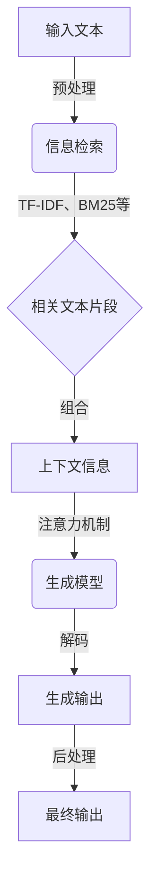

# 大语言模型原理与工程实践：检索增强生成技术

## 1. 背景介绍

### 1.1 问题的由来

在当今信息时代,海量的文本数据不断产生和积累,如何高效地处理和利用这些数据成为了一个巨大的挑战。传统的信息检索技术主要关注如何从大规模文本数据中快速准确地找到相关内容,但它们通常无法生成新的内容。而随着人工智能技术的不断发展,大型语言模型(Large Language Model,LLM)应运而生,它们不仅能够理解和检索文本,还能够基于现有知识生成新的连贯、多样的文本内容。

大语言模型通过在海量文本语料上进行预训练,学习到了丰富的语言知识和上下文信息,从而具备了强大的文本理解和生成能力。然而,这些模型在实际应用中仍然面临一些挑战,例如生成内容的一致性、准确性和多样性等。为了解决这些问题,研究人员提出了检索增强生成(Retrieval-Augmented Generation,RAG)技术,旨在将大语言模型的生成能力与信息检索技术相结合,实现更高质量的文本生成。

### 1.2 研究现状

近年来,检索增强生成技术受到了广泛关注和研究。一些主流的方法包括:

1. **基于检索的生成(Retrieval-Based Generation)**:首先从语料库中检索与输入相关的文本片段,然后将这些片段作为上下文信息输入到语言模型中进行生成。
2. **基于记忆的生成(Memory-Augmented Generation)**:在语言模型中引入外部记忆模块,将相关的知识信息存储在记忆中,并在生成过程中动态地读取和更新记忆。
3. **基于注意力的生成(Attention-Based Generation)**:利用注意力机制,让语言模型在生成时能够选择性地关注输入文本的不同部分,从而产生更加相关和连贯的输出。

这些技术在一定程度上提高了生成质量,但仍然存在一些不足,例如检索的效率和准确性、记忆容量的限制、注意力机制的局限性等。因此,如何更好地融合检索和生成,充分利用语料库中的知识,是当前研究的重点和挑战。

### 1.3 研究意义

检索增强生成技术的研究具有重要的理论意义和应用价值:

- **理论意义**:它探索了语言模型与信息检索技术的有机结合,为构建更加智能、多功能的自然语言处理系统提供了新的思路和方法。同时,它也推动了对大型语言模型的深入研究,有助于更好地理解和利用这些模型的能力。
- **应用价值**:检索增强生成技术可以广泛应用于各种需要生成高质量文本的场景,如问答系统、对话系统、文本摘要、内容创作等。它有望显著提高这些系统的性能和用户体验,为人工智能在自然语言处理领域的应用开辟新的空间。

### 1.4 本文结构

本文将全面介绍检索增强生成技术的原理、算法和工程实践。具体内容安排如下:

1. **背景介绍**:阐述检索增强生成技术的由来、研究现状和意义。
2. **核心概念与联系**:介绍检索增强生成技术中的关键概念,并探讨它们之间的联系。
3. **核心算法原理与具体操作步骤**:详细阐述检索增强生成技术中的核心算法原理,并给出具体的操作步骤。
4. **数学模型和公式详细讲解与举例说明**:构建检索增强生成技术的数学模型,推导相关公式,并通过案例进行详细说明。
5. **项目实践:代码实例和详细解释说明**:提供一个基于检索增强生成技术的项目实践,包括开发环境搭建、源代码实现、代码解读和运行结果展示。
6. **实际应用场景**:介绍检索增强生成技术在问答系统、对话系统、文本摘要等领域的实际应用场景,并展望未来的应用前景。
7. **工具和资源推荐**:推荐相关的学习资源、开发工具、论文和其他有用资源。
8. **总结:未来发展趋势与挑战**:总结检索增强生成技术的研究成果,分析未来的发展趋势和面临的挑战,并对未来的研究方向进行展望。
9. **附录:常见问题与解答**:列出一些常见的问题并给出解答,帮助读者更好地理解和掌握检索增强生成技术。

## 2. 核心概念与联系

在检索增强生成技术中,有几个核心概念需要理解和掌握:

1. **大型语言模型(Large Language Model,LLM)**:大型语言模型是一种基于深度学习的自然语言处理模型,通过在海量文本语料上进行预训练,学习到了丰富的语言知识和上下文信息。它们具有强大的文本理解和生成能力,但在实际应用中仍然存在一些不足,如生成内容的一致性、准确性和多样性等。

2. **信息检索(Information Retrieval,IR)**:信息检索是一种从大规模非结构化或半结构化数据集合中查找相关信息的技术。在检索增强生成技术中,信息检索用于从语料库中检索与输入相关的文本片段,为语言模型提供额外的知识来源。

3. **检索增强生成(Retrieval-Augmented Generation,RAG)**:检索增强生成技术旨在将大型语言模型的生成能力与信息检索技术相结合,利用检索到的相关文本片段作为上下文信息,指导语言模型生成更加准确、连贯和多样的输出。

4. **上下文(Context)**:在检索增强生成技术中,上下文指的是与当前输入相关的背景信息或知识。它可以来自于输入文本本身,也可以来自于通过信息检索获取的相关文本片段。提供合适的上下文对于语言模型生成高质量输出至关重要。

5. **注意力机制(Attention Mechanism)**:注意力机制是一种允许模型在处理序列数据时动态地关注不同部分的技术。在检索增强生成中,注意力机制可以帮助语言模型在生成过程中选择性地关注输入文本和检索到的相关文本片段的不同部分,从而产生更加相关和连贯的输出。

这些核心概念相互关联、相辅相成,共同构建了检索增强生成技术的理论基础和技术框架。大型语言模型提供了强大的文本理解和生成能力,信息检索技术为语言模型提供了额外的知识来源,而检索增强生成技术则将两者有机结合,利用注意力机制实现更高质量的文本生成。

## 3. 核心算法原理与具体操作步骤

### 3.1 算法原理概述

检索增强生成技术的核心算法原理可以概括为以下几个主要步骤:

1. **输入处理**:接收用户的输入文本,并对其进行预处理,如分词、标记化等。

2. **信息检索**:根据输入文本,在语料库中检索相关的文本片段。这一步骤通常采用传统的信息检索技术,如TF-IDF、BM25等。

3. **上下文构建**:将输入文本和检索到的相关文本片段组合起来,构建生成模型的上下文信息。

4. **生成模型**:利用大型语言模型,结合构建的上下文信息,生成相关的输出文本。在这一步骤中,注意力机制发挥了重要作用,它允许模型在生成时动态地关注输入文本和检索文本片段的不同部分。

5. **输出后处理**:对生成的输出文本进行后续处理,如去重、过滤等,以提高输出质量。

该算法的核心思想是利用信息检索技术从语料库中获取与输入相关的知识,并将这些知识作为上下文信息提供给大型语言模型,指导模型生成更加准确、连贯和多样的输出。通过这种方式,检索增强生成技术实现了检索和生成的有机结合,充分发挥了两者的优势。

### 3.2 算法步骤详解

下面我们将详细介绍检索增强生成算法的具体操作步骤:

1. **输入处理**:接收用户的输入文本,对其进行预处理,如分词、标记化等。这一步骤的目的是将输入文本转换为模型可以理解的格式。

2. **信息检索**:根据预处理后的输入文本,在语料库中检索相关的文本片段。这一步骤通常采用传统的信息检索技术,如TF-IDF、BM25等。TF-IDF(Term Frequency-Inverse Document Frequency)是一种常用的文本相似度计算方法,它考虑了词项在文档中出现的频率和在整个语料库中的逆文档频率。BM25(Okapi BM25)则是一种基于概率模型的排名函数,它综合考虑了词频、文档长度和查询词的重要性等因素。通过这些技术,我们可以从语料库中检索出与输入文本最相关的文本片段。

3. **上下文构建**:将输入文本和检索到的相关文本片段组合起来,构建生成模型的上下文信息。上下文信息包括了输入文本本身以及与之相关的背景知识,对于生成高质量输出至关重要。

4. **生成模型**:利用大型语言模型,结合构建的上下文信息,生成相关的输出文本。在这一步骤中,注意力机制发挥了重要作用。注意力机制允许模型在生成时动态地关注输入文本和检索文本片段的不同部分,从而产生更加相关和连贯的输出。具体来说,注意力机制通过计算查询向量和键向量之间的相似性分数,动态地为每个键向量分配注意力权重,然后将值向量根据注意力权重进行加权求和,得到最终的注意力输出。这种机制使得模型能够选择性地关注输入序列的不同部分,从而更好地捕捉上下文信息。

5. **输出后处理**:对生成的输出文本进行后续处理,如去重、过滤等,以提高输出质量。这一步骤可以根据具体应用场景进行定制,例如在问答系统中,我们可以过滤掉与问题无关的输出;在文本摘要中,我们可以去除冗余的句子等。

通过上述步骤,检索增强生成技术实现了信息检索和自然语言生成的有机结合,充分利用了语料库中的知识,从而生成更加准确、连贯和多样的输出文本。

### 3.3 算法优缺点

检索增强生成算法具有以下优点:

1. **知识丰富**:通过利用语料库中的知识,算法可以生成更加准确和内容丰富的输出。
2. **多样性**:由于注意力机制的引入,算法可以动态地关注不同的上下文信息,从而生成多样化的输出。
3. **可解释性**:算法的输出基于检索到的相关文本片段,因此具有一定的可解释性和可追溯性。
4. **灵活性**:算法可以应用于各种需要生成高质量文本的场景,如问答系统、对话系统、文本摘要等。

同时,该算法也存在一些缺点和挑战:

1. **检索效率**:在大规模语料库中进行信息检索可能会导致效率低下,影响整体性能。
2. **上下文选择**:如何从检索到的文本片段中选择最合适的上下文信息仍然是一个挑战。
3. **一致性**:生成的输出可能会与检索到的文本片段存在不一致的情况,需要进一步处理。
4. **知识覆盖范围**:算法的性能在一定程度上取决于语料库的覆盖范围和质量。

### 3.4 算法应用领域