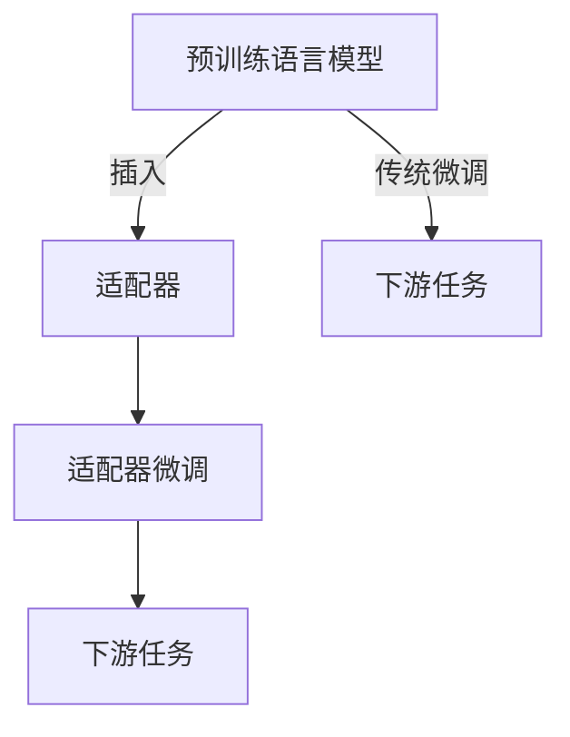

# 大语言模型原理与工程实践：适配器微调

## 1. 背景介绍

### 1.1 问题的由来

在自然语言处理(NLP)领域,预训练语言模型(PLM)已经取得了令人瞩目的成就。大型语言模型如BERT、GPT、T5等在广泛的下游任务上展现出了强大的性能。然而,这些模型通常包含数十亿甚至上百亿的参数,导致了以下几个主要问题:

1. **计算资源消耗巨大**: 训练和推理这些庞大模型需要大量的计算资源,包括GPU/TPU等昂贵的硬件设备,给企业和研究机构带来了沉重的财务负担。

2. **环境影响严重**: 训练大型语言模型会消耗大量的能源,从而产生大量的碳排放,对环境造成不利影响。

3. **泛化能力有限**: 尽管大型语言模型在特定领域表现出色,但它们往往缺乏跨领域的泛化能力,难以直接应用于新的领域或任务。

4. **隐私和安全风险**: 大型语言模型可能会记录和复制训练数据中的敏感信息,存在潜在的隐私和安全风险。

因此,如何在保持模型性能的同时,降低计算资源消耗、减少环境影响、提高泛化能力以及降低隐私和安全风险,成为了当前NLP领域亟待解决的重要问题。

### 1.2 研究现状  

为了解决上述问题,研究人员提出了多种模型压缩和知识迁移的方法,其中一种被广泛关注和采用的方法是"适配器(Adapter)"。适配器是一种轻量级的模块,可以插入到大型预训练语言模型中,通过微调适配器的参数来适应特定的下游任务,而不需要微调整个大型模型。相比于传统的微调方法,适配器微调具有以下优势:

1. **参数高效**: 适配器只引入少量的可训练参数(通常低于模型总参数的5%),从而大幅减少了计算资源的需求。

2. **任务灵活**: 每个下游任务都可以拥有专门的适配器,不同任务之间的适配器相互独立,避免了"灾难性遗忘"。

3. **环境友好**: 由于参数量少,适配器微调的碳排放量大幅降低,更加环保。

4. **隐私保护**: 适配器微调过程中不需要访问原始训练数据,降低了隐私和安全风险。

5. **泛化性强**: 适配器能够有效捕获下游任务的特征,从而提高了模型在新领域的泛化能力。

目前,适配器微调方法已经被广泛应用于自然语言理解、机器翻译、对话系统等多个NLP任务中,并取得了优异的性能表现。

### 1.3 研究意义

适配器微调技术的出现为NLP领域带来了全新的发展机遇,具有重要的理论意义和应用价值:

- **理论意义**:
  - 深入探索大型语言模型的知识表示和迁移机制,推动NLP理论研究向前发展。
  - 为高效模型压缩和知识迁移提供了新的技术路线,拓展了模型压缩的研究视角。
  - 验证了"少参数、多任务"的范式在NLP领域的可行性,为未来模型设计提供了新思路。

- **应用价值**:
  - 降低了大型语言模型的计算资源需求,使NLP技术更加环保和经济,推动了AI技术的民主化。
  - 提高了模型在新领域的泛化能力,扩展了NLP技术的应用场景,促进了AI技术的产业落地。
  - 增强了模型的隐私保护能力,提高了AI技术的安全性和可信度,有利于推动"负责任AI"的发展。

因此,深入研究适配器微调技术的原理和实践,对于推动NLP领域的理论创新和技术进步都具有重要意义。

### 1.4 本文结构

本文将全面介绍适配器微调技术的理论基础、核心算法、实践应用等内容。文章主要分为以下几个部分:

1. **背景介绍**: 阐述适配器微调技术的产生背景、研究现状和重要意义。

2. **核心概念与联系**: 介绍适配器微调所涉及的核心概念,并分析它们之间的联系。

3. **核心算法原理与操作步骤**: 深入解析适配器微调算法的原理,并详细讲解算法的具体实现步骤。

4. **数学模型与公式推导**: 构建适配器微调的数学模型,并推导出相关的公式,辅以案例说明。

5. **项目实践**: 通过实际代码实例,演示如何搭建开发环境、实现源代码并运行适配器微调模型。

6. **应用场景分析**: 介绍适配器微调技术在自然语言理解、机器翻译等领域的实际应用案例。

7. **工具与资源推荐**: 为读者提供适配器微调相关的学习资源、开发工具和论文推荐。

8. **总结与展望**: 总结适配器微调技术的研究成果,并展望其未来的发展趋势和面临的挑战。

9. **附录**: 针对适配器微调技术的常见问题,给出解答和说明。

通过全面而深入的介绍,本文旨在为读者提供一个系统的理解适配器微调技术的机会,并激发大家对该领域的浓厚兴趣。

## 2. 核心概念与联系

在深入探讨适配器微调算法之前,我们需要先了解一些核心概念,这些概念为理解适配器微调技术奠定了基础。

### 2.1 预训练语言模型(PLM)

预训练语言模型(Pre-trained Language Model, PLM)是指在大规模无监督语料库上预先训练的语言模型。这些模型通过自监督学习的方式,捕获了大量的语言先验知识,为后续的下游任务奠定了基础。

常见的预训练语言模型包括:

- **BERT**(Bidirectional Encoder Representations from Transformers)
- **GPT**(Generative Pre-trained Transformer)
- **T5**(Text-to-Text Transfer Transformer)
- **XLNet**
- **RoBERTa**
- **ALBERT**
- ...

这些模型通常包含数十亿甚至上百亿的参数,在下游任务上表现出了强大的性能。然而,训练和推理如此庞大的模型需要消耗大量的计算资源,这正是适配器微调技术应运而生的重要原因之一。

### 2.2 微调(Fine-tuning)

微调是指在预训练语言模型的基础上,通过监督学习的方式,进一步调整模型参数以适应特定的下游任务。微调过程中,模型会在下游任务的训练数据上进行训练,所有参数都会被更新。

尽管微调能够有效地提高模型在特定任务上的性能,但它也存在一些缺陷:

1. **计算资源消耗大**: 需要更新整个大型模型的所有参数,计算开销巨大。

2. **灾难性遗忘**: 在微调过程中,模型可能会"遗忘"之前学习到的一般知识。

3. **任务冲突**: 不同任务之间的微调参数可能会相互干扰,导致性能下降。

4. **隐私和安全风险**: 微调过程中需要访问原始训练数据,存在潜在的隐私和安全风险。

适配器微调技术正是为了解决传统微调方法的这些缺陷而被提出的。

### 2.3 适配器(Adapter)

适配器是指插入到预训练语言模型中的一个轻量级模块,通常由一些小型的前馈神经网络组成。适配器的作用是捕获下游任务的特征,并将这些特征注入到大型模型中,从而使模型适应该任务。

适配器的优势在于:

1. **参数高效**: 适配器只引入少量的可训练参数(通常低于模型总参数的5%),从而大幅节省了计算资源。

2. **任务独立**: 每个下游任务都可以拥有专门的适配器,不同任务之间的适配器相互独立,避免了参数冲突。

3. **知识保留**: 适配器只对原有模型进行轻微修改,能够很好地保留预训练模型中学习到的一般知识。

4. **隐私保护**: 适配器微调过程中不需要访问原始训练数据,降低了隐私和安全风险。

适配器的引入使得大型语言模型的知识能够高效地迁移到下游任务中,同时避免了传统微调方法的诸多缺陷。

### 2.4 适配器微调(Adapter Tuning)

适配器微调是指在预训练语言模型中插入适配器模块,并仅微调适配器的参数以适应特定的下游任务,而不需要微调整个大型模型。适配器微调的过程如下:

1. 将适配器插入到预训练语言模型的特定位置(通常是Transformer层之间)。

2. 在下游任务的训练数据上,仅微调适配器的参数,而保持预训练模型的参数不变。

3. 在推理阶段,适配器的输出会被注入到预训练模型中,从而使模型适应该下游任务。

适配器微调技术结合了预训练语言模型和微调的优点,既能够利用大型模型学习到的丰富知识,又能高效地将这些知识迁移到新的下游任务中。同时,它还克服了传统微调方法的缺陷,如计算资源消耗大、灾难性遗忘、任务冲突等。

### 2.5 核心概念之间的联系

上述核心概念之间存在着紧密的联系,它们共同构成了适配器微调技术的理论基础。我们可以用一个简单的示意图来直观地展示它们之间的关系:

从上图可以看出:

1. 预训练语言模型是适配器微调技术的基础,它通过自监督学习捕获了大量的语言先验知识。

2. 适配器是一种轻量级的模块,可以插入到预训练语言模型中。

3. 适配器微调是指仅微调适配器的参数,而不需要微调整个大型模型,从而实现了高效的知识迁移。

4. 适配器微调的目标是使预训练语言模型适应特定的下游任务,与传统的微调方法相比,它具有更高的计算效率和更好的泛化能力。

通过适当地设计和训练适配器,我们可以充分利用预训练语言模型中蕴含的知识,并将其高效地应用于各种下游任务,从而提高NLP系统的性能和效率。

## 3. 核心算法原理与具体操作步骤

### 3.1 算法原理概述

适配器微调算法的核心思想是在预训练语言模型中插入轻量级的适配器模块,并仅微调这些适配器的参数,从而使模型适应特定的下游任务,而不需要微调整个大型模型。这种方法能够有效地减少计算资源的消耗,同时保留了预训练模型中学习到的丰富知识。

适配器微调算法的原理可以概括为以下几个关键步骤:

1. **插入适配器模块**:
   - 在预训练语言模型的特定位置(通常是Transformer层之间)插入适配器模块。
   - 适配器模块通常由一些小型的前馈神经网络组成,参数量远小于整个预训练模型。

2. **计算适配器输出**:
   - 将预训练模型的输出作为适配器模块的输入。
   - 通过适配器模块,计算出适配器的输出。

3. **注入适配器输出**:
   - 将适配器的输出与预训练模型的输出进行融合(如相加、门控等操作)。
   - 融合后的输出被送入下一层,从而使模型适应特定的下游任务。

4. **微调适配器参数**:
   - 在下游任务的训练数据上,仅微调适配器模块的参数。
   - 预训练语言模型的参数保持不变,从而保留了原有的语言知