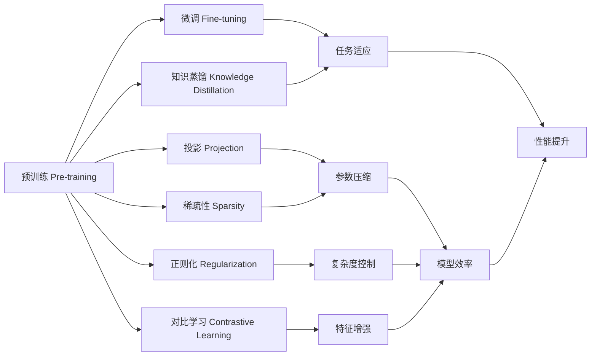

# 大语言模型原理基础与前沿 基于投影和正则化的方法

关键词：大语言模型、投影、正则化、预训练、微调、知识蒸馏、对比学习、稀疏性

## 1. 背景介绍
### 1.1  问题的由来
近年来，随着深度学习技术的快速发展，大规模预训练语言模型(Pretrained Language Models, PLMs)已成为自然语言处理(Natural Language Processing, NLP)领域的研究热点。PLMs通过在大规模无标注语料上进行自监督预训练，可以学习到丰富的语言知识，并通过微调(Fine-tuning)等方式应用到下游任务，取得了显著的性能提升。然而，PLMs也面临着模型参数量巨大、训练成本高昂、推理速度慢等问题，亟需探索更高效的模型压缩和加速技术。

### 1.2  研究现状
为了提高PLMs的效率，学术界提出了许多模型压缩方法，如知识蒸馏(Knowledge Distillation)、量化(Quantization)、剪枝(Pruning)等。其中，基于投影(Projection)和正则化(Regularization)的方法因其简单有效而备受关注。投影方法通过将高维词向量映射到低维子空间，在保留重要语义信息的同时大幅减小参数量。正则化方法通过在训练目标中引入额外的正则项，如L1/L2范数、核范数等，促使模型学习到更加简洁高效的表示。近期的一些工作，如ALBERT[1]、DistilBERT[2]、TinyBERT[3]等，都采用了投影和正则化技术，在维持较高性能的同时显著提升了模型效率。

### 1.3  研究意义
尽管已有工作取得了可喜的进展，但仍存在不少问题有待进一步探索：
1. 现有方法大多针对特定模型结构(如Transformer)，缺乏通用性和可扩展性。 
2. 对投影和正则化技术的理论基础研究不足，缺乏对其内在机制的深入理解。
3. 模型压缩与知识传递之间的权衡问题尚未得到很好的解决。

因此，本文拟从理论和实践两个角度，系统研究基于投影和正则化的大语言模型压缩方法。一方面，探索更加通用和鲁棒的投影与正则化技术，提出适用于不同模型结构的压缩框架；另一方面，通过理论分析和实验验证，深入理解投影和正则化的作用机制，为设计更优的模型压缩方案提供指导。本研究对于提高大语言模型的效率，推动其在实际应用中的部署具有重要意义。

### 1.4  本文结构
本文的结构安排如下：第2部分介绍大语言模型压缩的核心概念与技术；第3部分重点阐述基于投影和正则化的模型压缩算法原理与步骤；第4部分从理论角度分析投影和正则化的作用机制，并给出数学模型与公式推导；第5部分通过实验验证所提方法的有效性，给出代码实例与详细解释；第6部分讨论方法在实际应用场景中的可能用途；第7部分推荐相关学习资源与开发工具；第8部分总结全文，并展望未来研究方向；第9部分列举一些常见问题与解答。

## 2. 核心概念与联系
大语言模型压缩的核心概念包括：
- 预训练(Pre-training)：在大规模无标注语料上进行自监督学习，捕捉语言的一般性知识和规律。
- 微调(Fine-tuning)：在特定任务的标注数据上对预训练模型进行二次训练，使其适应任务的特点。
- 知识蒸馏(Knowledge Distillation)：使用大型复杂的教师模型(Teacher Model)去指导小型学生模型(Student Model)的训练，将知识从教师模型传递给学生模型。
- 投影(Projection)：通过线性或非线性变换将高维词向量映射到低维子空间，减小模型参数量。
- 正则化(Regularization)：在模型训练的目标函数中引入惩罚项，控制模型复杂度，防止过拟合，提高泛化性能。
- 对比学习(Contrastive Learning)：通过最大化正样本对的相似度，最小化负样本对的相似度，学习到更有判别性的特征表示。
- 稀疏性(Sparsity)：在模型参数或激活值中引入稀疏约束，使大部分参数趋于零，从而实现模型压缩。

这些概念之间存在着密切的联系：
- 预训练是大语言模型压缩的基础，微调是预训练模型应用于具体任务的关键。
- 知识蒸馏可看作是一种特殊的微调，旨在将大模型的知识精炼到小模型中。
- 投影和正则化都是在预训练和微调阶段对模型施加约束的手段，前者通过降维压缩模型参数，后者通过引入惩罚项控制模型复杂度。
- 对比学习是一种新兴的自监督预训练范式，可与投影、正则化等技术结合，学习更加紧凑和有效的特征表示。
- 稀疏性可看作是一种隐式的正则化形式，通过参数/激活值的稀疏化来压缩模型。

综上，投影、正则化、知识蒸馏、对比学习、稀疏性等技术在大语言模型压缩中扮演着关键角色，它们相互配合、协同作用，共同促进模型效率和性能的提升。

## 3. 核心算法原理 & 具体操作步骤
### 3.1  算法原理概述
本文提出的基于投影和正则化的大语言模型压缩方法，核心思想是在预训练和微调阶段引入投影层和正则化项，同时结合知识蒸馏和对比学习等技术，实现参数高效压缩和特征增强。具体而言：
- 在预训练阶段，在Transformer的每一层之后插入投影层，将隐藏状态从高维空间映射到低维子空间，减小参数量。同时，在预训练目标中加入L1和L2正则化项，鼓励模型学习稀疏紧致的表示。
- 在微调阶段，利用大型教师模型的知识来指导小型学生模型，通过最小化两个模型输出分布之间的KL散度来进行知识蒸馏。此外，在学生模型中引入对比学习目标，最大化正样本对的相似度，提高特征的判别性。

### 3.2  算法步骤详解
算法主要分为两个阶段：预训练和微调。

预训练阶段：
1. 构建带投影层的Transformer模型，设置隐藏层维度 $d_h$ 和投影层维度 $d_p$，其中 $d_p < d_h$。
2. 在预训练语料上进行自监督学习，采用掩码语言模型(Masked Language Modeling, MLM)和下一句预测(Next Sentence Prediction, NSP)任务。
3. 在预训练损失中加入L1和L2正则化项，损失函数定义为：

$$L_{pre} = L_{MLM} + L_{NSP} + \lambda_1 \sum_{i} ||\theta_i||_1 + \lambda_2 \sum_{i} ||\theta_i||_2^2$$

其中，$L_{MLM}$ 和 $L_{NSP}$ 分别为MLM和NSP任务的损失，$\theta_i$ 为模型参数，$\lambda_1$ 和 $\lambda_2$ 为正则化系数。

4. 利用AdamW优化器和线性学习率调度对模型进行训练，直至收敛。

微调阶段：
1. 在下游任务数据上对预训练模型进行微调，分别构建教师模型(原始大模型)和学生模型(压缩模型)。
2. 对教师模型进行常规微调，损失函数为任务特定的损失(如交叉熵损失)：

$$L_{tea} = L_{task}$$

3. 在学生模型中引入知识蒸馏损失和对比学习损失，总损失函数定义为：

$$L_{stu} = \alpha L_{task} + \beta L_{KD} + \gamma L_{CL}$$

其中，$L_{task}$ 为任务损失，$L_{KD}$ 为知识蒸馏损失(教师模型和学生模型输出分布的KL散度)，$L_{CL}$ 为对比学习损失(正样本对相似度与负样本对相似度的差异)，$\alpha$、$\beta$、$\gamma$ 为平衡系数。

4. 利用AdamW优化器和线性学习率调度对学生模型进行训练，直至收敛。在推理阶段，只使用学生模型进行预测。

### 3.3  算法优缺点
优点：
- 通过投影和正则化技术，显著减小了模型参数量，提高了训练和推理效率。
- 引入知识蒸馏和对比学习，充分利用大模型的知识，同时增强了特征表示的判别性，提高了下游任务性能。
- 算法简单易实现，可扩展性强，适用于各种不同结构的语言模型。

缺点：
- 超参数(如投影维度、正则化系数等)选择需要依赖经验和调优，对参数敏感。
- 在某些任务上，精度可能略有下降，需要在效率和性能间权衡。
- 知识蒸馏和对比学习引入了额外的计算开销，在实践中需要折中。

### 3.4  算法应用领域
本算法可广泛应用于各种NLP任务，如：
- 文本分类：情感分析、主题分类、意图识别等。
- 序列标注：命名实体识别、词性标注、语义角色标注等。
- 问答系统：阅读理解、开放域问答等。
- 机器翻译：将算法用于编码器-解码器结构的压缩。
- 文本生成：如对话生成、摘要生成、故事生成等。

此外，本算法还可拓展应用于其他领域，如语音识别、图像分类、推荐系统等，具有广阔的应用前景。

## 4. 数学模型和公式 & 详细讲解 & 举例说明
### 4.1  数学模型构建
我们以Transformer为例，阐述如何在模型中引入投影层和正则化项。

标准的Transformer层包括多头自注意力(Multi-Head Self-Attention)和前馈网络(Feed-Forward Network)两个子层。对于第 $l$ 层的第 $i$ 个token，其隐藏状态表示为 $\mathbf{h}_i^l \in \mathbb{R}^{d_h}$。

在多头自注意力中，通过线性变换将 $\mathbf{h}_i^l$ 映射为查询向量(query)、键向量(key)和值向量(value)：

$$\mathbf{q}_i^l = \mathbf{W}_q^l \mathbf{h}_i^l,\quad 
\mathbf{k}_i^l = \mathbf{W}_k^l \mathbf{h}_i^l,\quad
\mathbf{v}_i^l = \mathbf{W}_v^l \mathbf{h}_i^l$$

其中，$\mathbf{W}_q^l, \mathbf{W}_k^l, \mathbf{W}_v^l \in \mathbb{R}^{d_h \times d_h}$ 为可学习的权重矩阵。

然后，通过scaled dot-product attention计算注意力权重和输出：

$$\mathbf{a}_i^l = \text{softmax}(\frac{\mathbf{q}_i^l \mathbf{K}^{lT}}{\sqrt{d_h}}) \mathbf{V}^l$$

其中，$\mathbf{K}^l = [\mathbf{k}_1^l,\dots,\mathbf{k}_n^l] \in \mathbb{R}^{d_h \times n}$，$\mathbf{V}^l = [\mathbf{v}_1^l,\dots,\mathbf{v}_n^l