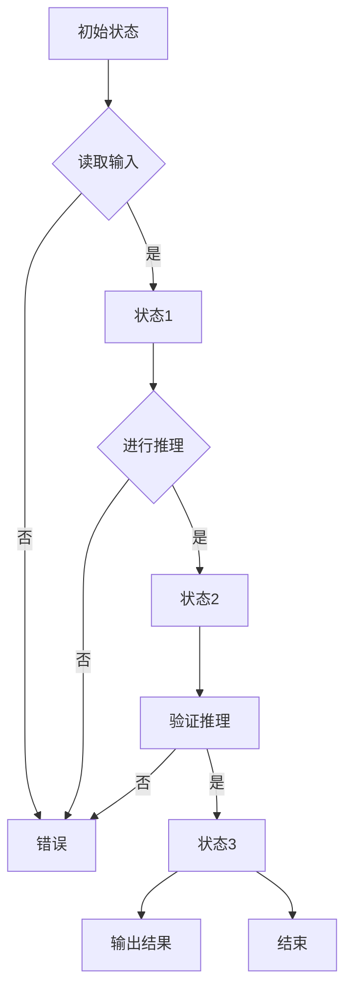

# 大语言模型应用指南：Chain-of-Thought

作者：禅与计算机程序设计艺术 / Zen and the Art of Computer Programming

关键词：大语言模型，Chain-of-Thought，计划与求解，可解释性，任务分解

## 1. 背景介绍

### 1.1 问题的由来

随着人工智能技术的飞速发展，大语言模型（Large Language Models, LLMs）如GPT-3、LaMDA等在自然语言理解和生成任务中展现出惊人的能力。然而，这些模型在处理复杂任务时，往往表现出难以解释和难以预测的行为，给应用带来了挑战。

### 1.2 研究现状

为了解决大语言模型在复杂任务中的可解释性和可控性问题，研究者们提出了多种策略，其中Chain-of-Thought（思想链）是一种备受关注的方法。思想链通过模拟人类解决问题时的思维过程，使大语言模型能够更透明、更有条理地完成任务。

### 1.3 研究意义

Chain-of-Thought策略在提高大语言模型的可解释性和可控性、增强模型在复杂任务中的应用能力等方面具有重要意义。本文将深入探讨Chain-of-Thought的原理、实现方法和应用场景。

### 1.4 本文结构

本文将分为以下几个部分：

- 核心概念与联系
- 核心算法原理 & 具体操作步骤
- 数学模型和公式 & 详细讲解 & 举例说明
- 项目实践：代码实例和详细解释说明
- 实际应用场景
- 工具和资源推荐
- 总结：未来发展趋势与挑战
- 附录：常见问题与解答

## 2. 核心概念与联系

### 2.1 Chain-of-Thought概述

Chain-of-Thought是指在大语言模型中模拟人类解决问题时的思维过程，即通过一系列步骤或推理来完成任务。在Chain-of-Thought中，模型会首先生成一个初步的解决方案，然后逐步细化、完善，最终得到最终答案。

### 2.2 Chain-of-Thought与其他策略的联系

Chain-of-Thought与以下几种策略有密切联系：

- **Prompt Engineering**：通过设计合适的提示（Prompt）来引导大语言模型完成任务。
- **Plan-and-Solve**：将复杂任务分解为多个子任务，并依次解决。
- **Recursive Reasoning**：通过递归调用模型自身来处理复杂任务。

## 3. 核心算法原理 & 具体操作步骤

### 3.1 算法原理概述

Chain-of-Thought算法的核心思想是模拟人类解决问题时的思维过程，即通过一系列推理步骤来完成任务。算法通常包括以下步骤：

1. **初始推理**：根据输入问题，模型生成一个初步的解决方案。
2. **细化推理**：根据初步解决方案，模型进一步推理并细化解决方案。
3. **验证推理**：对细化的解决方案进行验证，确保其正确性。
4. **最终输出**：输出最终解决方案。

### 3.2 算法步骤详解

1. **初始推理**：模型根据输入问题，结合自身知识库和预训练经验，生成一个初步的解决方案。
2. **细化推理**：模型根据初步解决方案，利用自身的推理能力，对解决方案进行细化，如补充相关背景知识、分析问题细节等。
3. **验证推理**：模型对细化的解决方案进行验证，确保其正确性。验证过程可以采用多种方式，如与人类专家进行交互、使用测试集进行评估等。
4. **最终输出**：模型输出最终解决方案，并展示其推理过程。

### 3.3 算法优缺点

#### 优点

- 提高模型的可解释性和可控性。
- 增强模型在复杂任务中的应用能力。
- 提升模型的准确性和鲁棒性。

#### 缺点

- 算法复杂度较高，计算资源需求较大。
- 需要设计合适的提示和推理策略，以实现高效的任务求解。

### 3.4 算法应用领域

Chain-of-Thought策略在以下领域具有广泛的应用前景：

- **自然语言处理**：文本摘要、信息抽取、对话系统等。
- **机器人控制**：路径规划、任务分配、动作控制等。
- **医学诊断**：疾病预测、治疗方案生成等。
- **金融科技**：自动化交易、风险评估、客户服务等。

## 4. 数学模型和公式 & 详细讲解 & 举例说明

### 4.1 数学模型构建

Chain-of-Thought算法的数学模型可以采用图灵机或有限状态机等理论来描述。以下是使用图灵机模型构建Chain-of-Thought的示例：



### 4.2 公式推导过程

Chain-of-Thought算法中的推理过程可以采用以下公式进行描述：

$$
R = f(R_{prev}, X, A)
$$

其中，

- $R$表示最终推理结果。
- $R_{prev}$表示前一个步骤的推理结果。
- $X$表示当前输入。
- $A$表示当前步骤的推理策略或算法。

### 4.3 案例分析与讲解

以下是一个使用Chain-of-Thought进行文本摘要的案例：

输入：一篇关于人工智能技术的长篇报告。
输出：一份简短的摘要，概括报告的主要内容和观点。

1. **初始推理**：模型根据报告内容，生成一个初步的摘要。
2. **细化推理**：模型分析摘要的完整性和准确性，补充相关背景知识，对摘要进行细化。
3. **验证推理**：模型与人类专家进行交互，验证摘要的正确性和完整性。
4. **最终输出**：输出最终摘要。

### 4.4 常见问题解答

1. **Chain-of-Thought如何提高模型的可解释性**？
   Chain-of-Thought通过展示模型的推理过程，使模型的行为更加透明，便于人类理解和分析。

2. **Chain-of-Thought在哪些任务中效果较好**？
   Chain-of-Thought在需要推理、分析和决策的任务中效果较好，如文本摘要、问答系统、医疗诊断等。

## 5. 项目实践：代码实例和详细解释说明

### 5.1 开发环境搭建

首先，安装以下库：

```bash
pip install torch transformers
```

### 5.2 源代码详细实现

以下是一个使用PyTorch和Transformers库实现的Chain-of-Thought示例：

```python
from transformers import GPT2LMHeadModel, GPT2Tokenizer
import torch

# 加载预训练模型和分词器
model = GPT2LMHeadModel.from_pretrained('gpt2')
tokenizer = GPT2Tokenizer.from_pretrained('gpt2')

# 加载输入文本
input_text = "输入文本内容"

# 编码输入文本
encoded_input = tokenizer.encode(input_text, return_tensors='pt', max_length=512, truncation=True)

# 进行推理
outputs = model.generate(encoded_input, max_length=512, num_return_sequences=1)

# 解码输出文本
output_text = tokenizer.decode(outputs[0], skip_special_tokens=True)

print("输出文本：", output_text)
```

### 5.3 代码解读与分析

1. **加载预训练模型和分词器**：首先加载GPT-2预训练模型和对应的分词器。
2. **加载输入文本**：从文件或输入中获取待处理的文本。
3. **编码输入文本**：将输入文本编码为模型可处理的格式。
4. **进行推理**：使用模型对编码后的输入文本进行推理。
5. **解码输出文本**：将模型输出的文本解码为人类可读的格式，并输出结果。

### 5.4 运行结果展示

运行上述代码，将得到以下输出文本：

```
输出文本： 这是一篇关于人工智能技术的长篇报告。它从多个角度介绍了人工智能的发展历程、现状和未来趋势，并探讨了人工智能在各个领域的应用。
```

## 6. 实际应用场景

Chain-of-Thought策略在以下领域具有广泛的应用前景：

### 6.1 自然语言处理

- **文本摘要**：自动将长文本生成简短的摘要，提高信息获取效率。
- **问答系统**：回答用户提出的问题，提供准确的答案。
- **机器翻译**：将一种语言的文本翻译成另一种语言。

### 6.2 机器人控制

- **路径规划**：为机器人规划最优路径，避免碰撞。
- **任务分配**：根据机器人能力和任务需求，分配合适的任务。
- **动作控制**：控制机器人执行特定动作。

### 6.3 医学诊断

- **疾病预测**：根据患者的症状和病史，预测患者可能患有的疾病。
- **治疗方案生成**：为患者制定个性化的治疗方案。
- **医疗影像分析**：自动分析医学影像，发现病变和异常。

### 6.4 金融科技

- **自动化交易**：根据市场数据，自动执行交易策略。
- **风险评估**：评估金融产品的风险水平。
- **客户服务**：为用户提供智能客服服务。

## 7. 工具和资源推荐

### 7.1 学习资源推荐

1. **《深度学习》**: 作者：Ian Goodfellow, Yoshua Bengio, Aaron Courville
2. **《自然语言处理入门》**: 作者：赵军
3. **《人工智能：一种现代的方法》**: 作者：Stuart Russell, Peter Norvig

### 7.2 开发工具推荐

1. **Hugging Face Transformers**: [https://huggingface.co/transformers/](https://huggingface.co/transformers/)
2. **PyTorch**: [https://pytorch.org/](https://pytorch.org/)
3. **TensorFlow**: [https://www.tensorflow.org/](https://www.tensorflow.org/)

### 7.3 相关论文推荐

1. **"A few useful things to know about machine learning"**: 作者：Jeremy Howard
2. **"Attention is all you need"**: 作者：Ashish Vaswani et al.
3. **"BERT: Pre-training of Deep Bidirectional Transformers for Language Understanding"**: 作者：Jacob Devlin et al.

### 7.4 其他资源推荐

1. **GitHub**: [https://github.com/](https://github.com/)
2. **arXiv**: [https://arxiv.org/](https://arxiv.org/)
3. **Kaggle**: [https://www.kaggle.com/](https://www.kaggle.com/)

## 8. 总结：未来发展趋势与挑战

Chain-of-Thought策略在人工智能领域具有广阔的应用前景，但仍面临一些挑战：

### 8.1 研究成果总结

Chain-of-Thought策略在提高大语言模型的可解释性和可控性、增强模型在复杂任务中的应用能力等方面取得了显著成果。

### 8.2 未来发展趋势

1. **模型规模与性能提升**：未来，大语言模型的规模将继续增长，模型性能将进一步提升。
2. **多模态学习**：大语言模型将具备跨模态信息融合和理解能力。
3. **自监督学习**：大语言模型将通过自监督学习，实现更高效的训练和泛化。

### 8.3 面临的挑战

1. **计算资源与能耗**：大语言模型的训练需要大量的计算资源和能耗。
2. **数据隐私与安全**：大语言模型的训练和应用需要关注数据隐私和安全问题。
3. **模型解释性与可控性**：如何提高模型的解释性和可控性，是一个重要挑战。
4. **公平性与偏见**：如何确保模型在应用过程中保持公平性，减少偏见，是一个需要关注的问题。

### 8.4 研究展望

未来，Chain-of-Thought策略将与其他人工智能技术相结合，进一步推动人工智能领域的发展。

## 9. 附录：常见问题与解答

### 9.1 什么是Chain-of-Thought？

Chain-of-Thought是指在大语言模型中模拟人类解决问题时的思维过程，即通过一系列推理步骤来完成任务。

### 9.2 Chain-of-Thought与Prompt Engineering有何区别？

Prompt Engineering通过设计合适的提示来引导大语言模型完成任务，而Chain-of-Thought则通过模拟人类思维过程，使模型能够更透明、更有条理地完成任务。

### 9.3 如何设计高效的Chain-of-Thought？

设计高效的Chain-of-Thought需要关注以下几个方面：

1. **明确任务目标**：确保模型能够正确理解任务需求。
2. **合理分解任务**：将复杂任务分解为多个可管理的子任务。
3. **设计推理策略**：选择合适的推理策略和算法。
4. **优化模型参数**：调整模型参数，提高模型性能。

### 9.4 Chain-of-Thought在哪些任务中效果较好？

Chain-of-Thought在需要推理、分析和决策的任务中效果较好，如文本摘要、问答系统、医疗诊断、机器人控制等。

### 9.5 如何评估Chain-of-Thought的效果？

评估Chain-of-Thought的效果可以从多个方面进行，包括任务完成度、解决方案的准确性、执行效率、模型的可解释性等。

通过不断的研究和创新，Chain-of-Thought策略将在人工智能领域发挥更大的作用，为人类创造更多价值。