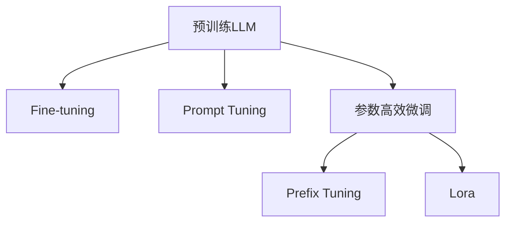

# 大语言模型应用指南：三类微调方法

关键词：大语言模型、微调、Prompt Tuning、Prefix Tuning、Lora

## 1. 背景介绍
### 1.1  问题的由来
近年来，随着深度学习的飞速发展，大语言模型(Large Language Model, LLM)已经成为自然语言处理(Natural Language Processing, NLP)领域的研究热点。LLM通过在海量文本数据上进行预训练，可以学习到丰富的语言知识，具有强大的语言理解和生成能力。然而，直接使用预训练的LLM进行下游任务时，往往难以达到理想的效果，需要在特定任务上进行微调(Fine-tuning)，以提高模型的适应性和性能。

### 1.2  研究现状
目前，针对LLM的微调方法主要有以下三类：
1. 传统的Fine-tuning方法，即在预训练模型的基础上，使用任务特定的数据集对整个模型进行微调。
2. Prompt Tuning方法，通过设计合适的Prompt模板，引导LLM生成符合任务要求的输出。
3. 参数高效的微调方法，如Prefix Tuning和Lora等，通过冻结大部分预训练参数，仅微调少量的任务相关参数，以减少计算开销。

### 1.3  研究意义
探索高效的LLM微调方法对于推动NLP技术的发展具有重要意义：
1. 提高LLM在下游任务上的性能，拓展其应用范围。
2. 降低微调的计算开销，使得LLM的应用更加经济高效。
3. 为LLM的可解释性和可控性研究提供新的思路。

### 1.4  本文结构
本文将围绕三类主要的LLM微调方法展开讨论：
1. 介绍各类微调方法的核心概念和原理。
2. 详细阐述各类微调方法的算法步骤和数学模型。
3. 给出代码实例，并解释其实现细节。
4. 分析各类微调方法的优缺点和适用场景。
5. 总结LLM微调技术的发展趋势和面临的挑战。

## 2. 核心概念与联系
- 大语言模型(Large Language Model, LLM)：在海量文本数据上预训练得到的语言模型，具有强大的语言理解和生成能力，如GPT系列模型。
- 微调(Fine-tuning)：在预训练模型的基础上，使用任务特定的数据集对模型进行进一步训练，以提高其在特定任务上的性能。
- Prompt Tuning：通过设计合适的Prompt模板，引导LLM生成符合任务要求的输出，无需修改预训练模型的参数。
- Prefix Tuning：在输入序列前添加可学习的Prefix向量，通过优化Prefix向量来适应特定任务，同时冻结预训练模型的参数。
- Lora(Low-Rank Adaptation)：在预训练模型的每个注意力层和前馈层并行添加低秩分解矩阵，通过优化这些矩阵来适应特定任务，同时冻结预训练模型的参数。

下图展示了这三类微调方法的核心思想和联系：

## 3. 核心算法原理 & 具体操作步骤
### 3.1  算法原理概述
#### 3.1.1 Fine-tuning
Fine-tuning是最传统和直接的微调方法，其基本思想是在预训练模型的基础上，使用任务特定的数据集对整个模型进行进一步训练。具体而言，Fine-tuning通过以下步骤实现：
1. 在预训练模型的顶部添加一个任务特定的输出层，如分类层或生成层。
2. 使用任务特定的数据集，通过反向传播算法优化整个模型的参数，包括预训练部分和新增的输出层。
3. 在测试阶段，使用微调后的模型对新样本进行预测或生成。

Fine-tuning的优点是实现简单，且可以充分利用预训练模型学习到的语言知识。但其缺点是需要存储和优化整个预训练模型的参数，计算开销大，且容易出现过拟合现象。

#### 3.1.2 Prompt Tuning
Prompt Tuning是一种无需修改预训练模型参数的微调方法，其核心思想是通过设计合适的Prompt模板，引导LLM生成符合任务要求的输出。具体而言，Prompt Tuning通过以下步骤实现：
1. 根据任务的特点，设计一个包含任务描述、输入样本和输出格式的Prompt模板。
2. 将Prompt模板和输入样本拼接成一个完整的输入序列，输入到预训练的LLM中。
3. 通过LLM生成符合Prompt模板要求的输出序列，并根据任务的评价指标计算损失函数。
4. 使用优化算法（如Adam）调整Prompt模板中的可学习参数，如任务描述中的关键词权重，以最小化损失函数。
5. 在测试阶段，使用优化后的Prompt模板对新样本进行预测或生成。

Prompt Tuning的优点是无需修改预训练模型的参数，计算开销小，且可以通过设计合适的Prompt模板来引导LLM生成符合任务要求的输出。但其缺点是对Prompt模板的设计有较高的要求，需要一定的人工经验和迭代优化。

#### 3.1.3 参数高效微调
参数高效微调是一类旨在降低微调计算开销的方法，其核心思想是冻结预训练模型的大部分参数，仅引入少量的任务相关参数进行优化。本文重点介绍两种参数高效微调方法：Prefix Tuning和Lora。

##### 3.1.3.1 Prefix Tuning
Prefix Tuning的基本思想是在输入序列的前面添加一个可学习的Prefix向量，通过优化Prefix向量来适应特定任务，同时冻结预训练模型的参数。具体而言，Prefix Tuning通过以下步骤实现：
1. 在输入序列的前面拼接一个长度为$l$的可学习Prefix向量$P \in \mathbb{R}^{l \times d}$，其中$d$为隐层维度。
2. 将拼接后的序列输入到预训练的LLM中，计算输出序列和损失函数。
3. 使用优化算法（如Adam）调整Prefix向量$P$的参数，以最小化损失函数，同时冻结预训练模型的参数。
4. 在测试阶段，使用优化后的Prefix向量对新样本进行预测或生成。

Prefix Tuning的优点是计算开销小，且可以通过Prefix向量来捕捉任务相关的信息，而无需修改预训练模型的参数。但其缺点是Prefix向量的容量有限，对于复杂任务可能难以充分适应。

##### 3.1.3.2 Lora
Lora(Low-Rank Adaptation)是一种基于低秩分解的参数高效微调方法，其基本思想是在预训练模型的每个注意力层和前馈层并行添加低秩分解矩阵，通过优化这些矩阵来适应特定任务，同时冻结预训练模型的参数。具体而言，Lora通过以下步骤实现：
1. 对于预训练模型的每个注意力层和前馈层，并行添加两个低秩矩阵$A \in \mathbb{R}^{d \times r}, B \in \mathbb{R}^{r \times d}$，其中$d$为隐层维度，$r$为秩的大小（通常远小于$d$）。
2. 在前向传播时，将低秩矩阵$AB$与原始的注意力权重或前馈权重相加，得到适应后的权重矩阵。
3. 使用任务特定的数据集，通过反向传播算法优化低秩矩阵$A$和$B$的参数，以最小化损失函数，同时冻结预训练模型的参数。
4. 在测试阶段，使用优化后的低秩矩阵对新样本进行预测或生成。

Lora的优点是计算开销小，且可以通过低秩矩阵来捕捉任务相关的信息，同时保留预训练模型的大部分参数。但其缺点是需要为每个注意力层和前馈层添加额外的矩阵，增加了模型的复杂度。

### 3.2  算法步骤详解
#### 3.2.1 Fine-tuning
1. 加载预训练的LLM，如GPT-2或BERT。
2. 在预训练模型的顶部添加一个任务特定的输出层，如分类层或生成层。
3. 准备任务特定的数据集，包括输入样本和对应的标签或目标输出。
4. 将数据集划分为训练集、验证集和测试集。
5. 定义损失函数，如交叉熵损失或平方损失。
6. 使用优化算法（如Adam）对整个模型的参数进行优化，通过反向传播算法最小化损失函数。
7. 在验证集上评估模型性能，调整超参数（如学习率、批量大小等）以获得最佳性能。
8. 在测试集上评估微调后的模型性能，报告相关指标（如准确率、F1分数等）。

#### 3.2.2 Prompt Tuning
1. 加载预训练的LLM，如GPT-2或BERT。
2. 根据任务的特点，设计一个包含任务描述、输入样本和输出格式的Prompt模板。
3. 准备任务特定的数据集，包括输入样本和对应的标签或目标输出。
4. 将数据集划分为训练集、验证集和测试集。
5. 定义损失函数，如交叉熵损失或平方损失。
6. 将Prompt模板和输入样本拼接成完整的输入序列，输入到预训练的LLM中。
7. 通过LLM生成符合Prompt模板要求的输出序列，计算损失函数。
8. 使用优化算法（如Adam）调整Prompt模板中的可学习参数，如任务描述中的关键词权重，以最小化损失函数。
9. 在验证集上评估模型性能，调整超参数（如学习率、批量大小等）以获得最佳性能。
10. 在测试集上评估优化后的Prompt模板的性能，报告相关指标（如准确率、F1分数等）。

#### 3.2.3 Prefix Tuning
1. 加载预训练的LLM，如GPT-2或BERT。
2. 定义一个长度为$l$的可学习Prefix向量$P \in \mathbb{R}^{l \times d}$，其中$d$为隐层维度。
3. 准备任务特定的数据集，包括输入样本和对应的标签或目标输出。
4. 将数据集划分为训练集、验证集和测试集。
5. 定义损失函数，如交叉熵损失或平方损失。
6. 将Prefix向量$P$与输入样本拼接，形成完整的输入序列。
7. 将拼接后的序列输入到预训练的LLM中，计算输出序列和损失函数。
8. 使用优化算法（如Adam）调整Prefix向量$P$的参数，以最小化损失函数，同时冻结预训练模型的参数。
9. 在验证集上评估模型性能，调整超参数（如学习率、批量大小等）以获得最佳性能。
10. 在测试集上评估优化后的Prefix Tuning模型的性能，报告相关指标（如准确率、F1分数等）。

#### 3.2.4 Lora
1. 加载预训练的LLM，如GPT-2或BERT。
2. 对于预训练模型的每个注意力层和前馈层，并行添加两个低秩矩阵$A \in \mathbb{R}^{d \times r}, B \in \mathbb{R}^{r \times d}$，其中$d$为隐层维度，$r$为秩的大小（通常远小于$d$）。
3. 准备任务特定的数据集，包括输入样本和对应的标签或目标输出。
4. 将数据集划分为训练集、验证集和测试集。
5. 定义损失函数，如交叉熵损失或平方损失。
6. 在前向传播时，将低秩矩阵$AB$与原始的注意力权重或前馈权重相加，得到适应后的权重矩阵。
7. 将输入样本