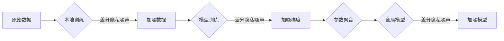
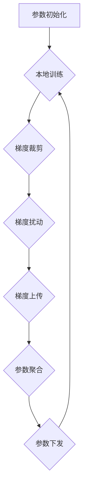

# 差分隐私与联邦学习安全原理与代码实战案例讲解

关键词：差分隐私、联邦学习、数据安全、隐私保护、机器学习

## 1. 背景介绍
### 1.1 问题的由来
在大数据时代,数据已成为最宝贵的资源之一。随着人工智能和机器学习的快速发展,海量数据的收集和分析变得越来越重要。然而,在数据共享和利用的过程中,用户隐私保护问题日益突出。传统的数据脱敏技术已无法满足日益严格的隐私保护要求。因此,亟需探索新的隐私保护技术,在确保数据安全的同时,最大限度地发挥数据价值。

### 1.2 研究现状 
差分隐私(Differential Privacy)作为一种严格的隐私保护模型,能够在保护个体隐私的同时,支持对数据进行统计分析。自2006年被提出以来,差分隐私受到学术界和工业界的广泛关注,并在苹果、谷歌等科技巨头的产品中得到应用。

联邦学习(Federated Learning)是一种分布式机器学习范式,旨在解决数据孤岛问题,实现跨组织、跨区域的协同学习。联邦学习通过在本地训练模型,仅共享模型参数而非原始数据,从而有效保护用户隐私。近年来,联邦学习技术快速发展,已在金融、医疗等领域取得了初步应用。

### 1.3 研究意义
将差分隐私与联邦学习相结合,有望实现更加严格、完善的隐私保护。一方面,差分隐私能够量化隐私泄露风险,提供可证明的安全性保障；另一方面,联邦学习能够实现数据的按需访问和使用,最小化隐私泄露面。因此,深入研究差分隐私和联邦学习的融合,对于推动隐私保护技术的发展具有重要意义。

### 1.4 本文结构
本文将围绕差分隐私与联邦学习的安全原理展开深入探讨,内容涵盖核心概念阐释、数学模型推导、代码实战等方面。全文共分为9个章节：第1章介绍研究背景；第2章阐述差分隐私与联邦学习的核心概念；第3章深入分析相关算法原理；第4章建立数学模型并给出详细推导；第5章提供代码实例和解释说明；第6章讨论实际应用场景；第7章推荐相关工具和资源；第8章总结全文并展望未来；第9章为常见问题解答。

## 2. 核心概念与联系
差分隐私的核心思想是：对数据集的查询结果施加随机噪声,使得攻击者无法通过对比查询结果推断出个体是否在数据集中。形式化地,差分隐私定义如下：

$\varepsilon$-差分隐私：给定两个相邻数据集 $D_1$ 和 $D_2$,它们之间只相差一条记录。一个随机算法 $\mathcal{M}$ 满足 $\varepsilon$-差分隐私,当且仅当对任意输出 $S \subseteq Range(\mathcal{M})$,有:

$$
Pr[\mathcal{M}(D_1) \in S] \leq e^\varepsilon \cdot Pr[\mathcal{M}(D_2) \in S]
$$

其中,$\varepsilon$ 表示隐私预算,用于衡量隐私保护强度。$\varepsilon$ 越小,隐私保护力度越大,但数据可用性下降；反之亦然。差分隐私的两个重要性质是：

- 可组合性：多个满足差分隐私的算法串行或并行组合后,仍然满足差分隐私。
- 后处理不变性：对满足差分隐私的算法输出结果做任意后处理,仍然满足差分隐私。

联邦学习的核心思想是：参与方在本地利用自有数据训练机器学习模型,通过安全的通信协议交换模型参数,最终聚合为全局模型。根据数据划分方式,联邦学习可分为横向联邦学习、纵向联邦学习和联邦迁移学习。其中,横向联邦学习的参与方拥有不同用户的相同特征数据,纵向联邦学习的参与方拥有相同用户的不同特征数据。

将差分隐私引入联邦学习,能够有效降低原始数据的隐私泄露风险。一般而言,可在以下三个层面利用差分隐私增强联邦学习的隐私保护能力：

1. 本地数据扰动：参与方在本地训练前,对原始数据施加差分隐私噪声,防止数据重构攻击。
2. 梯度扰动：在联邦学习过程中,对上传的梯度信息施加差分隐私噪声,防止梯度反演攻击。
3. 输出扰动：对联邦学习的最终输出模型施加差分隐私噪声,防止成员推断攻击。

下图展示了差分隐私在联邦学习中的应用框架：

## 3. 核心算法原理 & 具体操作步骤
### 3.1 算法原理概述
差分隐私的实现依赖于两类核心算法：Laplace机制和指数机制。其中,Laplace机制适用于数值型查询,指数机制适用于非数值型查询。两类算法的基本原理如下：

Laplace机制：对查询结果 $f(D)$ 施加服从参数为 $\lambda=\Delta f/\varepsilon$ 的Laplace噪声 $\eta$,得到差分隐私输出 $\tilde{f}(D)=f(D)+\eta$。其中,$\Delta f$ 表示查询 $f$ 的敏感度,即 $f$ 在任意两个相邻数据集上的最大变化量。

指数机制：对候选输出集 $\mathcal{R}$ 中的每个元素 $r\in\mathcal{R}$ 定义效用函数 $u(D,r)$,然后以如下概率分布采样输出：

$$
Pr[r] = \frac{\exp(\varepsilon u(D,r)/2\Delta u)}{\sum_{r'\in\mathcal{R}}\exp(\varepsilon u(D,r')/2\Delta u)}
$$

其中,$\Delta u$ 表示效用函数 $u$ 的敏感度。直观地,指数机制以较大概率输出高效用元素,同时保证差分隐私。

在联邦学习中,可利用Laplace机制对梯度进行扰动。设原始梯度为 $\mathbf{g}$,敏感度为 $\Delta \mathbf{g}$,隐私预算为 $\varepsilon$,则加噪梯度 $\tilde{\mathbf{g}}$ 的计算公式为：

$$
\tilde{\mathbf{g}} = \mathbf{g} + Lap(\Delta \mathbf{g}/\varepsilon)
$$

其中,$Lap(\cdot)$ 表示Laplace分布。为确保梯度有界,通常先对原始梯度 $\mathbf{g}$ 进行裁剪,使其 $L_2$ 范数不超过给定阈值 $C$,然后再施加Laplace噪声。

### 3.2 算法步骤详解
基于差分隐私的联邦学习算法主要分为以下几个步骤：

1. 参数初始化：各参与方初始化本地模型参数,设置隐私预算 $\varepsilon$,梯度裁剪阈值 $C$ 等。
2. 本地训练：各参与方在本地数据上训练模型,得到梯度 $\mathbf{g}$。
3. 梯度裁剪：对梯度 $\mathbf{g}$ 进行 $L_2$ 范数裁剪,使其不超过阈值 $C$。
4. 梯度扰动：对裁剪后的梯度施加Laplace噪声,得到加噪梯度 $\tilde{\mathbf{g}}$。
5. 梯度上传：各参与方将加噪梯度 $\tilde{\mathbf{g}}$ 上传至服务器。
6. 参数聚合：服务器对收到的加噪梯度做平均,更新全局模型参数。
7. 参数下发：服务器将更新后的全局模型参数下发给各参与方。
8. 重复步骤2-7,直至模型收敛或达到预设轮数。

算法流程如下图所示：

### 3.3 算法优缺点
基于差分隐私的联邦学习算法的主要优点包括：

- 隐私保护：通过对梯度施加差分隐私噪声,可防止敌手从梯度信息中推断出个体隐私。
- 数据安全：原始数据无需离开本地即可参与联邦学习,大大降低了数据泄露风险。
- 理论保障：差分隐私提供了严格的隐私保护定义和量化方法,使得隐私性可证明、可衡量。

同时,该算法也存在一些局限性：

- 效用损失：为满足差分隐私,必然会对数据和模型造成扰动,导致一定的效用损失。
- 通信开销：梯度扰动会引入额外的随机噪声,增大了梯度的方差,可能需要更多通信轮数才能收敛。
- 隐私预算：差分隐私要求预先设定隐私预算,但在实践中如何选取合适的隐私预算仍是一个开放问题。

### 3.4 算法应用领域
得益于可证明的隐私保护和联邦学习的分布式特性,差分隐私联邦学习算法在众多领域展现出广阔的应用前景,例如：

- 金融反欺诈：多家银行在本地训练反欺诈模型,通过联邦学习聚合成全局模型,既可利用多方数据提升性能,又能保护客户隐私。
- 智慧医疗：医院和研究机构利用联邦学习开展协作研究,在保护患者隐私的前提下,实现医学数据的共享利用。
- 个性化推荐：电商平台通过联邦学习聚合多个商家的数据,构建更加准确的用户画像和推荐模型,同时避免用户隐私泄露。

此外,在智能交通、工业互联网、智慧城市等领域,差分隐私联邦学习也有着广阔的应用空间。

## 4. 数学模型和公式 & 详细讲解 & 举例说明
### 4.1 数学模型构建
考虑一个包含 $K$ 个参与方的联邦学习系统,其中第 $k$ 个参与方拥有本地数据集 $D_k$,样本数为 $n_k$,全局样本数 $n=\sum_{k=1}^K n_k$。联邦学习的目标是最小化如下损失函数：

$$
\min_{\mathbf{w}} f(\mathbf{w}) = \sum_{k=1}^K \frac{n_k}{n} F_k(\mathbf{w})
$$

其中,$\mathbf{w}$ 表示全局模型参数,$F_k(\mathbf{w})$ 表示第 $k$ 个参与方的本地损失函数,通常定义为：

$$
F_k(\mathbf{w}) = \frac{1}{n_k} \sum_{i=1}^{n_k} \ell(\mathbf{w};x_{k,i},y_{k,i})
$$

这里,$\ell(\cdot)$ 是样本级损失函数,$(x_{k,i},y_{k,i})$ 是第 $k$ 个参与方的第 $i$ 个样本及其标签。

为了在联邦学习过程中保护差分隐私,需要对梯度施加随机噪声。设第 $k$ 个参与方的本地梯度为 $\mathbf{g}_k=\nabla F_k(\mathbf{w})$,首先对其进行 $L_2$ 范数裁剪：

$$
\bar{\mathbf{g}}_k = \mathb