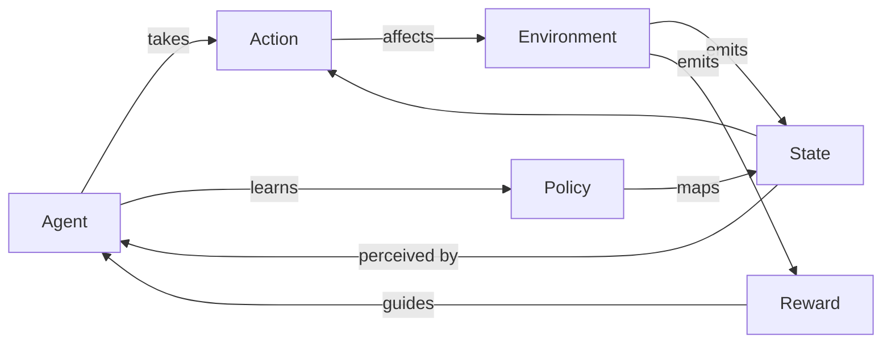

# 强化学习 (Reinforcement Learning) 原理与代码实例讲解

## 1. 背景介绍
### 1.1  问题的由来
强化学习(Reinforcement Learning, RL)作为机器学习的一个重要分支,其灵感来源于心理学中的行为主义理论。在这一理论中,智能体(agent)通过与环境的交互来学习最优策略,以获得最大的累积奖励。这种试错式的学习方式与人类和动物学习的过程非常相似,因此受到了广泛关注。

强化学习试图回答这样一个问题:给定一个环境,智能体应该采取什么样的行动才能获得最大的长期收益?这个问题在很多领域都有重要意义,例如自动控制、机器人、运筹优化、金融投资等。传统的监督学习和非监督学习很难直接解决这类问题,因为它们没有考虑智能体的行为对环境产生的影响。

### 1.2  研究现状
近年来,随着深度学习的发展,强化学习取得了突破性进展。一个里程碑式的成果是DeepMind公司开发的AlphaGo程序,它在围棋比赛中击败了世界冠军,展示了深度强化学习的巨大潜力。此后,深度强化学习在机器人控制、自动驾驶、游戏AI等领域取得了一系列瞩目成果。

目前,强化学习的主要研究方向包括:
1. 提高样本效率,减少环境交互次数
2. 解决部分可观测马尔可夫决策过程(POMDP)问题
3. 多智能体强化学习,研究智能体间的协作与竞争
4. 将强化学习与计划、推理等其他智能算法结合
5. 强化学习的可解释性和安全性

### 1.3  研究意义 
强化学习有望在智能系统开发中发挥重要作用。一方面,很多复杂系统很难建立精确的数学模型,而强化学习可以通过端到端的方式直接学习最优控制策略。另一方面,强化学习让机器具备了一定的自主学习能力,使其能够适应不断变化的环境。

此外,强化学习与神经科学和认知科学也有着紧密联系。研究强化学习有助于我们理解生物智能的本质,探索类脑智能的实现途径。

### 1.4  本文结构
本文将全面介绍强化学习的原理和代码实现。第2部分介绍强化学习的核心概念。第3部分讲解几种经典的强化学习算法。第4部分给出算法所依赖的数学模型。第5部分提供算法的代码实例。第6部分讨论强化学习的应用场景。第7部分推荐相关学习资源。第8部分对全文进行总结并展望未来。第9部分列出了一些常见问题。

## 2. 核心概念与联系

强化学习的核心概念包括:
- 智能体(Agent):可以感知环境状态并作出行动决策的主体。
- 环境(Environment):智能体所处的世界,可以对智能体的行为做出反馈。
- 状态(State):对环境的完整描述,是智能体感知的基础。
- 行动(Action):智能体施加于环境的控制。
- 策略(Policy):将状态映射为行动的函数,代表智能体的决策。 
- 奖励(Reward):环境对智能体行为的即时反馈,引导智能体学习。
- 价值(Value):衡量状态或者状态-行动对的长期累积奖励。
- 轨迹(Trajectory):智能体与环境交互产生的状态-行动-奖励序列。

这些概念的关系如下图所示:

在每个时间步,智能体根据当前状态,使用策略选择一个行动施加于环境。环境接受行动后转移到新的状态,同时反馈给智能体一个即时奖励。智能体根据状态转移和奖励更新策略,以使长期累积奖励最大化。这个过程不断循环,直到达到终止状态。

强化学习的目标就是找到最优策略 $\pi^*$,使得从任意初始状态 $s_0$ 出发,采用该策略能获得最大的期望累积奖励:

$$
\pi^* = \arg\max_\pi \mathbb{E}_{\pi}[\sum_{t=0}^{\infty} \gamma^t r_t | s_0]
$$

其中 $\gamma \in [0,1]$ 是折扣因子,用于控制远期奖励的权重。

## 3. 核心算法原理 & 具体操作步骤
### 3.1 算法原理概述
强化学习有三大类经典算法:
1. 值函数法:通过学习值函数来间接得到最优策略,代表算法有Q-learning和Sarsa。 
2. 策略梯度法:直接对策略函数进行参数化,并用梯度上升优化策略,代表算法有REINFORCE。
3. 演员-评论家法:结合值函数和策略函数,同时学习两个函数,代表算法有A3C。

以下我们重点介绍Q-learning算法。

### 3.2 Q-learning算法步骤详解
Q-learning是一种值函数法,其核心是学习动作-状态值函数 $Q(s,a)$。$Q(s,a)$ 表示在状态 $s$ 下选择行动 $a$ 的长期价值,考虑了当前奖励和未来奖励。若知道了 $Q$ 函数的准确值,则最优策略就是在每个状态采取Q值最大的行动:

$$
\pi^*(s) = \arg\max_a Q(s,a)
$$

Q-learning算法的具体步骤如下:

1. 初始化Q表格 $Q(s,a)$,对所有 $s\in \mathcal{S}, a\in \mathcal{A}$,令 $Q(s,a)=0$。

2. 重复循环直到收敛:
   1. 初始化状态 $s$
   2. 重复循环直到 $s$ 为终止状态:
      1. 根据 $\epsilon$-贪婪策略选择行动 $a$: 
         - 以 $\epsilon$ 的概率随机选择行动 
         - 以 $1-\epsilon$ 的概率选择Q值最大的行动 $a=\arg\max_{a'} Q(s, a')$
      2. 执行行动 $a$,观察奖励 $r$ 和下一状态 $s'$
      3. 更新Q值:
         $$Q(s,a) \leftarrow Q(s,a) + \alpha [r + \gamma \max_{a'} Q(s',a') - Q(s,a)]$$
         其中 $\alpha \in (0,1]$ 为学习率
      4. $s \leftarrow s'$
      
3. 输出最优策略 $\pi^*(s) = \arg\max_a Q(s,a)$

可以证明,在适当的条件下,Q-learning算法最终会收敛到最优Q函数 $Q^*$。

### 3.3 Q-learning算法优缺点
Q-learning的主要优点有:
- 简单易实现,通过值函数就可以得到最优策略
- 能够学习离线策略,不需要与环境交互就可以更新Q值
- 收敛性有理论保证

Q-learning的主要缺点是:
- 需要存储大量的Q值,当状态和行动空间很大时会导致维度灾难
- 难以处理连续状态和行动空间
- 探索效率较低,容易陷入局部最优

### 3.4 Q-learning算法应用领域
Q-learning在很多领域都有应用,例如:
- 智能体寻路问题
- 游戏AI的动作决策
- 机器人避障与运动规划
- 自适应动态系统控制

## 4. 数学模型和公式 & 详细讲解 & 举例说明
### 4.1 马尔可夫决策过程 
强化学习问题通常被建模为马尔可夫决策过程(Markov Decision Process, MDP)。一个MDP由以下元素组成:
- 状态空间 $\mathcal{S}$
- 行动空间 $\mathcal{A}$  
- 状态转移概率 $\mathcal{P}(s'|s,a)$,表示在状态 $s$ 下执行行动 $a$ 后转移到状态 $s'$ 的概率
- 奖励函数 $\mathcal{R}(s,a,s')$,表示在状态 $s$ 下执行行动 $a$ 后转移到状态 $s'$ 获得的即时奖励

MDP满足马尔可夫性质,即下一状态 $s'$ 只取决于当前状态 $s$ 和行动 $a$,与之前的历史状态和行动无关:

$$
\mathcal{P}(s_{t+1}|s_t,a_t,s_{t-1},a_{t-1},\dots) = \mathcal{P}(s_{t+1}|s_t,a_t)
$$

在MDP中,策略 $\pi(a|s)$ 定义为在状态 $s$ 下选择行动 $a$ 的概率。给定一个策略 $\pi$,我们可以计算状态值函数 $V^\pi(s)$ 和动作值函数 $Q^\pi(s,a)$:

$$
\begin{aligned}
V^\pi(s) &= \mathbb{E}_{\pi}[\sum_{k=0}^{\infty} \gamma^k r_{t+k} | s_t=s] \\
Q^\pi(s,a) &= \mathbb{E}_{\pi}[\sum_{k=0}^{\infty} \gamma^k r_{t+k} | s_t=s, a_t=a]
\end{aligned}
$$

最优值函数 $V^*(s)$ 和 $Q^*(s,a)$ 定义为在所有可能的策略中能达到的最大值函数:

$$
\begin{aligned}
V^*(s) &= \max_\pi V^\pi(s) \\  
Q^*(s,a) &= \max_\pi Q^\pi(s,a)
\end{aligned}
$$

### 4.2 Bellman最优方程
Bellman最优方程描述了最优值函数所满足的递归关系:

$$
\begin{aligned}
V^*(s) &= \max_a \sum_{s'} \mathcal{P}(s'|s,a) [\mathcal{R}(s,a,s') + \gamma V^*(s')] \\
Q^*(s,a) &= \sum_{s'} \mathcal{P}(s'|s,a) [\mathcal{R}(s,a,s') + \gamma \max_{a'} Q^*(s',a')]
\end{aligned}
$$

Bellman最优方程给出了值函数的最优性条件,即一个值函数要想成为最优值函数,必须满足Bellman最优方程。同时,任何满足Bellman最优方程的值函数都必然是最优值函数。

Bellman最优方程是值迭代(Value Iteration)和策略迭代(Policy Iteration)等动态规划算法的理论基础。

### 4.3 Q-learning的收敛性证明
Q-learning算法可以看作是Bellman最优方程的随机逼近。令 $\alpha_t(s,a)$ 表示状态-行动对 $(s,a)$ 在 $t$ 时刻的学习率,对所有 $s,a$,若满足:

$$
\begin{aligned}
\sum_{t=1}^{\infty} \alpha_t(s,a) &= \infty \\ 
\sum_{t=1}^{\infty} \alpha_t^2(s,a) &< \infty
\end{aligned}
$$

那么Q-learning算法可以保证 $Q(s,a)$ 依概率收敛到 $Q^*(s,a)$。

直观上,第一个条件保证了每个状态-行动对能被无限次访问,第二个条件限制了学习率下降的速度不能太快。在实践中,常用的学习率形式为 $\alpha_t(s,a) = \frac{1}{n_t(s,a)}$,其中 $n_t(s,a)$ 为状态-行动对 $(s,a)$ 在 $t$ 时刻之前被访问的次数。

### 4.4 Q-learning的一个简单例子
考虑一个迷宫寻路问题。假设智能体处在一个 $3\times 3$ 的网格迷宫中,状态空间为 $\mathcal{S}=\{(i,j)|i,j=0,1,2\}$,行动空间为 $\mathcal{A}=\{up, down, left, right\}$。智能体的目标是从起点 $(0,0)$ 走到终点 $(2,2)$,每走一步奖励为-1