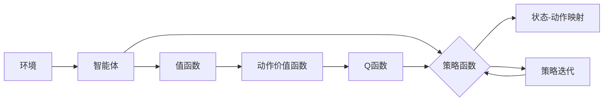

# 强化学习(Reinforcement Learning) - 原理与代码实例讲解

作者：禅与计算机程序设计艺术 / Zen and the Art of Computer Programming

## 1. 背景介绍

### 1.1 问题的由来

强化学习（Reinforcement Learning，简称RL）是人工智能领域的一个重要分支，它让机器通过与环境交互来学习如何做出最优决策。与监督学习（Supervised Learning）和深度学习（Deep Learning）不同，强化学习更注重决策过程和长期目标，而非仅仅关注短期预测。

强化学习最早可以追溯到20世纪50年代，但在过去几十年里，随着深度学习技术的快速发展，强化学习得到了广泛关注和快速发展。如今，强化学习已经在游戏、自动驾驶、机器人、推荐系统等多个领域取得了显著成果。

### 1.2 研究现状

近年来，强化学习研究取得了许多突破性的进展，主要体现在以下几个方面：

- 深度强化学习：将深度神经网络与强化学习相结合，使得强化学习能够处理更复杂的决策问题。
- 多智能体强化学习：研究多个智能体之间相互协作和竞争的策略，使得强化学习在多智能体场景中更具实用性。
- 无模型强化学习：通过直接学习状态-动作映射，避免了传统强化学习中的模型预测问题。
- 安全强化学习：研究如何在强化学习过程中保证学习过程的安全性和稳定性。

### 1.3 研究意义

强化学习在许多领域都具有重要的应用价值，主要体现在以下几个方面：

- 自动驾驶：自动驾驶汽车通过强化学习学习驾驶策略，实现自动驾驶功能。
- 机器人：机器人通过强化学习学习运动控制策略，实现更加智能化的动作。
- 游戏：强化学习在游戏领域取得了巨大成功，如AlphaGo战胜了围棋世界冠军。
- 推荐系统：强化学习可以用于构建更加智能的推荐系统，提高推荐效果。

### 1.4 本文结构

本文将系统地介绍强化学习的基本原理、算法和代码实现。文章结构如下：

- 第2部分：介绍强化学习的基本概念和联系。
- 第3部分：详细阐述强化学习的核心算法原理和具体操作步骤。
- 第4部分：介绍强化学习中的数学模型和公式，并结合实例进行讲解。
- 第5部分：给出强化学习的代码实例，并对关键代码进行解读和分析。
- 第6部分：探讨强化学习在实际应用场景中的应用，并展望未来发展趋势。
- 第7部分：推荐强化学习相关的学习资源、开发工具和参考文献。
- 第8部分：总结全文，展望强化学习的未来发展趋势与挑战。
- 第9部分：附录，包含常见问题与解答。

## 2. 核心概念与联系

为更好地理解强化学习，本节将介绍几个核心概念：

- 环境和环境状态（Environment）：环境是一个抽象的概念，它包含了所有可能的状态和动作，并负责与环境中的智能体进行交互。环境状态是指当前环境所处的状态，通常用一个向量表示。
- 智能体（Agent）：智能体是强化学习中的学习主体，它通过与环境交互来学习最优策略。智能体通常由一个策略函数和一个价值函数组成。
- 策略（Policy）：策略是智能体在给定状态下选择动作的规则。策略函数将环境状态映射到动作。
- 值函数（Value Function）：值函数用于评估智能体在某个状态下采取某种策略所能获得的长期回报。
- 动作价值函数（Action-Value Function）：动作价值函数用于评估智能体在某个状态下采取某个动作所能获得的长期回报。
- Q函数（Q-Function）：Q函数是动作价值函数的一种特殊情况，它将状态-动作对映射到长期回报。
- 策略迭代（Policy Iteration）：策略迭代是一种改进策略的方法，它通过不断迭代优化策略函数来提高智能体性能。
- 模拟（Simulation）：模拟是指通过模拟环境中的动作和状态来评估智能体的性能。
- 学习（Learning）：学习是指智能体通过与环境交互来改进策略的过程。

这些概念之间的关系可以用以下Mermaid流程图表示：



从图中可以看出，智能体通过与环境交互，使用策略函数选择动作，并根据动作价值函数和Q函数来评估策略。通过策略迭代，智能体不断改进策略函数，最终提高性能。

## 3. 核心算法原理 & 具体操作步骤

### 3.1 算法原理概述

强化学习的基本原理是：智能体通过与环境交互，不断尝试不同的动作，并根据动作的结果来学习最优策略。具体来说，强化学习包括以下步骤：

1. 初始化：初始化智能体、环境、策略函数、值函数等。
2. 选择动作：智能体根据策略函数选择动作。
3. 执行动作：智能体执行选择的动作，并与环境进行交互。
4. 获得奖励：环境根据智能体的动作给出奖励。
5. 更新策略：智能体根据奖励来更新策略函数和值函数。

### 3.2 算法步骤详解

下面详细介绍强化学习的具体操作步骤：

**步骤 1：初始化**

初始化智能体、环境、策略函数、值函数等。

- 智能体：初始化智能体的策略函数和值函数，可以使用随机策略或贪婪策略等。
- 环境：初始化环境，包括环境状态、动作空间等。
- 策略函数：初始化策略函数，可以是一个神经网络或线性函数。
- 值函数：初始化值函数，可以是一个神经网络或线性函数。

**步骤 2：选择动作**

智能体根据策略函数选择动作。

- 策略函数：根据当前状态选择动作，可以是一个确定性策略或随机策略。
- 确定性策略：智能体根据当前状态直接选择动作，如贪婪策略。
- 随机策略：智能体根据当前状态以一定概率选择动作，如ε-贪婪策略。

**步骤 3：执行动作**

智能体执行选择的动作，并与环境进行交互。

- 执行动作：智能体根据选择的动作与环境进行交互，执行相应的操作。
- 状态转移：环境根据智能体的动作更新状态。

**步骤 4：获得奖励**

环境根据智能体的动作给出奖励。

- 奖励：奖励是环境对智能体的动作的反馈，可以是正奖励、负奖励或零奖励。

**步骤 5：更新策略**

智能体根据奖励来更新策略函数和值函数。

- 更新策略函数：根据奖励和值函数来更新策略函数，使得智能体在给定状态下选择更优的动作。
- 更新值函数：根据奖励和动作价值函数来更新值函数，使得智能体在给定状态下能够获得更高的回报。

### 3.3 算法优缺点

强化学习具有以下优点：

- 自主性：强化学习让智能体能够自主地学习如何与环境交互，无需人工干预。
- 适应性：强化学习能够让智能体根据环境的变化动态地调整策略。
- 泛化能力：强化学习能够让智能体在多个场景下应用相同的策略。

然而，强化学习也存在以下缺点：

- 收敛速度慢：强化学习需要大量的样本来收敛到最优策略，计算复杂度高。
- 难以直观解释：强化学习的学习过程难以直观解释，难以理解智能体的决策逻辑。

### 3.4 算法应用领域

强化学习在以下领域具有广泛的应用：

- 自动驾驶：自动驾驶汽车可以通过强化学习学习如何驾驶，实现自动驾驶功能。
- 机器人：机器人可以通过强化学习学习运动控制策略，实现更加智能化的动作。
- 游戏：强化学习可以用于构建智能游戏对手，如AlphaGo、AlphaStar等。
- 推荐系统：强化学习可以用于构建更加智能的推荐系统，提高推荐效果。
- 股票交易：强化学习可以用于构建智能交易系统，实现自动化股票交易。

## 4. 数学模型和公式 & 详细讲解 & 举例说明

### 4.1 数学模型构建

强化学习的数学模型主要包括以下内容：

- 状态空间（State Space）：状态空间是指所有可能的状态的集合，用 $S$ 表示。
- 动作空间（Action Space）：动作空间是指所有可能动作的集合，用 $A$ 表示。
- 状态转移函数（State Transition Function）：状态转移函数描述了在给定当前状态和动作的情况下，智能体下一步可能到达的状态。
- 奖励函数（Reward Function）：奖励函数描述了智能体的动作所能获得的奖励。
- 策略函数（Policy Function）：策略函数描述了在给定状态的情况下，智能体选择动作的概率分布。
- 值函数（Value Function）：值函数描述了智能体在给定状态下采取某种策略所能获得的长期回报。
- Q函数（Q-Function）：Q函数描述了智能体在给定状态和动作的情况下，采取该动作所能获得的长期回报。

### 4.2 公式推导过程

以下以马尔可夫决策过程（Markov Decision Process，简称MDP）为例，推导强化学习的公式。

假设MDP的参数如下：

- 状态空间 $S = \{s_1, s_2, ..., s_n\}$
- 动作空间 $A = \{a_1, a_2, ..., a_m\}$
- 状态转移函数 $T(s, a, s')$：给定当前状态 $s$ 和动作 $a$，下一步可能到达的状态 $s'$ 的概率。
- 奖励函数 $R(s, a)$：给定当前状态 $s$ 和动作 $a$，智能体所能获得的奖励。
- 策略函数 $\pi(s, a)$：在状态 $s$ 的情况下，智能体选择动作 $a$ 的概率。

则MDP的公式如下：

$$
P(s'|s, a) = T(s, a, s')
$$

$$
R(s, a) = R(s, a)
$$

$$
\pi(s, a) = \sum_{a'} \pi(s, a')P(s', a'|s, a)
$$

$$
V(s) = \sum_{a} \pi(s, a) \sum_{s'} P(s', s|s, a) R(s', s|s, a) + \gamma V(s')
$$

其中 $\gamma$ 是折扣因子，表示对未来奖励的期望。

### 4.3 案例分析与讲解

以下以CartPole游戏为例，分析强化学习在游戏领域的应用。

CartPole游戏是一个经典的强化学习任务，其目标是将一个杆子保持在竖直状态。游戏的状态由杆子与竖直方向的夹角和角速度组成，动作包括向左推和向右推。智能体需要通过选择动作来控制杆子的状态，直到游戏结束。

在这个案例中，智能体可以使用Q学习算法来学习最优策略。Q学习算法是一种基于值函数的强化学习算法，它通过更新Q函数来学习最优策略。

下面是Q学习算法的伪代码：

```
初始化Q函数 Q(s, a) = 0
for每个epsilon-greedy策略：
    对于每个状态 s：
        对于每个动作 a：
            选择动作 a' = epsilon-greedy策略(s)
            执行动作 a'，获得奖励 R 和下一个状态 s'
            更新Q函数 Q(s, a) = Q(s, a) + alpha * [R + gamma * max Q(s', a') - Q(s, a)]
```

通过不断迭代，智能体将学会在CartPole游戏中保持杆子竖直，达到游戏目标。

### 4.4 常见问题解答

**Q1：什么是ε-贪婪策略？**

A：ε-贪婪策略是一种在贪婪策略和随机策略之间进行平衡的策略。在ε-贪婪策略中，智能体以概率 $1-\epsilon$ 选择贪婪策略，以概率 $\epsilon$ 选择随机策略。

**Q2：什么是值函数？**

A：值函数描述了智能体在给定状态下采取某种策略所能获得的长期回报。值函数可以分为状态值函数和动作值函数。

**Q3：什么是Q函数？**

A：Q函数描述了智能体在给定状态和动作的情况下，采取该动作所能获得的长期回报。Q函数是动作值函数的一种特殊情况。

**Q4：什么是Q学习算法？**

A：Q学习算法是一种基于值函数的强化学习算法，它通过更新Q函数来学习最优策略。

## 5. 项目实践：代码实例和详细解释说明

### 5.1 开发环境搭建

为了进行强化学习项目实践，我们需要搭建以下开发环境：

- Python 3.6及以上版本
- TensorFlow 2.0及以上版本
- Gym环境

以下是搭建Gym环境的步骤：

1. 安装Gym环境：

```bash
pip install gym
```

2. 下载CartPole游戏环境：

```bash
gym make cart_pole
```

### 5.2 源代码详细实现

以下是一个使用TensorFlow和Gym实现CartPole游戏的Q学习算法的Python代码示例：

```python
import gym
import numpy as np
import tensorflow as tf

# 初始化参数
gamma = 0.99  # 折扣因子
epsilon = 0.1  # ε-贪婪策略的概率
alpha = 0.1  # 学习率
n_episodes = 1000  # 迭代次数

# 初始化Q函数
Q = np.zeros([4, 2])  # 状态空间为4，动作空间为2

# 创建CartPole游戏环境
env = gym.make("CartPole-v1")

# Q学习算法
for episode in range(n_episodes):
    state = env.reset()
    done = False
    while not done:
        action = np.argmax(Q[state, :])
        next_state, reward, done, _ = env.step(action)
        Q[state, action] = Q[state, action] + alpha * (reward + gamma * np.max(Q[next_state, :]) - Q[state, action])
        state = next_state
    env.close()

# 测试Q函数
state = env.reset()
while True:
    action = np.argmax(Q[state, :])
    next_state, reward, done, _ = env.step(action)
    print(f"Action: {action}, Reward: {reward}")
    state = next_state
    if done:
        break
```

### 5.3 代码解读与分析

以上代码实现了Q学习算法在CartPole游戏环境中的训练过程。以下是代码的关键部分：

1. 初始化参数：设置折扣因子、ε-贪婪策略概率、学习率和迭代次数。

2. 初始化Q函数：创建一个大小为状态空间乘以动作空间的全零矩阵，用于存储状态-动作对的价值。

3. 创建CartPole游戏环境：使用Gym创建CartPole游戏环境。

4. Q学习算法：使用Q学习算法训练Q函数。

   - 随机初始化智能体状态。

   - 循环进行以下步骤：

     - 根据ε-贪婪策略选择动作。

     - 执行动作，并获得奖励和下一个状态。

     - 更新Q函数，根据奖励和下一个状态的最大值来更新当前状态-动作对的价值。

5. 测试Q函数：测试训练好的Q函数在CartPole游戏环境中的性能。

### 5.4 运行结果展示

运行上述代码，我们可以看到在CartPole游戏环境中，智能体通过Q学习算法学会了保持杆子竖直的策略，最终成功地完成了游戏。

## 6. 实际应用场景

### 6.1 自动驾驶

自动驾驶是强化学习在工业界最具应用前景的领域之一。通过强化学习，自动驾驶汽车可以学习如何在不同路况下安全行驶，实现自动驾驶功能。

### 6.2 机器人

机器人可以通过强化学习学习运动控制策略，实现更加智能化的动作。例如，机器人可以通过强化学习学习抓取物体、行走等动作。

### 6.3 游戏

强化学习在游戏领域取得了巨大成功，如AlphaGo、AlphaStar等。这些智能游戏对手可以与人类高手进行对弈，并取得胜利。

### 6.4 推荐系统

强化学习可以用于构建更加智能的推荐系统，提高推荐效果。例如，推荐系统可以通过强化学习学习如何根据用户的历史行为推荐商品。

### 6.5 股票交易

强化学习可以用于构建智能交易系统，实现自动化股票交易。例如，智能交易系统可以通过强化学习学习如何根据股票价格和交易量等信息进行买卖决策。

### 6.6 未来应用展望

随着强化学习的不断发展，未来它将在更多领域得到应用，如医疗、金融、教育等。以下是强化学习未来应用的一些展望：

- 智能医疗：强化学习可以帮助医生诊断疾病、制定治疗方案。
- 智能金融：强化学习可以帮助金融机构进行风险管理、资产配置。
- 智能教育：强化学习可以帮助学生个性化学习、提高学习效果。

## 7. 工具和资源推荐

### 7.1 学习资源推荐

为了帮助读者更好地学习强化学习，以下推荐一些优质的学习资源：

1. 《Reinforcement Learning: An Introduction》
2. 《Reinforcement Learning: Principles and Practice》
3. 《Deep Reinforcement Learning》
4. 《Deep Reinforcement Learning with Python》
5. OpenAI Gym：https://gym.openai.com/
6. TensorFlow：https://www.tensorflow.org/
7. PyTorch：https://pytorch.org/

### 7.2 开发工具推荐

以下是强化学习开发过程中常用的工具：

1. TensorFlow：https://www.tensorflow.org/
2. PyTorch：https://pytorch.org/
3. OpenAI Gym：https://gym.openai.com/
4. Keras：https://keras.io/

### 7.3 相关论文推荐

以下是强化学习领域的一些经典论文：

1. "Reinforcement Learning: An Introduction" by Richard S. Sutton and Andrew G. Barto
2. "Deep Reinforcement Learning: An Overview" by Sergey Levine, Chelsea Finn, and Pieter Abbeel
3. "Playing Atari with Deep Reinforcement Learning" by Volodymyr Mnih, Koray Kavukcuoglu, David Silver, Alex Graves, Ioannis Antonoglou, Daan Wierstra, and Mehdi Mirza
4. "Human-Level Control through Deep Reinforcement Learning" by Volodymyr Mnih, Koray Kavukcuoglu, David Silver, Andrei A. Rusu, Joel Veness, Martin A. Bellemare, Alex Graves, Martin Riedmiller, Andreas K. Fidjeland, Georg Ostrovski, Silvio M. Schaul, Tom Schaul, Hector H. Silver, and Julian J. Wierstra

### 7.4 其他资源推荐

以下是强化学习领域的一些其他资源：

1. https://www.coursera.org/learn/reinforcement-learning
2. https://www.deeplearning.ai/learn-deep-learning
3. https://www.cs.stanford.edu/~cs234/

## 8. 总结：未来发展趋势与挑战

### 8.1 研究成果总结

本文对强化学习的基本原理、算法和代码实例进行了详细介绍。通过本文的学习，读者可以了解到强化学习的核心概念、基本原理和常用算法，并能够动手实现简单的强化学习项目。

### 8.2 未来发展趋势

未来，强化学习将在以下几个方面得到进一步发展：

- 深度强化学习：将深度神经网络与强化学习相结合，处理更复杂的决策问题。
- 多智能体强化学习：研究多个智能体之间相互协作和竞争的策略，实现多智能体场景下的强化学习。
- 无模型强化学习：通过直接学习状态-动作映射，避免传统强化学习中的模型预测问题。
- 安全强化学习：研究如何在强化学习过程中保证学习过程的安全性和稳定性。

### 8.3 面临的挑战

尽管强化学习取得了许多进展，但仍面临着以下挑战：

- 收敛速度慢：强化学习需要大量的样本来收敛到最优策略，计算复杂度高。
- 难以直观解释：强化学习的学习过程难以直观解释，难以理解智能体的决策逻辑。
- 数据获取困难：在一些领域，获取足够的数据来训练强化学习模型比较困难。

### 8.4 研究展望

未来，强化学习将在以下方面取得突破：

- 算法效率：提高强化学习算法的效率，降低计算复杂度。
- 可解释性：提高强化学习模型的可解释性，理解智能体的决策逻辑。
- 数据获取：研究更加高效的数据获取方法，降低数据获取成本。

相信随着研究的不断深入，强化学习将在更多领域得到应用，为人工智能的发展做出更大的贡献。

## 9. 附录：常见问题与解答

**Q1：什么是ε-贪婪策略？**

A：ε-贪婪策略是一种在贪婪策略和随机策略之间进行平衡的策略。在ε-贪婪策略中，智能体以概率 $1-\epsilon$ 选择贪婪策略，以概率 $\epsilon$ 选择随机策略。

**Q2：什么是值函数？**

A：值函数描述了智能体在给定状态下采取某种策略所能获得的长期回报。值函数可以分为状态值函数和动作值函数。

**Q3：什么是Q函数？**

A：Q函数描述了智能体在给定状态和动作的情况下，采取该动作所能获得的长期回报。Q函数是动作价值函数的一种特殊情况。

**Q4：什么是Q学习算法？**

A：Q学习算法是一种基于值函数的强化学习算法，它通过更新Q函数来学习最优策略。

**Q5：什么是深度强化学习？**

A：深度强化学习是将深度神经网络与强化学习相结合，处理更复杂的决策问题。深度强化学习可以学习到更加复杂的特征表示，从而处理更复杂的决策问题。

**Q6：什么是多智能体强化学习？**

A：多智能体强化学习是研究多个智能体之间相互协作和竞争的策略，实现多智能体场景下的强化学习。

**Q7：什么是无模型强化学习？**

A：无模型强化学习是通过对状态-动作映射进行学习，避免传统强化学习中的模型预测问题。

**Q8：什么是安全强化学习？**

A：安全强化学习是研究如何在强化学习过程中保证学习过程的安全性和稳定性。

**Q9：什么是蒙特卡洛方法？**

A：蒙特卡洛方法是一种基于随机抽样的数值计算方法，可以用于解决一些复杂的数学问题。

**Q10：什么是模拟退火？**

A：模拟退火是一种基于概率的优化算法，可以用于寻找函数的最优解。

**Q11：什么是强化学习在自动驾驶中的应用？**

A：在自动驾驶中，强化学习可以用于学习驾驶策略，实现自动驾驶功能。

**Q12：什么是强化学习在机器人中的应用？**

A：在机器人中，强化学习可以用于学习运动控制策略，实现更加智能化的动作。

**Q13：什么是强化学习在游戏中的应用？**

A：在游戏领域，强化学习可以用于构建智能游戏对手，如AlphaGo、AlphaStar等。

**Q14：什么是强化学习在推荐系统中的应用？**

A：在推荐系统中，强化学习可以用于学习推荐策略，提高推荐效果。

**Q15：什么是强化学习在股票交易中的应用？**

A：在股票交易中，强化学习可以用于学习交易策略，实现自动化股票交易。