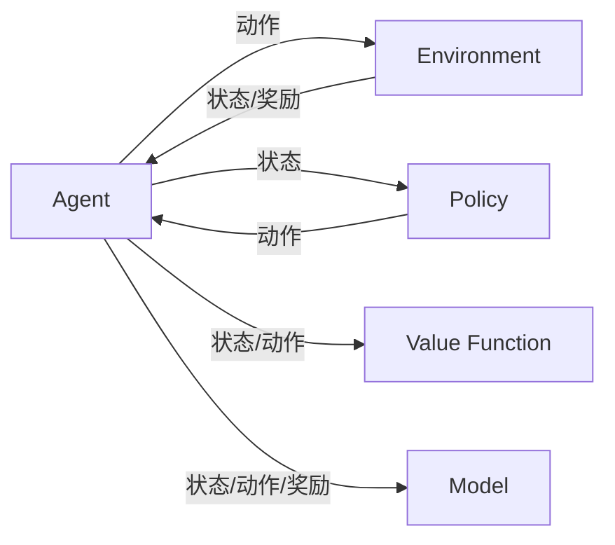

# 强化学习进阶原理与代码实战案例讲解

## 1. 背景介绍
### 1.1  问题的由来
强化学习(Reinforcement Learning, RL)作为人工智能和机器学习领域的一个重要分支,其核心思想是通过智能体(Agent)与环境(Environment)的交互过程,不断尝试和学习,最终找到最优策略以获得最大化的累积奖励。强化学习在许多现实场景中都有广泛应用,如自动驾驶、智能推荐、机器人控制、游戏AI等。然而,强化学习算法的理论基础和实现细节对于初学者来说往往不太容易理解和掌握。

### 1.2  研究现状
近年来,强化学习领域涌现出了许多新的理论突破和应用成果。从传统的Q-learning、Sarsa等表格型方法,到基于值函数逼近的DQN系列算法,再到策略梯度和Actor-Critic架构,强化学习的研究一直在不断深入。同时,一些前沿的研究方向如分层强化学习、元强化学习、逆强化学习等也受到越来越多的关注。不过,这些进阶的强化学习理论和算法对于很多学习者来说理解起来有一定难度。

### 1.3  研究意义
系统全面地介绍强化学习的进阶原理,并给出详细的代码实战案例讲解,将有助于更多人深入理解强化学习的内在机制和实现细节。通过本文的学习,读者可以建立起强化学习领域的知识体系,掌握常见强化学习算法的数学原理和编程实现,了解强化学习在不同场景下的实际应用。这对于那些希望系统学习和研究强化学习的学生、工程师和研究人员具有重要意义。

### 1.4  本文结构
本文将分为以下几个核心章节:
- 第2节介绍强化学习的一些核心概念及其内在联系
- 第3节重点讲解几种主要的强化学习算法原理和操作步骤
- 第4节给出强化学习常用的数学模型和公式推导过程,并举例说明
- 第5节通过代码实例和详细注释,演示如何用Python实现几个经典的强化学习算法
- 第6节总结强化学习的实际应用场景,展望其未来发展方向
- 第7节推荐一些学习强化学习的工具和资源
- 第8节对全文进行总结,指出强化学习未来的发展趋势和挑战
- 第9节的附录部分列出了一些强化学习常见问题的解答

## 2. 核心概念与联系

在讨论强化学习算法之前,我们先来了解一下强化学习的一些核心概念:

- 智能体(Agent):可以感知环境状态并作出动作决策的主体,其目标是最大化累积奖励。
- 环境(Environment):智能体所处的外部环境,接收智能体的动作并反馈新的状态和奖励。
- 状态(State):表示智能体所处的环境状态,是智能体进行决策的依据。
- 动作(Action):智能体根据当前状态所采取的行为决策。 
- 策略(Policy):将状态映射到动作的函数,代表智能体的行为决策规则。
- 奖励(Reward):环境对智能体的即时反馈,引导智能体学习优化其策略。
- 值函数(Value Function):评估某个状态或状态-动作对的长期累积奖励。
- 模型(Model):对环境的状态转移概率和奖励函数的建模,可用于规划和学习。

下图展示了这些核心概念在强化学习框架中的内在联系:

智能体根据当前状态,通过策略函数选择一个动作,施加到环境中。环境接收动作后,反馈给智能体一个新的状态和即时奖励。智能体根据新的状态-动作对,通过值函数评估其长期回报,并利用即时奖励和下一状态的值函数来更新当前状态-动作对的值函数。此外,智能体还可以通过状态转移和奖励样本来建立环境模型,用于规划或生成新的训练数据。整个循环往复,不断优化策略和值函数,最终使智能体学会在环境中做出最优决策。

## 3. 核心算法原理 & 具体操作步骤
### 3.1  算法原理概述
强化学习有多种不同类型的算法,它们在问题建模、策略优化、探索利用等方面各有特点。下面我们重点介绍几种主流的强化学习算法:

1. 值函数型:通过学习值函数来隐式地得到最优策略,代表算法有Q-learning、Sarsa、DQN等。

2. 策略梯度型:直接对策略函数的参数进行梯度上升,代表算法有REINFORCE、Actor-Critic等。

3. 基于模型:通过学习环境模型来进行规划和策略改进,代表算法有Dyna-Q、MPC等。

4. 分层强化学习:将复杂任务分解为多个子任务,通过层次化的策略学习来加速训练和泛化。

5. 逆强化学习:通过专家示范来推断奖励函数,从而学习专家策略。

这些算法在建模思路、更新方式、收敛性等方面各有优劣,需要根据具体问题来选择合适的算法。

### 3.2  算法步骤详解
下面我们以Q-learning算法为例,详细讲解其操作步骤:

1. 初始化Q表格`Q(s,a)`,对于所有状态-动作对,初始值设为0。

2. 设置学习率`α∈(0,1]`,折扣因子`γ∈[0,1]`,探索概率`ε∈(0,1]`。

3. 重复下述循环直到收敛:

- 初始化状态`s`
- 重复下述步骤直到`s`为终止状态:
    - 以`ε`的概率随机选择动作`a`,否则选择`Q(s,·)`最大的动作
    - 执行动作`a`,观察奖励`r`和新状态`s'`
    - 更新`Q(s,a)`:
    
$$Q(s,a) \leftarrow Q(s,a) + \alpha [r + \gamma \max_{a'} Q(s',a') - Q(s,a)]$$

- `s ← s'`

Q-learning的核心在于Q值的更新公式,它利用下一状态的最大Q值来近似当前状态-动作对的最优Q值。通过不断迭代,Q值最终会收敛到最优值函数`Q*(s,a)`。同时,Q-learning引入了`ε-greedy`的探索策略,以一定概率随机探索,保证能找到全局最优策略。

### 3.3  算法优缺点
Q-learning的主要优点有:
- 简单易实现,通过值函数就可以得到最优策略
- 异策略(Off-policy),目标策略和行为策略分离,提高稳定性
- 收敛性有理论保证,Q值能收敛到最优值函数

但Q-learning也存在一些局限:
- 基于表格存储和更新Q值,难以处理大规模状态空间
- 探索效率不高,容易陷入局部最优
- 对奖励函数比较敏感,奖励设置不当会影响学习效果

### 3.4  算法应用领域
Q-learning 是一种应用广泛的强化学习算法,在以下领域都有成功案例:
- 智能游戏 AI:如 Atari 视频游戏、围棋、德州扑克等
- 机器人控制:如移动机器人路径规划、机械臂操纵等  
- 自动驾驶:如信号灯和障碍物识别、车辆决策控制等
- 推荐系统:如新闻推荐、电商推荐、广告投放等
- 资源管理:如服务器集群的任务调度、能源分配等

当然,Q-learning 也有其适用条件和局限性,并非对所有问题都是最优选择。实际应用时还需要考虑问题的规模、特点、实时性等因素,权衡不同算法的优劣。

## 4. 数学模型和公式 & 详细讲解 & 举例说明
### 4.1  数学模型构建
强化学习可以用马尔可夫决策过程(Markov Decision Process, MDP)来建模,一个MDP由以下元素组成:
- 状态空间 $\mathcal{S}$
- 动作空间 $\mathcal{A}$  
- 状态转移概率 $\mathcal{P}(s'|s,a)$
- 奖励函数 $\mathcal{R}(s,a)$
- 折扣因子 $\gamma \in [0,1]$

MDP的目标是寻找一个最优策略 $\pi^*$,使得从任意状态出发,执行该策略能获得最大的期望累积奖励:

$$\pi^* = \arg\max_{\pi} \mathbb{E}\Big[\sum_{t=0}^{\infty} \gamma^t \mathcal{R}(s_t,a_t) | \pi \Big]$$

其中,$\pi(a|s)$ 表示在状态 $s$ 下选择动作 $a$ 的概率。

### 4.2  公式推导过程
为了求解最优策略,我们引入值函数的概念。状态值函数 $V^{\pi}(s)$ 表示从状态 $s$ 开始,执行策略 $\pi$ 的期望回报:

$$V^{\pi}(s) = \mathbb{E}_{\pi} \Big[\sum_{k=0}^{\infty} \gamma^k \mathcal{R}(s_{t+k},a_{t+k}) | s_t=s \Big]$$

类似地,动作值函数 $Q^{\pi}(s,a)$ 表示在状态 $s$ 下选择动作 $a$,然后执行策略 $\pi$ 的期望回报:

$$Q^{\pi}(s,a) = \mathbb{E}_{\pi} \Big[\sum_{k=0}^{\infty} \gamma^k \mathcal{R}(s_{t+k},a_{t+k}) | s_t=s, a_t=a \Big]$$

根据贝尔曼方程,值函数满足以下递推关系:

$$V^{\pi}(s) = \sum_{a} \pi(a|s) \Big(\mathcal{R}(s,a) + \gamma \sum_{s'} \mathcal{P}(s'|s,a) V^{\pi}(s') \Big)$$

$$Q^{\pi}(s,a) = \mathcal{R}(s,a) + \gamma \sum_{s'} \mathcal{P}(s'|s,a) \sum_{a'} \pi(a'|s') Q^{\pi}(s',a')$$

定义最优值函数 $V^*(s)$ 和 $Q^*(s,a)$ 如下:

$$V^*(s) = \max_{\pi} V^{\pi}(s), \quad \forall s \in \mathcal{S}$$

$$Q^*(s,a) = \max_{\pi} Q^{\pi}(s,a), \quad \forall s \in \mathcal{S}, a \in \mathcal{A}$$

最优值函数满足贝尔曼最优方程:

$$V^*(s) = \max_{a} \Big(\mathcal{R}(s,a) + \gamma \sum_{s'} \mathcal{P}(s'|s,a) V^*(s') \Big)$$

$$Q^*(s,a) = \mathcal{R}(s,a) + \gamma \sum_{s'} \mathcal{P}(s'|s,a) \max_{a'} Q^*(s',a')$$

如果我们能求出最优Q值 $Q^*(s,a)$,就可以得到最优策略:

$$\pi^*(a|s) = \arg\max_{a} Q^*(s,a)$$

Q-learning算法就是通过不断逼近 $Q^*(s,a)$ 来得到最优策略的。

### 4.3  案例分析与讲解
下面我们以一个简单的迷宫问题来说明Q-learning的建模和求解过程。

如上图所示,智能体(黄色)要从起点S走到终点G,其中灰色方块代表墙壁,无法通过。

我们可以将这个迷宫抽象为一个MDP:
- 状态空间 $\mathcal{S}$ 为所有非墙壁的网格,共12个状态
- 动