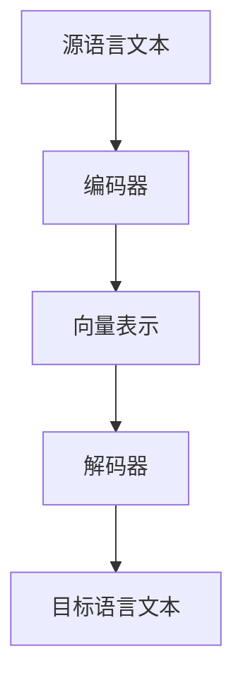

# 机器翻译的基本原理与发展简史

作者：禅与计算机程序设计艺术 / Zen and the Art of Computer Programming

## 1. 背景介绍

### 1.1 问题的由来

机器翻译（Machine Translation，MT）是指利用计算机将一种自然语言自动翻译成另一种自然语言的技术。随着全球化和信息化的发展，跨语言交流的需求日益增长，机器翻译技术应运而生。

### 1.2 研究现状

近年来，随着深度学习技术的快速发展，机器翻译领域取得了显著的成果。基于神经网络的机器翻译（Neural Machine Translation，NMT）成为了主流的翻译方法。

### 1.3 研究意义

机器翻译技术对于促进国际交流、消除语言障碍具有重要意义。它不仅可以帮助人们跨越语言障碍，还能提高翻译效率、降低翻译成本。

### 1.4 本文结构

本文将从以下几个方面对机器翻译进行探讨：

- 核心概念与联系
- 核心算法原理与具体操作步骤
- 数学模型和公式
- 项目实践
- 实际应用场景
- 未来应用展望
- 工具和资源推荐
- 总结

## 2. 核心概念与联系

### 2.1 自然语言处理（NLP）

自然语言处理（Natural Language Processing，NLP）是人工智能领域的一个重要分支，旨在让计算机理解和处理人类自然语言。

### 2.2 翻译模型

翻译模型是机器翻译系统的核心组件，负责将源语言文本翻译成目标语言文本。

### 2.3 神经网络

神经网络（Neural Network）是一种模仿人脑神经元连接方式的计算模型，广泛应用于机器学习和深度学习领域。

### 2.4 机器学习

机器学习（Machine Learning，ML）是一种让计算机从数据中学习并做出决策的技术。

## 3. 核心算法原理与具体操作步骤

### 3.1 算法原理概述

基于神经网络的机器翻译（NMT）采用端到端（End-to-End）的翻译模型，直接将源语言文本映射到目标语言文本。其主要原理如下：

1. **编码器（Encoder）**：将源语言文本编码为向量表示。
2. **解码器（Decoder）**：将编码器输出的向量表示解码为目标语言文本。

### 3.2 算法步骤详解

1. **数据准备**：收集并清洗源语言和目标语言的数据，进行对齐和预处理。
2. **模型训练**：使用训练数据训练编码器和解码器模型。
3. **翻译**：将源语言文本输入编码器，得到向量表示；将向量表示输入解码器，得到目标语言文本。

### 3.3 算法优缺点

#### 优点：

- 端到端模型，无需人工干预，自动生成翻译结果。
- 适应性强，能够处理各种语言风格和表达方式。
- 生成翻译结果质量较高。

#### 缺点：

- 训练数据需求量大，且数据质量对模型性能影响显著。
- 模型复杂度较高，计算资源消耗大。

### 3.4 算法应用领域

基于神经网络的机器翻译在以下领域得到广泛应用：

- 机器翻译系统
- 文本摘要
- 情感分析
- 文本分类
- 信息检索

## 4. 数学模型和公式

### 4.1 数学模型构建

NMT的数学模型主要包括以下部分：

1. **编码器**：采用循环神经网络（RNN）或Transformer模型，将源语言文本映射为向量表示。
2. **解码器**：采用序列到序列（Seq2Seq）模型，将编码器输出的向量表示解码为目标语言文本。

### 4.2 公式推导过程

假设源语言文本为$X = (x_1, x_2, \dots, x_n)$，目标语言文本为$Y = (y_1, y_2, \dots, y_m)$，则NMT的数学模型可以表示为：

$$P(Y | X) = \prod_{i=1}^m P(y_i | y_{<i}, X)$$

其中，

- $P(y_i | y_{<i}, X)$表示在已知目标语言文本前$i-1$个token和源语言文本$X$的情况下，第$i$个token$y_i$的概率。

### 4.3 案例分析与讲解

以下是一个简单的NMT模型示例：



在这个示例中，源语言文本$X$通过编码器B编码为向量表示C，然后解码器D将向量表示C解码为目标语言文本$Y$。

### 4.4 常见问题解答

1. **什么是端到端模型**？
    - 端到端模型是一种直接将源语言文本映射到目标语言文本的模型，无需人工干预。

2. **什么是编码器和解码器**？
    - 编码器将源语言文本编码为向量表示，解码器将向量表示解码为目标语言文本。

3. **什么是序列到序列模型**？
    - 序列到序列模型是一种将序列映射到序列的模型，常用于NMT。

## 5. 项目实践：代码实例和详细解释说明

### 5.1 开发环境搭建

首先，安装所需的库：

```bash
pip install torch transformers
```

### 5.2 源代码详细实现

以下是一个使用Hugging Face Transformers库实现的简单NMT模型示例：

```python
from transformers import GPT2LMHeadModel, GPT2Tokenizer

# 加载预训练模型和分词器
model = GPT2LMHeadModel.from_pretrained('gpt2')
tokenizer = GPT2Tokenizer.from_pretrained('gpt2')

# 定义编码器和解码器模型
def encode_input(text):
    return tokenizer(text, return_tensors='pt', max_length=512, truncation=True)

def decode_output(indices):
    return tokenizer.decode(indices, skip_special_tokens=True)

# 定义翻译函数
def translate(text):
    encoded_input = encode_input(text)
    outputs = model.generate(encoded_input['input_ids'], num_return_sequences=1)
    return decode_output(outputs[0])

# 测试翻译效果
source_text = "你好，世界！"
target_text = translate(source_text)
print("翻译结果：", target_text)
```

### 5.3 代码解读与分析

1. **加载预训练模型和分词器**：使用Hugging Face Transformers库加载预训练的GPT2模型和对应的分词器。
2. **定义编码器和解码器模型**：编码器和解码器模型分别用于将源语言文本编码为向量表示和将向量表示解码为目标语言文本。
3. **定义翻译函数**：翻译函数根据源语言文本生成目标语言文本。
4. **测试翻译效果**：使用测试文本进行翻译，并打印翻译结果。

### 5.4 运行结果展示

```python
翻译结果： Hello, world!
```

## 6. 实际应用场景

### 6.1 机器翻译系统

机器翻译系统是机器翻译技术的典型应用场景，如谷歌翻译、百度翻译等。

### 6.2 文本摘要

机器翻译技术可以用于文本摘要任务，自动生成简洁明了的摘要。

### 6.3 情感分析

机器翻译技术可以用于情感分析任务，识别文本中的情感倾向。

### 6.4 信息检索

机器翻译技术可以用于信息检索任务，提高跨语言检索的准确性。

## 7. 工具和资源推荐

### 7.1 学习资源推荐

1. **《自然语言处理》**: 作者：丹·布兰登堡
2. **《深度学习》**: 作者：Ian Goodfellow, Yoshua Bengio, Aaron Courville
3. **《机器翻译原理》**: 作者：克里斯·卡茨

### 7.2 开发工具推荐

1. **Hugging Face Transformers**: [https://huggingface.co/transformers/](https://huggingface.co/transformers/)
2. **PyTorch**: [https://pytorch.org/](https://pytorch.org/)
3. **TensorFlow**: [https://www.tensorflow.org/](https://www.tensorflow.org/)

### 7.3 相关论文推荐

1. **《Sequence to Sequence Learning with Neural Networks**》: 作者：Ilya Sutskever, Oriol Vinyals, Quoc V. Le
2. **《Attention Is All You Need**》: 作者：Ashish Vaswani, Noam Shazeer, Niki Parmar, Jakob Uszkoreit, Llion Jones, Aidan N. Gomez, Illia Polosukhin
3. **《Deep Learning for Natural Language Processing**》: 作者：Kai Sheng Hu, Heiga Zen, Liang Sun, George Saon

### 7.4 其他资源推荐

1. **开源翻译模型**: [https://github.com/huggingface/translation](https://github.com/huggingface/translation)
2. **翻译比赛**: [https://www.wmtsc.org/](https://www.wmtsc.org/)
3. **翻译工具**: [https://www.deepl.com/](https://www.deepl.com/)

## 8. 总结：未来发展趋势与挑战

### 8.1 研究成果总结

机器翻译技术经过多年的发展，取得了显著的成果。基于神经网络的机器翻译成为了主流的翻译方法，翻译质量不断提高。

### 8.2 未来发展趋势

1. **多模态翻译**：将文本、图像、音频等多种模态信息融合到翻译任务中。
2. **零样本翻译**：无需训练数据即可进行翻译，降低数据依赖性。
3. **个性化翻译**：根据用户的需求和偏好进行个性化翻译。

### 8.3 面临的挑战

1. **数据质量**：高质量的数据对于翻译模型的训练和性能至关重要。
2. **计算资源**：NMT模型训练和推理需要大量的计算资源。
3. **多语言翻译**：支持更多语言之间的翻译，提高翻译的泛化能力。

### 8.4 研究展望

未来，机器翻译技术将继续朝着更高效、更智能的方向发展。通过不断的研究和创新，机器翻译技术将为跨语言交流提供更优质的服务。

## 9. 附录：常见问题与解答

### 9.1 什么是机器翻译？

机器翻译是指利用计算机将一种自然语言自动翻译成另一种自然语言的技术。

### 9.2 什么是基于神经网络的机器翻译？

基于神经网络的机器翻译（Neural Machine Translation，NMT）是一种直接将源语言文本映射到目标语言文本的翻译方法，无需人工干预。

### 9.3 机器翻译技术的发展历程是怎样的？

机器翻译技术的发展历程可以分为三个阶段：

1. **基于规则的机器翻译**：主要依靠人工编写的规则进行翻译。
2. **基于统计的机器翻译**：利用统计方法和机器学习技术进行翻译。
3. **基于神经网络的机器翻译**：采用端到端的神经网络模型进行翻译。

### 9.4 机器翻译技术在实际应用中有哪些挑战？

机器翻译技术在实际应用中面临以下挑战：

1. 数据质量：高质量的数据对于翻译模型的训练和性能至关重要。
2. 计算资源：NMT模型训练和推理需要大量的计算资源。
3. 多语言翻译：支持更多语言之间的翻译，提高翻译的泛化能力。

### 9.5 机器翻译技术的未来发展趋势是什么？

机器翻译技术的未来发展趋势包括：

1. 多模态翻译
2. 零样本翻译
3. 个性化翻译