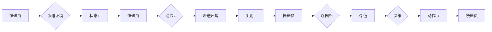

# 深度 Q-learning：在快递派送中的应用

关键词：深度强化学习、Q-learning、快递派送、路径规划、智能物流

## 1. 背景介绍

### 1.1 问题的由来

在现代电子商务时代，快递派送已成为人们日常生活中不可或缺的一部分。随着快递业务量的急剧增长，如何高效、经济地完成快递派送成为快递公司亟需解决的问题。传统的人工调度和路径规划方法已难以应对日益复杂的快递网络和海量的订单数据，亟需引入先进的人工智能技术来优化快递派送过程。

### 1.2 研究现状

近年来，深度强化学习在众多领域取得了突破性进展，展现出在复杂决策问题上的优越性能。其中，Q-learning 作为一种经典的强化学习算法，因其简单有效而备受关注。研究者们开始探索将深度 Q-learning 应用于快递派送领域，希望通过智能算法来优化快递员的派送路径，提升派送效率，降低运营成本。

### 1.3 研究意义

深度 Q-learning 在快递派送中的应用具有重要的理论和实践意义。首先，它为快递路径优化问题提供了一种新的解决思路，突破了传统优化算法的局限性。其次，通过深度 Q-learning 优化派送路径，可以显著提升快递派送效率，缩短货物送达时间，提高客户满意度。此外，优化派送路径还能够降低快递员的劳动强度，减少不必要的时间和燃料浪费，具有良好的经济和社会效益。

### 1.4 本文结构

本文将全面探讨深度 Q-learning 在快递派送中的应用。第2部分介绍深度 Q-learning 的核心概念与内在联系；第3部分重点阐述 Q-learning 的算法原理和关键步骤；第4部分建立快递派送问题的数学模型，推导相关公式，并给出具体的案例分析；第5部分通过项目实践，给出详细的代码实现和结果演示；第6部分讨论深度 Q-learning 在实际快递派送场景中的应用情况；第7部分推荐相关的学习资源和开发工具；第8部分总结全文，展望未来的发展趋势和挑战；第9部分为常见问题解答。

## 2. 核心概念与联系

深度 Q-learning 是深度强化学习的一个重要分支，它结合了深度学习和 Q-learning 的优点，实现了端到端的决策学习。在快递派送场景中，我们可以将快递员看作智能体（Agent），将派送环境看作状态（State），将派送路径选择看作动作（Action），将送达时间看作奖励（Reward）。快递员根据当前的派送状态，选择下一步的派送动作，并从环境中获得相应的奖励反馈，目标是最大化长期累积奖励，即最小化总派送时间。Q-learning 的核心是学习动作-状态值函数 Q(s,a)，表示在状态 s 下选择动作 a 的长期价值。通过不断的试错和学习，快递员可以逐步优化派送策略，找到最佳派送路线。

深度 Q-learning 使用深度神经网络来逼近 Q 值函数，克服了传统 Q-learning 在大规模状态空间上的困难。深度神经网络可以自动提取和学习状态特征，具有强大的表示能力和泛化能力。同时，深度 Q-learning 采用了经验回放（Experience Replay）和目标网络（Target Network）等技巧，有效解决了数据相关性和训练不稳定性问题，提升了算法的样本效率和收敛性。

下图展示了深度 Q-learning 在快递派送中的工作流程：

## 3. 核心算法原理 & 具体操作步骤

### 3.1 算法原理概述

Q-learning 是一种无模型、异策略的时序差分学习算法，它通过迭代更新动作-状态值函数 Q(s,a) 来寻找最优策略。Q 值函数表示在状态 s 下选择动作 a 的长期累积奖励期望，即 Q(s,a) = E[Rt|st=s, at=a]，其中 Rt 表示从时刻 t 开始的累积奖励。Q-learning 的核心思想是利用贝尔曼方程来迭代更新 Q 值：

$$Q(s_t, a_t) \leftarrow Q(s_t, a_t) + \alpha [r_t + \gamma \max_{a} Q(s_{t+1}, a) - Q(s_t, a_t)]$$

其中，$\alpha$ 是学习率，$\gamma$ 是折扣因子，$r_t$ 是即时奖励，$\max_{a} Q(s_{t+1}, a)$ 是下一状态的最大 Q 值。通过不断更新 Q 值，算法最终收敛到最优 Q 值函数，进而得到最优策略。

### 3.2 算法步骤详解

深度 Q-learning 在传统 Q-learning 的基础上，使用深度神经网络 $Q(s,a;\theta)$ 来逼近 Q 值函数，其中 $\theta$ 表示网络参数。具体的算法步骤如下：

1. 初始化 Q 网络参数 $\theta$，目标网络参数 $\theta^{-}=\theta$，经验回放缓冲区 D。

2. for episode = 1 to M do

3. &emsp;&emsp;初始化初始状态 $s_0$

4. &emsp;&emsp;for t = 0 to T do

5. &emsp;&emsp;&emsp;&emsp;根据 $\epsilon-greedy$ 策略选择动作 $a_t=\arg\max_{a} Q(s_t,a;\theta)$ 或随机动作

6. &emsp;&emsp;&emsp;&emsp;执行动作 $a_t$，观察奖励 $r_t$ 和下一状态 $s_{t+1}$

7. &emsp;&emsp;&emsp;&emsp;将转移样本 $(s_t, a_t, r_t, s_{t+1})$ 存入 D

8. &emsp;&emsp;&emsp;&emsp;从 D 中随机采样一个 batch 的转移样本 $(s_j, a_j, r_j, s_{j+1})$

9. &emsp;&emsp;&emsp;&emsp;计算目标 Q 值 $y_j=r_j+\gamma \max_{a} Q(s_{j+1},a;\theta^{-})$

10. &emsp;&emsp;&emsp;&emsp;最小化损失函数 $L(\theta)=\frac{1}{N}\sum_j(y_j-Q(s_j,a_j;\theta))^2$，更新 Q 网络参数 $\theta$

11. &emsp;&emsp;&emsp;&emsp;每隔 C 步更新目标网络参数 $\theta^{-}=\theta$

12. &emsp;&emsp;end for

13. end for

其中，$\epsilon-greedy$ 策略是一种探索与利用平衡的策略，以 $\epsilon$ 的概率随机选择动作，以 $1-\epsilon$ 的概率选择最优动作。经验回放缓冲区 D 用于存储历史转移样本，打破了数据的相关性，提高了样本利用效率。目标网络参数 $\theta^{-}$ 的更新频率低于 Q 网络，有助于稳定训练过程。

### 3.3 算法优缺点

深度 Q-learning 的主要优点包括：

1. 端到端学习：无需人工设计特征，直接从原始状态学习到动作策略。

2. 强大的非线性拟合能力：深度神经网络可以拟合复杂的 Q 值函数。

3. 稳定的训练过程：经验回放和目标网络等技巧有效缓解了训练不稳定性问题。

4. 样本效率高：离线学习使得样本可以被重复利用，提高了数据效率。

但深度 Q-learning 也存在一些局限性：

1. 探索效率低：$\epsilon-greedy$ 策略的探索是随机的，导致探索效率不高。

2. 难以处理连续动作空间：Q 值函数对动作空间进行离散化，不适合连续动作空间。

3. 需要大量训练数据和计算资源：深度神经网络的训练需要海量数据和算力支持。

4. 难以适应动态环境：当环境发生变化时，需要重新训练模型，适应性较差。

### 3.4 算法应用领域

除了快递派送，深度 Q-learning 还被广泛应用于以下领域：

1. 游戏智能体：如 Atari 游戏、围棋、星际争霸等。

2. 机器人控制：如机械臂操作、自动驾驶、四足机器人等。

3. 推荐系统：如电商推荐、新闻推荐、广告投放等。

4. 网络优化：如负载均衡、流量调度、资源分配等。

5. 智能交通：如信号灯控制、交通流预测、路径规划等。

## 4. 数学模型和公式 & 详细讲解 & 举例说明

### 4.1 数学模型构建

我们可以将快递派送问题建模为一个马尔可夫决策过程（MDP），形式化地定义为一个五元组 $\mathcal{M}=(\mathcal{S}, \mathcal{A}, \mathcal{P}, \mathcal{R}, \gamma)$，其中：

- 状态空间 $\mathcal{S}$：表示快递员所处的派送环境状态，如当前位置、剩余订单等。

- 动作空间 $\mathcal{A}$：表示快递员可选择的派送动作，如前往某个地点、送达某个订单等。

- 转移概率 $\mathcal{P}$：表示在状态 s 下选择动作 a 后，转移到状态 s' 的概率，即 $\mathcal{P}(s'|s,a)$。

- 奖励函数 $\mathcal{R}$：表示在状态 s 下选择动作 a 后，获得的即时奖励，即 $\mathcal{R}(s,a)$。

- 折扣因子 $\gamma$：表示未来奖励的折现比例，取值范围 [0,1]。

在快递派送场景中，我们可以将状态定义为 $s=(loc, orders)$，其中 $loc$ 表示快递员当前位置，$orders$ 表示剩余待派送订单。动作可以定义为 $a=(dest, order)$，表示前往目的地 $dest$ 派送订单 $order$。奖励可以定义为 $r=-(t_d + \alpha t_w)$，其中 $t_d$ 为派送耗时，$t_w$ 为等待耗时，$\alpha$ 为等待惩罚系数。

### 4.2 公式推导过程

根据 MDP 模型，我们可以推导出快递派送问题的最优 Q 函数和最优策略。首先，定义状态-动作值函数 $Q^\pi(s,a)$ 为在策略 $\pi$ 下，从状态 s 开始选择动作 a 得到的期望累积奖励：

$$Q^\pi(s,a) = \mathbb{E}_{\pi}[\sum_{k=0}^{\infty} \gamma^k r_{t+k} | s_t=s, a_t=a]$$

其中，$\mathbb{E}_{\pi}$ 表示在策略 $\pi$ 下的期望，$r_{t+k}$ 表示在时刻 t+k 获得的奖励。最优 Q 函数 $Q^*(s,a)$ 定义为在所有策略中取得最大期望累积奖励的 Q 函数：

$$Q^*(s,a) = \max_{\pi} Q^\pi(s,a)$$

根据贝尔曼最优方程，最优 Q 函数满足以下递推关系：

$$Q^*(s,a) = \mathcal{R}(s,a) + \gamma \sum_{s' \in \mathcal{S}} \mathcal{P}(s'|s,a) \max_{a'} Q^*(s',a')$$

即当前状态-动作对的最优 Q 值等于即时奖励加上下一状态的最大 Q 值的折现。基于最优 Q 函数，我们可以得到最优策略 $\pi^*$：

$$\pi^*(s) = \arg\max_{a} Q^*(s,a)$$