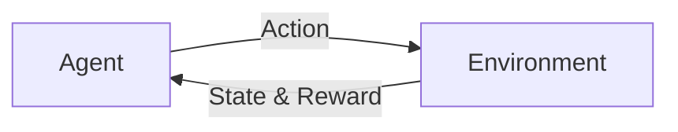

# 深度 Q-learning：基础概念解析

## 1. 背景介绍

### 1.1 问题的由来

强化学习(Reinforcement Learning, RL)是机器学习中的一个重要分支,它研究如何让智能体(Agent)通过与环境的交互来学习最优策略,从而获得最大的累积奖励。在强化学习中,Q-learning 是一种经典而强大的算法,它能够在没有环境模型的情况下,通过不断试错和学习来找到最优策略。

然而,传统的 Q-learning 算法在面对高维状态空间时会遇到维度灾难的问题,导致学习效率低下甚至无法收敛。为了解决这一问题,研究者们提出了深度 Q-learning (Deep Q-Network, DQN)算法,它将深度神经网络引入 Q-learning 中,利用神经网络强大的特征提取和函数拟合能力来逼近最优 Q 函数,从而实现了端到端的强化学习。

### 1.2 研究现状

自从 2015 年 DeepMind 在 Nature 上发表了关于 DQN 玩 Atari 游戏的论文后,深度强化学习迅速成为了学术界和工业界的研究热点。此后,各种基于 DQN 改进的算法被相继提出,如 Double DQN、Dueling DQN、Prioritized Experience Replay 等,极大地提升了 DQN 的性能表现。

同时,DQN 在机器人控制、自动驾驶、推荐系统、智能电网等诸多领域得到了广泛应用,展现出了深度强化学习的巨大潜力。不过,DQN 仍然存在一些局限性,如样本利用效率不高、探索策略欠佳、难以适应连续动作空间等,这些问题有待进一步研究。

### 1.3 研究意义

深入研究 DQN 算法对于理解和发展深度强化学习具有重要意义:

1. 揭示深度学习和强化学习结合的内在机理,为构建更加智能和高效的学习系统提供理论基础。

2. 探索 DQN 算法的优化与改进,提高其在不同任务场景下的适用性和鲁棒性,推动强化学习走向实用化。 

3. 拓展 DQN 在认知科学、神经科学等交叉学科中的应用,加深对人脑学习机制的认识,为类脑智能研究提供新思路。

### 1.4 本文结构

本文将围绕深度 Q-learning 的基础概念展开系统讨论,内容安排如下:

- 第2部分介绍强化学习和 Q-learning 的核心概念与二者之间的联系。
- 第3部分重点阐述 DQN 算法的原理、操作步骤及优缺点。
- 第4部分从数学角度对 DQN 的模型、公式进行推导和举例说明。 
- 第5部分给出 DQN 的代码实现,并结合实例对其进行解读。
- 第6部分讨论 DQN 在不同领域的应用场景及未来应用前景。
- 第7部分推荐 DQN 相关的学习资源、开发工具和重要文献。
- 第8部分总结 DQN 的研究现状,展望其未来发展趋势与面临的挑战。
- 第9部分列举 DQN 常见问题解答,为读者释疑解惑。

## 2. 核心概念与联系

在深入探讨 DQN 之前,我们有必要对强化学习和 Q-learning 的一些核心概念进行梳理,这将有助于理解 DQN 的思想渊源。

**强化学习**的目标是让 Agent 通过与环境的交互来学习最优策略 $\pi^*$,使得期望累积奖励最大化:

$$
\pi^* = \arg\max_\pi \mathbb{E}[G_t | \pi] 
$$

其中,$G_t$ 表示从时刻 $t$ 开始的累积奖励(回报):

$$
G_t = R_{t+1} + \gamma R_{t+2} + \gamma^2 R_{t+3} + ... = \sum_{k=0}^{\infty} \gamma^k R_{t+k+1}
$$

$\gamma \in [0,1]$ 称为折扣因子,用于平衡即时奖励和长期奖励。

强化学习通常由 Agent、State、Action、Reward 四要素组成,它们之间的交互可用下图表示:

**Q-learning** 是一种常用的无模型(model-free)、异策略(off-policy)的时序差分学习算法,核心思想是学习动作-状态值函数(Q 函数):

$$
Q(s,a) = \mathbb{E}[G_t | S_t=s, A_t=a]
$$

$Q(s,a)$ 表示在状态 $s$ 下选择动作 $a$ 的期望累积奖励。若知道最优 Q 函数 $Q^*(s,a)$,则最优策略为:

$$
\pi^*(s) = \arg\max_a Q^*(s,a)
$$

Q-learning 算法基于贝尔曼最优方程对 Q 函数进行迭代更新:

$$
Q(s,a) \leftarrow Q(s,a) + \alpha [r + \gamma \max_{a'} Q(s',a') - Q(s,a)]
$$

其中,$\alpha$ 为学习率,$s'$ 为执行动作 $a$ 后转移到的新状态。不断迭代上式,Q 函数最终会收敛到 $Q^*$。

传统 Q-learning 采用查表法(tabular method)存储每个状态-动作对的 Q 值,当状态和动作空间很大时,存储和计算开销会急剧增加。DQN 的关键创新在于,用深度神经网络 $Q(s,a;\theta)$ 来拟合 Q 函数,其中 $\theta$ 为网络参数。通过优化网络使其输出与贝尔曼方程的目标值尽可能接近,就可以逼近最优 Q 函数:

$$
\mathcal{L}(\theta) = \mathbb{E}_{s,a,r,s'} [(r + \gamma \max_{a'} Q(s',a';\theta) - Q(s,a;\theta))^2]
$$

DQN 实现了 Q-learning 在连续状态空间上的扩展,并通过经验回放(Experience Replay)、固定 Q 目标(Fixed Q-targets)等机制提高了训练稳定性,开创了深度强化学习的新时代。

## 3. 核心算法原理 & 具体操作步骤

### 3.1 算法原理概述

DQN 的核心是使用深度神经网络作为 Q 函数的近似,通过最小化时序差分(TD)误差来训练网络参数,使其输出逼近最优 Q 值。DQN 的训练过程可分为两个阶段:

1. **采样阶段**: Agent 根据当前策略(如 $\epsilon$-greedy)与环境交互,生成状态转移序列 $(s_t, a_t, r_t, s_{t+1})$,并存入经验回放池(Replay Buffer)。

2. **训练阶段**: 从回放池中随机采样一批转移序列,以其中的 $s_t, a_t, r_t, s_{t+1}$ 作为监督信号,通过随机梯度下降(SGD)来更新网络参数 $\theta$,使得网络输出 $Q(s_t,a_t;\theta)$ 尽可能接近目标值 $r_t + \gamma \max_{a} Q(s_{t+1},a;\theta^-)$。其中 $\theta^-$ 为目标网络的参数,它是一个周期性更新的 $\theta$ 的历史版本,用于提供一个相对稳定的训练目标。

通过不断重复采样和训练,网络最终能够学习到接近最优 Q 函数的近似。在执行阶段,Agent 只需根据当前状态输入网络,选取输出 Q 值最大的动作即可。

### 3.2 算法步骤详解

DQN 算法的具体步骤如下:

1. 初始化经验回放池 $\mathcal{D}$,容量为 $N$。 
2. 初始化动作-值函数 $Q$,参数为 $\theta$,优化器为 G。
3. 初始化目标函数 $\hat{Q}$,参数为 $\theta^- = \theta$。
4. for episode = 1, M do
    1. 初始化初始状态 $s_1$
    2. for t = 1, T do 
        1. 根据 $\epsilon$-greedy 策略选择动作 $a_t$:
            $$
            a_t = 
            \begin{cases}
            \arg\max_a Q(s_t,a;\theta), & \text{with prob. } 1-\epsilon \\
            \text{random action}, & \text{with prob. } \epsilon
            \end{cases}
            $$
        2. 执行动作 $a_t$,观察奖励 $r_t$ 和新状态 $s_{t+1}$
        3. 将转移 $(s_t, a_t, r_t, s_{t+1})$ 存入 $\mathcal{D}$
        4. 从 $\mathcal{D}$ 中随机采样一批转移 $(s,a,r,s')$
        5. 计算目标值:
            $$
            y = 
            \begin{cases}
            r, & \text{if } s' \text{ is terminal} \\
            r + \gamma \max_{a'} \hat{Q}(s',a';\theta^-), & \text{otherwise}
            \end{cases}
            $$
        6. 通过最小化损失函数更新 $\theta$:
            $$
            \mathcal{L}(\theta) = \mathbb{E}_{s,a,r,s' \sim \mathcal{D}} [(y - Q(s,a;\theta))^2]
            $$
        7. 每隔 C 步,将 $\theta^-$ 更新为 $\theta$ 
    3. end for
5. end for

其中,超参数 $\epsilon$ 控制探索和利用的平衡,$\epsilon$ 通常随训练进行而衰减。$\gamma$ 为折扣因子,控制短期和长期奖励的权衡。回放池 $\mathcal{D}$ 用于打破转移数据间的关联性和非平稳性。目标网络 $\hat{Q}$ 的参数 $\theta^-$ 每隔 C 步才更新一次,以减缓训练初期的不稳定性。

### 3.3 算法优缺点

DQN 相比传统 Q-learning 的优点在于:

1. 可以处理高维连续状态空间,不需要事先离散化状态。
2. 通过深度网络提取高层特征,具有更强的泛化和策略表示能力。
3. 引入经验回放和固定 Q 目标,缓解了数据关联和非平稳的问题。

但 DQN 仍存在一些不足:

1. 采样效率较低,回放池中的数据利用不充分。
2. 对超参数敏感,难以调参。
3. 使用 $\epsilon$-greedy 进行探索,难以在探索和利用间权衡。
4. 不适用于连续动作空间,需要进行动作离散化。

### 3.4 算法应用领域

DQN 及其变体在以下领域取得了广泛应用:

1. 游戏: Atari 游戏、围棋、星际争霸等
2. 机器人控制: 机械臂操纵、四足机器人运动规划等  
3. 自然语言处理: 对话系统、问答系统、机器翻译等
4. 计算机视觉: 图像分类、目标检测、语义分割等
5. 推荐系统: 电商推荐、新闻推荐、广告投放等
6. 智能交通: 自动驾驶、交通信号控制等
7. 通信网络: 动态路由、资源分配、流量调度等

随着 DQN 的不断发展和完善,其应用领域还将不断扩大,为解决现实世界复杂问题提供新的思路。

## 4. 数学模型和公式 & 详细讲解 & 举例说明

### 4.1 数学模型构建

DQN 的数学模型可以用马尔可夫决策过程(MDP)来描述,一个 MDP 由以下五元组构成:

$$
\mathcal{M} = (\mathcal{S}, \mathcal{A}, \mathcal{P}, \mathcal{R}, \gamma)
$$

- $\mathcal{S}$ 是有限的状态集合。 
- $\mathcal{A}$ 是有限的动作集合。
- $\mathcal{P}$ 是状态转移概率矩阵,$\mathcal{P}_{ss'}^a = P(s'|s,a)$ 表示在状态 $s$ 下执