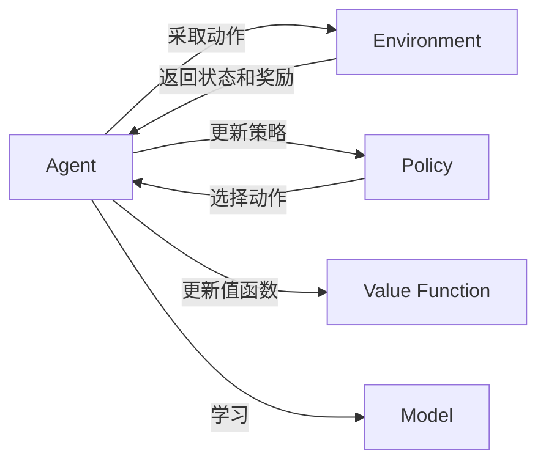

# 深度强化学习 (Deep Reinforcement Learning)

## 1. 背景介绍

### 1.1 问题的由来
强化学习(Reinforcement Learning, RL)是机器学习的一个重要分支,其目标是让智能体(agent)通过与环境的交互学习最优策略,以获得最大的累积奖励。传统的强化学习方法在面对高维、连续的状态空间时往往难以奏效。近年来,随着深度学习的蓬勃发展,将深度神经网络引入强化学习,即深度强化学习(Deep Reinforcement Learning, DRL)成为了研究热点。DRL有望攻克传统RL的难题,在复杂环境中学习到更优策略,推动人工智能迈上新台阶。

### 1.2 研究现状 
自2013年DeepMind提出深度Q网络(Deep Q-Network, DQN)算法以来,DRL领域涌现出许多里程碑式的工作,如DDPG、A3C、PPO、TRPO等。这些算法在Atari游戏、机器人控制、自动驾驶、推荐系统等诸多领域取得了瞩目成就。尤其是AlphaGo系列算法,展现了DRL的强大能力。目前,DRL仍是AI领域最活跃的研究方向之一,但同时也面临样本效率低、泛化能力差、探索困难等挑战有待攻克。

### 1.3 研究意义
DRL作为连接深度学习和强化学习的桥梁,有望继承两者的优势,学习更加强大、高效、鲁棒的策略,推动AI在更多领域的落地应用。DRL的进一步发展,将助力自动驾驶、智能机器人、智慧城市、医疗辅助诊断等行业实现革命性突破,也将加速AGI的到来。深入研究DRL,对于AI的理论创新和产业应用都具有重要意义。

### 1.4 本文结构
本文将首先介绍DRL的核心概念和主要算法。然后重点讲解DRL的理论基础,包括MDP、值函数、策略梯度等数学模型。接着通过经典的案例剖析DRL算法的代码实现。文章还将探讨DRL在游戏、机器人、推荐系统等领域的应用,介绍相关学习资源,展望DRL未来的机遇与挑战。

## 2. 核心概念与联系

DRL涉及的核心概念包括:
- 智能体(Agent):做出动作与环境交互的主体
- 环境(Environment):智能体所处的环境,接收动作、返回下一状态和奖励
- 状态(State):环境的状态表示
- 动作(Action):智能体能够采取的行为
- 策略(Policy):将状态映射为动作的函数
- 轨迹(Trajectory):一个episode中状态-动作-奖励序列
- 回报(Return):一个状态开始直到终止状态的累积折扣奖励
- 值函数(Value Function):衡量一个状态或状态-动作对的期望回报
- 模型(Model):环境动力学的表示,即 $p(s',r|s,a)$

DRL = 深度学习 + 强化学习。其中:
- 深度学习负责学习值函数、策略等复杂函数
- 强化学习负责探索-利用平衡,学习最优策略

下图展示了DRL中各个概念之间的关系:



## 3. 核心算法原理 & 具体操作步骤

### 3.1 算法原理概述
DRL的主流算法可分为值函数法和策略梯度法两大类。

值函数法通过学习值函数来隐式地得到最优策略。代表算法有:
- DQN:使用深度神经网络逼近Q函数
- Double DQN:使用双Q网络缓解Q值过估计问题 
- Dueling DQN:将Q函数分解为状态值函数和优势函数
- Rainbow:集成多种DQN改进技术

策略梯度法则直接对策略函数进行参数化和优化。代表算法有:
- REINFORCE:蒙特卡洛策略梯度
- Actor-Critic:引入值函数降低策略梯度方差
- A3C:多个并行Actor-Critic
- TRPO/PPO:置信域/近端策略优化,限制策略更新幅度
- DDPG:适用于连续动作空间的确定性策略梯度

### 3.2 算法步骤详解
以DQN为例,其算法流程可总结为:

1. 随机初始化Q网络参数 $\theta$
2. 初始化经验回放池 $\mathcal{D}$
3. for episode = 1 to M do
    1. 初始化初始状态 $s_1$
    2. for t = 1 to T do 
        1. 根据 $\epsilon$-greedy策略选择动作 $a_t$
        2. 执行动作 $a_t$,观测奖励 $r_t$ 和下一状态 $s_{t+1}$
        3. 将转移 $(s_t,a_t,r_t,s_{t+1})$ 存入 $\mathcal{D}$
        4. 从 $\mathcal{D}$ 中采样一个批量转移 
        5. 计算目标Q值 $y_i = 
            \begin{cases}
            r_i & \text{if } s_{i+1} \text{ is terminal} \\
            r_i + \gamma \max_{a'}Q(s_{i+1},a';\theta^-) & \text{otherwise}
            \end{cases}$
        6. 最小化损失 $L(\theta)=\mathbb{E}_{(s,a,r,s')\sim\mathcal{D}}[(y-Q(s,a;\theta))^2]$
        7. 每C步同步目标网络参数 $\theta^-\leftarrow\theta$
    3. end for
4. end for

其中, $\theta^-$ 为目标网络参数,用于计算TD目标。经验回放和目标网络有助于稳定训练。

### 3.3 算法优缺点
DQN的主要优点是:
- 端到端学习最优策略,不需人工设计特征
- 通过经验回放缓解数据相关性
- 使用目标网络缓解非静态目标问题

但它也存在一些局限:
- 不能直接处理连续动作空间
- 存在Q值过估计问题
- 难以学习随机性策略

后续的Double DQN、Dueling DQN、A3C、DDPG等算法针对性地改进了这些不足。

### 3.4 算法应用领域
DRL算法已在多个领域展现强大潜力,如:
- 游戏:Atari、Go、星际争霸、Dota等
- 机器人控制:机械臂、四足机器人、仿人机器人等
- 自动驾驶:端到端驾驶、决策规划、交通流量控制等
- 推荐系统:在线推荐、广告投放等
- 通信:资源分配、智能路由等

## 4. 数学模型和公式 & 详细讲解 & 举例说明

### 4.1 数学模型构建
DRL所要解决的问题可用马尔可夫决策过程(Markov Decision Process, MDP)来建模。一个MDP由状态空间 $\mathcal{S}$、动作空间 $\mathcal{A}$、转移概率 $\mathcal{P}$、奖励函数 $\mathcal{R}$ 和折扣因子 $\gamma$ 组成。在MDP中,智能体与环境交互的过程可表示为:

$$s_0 \overset{a_0}{\rightarrow} s_1 \overset{a_1}{\rightarrow} s_2 \overset{a_2}{\rightarrow} \cdots \overset{a_{T-1}}{\rightarrow} s_T$$

其中, $s_t\in\mathcal{S}, a_t\in\mathcal{A}, r_t=\mathcal{R}(s_t,a_t), s_{t+1}\sim\mathcal{P}(\cdot|s_t,a_t)$。

MDP满足马尔可夫性,即下一状态仅取决于当前状态和动作:

$$p(s_{t+1}|s_t,a_t,s_{t-1},a_{t-1},\dots)=p(s_{t+1}|s_t,a_t)$$

一个episode的回报定义为:

$$R(\tau)=\sum_{t=0}^{T-1}\gamma^tr_t$$

其中 $\tau=(s_0,a_0,\dots,s_T)$ 为一条轨迹, $\gamma\in[0,1]$ 为折扣因子。

策略 $\pi(a|s)$ 定义为在状态 $s$ 下选择动作 $a$ 的概率。DRL的目标是学习一个最优策略 $\pi^*$,使得期望回报最大化:

$$\pi^*=\arg\max_{\pi}\mathbb{E}_{\tau\sim p_{\pi}(\tau)}[R(\tau)]$$

其中 $p_{\pi}(\tau)$ 为在策略 $\pi$ 下生成轨迹 $\tau$ 的概率。

### 4.2 公式推导过程
DRL中的两个重要公式是值函数和贝尔曼方程。

状态值函数 $V^{\pi}(s)$ 表示从状态 $s$ 开始,策略 $\pi$ 的期望回报:

$$V^{\pi}(s)=\mathbb{E}_{\tau\sim p_{\pi}(\tau|s_0=s)}[R(\tau)]$$

状态-动作值函数 $Q^{\pi}(s,a)$ 表示在状态 $s$ 下采取动作 $a$,然后继续执行策略 $\pi$ 的期望回报:

$$Q^{\pi}(s,a)=\mathbb{E}_{\tau\sim p_{\pi}(\tau|s_0=s,a_0=a)}[R(\tau)]$$

值函数满足贝尔曼方程:

$$V^{\pi}(s)=\mathbb{E}_{a\sim\pi(\cdot|s),s'\sim\mathcal{P}(\cdot|s,a)}[r+\gamma V^{\pi}(s')]$$

$$Q^{\pi}(s,a)=\mathbb{E}_{s'\sim\mathcal{P}(\cdot|s,a)}[r+\gamma\mathbb{E}_{a'\sim\pi(\cdot|s')}[Q^{\pi}(s',a')]]$$

最优值函数定义为:

$$V^*(s)=\max_{\pi}V^{\pi}(s), \forall s\in\mathcal{S}$$

$$Q^*(s,a)=\max_{\pi}Q^{\pi}(s,a), \forall s\in\mathcal{S}, a\in\mathcal{A}$$

它们满足最优贝尔曼方程:

$$V^*(s)=\max_{a}\mathbb{E}_{s'\sim\mathcal{P}(\cdot|s,a)}[r+\gamma V^*(s')]$$

$$Q^*(s,a)=\mathbb{E}_{s'\sim\mathcal{P}(\cdot|s,a)}[r+\gamma\max_{a'}Q^*(s',a')]$$

值函数法通过迭代更新贝尔曼方程逼近最优值函数,然后通过 $\pi^*(a|s)=\arg\max_{a}Q^*(s,a)$ 得到最优策略。

策略梯度定理给出了期望回报对于策略参数 $\theta$ 的梯度:

$$\nabla_{\theta}\mathbb{E}_{\tau\sim p_{\theta}(\tau)}[R(\tau)]=\mathbb{E}_{\tau\sim p_{\theta}(\tau)}[\sum_{t=0}^{T-1}\nabla_{\theta}\log\pi_{\theta}(a_t|s_t)Q^{\pi_{\theta}}(s_t,a_t)]$$

策略梯度法通过随机梯度上升直接优化参数化策略 $\pi_{\theta}$。

### 4.3 案例分析与讲解
考虑一个简单的网格世界环境,如下图所示:

```
+---+---+---+
| S |   |   |
+---+---+---+
|   |   | G |
+---+---+---+
```

其中S为初始状态,G为目标状态,中间的格子为可行走区域。每一步的奖励为-1,到达目标的奖励为0。折扣因子 $\gamma=1$。

我们用表格法求解这个MDP问题。初始化 $V(s)=0,\forall s\in\mathcal{S}$,然后重复更新值函数:

$$V(s)\leftarrow\max_{a}\sum_{s'\in\mathcal{S}}\mathcal{P}(s'|s,a)[r+\gamma V(s')], \forall s\in\mathcal{S}$$

直到值函数收敛。最终得到的最优值函数为:

```
+-----+-----+-----+
| -2