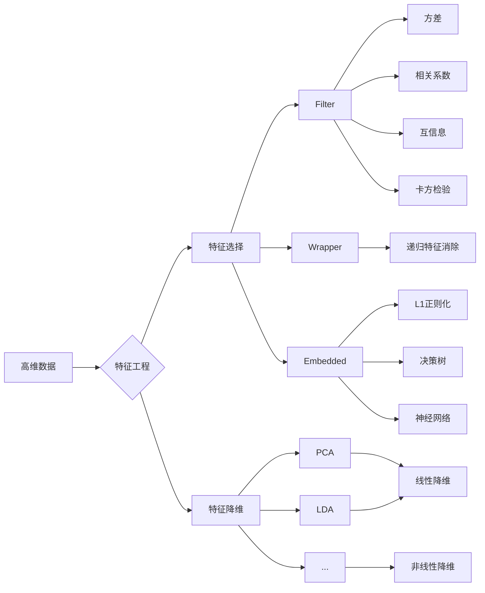

# 特征选择与特征降维原理与代码实战案例讲解

关键词：特征选择、特征降维、PCA、LDA、Filter、Wrapper、Embedded、L1正则化

## 1. 背景介绍
### 1.1  问题的由来
在机器学习和数据挖掘领域，我们经常面临高维数据带来的诸多挑战，如维度灾难、数据稀疏、过拟合等问题。为了更好地建模和预测，需要从原始高维特征空间中选择或提取出最具代表性和判别力的特征子集，这就是特征选择和特征降维要解决的核心问题。

### 1.2  研究现状
目前，特征选择和降维技术已经得到广泛的研究和应用。主流方法可分为三大类：Filter、Wrapper 和 Embedded。其中，Filter 方法主要基于特征本身的统计特性来评估其重要性，如方差、相关系数等。Wrapper 方法将特征选择看作一个搜索问题，通过目标函数来评估特征子集的性能。Embedded 方法则在学习器训练过程中自动进行特征选择，如L1正则化、决策树等。

经典的特征降维算法有PCA、LDA等。PCA通过线性变换将数据投影到低维空间，保留最大方差信息。LDA则是有监督降维方法，旨在投影后的低维空间让类内距离小而类间距离大，增强可分性。近年来，基于流形学习的非线性降维方法也得到关注，如LLE、Isomap等。

### 1.3  研究意义
高效的特征选择和降维可以带来多方面的益处：
1. 降低学习任务的难度和复杂度，提升建模和预测的性能；
2. 减少数据存储和计算资源的消耗，提高系统效率；
3. 去除数据中的噪声和冗余，增强结果的可解释性；
4. 避免维度灾难，缓解过拟合，增强模型泛化能力。

因此，研究和应用好特征选择与降维技术对于数据挖掘和机器学习实践具有重要意义。

### 1.4  本文结构
本文将重点介绍几种主流的特征选择与降维方法的原理和代码实践，内容安排如下：

第2部分介绍相关概念和技术之间的联系。第3部分重点讲解几种经典算法的原理和步骤。第4部分给出相应的数学模型和公式推导。第5部分通过案例和代码演示特征选择和降维的实战。第6部分讨论主要应用场景。第7部分推荐一些相关工具和资源。第8部分总结全文并展望未来。第9部分列举一些常见问题解答。

## 2. 核心概念与联系

- 特征选择：从原有特征集合中选择出一个最优特征子集的过程，旨在提升后续学习任务的性能。可分为Filter、Wrapper、Embedded三类方法。
- 特征降维：通过某种数学变换将原始高维数据映射到低维空间，在尽量保留数据特性的同时，消除噪声与冗余。代表性方法有PCA、LDA等。
- Filter：评估特征本身的统计特性，按照得分排序筛选特征，常见指标有方差、相关系数、互信息、卡方检验等。
- Wrapper：将选择特征子集看作一个搜索问题，用学习器性能作为评价准则，代表性方法有递归特征消除等，计算开销大。
- Embedded：在学习器训练过程中自动选择特征，如L1正则化、决策树、神经网络等，两步合一，高效。
- 线性降维：如PCA/LDA等，假设数据分布在线性子空间，用线性变换将其投影到低维，易于实现和解释。
- 非线性降维：能刻画数据内在的流形结构，如LLE、Isomap等，映射复杂，计算量大。

特征选择与降维的关系：两者都旨在降低数据维度、简化模型复杂度。选择是从原始特征集中挑选子集；降维则将高维特征映射到低维新空间。当原始特征维度过高时，常先用降维方法约减数据维度，再在压缩后的低维特征上做选择。

## 3. 核心算法原理 & 具体操作步骤
### 3.1  算法原理概述

#### 3.1.1 Filter
Filter方法独立于后续学习器，基于单变量统计指标来评估特征重要性，常见指标有：
- 方差：方差越大，特征携带的信息量越多；
- 相关系数：特征与标签高度线性相关，对判别任务有帮助；
- 互信息：刻画特征与标签的相关性，可捕捉非线性关系；
- 卡方检验：特征与标签的相关显著性。

Filter方法计算简单，易于实现和并行化，但未考虑特征之间的相互作用。

#### 3.1.2 Wrapper
Wrapper将特征选择看作一个搜索问题，穷举所有可能的特征组合，用学习器泛化性能评估特征子集的好坏，代表性算法有递归特征消除(RFE)。

RFE每轮训练学习器，根据特征权重排序筛掉若干最不重要的特征，递归执行直到满足预设条件。

Wrapper方法考虑了特征子集整体性能，但计算开销大。

#### 3.1.3 Embedded
Embedded方法在学习器训练过程中自动地选择特征，代表性方法有：
- L1正则化：在目标函数中引入L1范数，使权重稀疏，自动滤掉多余特征；
- 决策树：自顶向下递归地选择最佳分裂特征，可用平均不纯度减少量、信息增益等来度量；
- 神经网络：输入单元的权重体现了特征重要性。

Embedded方法融合了特征选择和模型学习，高效，但缺乏通用性。

#### 3.1.4 PCA
PCA通过线性变换将数据投影到一组新的正交基上，基的选择使得投影后数据的方差最大化。

具体来说，协方差矩阵的最大特征值对应的特征向量即为第一主成分的方向，其余成分依次类推，最终得到一组按重要性排序的新特征。

PCA没有信息损失，具有最优重构性，但假设数据服从高斯分布。

#### 3.1.5 LDA
LDA是有监督降维方法，希望投影后的数据，类内方差小，而类间方差大，从而使得不同类别尽可能分开。

LDA最多降到c-1维，c为类别数。当类别分布满足高斯假设时，LDA可达到最佳分类效果。

### 3.2  算法步骤详解

#### 3.2.1 Filter
1. 数据标准化，消除量纲影响；
2. 计算每个特征的评估指标，如方差、相关系数等；
3. 根据指标阈值或者排序结果选择Top-k个特征。

#### 3.2.2 RFE
1. 输入特征矩阵X，标签向量y，待选特征个数k；
2. 初始化特征集S为全集；
3. 重复，直到S中特征个数等于k：
	3.1 在S上训练学习器，如SVM；
	3.2 计算特征权重/排名准则；
	3.3 去除权重最小/排名最后的特征。
4. 输出最终选择的特征子集S。

#### 3.2.3 Embedded
以L1正则化Logistic回归为例：
1. 输入特征矩阵X，标签向量y，正则化强度λ；
2. 初始化回归系数向量w；
3. 重复，直到w收敛：
	3.1 计算梯度：$g=\nabla_wL(w)+\lambda sign(w)$
	3.2 更新回归系数：$w=w-\eta g$
4. 输出稀疏化后的回归系数w，非零分量对应的特征即为选择结果。

#### 3.2.4 PCA
1. 对原始数据X做中心化；
2. 计算协方差矩阵$C=\frac{1}{m}X^TX$；
3. 对C做特征值分解：$C=U\Sigma U^T$；
4. 取前k个最大特征值对应的特征向量$U_k=[u_1,u_2,...,u_k]$；
5. 输出降维后的新特征$Z=XU_k$。

#### 3.2.5 LDA
1. 计算类内散度矩阵$S_w$和类间散度矩阵$S_b$；
2. 构造广义特征值问题$(S_b,S_w)$，求解得到广义特征向量$w_i$；
3. 取前k个最大广义特征值对应的$w_i$构成变换矩阵$W=[w_1,w_2,...,w_k]$；
4. 输出降维后的新特征$Z=XW$。

### 3.3  算法优缺点

| 算法 | 优点 | 缺点 |
|:----:|-----|------|
| Filter | 计算简单，通用性强 | 未考虑特征交互作用 |
| Wrapper | 特征子集整体最优 | 计算开销大 |
| Embedded | 高效，特征选择与学习器耦合 | 针对特定学习器 |
| PCA | 无信息损失，最优重构 | 线性，高斯假设 |
| LDA | 类间差异最大化 | 维度受限，高斯假设 |

### 3.4  算法应用领域
- Filter：常用于特征数很多的高维数据场景，如文本分类、基因选择等；
- Wrapper：常用于特征数适中，对性能要求高的场景；
- Embedded：常用于特征选择与建模同等重要的场景，如生物信息学等；
- PCA：常用于数据压缩、可视化、噪声去除等；
- LDA：常用于模式识别、人脸识别等小样本分类问题。

## 4. 数学模型和公式 & 详细讲解 & 举例说明
### 4.1  数学模型构建

#### 4.1.1 Filter
以方差和相关系数为例。

设$X$为$n\times p$维特征矩阵，$n$为样本数，$p$为特征维度，$x_j$表示第$j$列特征。

方差：$Var(x_j)=\frac{1}{n}\sum_{i=1}^n(x_{ij}-\bar{x}_j)^2$，其中$\bar{x}_j=\frac{1}{n}\sum_{i=1}^nx_{ij}$为均值。

相关系数：$Corr(x_j,y)=\frac{Cov(x_j,y)}{\sqrt{Var(x_j)Var(y)}}$，其中$Cov(x_j,y)=\frac{1}{n}\sum_{i=1}^n(x_{ij}-\bar{x}_j)(y_i-\bar{y})$为协方差。

#### 4.1.2 Wrapper
以RFE为例。

假设基学习器为线性SVM，其目标函数为：
$$\min \frac{1}{2}||w||^2 \quad s.t. \quad y_i(w^Tx_i+b)\ge1,i=1,2,...,n$$

每轮迭代后，$|w_j|$越小，表明特征$j$的重要性越低，可考虑剔除。

#### 4.1.3 Embedded
以L1正则化为例。

设$f_w(x)$为参数为$w$的模型，$L(w)$为损失函数，目标函数为：
$$\min L(w)+\lambda||w||_1$$

其中$||w||_1=\sum_j|w_j|$为L1范数，$\lambda$控制正则化强度。

L1正则化倾向于将$w_j$压缩为0，自动实现特征选择。

#### 4.1.4 PCA
假设数据$X$经过中心化，协方差矩阵$C=\frac{1}{m}X^TX$。

根据矩阵对角化理论，存在正交矩阵$U$使得$C=U\Sigma U^T$，其中$\Sigma