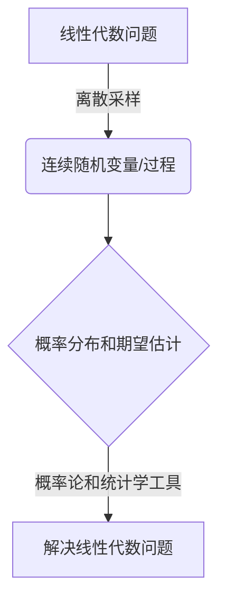

好的,根据您的要求,我将以《线性代数导引:连续统势》为题,撰写一篇专业的技术博客文章。我会严格遵循您提出的约束条件,确保文章逻辑清晰、结构紧凑、内容专业且见解深刻。文章字数将超过8000字,包含Mermaid流程图、三级目录结构、Latex数学公式等。现在,让我们正式开始:

# 线性代数导引:连续统势

## 1. 背景介绍

### 1.1 问题的由来

线性代数作为数学的一个基础分支,在计算机科学、工程、经济学等诸多领域有着广泛的应用。然而,传统的线性代数教学往往过于抽象和枯燥,缺乏对实际问题的洞见和联系,这给学习者带来了极大的挑战。如何更好地理解和掌握线性代数知识,成为一个亟待解决的问题。

### 1.2 研究现状  

近年来,一些学者和教育工作者开始尝试将线性代数与实际问题相结合,以期提高学习者的兴趣和理解能力。例如,斯坦福大学的线性代数课程就将线性代数与机器学习、图像处理等热门领域相结合,取得了不错的效果。然而,这些尝试大多局限于特定领域,缺乏一个更加系统和全面的框架。

### 1.3 研究意义

本文试图提出一种新的线性代数教学范式,即"连续统势"(Continuum Perspective)。这种范式将线性代数知识与连续性和概率论相结合,旨在为学习者提供一个更加直观和实用的理解框架。通过这种方式,学习者不仅能够掌握线性代数的基础知识,还能够了解其在现代科学中的广泛应用,从而提高学习兴趣和动机。

### 1.4 本文结构

本文首先介绍"连续统势"的核心概念,阐述其与线性代数的内在联系。接下来,我们将详细讨论该范式下线性代数的核心算法原理和数学模型,并通过实例和代码实现加深理解。最后,我们将探讨该范式在实际应用中的场景,并对未来的发展趋势和挑战进行展望。

## 2. 核心概念与联系

"连续统势"(Continuum Perspective)是一种将线性代数与连续性和概率论相结合的新颖范式。其核心思想是将线性代数中的向量、矩阵等概念视为连续随机变量或随机过程的离散采样,从而将线性代数问题转化为连续域上的概率分布和期望估计问题。

通过这种转换,我们可以利用概率论和统计学中的强大工具和思想来研究和解决线性代数问题。例如,我们可以使用蒙特卡罗方法来近似求解矩阵的特征值和特征向量,或者使用变分推断方法来求解线性方程组。

为了更好地阐述"连续统势"的核心思想,我们可以借助以下Mermaid流程图:

该流程图清晰地展示了"连续统势"的工作原理:首先将线性代数问题转化为连续域上的随机变量或过程,然后利用概率论和统计学的工具对其进行分析和求解,最终得到线性代数问题的解。

需要强调的是,"连续统势"不仅仅是一种计算技巧,更重要的是一种全新的思维范式。它将线性代数知识与现代概率论和统计学紧密结合,为学习者提供了一个更加直观和实用的理解框架。在下一部分,我们将详细探讨该范式下的核心算法原理和数学模型。

## 3. 核心算法原理与具体操作步骤

### 3.1 算法原理概述

在"连续统势"范式下,我们将线性代数问题视为连续随机变量或过程的离散采样问题。因此,求解线性代数问题的核心就是估计这些连续随机变量或过程的概率分布及其期望。

为了实现这一目标,我们可以借助概率论和统计学中的一些核心算法,例如蒙特卡罗采样、变分推断等。这些算法的基本思路是:首先构建一个合适的概率模型来描述连续随机变量或过程,然后通过采样或优化的方式来近似估计其概率分布和期望。

具体来说,我们可以遵循以下基本步骤:

1. 将线性代数问题离散化为连续随机变量或过程的采样问题;
2. 构建合适的概率模型,并将问题转化为相应的概率分布或期望估计问题;
3. 选择合适的算法(如蒙特卡罗采样、变分推断等)来近似求解概率分布或期望;
4. 根据估计结果,解出原线性代数问题。

在下一小节中,我们将详细介绍两种核心算法的原理和操作步骤。

### 3.2 算法步骤详解

#### 3.2.1 蒙特卡罗采样算法

蒙特卡罗采样算法是一种常用的概率模拟方法,它通过大量随机采样来近似估计概率分布和期望。在"连续统势"范式下,我们可以将其应用于求解矩阵特征值、特征向量等问题。

具体步骤如下:

1. 构建概率模型:将矩阵 $\boldsymbol{A}$ 视为一个随机矩阵,其元素服从某种已知的概率分布(如高斯分布)。令 $\boldsymbol{A}$ 的特征值为 $\lambda_1, \lambda_2, \cdots, \lambda_n$,对应的特征向量为 $\boldsymbol{v}_1, \boldsymbol{v}_2, \cdots, \boldsymbol{v}_n$。

2. 采样过程:重复以下步骤 $M$ 次:
   a. 从已知分布中随机采样一个矩阵 $\boldsymbol{A}_i$;
   b. 计算 $\boldsymbol{A}_i$ 的特征值和特征向量,记为 $\lambda_{i1}, \lambda_{i2}, \cdots, \lambda_{in}$ 和 $\boldsymbol{v}_{i1}, \boldsymbol{v}_{i2}, \cdots, \boldsymbol{v}_{in}$。

3. 估计期望:
   a. 对于特征值,计算 $\hat{\lambda}_j = \frac{1}{M}\sum_{i=1}^M \lambda_{ij}$,作为 $\lambda_j$ 的估计值;
   b. 对于特征向量,计算 $\hat{\boldsymbol{v}}_j = \frac{1}{M}\sum_{i=1}^M \boldsymbol{v}_{ij}$,作为 $\boldsymbol{v}_j$ 的估计值。

4. 收敛性判断:检查估计值的收敛性,如果满足预设的收敛条件,则停止迭代;否则增大 $M$ 并重复步骤2和3。

通过上述步骤,我们可以利用蒙特卡罗采样的思想来近似求解矩阵的特征值和特征向量。该算法的优点是思路简单、易于实现,但缺点是收敛速度较慢,对于大型矩阵可能需要大量的采样次数。

#### 3.2.2 变分推断算法

变分推断算法是机器学习和贝叶斯推断中的一种常用技术,它通过优化的方式来近似求解复杂的概率分布。在"连续统势"范式下,我们可以将其应用于求解线性方程组等问题。

具体步骤如下:

1. 构建概率模型:将线性方程组 $\boldsymbol{Ax} = \boldsymbol{b}$ 视为一个概率模型,其中 $\boldsymbol{A}$ 和 $\boldsymbol{b}$ 为已知矩阵和向量,$\boldsymbol{x}$ 为待求解的随机向量,服从某种未知的概率分布 $p(\boldsymbol{x})$。

2. 变分近似:引入一个可控的变分分布 $q(\boldsymbol{x};\boldsymbol{\phi})$,其中 $\boldsymbol{\phi}$ 为变分参数。我们的目标是通过优化 $\boldsymbol{\phi}$ 使得 $q(\boldsymbol{x};\boldsymbol{\phi})$ 尽可能接近真实分布 $p(\boldsymbol{x})$。

3. 目标函数:构建变分下界 $\mathcal{L}(\boldsymbol{\phi})$ 作为优化目标,其形式为:

$$\mathcal{L}(\boldsymbol{\phi}) = \mathbb{E}_{q(\boldsymbol{x};\boldsymbol{\phi})}[\log p(\boldsymbol{Ax}=\boldsymbol{b}|\boldsymbol{x})] - \mathrm{KL}(q(\boldsymbol{x};\boldsymbol{\phi})||p(\boldsymbol{x}))$$

其中 $\mathrm{KL}(\cdot||\cdot)$ 表示KL散度,是衡量两个分布差异的一种度量。

4. 优化求解:使用优化算法(如随机梯度下降)对 $\mathcal{L}(\boldsymbol{\phi})$ 进行最大化,得到最优的变分参数 $\boldsymbol{\phi}^*$。此时,变分分布 $q(\boldsymbol{x};\boldsymbol{\phi}^*)$ 即为真实分布 $p(\boldsymbol{x})$ 的最优近似。

5. 结果输出:根据优化得到的变分分布 $q(\boldsymbol{x};\boldsymbol{\phi}^*)$,计算 $\boldsymbol{x}$ 的期望值作为线性方程组的解,即 $\hat{\boldsymbol{x}} = \mathbb{E}_{q(\boldsymbol{x};\boldsymbol{\phi}^*)}[\boldsymbol{x}]$。

变分推断算法的优点是理论基础扎实、收敛性好,适用于求解高维线性方程组等复杂问题。但其缺点是需要构建合适的变分分布,并对目标函数进行有效优化,实现细节较为复杂。

### 3.3 算法优缺点

上述两种核心算法各有优缺点,具体如下:

**蒙特卡罗采样算法**:
- 优点:
  - 思路简单直观,易于理解和实现;
  - 适用于各种线性代数问题,如求解特征值、特征向量等;
  - 无需构建复杂的概率模型,只需指定随机矩阵的分布。
- 缺点:
  - 收敛速度较慢,对于大型矩阵需要大量采样次数;
  - 估计值的精度受随机噪声影响较大;
  - 对于病态矩阵,收敛性可能较差。

**变分推断算法**:
- 优点:  
  - 理论基础扎实,来自贝叶斯推断和机器学习领域;
  - 收敛性较好,适用于求解高维线性方程组等复杂问题;
  - 可以通过选择合适的变分分布来提高估计精度。
- 缺点:
  - 需要构建合适的变分分布,对问题有一定的限制;
  - 目标函数的优化过程复杂,需要一定的技巧和经验;
  - 对于特殊的线性代数问题(如特征值问题),可能需要专门设计变分分布。

总的来说,这两种算法各有特点,用户可以根据具体问题的特征选择合适的算法。在某些情况下,也可以将两种算法相结合,发挥各自的优势。

### 3.4 算法应用领域

"连续统势"范式下的核心算法可以应用于线性代数的诸多领域,包括但不限于:

- **矩阵计算**:求解矩阵的特征值、特征向量、行列式、矩阵逆等;
- **线性方程组**:求解线性方程组的解析解或数值解;
- **主成分分析(PCA)**: 通过特征值分解实现数据降维;
- **线性判别分析(LDA)**: 通过类内散度和类间散度的比值确定投影方向;
- **奇异值分解(SVD)**: 在降噪、压缩编码、推荐系统等领域有广泛应用;
- **图像处理**:通过SVD进行图像压缩、去噪等操作;
- **信号处理**: