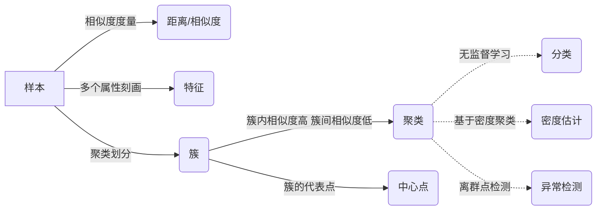

# 聚类分析在人工智能领域的应用

关键词：聚类分析、人工智能、机器学习、数据挖掘、模式识别

## 1. 背景介绍
### 1.1 问题的由来
在当今大数据时代,海量的数据正以前所未有的速度增长。面对如此庞大而复杂的数据,如何从中发现有价值的信息并加以利用,已成为人工智能领域亟待解决的问题。聚类分析作为一种无监督学习方法,通过将相似的数据对象归到同一类,能够有效地发现数据内在的分布结构和规律。因此,聚类分析在人工智能领域有着广泛的应用前景。

### 1.2 研究现状 
近年来,聚类分析技术在人工智能领域得到了长足的发展。许多新的聚类算法不断涌现,如基于密度的DBSCAN、基于图的谱聚类等。同时,聚类分析与深度学习、增强学习等技术的结合,也极大地拓展了聚类的应用范围。一些经典的聚类算法,如K-means、层次聚类等,也在实践中得到了广泛应用。

### 1.3 研究意义
聚类分析在人工智能领域的研究意义主要体现在以下几个方面:

1. 作为一种数据挖掘工具,聚类分析可以帮助我们探索数据内在的分布规律,为进一步的分析和预测提供依据。
2. 聚类可以作为一种数据预处理和特征工程的手段,通过聚类将相似样本归类,可以去除数据噪声,提升数据质量。  
3. 在缺乏先验知识和类别标签的情况下,聚类可以帮助我们自动发现数据的内在结构,实现无监督学习。
4. 聚类结果可以用于模式识别、异常检测等任务,在人工智能的许多应用场景中发挥重要作用。

### 1.4 本文结构
本文将重点介绍聚类分析在人工智能领域的应用。内容安排如下:第2部分介绍聚类分析的核心概念;第3部分重点讲解几种常见的聚类算法原理;第4部分给出聚类分析的数学模型和公式推导;第5部分通过代码实例演示聚类算法的具体实现;第6部分列举聚类分析的几个典型应用场景;第7部分推荐一些聚类分析的学习资源;最后第8部分对全文进行总结,并展望聚类分析技术的发展趋势和面临的挑战。

## 2. 核心概念与联系
聚类分析的核心概念包括:
- 聚类(Clustering):将物理或抽象对象的集合组织成为类的过程,使得同一聚类内的对象之间相似度较高,而不同聚类的对象之间相似度较低。
- 样本(Sample):数据集中的每个独立的数据对象,通常由多个属性(特征)来描述。
- 特征(Feature):用来刻画样本特性的变量,可以是数值型、类别型等。
- 距离/相似度(Distance/Similarity):度量两个样本之间差异大小的指标。距离越小(相似度越大),表示样本越接近。常见的距离度量有欧氏距离、曼哈顿距离等。
- 中心点(Centroid):聚类的代表点,通常是聚类内所有样本的均值向量。
- 簇(Cluster):聚类的结果,即把相似的样本划分在同一个簇中。

聚类分析与其他几个概念的联系如下:
- 分类(Classification):一种监督学习方式,需要预先定义类别标签,而聚类是无监督学习,自动发现数据的内在结构。
- 密度估计(Density Estimation):从数据样本估计总体的概率密度函数。某些聚类方法如DBSCAN基于密度来定义聚类。
- 异常检测(Anomaly Detection):发现数据中的异常点或离群点。异常点通常不属于任何一个聚类。

下图展示了聚类分析的核心概念之间的关系:



## 3. 核心算法原理 & 具体操作步骤
### 3.1 算法原理概述
聚类算法大致可分为基于划分、基于层次、基于密度、基于图等几大类。下面重点介绍几种常见的聚类算法:
1. K-means
将样本划分为K个簇,每个簇有一个中心点。通过迭代优化,使得簇内样本到中心点的距离平方和最小。

2. 层次聚类 
自底向上(聚合)或自顶向下(分裂)地构建树状的聚类结构。聚合法初始每个样本是一个簇,然后迭代地合并距离最近的两个簇;分裂法初始所有样本是一个簇,然后迭代地选择一个簇进行分裂。

3. DBSCAN
基于密度聚类的代表方法。以密度为连通性,将紧密相连的样本点划为一个簇。能够发现任意形状的聚类,对噪声数据鲁棒。 

4. 谱聚类
基于图论的聚类方法。将聚类问题转化为图的最优划分问题,通过谱图理论求解。能够发现非凸形状的聚类结构。

### 3.2 算法步骤详解
以K-means为例详细说明其算法步骤:
1. 随机选择K个样本作为初始的聚类中心点
2. 重复下列步骤直到收敛:
   a. 对每个样本,计算它到各个中心点的距离,将其分配到距离最近的簇
   b. 对每个簇,重新计算其中心点(即簇内所有样本的均值向量)
3. 输出最终的聚类结果

可以看出,K-means通过迭代优化最小化下面的目标函数:

$$J = \sum_{i=1}^K \sum_{x \in C_i} ||x - \mu_i||^2$$

其中$\mu_i$是第$i$个簇的中心点,$C_i$是第$i$个簇内的样本集合。

### 3.3 算法优缺点
K-means的主要优点有:
- 原理简单,易于实现。
- 计算复杂度较低,适合处理大规模数据集。
- 对球形、密集的簇效果较好。

K-means的主要缺点有:  
- 需要预先指定聚类数K,对K敏感。
- 容易陷入局部最优,聚类结果依赖初始中心点的选择。
- 只适合发现球形的簇,对于非凸形状的簇效果不好。
- 对噪声和离群点敏感。

其他一些聚类算法如DBSCAN、谱聚类等,在一定程度上克服了K-means的局限性,能够发现任意形状的簇,并且对噪声数据鲁棒。但它们的计算复杂度通常较高。

### 3.4 算法应用领域
聚类分析在人工智能的众多领域都有广泛应用,例如:
- 计算机视觉:图像分割、目标识别等
- 自然语言处理:文本聚类、主题发现等 
- 推荐系统:将用户或商品聚类,实现个性化推荐
- 生物信息学:基因表达数据聚类、蛋白质功能分类等
- 社交网络:社团发现、用户兴趣挖掘等

## 4. 数学模型和公式 & 详细讲解 & 举例说明
### 4.1 数学模型构建
聚类分析可以用如下的数学模型来描述:
给定样本集$D = \{x_1, x_2, \cdots, x_n\}$,每个样本$x_i$由$d$个属性刻画。聚类就是要将$D$划分为$K$个互不相交的子集$\{C_1, C_2, \cdots, C_K\}$,使得同一子集内的样本相似度高,不同子集间的样本相似度低。

相似度的度量是聚类分析的关键。常用的相似度度量有:
- 欧氏距离:$dist(x_i, x_j) = \sqrt{\sum_{k=1}^d (x_{ik} - x_{jk})^2}$
- 曼哈顿距离:$dist(x_i, x_j) = \sum_{k=1}^d |x_{ik} - x_{jk}|$
- 余弦相似度:$sim(x_i, x_j) = \frac{x_i \cdot x_j}{||x_i|| \cdot ||x_j||}$

其中$x_{ik}$表示样本$x_i$的第$k$个属性值。

### 4.2 公式推导过程
以K-means为例,推导其优化目标函数。

K-means的目标是最小化所有样本到其所属簇中心点的距离平方和,即:

$$\min J = \sum_{i=1}^K \sum_{x \in C_i} ||x - \mu_i||^2$$

其中
$$\mu_i = \frac{1}{|C_i|} \sum_{x \in C_i} x$$
是第$i$个簇的中心点。

求解上述优化问题的一般方法是迭代优化,交替进行两个步骤:
1. 固定$\mu_i$,优化$C_i$。此时问题等价于:
$$\min \sum_{x \in D} \min_{1 \leq i \leq K} ||x - \mu_i||^2$$
   即将每个样本分配到距离最近的簇。
2. 固定$C_i$,优化$\mu_i$。由于$J$是关于$\mu_i$的二次函数,求导得:
$$\frac{\partial J}{\partial \mu_i} = -2 \sum_{x \in C_i} (x - \mu_i)$$
   令导数为0,解得$\mu_i$的更新公式为:
$$\mu_i = \frac{1}{|C_i|} \sum_{x \in C_i} x$$

### 4.3 案例分析与讲解
下面以一个简单的二维数据集为例,直观展示K-means聚类的过程。

假设有10个样本点,每个样本由两个属性$(x, y)$刻画:
```
x   y
1   2
1.5 1.8 
5   8
8   8
1   0.6
9   11
2   2
2   4
7   5
8   7
```

令$K=3$,随机选择前3个样本点作为初始中心点。然后进行K-means聚类,得到如下结果:

```
Iteration 1:
Cluster 1: (1, 2), (1.5, 1.8), (1, 0.6), (2, 2), (2, 4)
Cluster 2: (5, 8), (8, 8), (7, 5), (8, 7) 
Cluster 3: (9, 11)

Iteration 2:
Cluster 1: (1, 2), (1.5, 1.8), (1, 0.6), (2, 2)  
Cluster 2: (5, 8), (8, 8), (7, 5), (8, 7)
Cluster 3: (2, 4), (9, 11)

Iteration 3:
Cluster 1: (1, 2), (1.5, 1.8), (1, 0.6), (2, 2)
Cluster 2: (5, 8), (8, 8), (7, 5), (8, 7)  
Cluster 3: (2, 4), (9, 11)
```

由于第3次迭代的聚类结果与第2次相同,算法收敛,得到最终的3个簇。直观上看,K-means能够较好地将这10个点划分为3个紧凑的簇。

### 4.4 常见问题解答
**Q:** 如何确定聚类数K?

**A:** 确定最优的聚类数是一个复杂的问题,通常需要结合先验知识和对聚类结果的解释。一些启发式的方法包括:
1. 肘部法则:画出不同K值下的聚类误差曲线,选择误差下降拐点处的K值。
2. 轮廓系数:计算每个样本的轮廓系数(衡量样本与所属簇的匹配程度),选择平均轮廓系数最大的K值。

**Q:** 如何处理聚类过程中