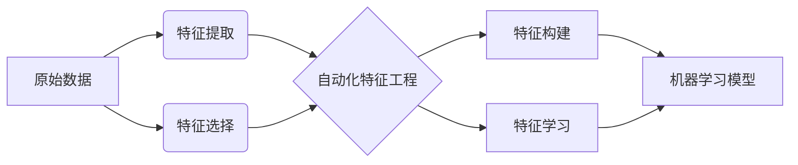

# 自动化特征工程:特征提取与构建方法

关键词：特征工程、特征提取、特征构建、自动化、机器学习

## 1. 背景介绍
### 1.1 问题的由来
在机器学习和数据挖掘领域,特征工程是一个至关重要但又容易被忽视的环节。高质量的特征是构建高性能模型的基石,然而传统的特征工程流程往往依赖于人工设计和领域知识,耗时耗力。如何自动化、智能化地完成特征工程,成为了一个亟待解决的问题。
### 1.2 研究现状
近年来,自动化特征工程逐渐成为学术界和工业界的研究热点。一些经典算法如主成分分析(PCA)、独立成分分析(ICA)等,在特征提取和降维方面取得了不错的效果。而深度学习的兴起,又为自动化特征工程带来了新的契机。CNN、RNN等网络结构被证明能够自动学习数据的高层特征表示。但目前这些方法大多针对特定领域,缺乏通用性和可解释性。
### 1.3 研究意义 
自动化特征工程可以大大减轻人力成本,提高建模效率,让机器学习工程师从繁琐的特征设计中解放出来,专注于算法优化。同时,自动化方法能发掘人工难以察觉的特征,有望获得更优的模型性能。研究一套行之有效的自动化特征工程方法,对于推动机器学习的工程化落地具有重要意义。
### 1.4 本文结构
本文将系统阐述自动化特征工程的核心概念、主流方法和实践案例。第2部分介绍特征工程的基本概念和分类;第3部分重点讲解几种常见的自动化特征提取算法原理;第4部分从数学角度对特征构建的优化目标和策略进行建模分析;第5部分通过实际数据集和代码示例,演示自动化特征工程的流程;第6-8部分分别总结特征工程的应用场景、相关工具资源,以及未来的机遇与挑战。

## 2. 核心概念与联系
特征工程的目的是从原始数据中提取和构建能够很好地代表潜在模式,并对学习任务有效的特征。按照特征是否需要人工参与设计,可分为传统特征工程和自动化特征工程两大类:

- 传统特征工程:特征由人工基于经验和领域知识设计,再喂入机器学习模型。流程通常包括特征提取、特征选择和特征构建等步骤。
- 自动化特征工程:利用机器自动学习或生成数据的特征表示,替代人工设计环节。按照实现方式,又可细分为基于特征提取的方法和基于特征构建的方法。

自动化特征工程与机器学习关系紧密。一方面,特征工程的结果直接影响了模型的性能上限;另一方面,不同的学习器对特征也有不同的偏好。二者相辅相成,协同优化。



## 3. 核心算法原理 & 具体操作步骤
### 3.1 算法原理概述
自动化特征提取的核心是如何从高维原始数据中,提炼出信息量大且维度小的新特征。常用的算法包括:

1) PCA:通过线性变换将数据投影到方差最大的几个正交方向,实现降维和去噪。
2) ICA:假设数据是几个独立信号的线性组合,通过优化统计独立性准则,还原出独立特征。
3) AutoEncoder:用神经网络拟合恒等映射,中间层激活值可作为学习到的特征。
4) 词向量:将离散文本映射为低维连续向量表示,如word2vec、glove等。

这些方法都可以无监督地学习数据的内在结构和特征表示。此外,有监督的特征学习通常与分类、回归等下游任务联合训练,端到端优化。
### 3.2 算法步骤详解
以PCA为例,其主要步骤包括:

1) 数据中心化:将所有样本减去均值,使数据以原点为中心。
2) 计算协方差矩阵:$C=\frac{1}{m}X^TX$,其中$X$为中心化后的数据矩阵。
3) 特征值分解:对协方差矩阵$C$进行特征值分解,得到特征值$\lambda_i$和特征向量$v_i$。
4) 降维与重构:取最大的$k$个特征值对应的特征向量,将数据投影到这$k$个方向上,得到降维后的新特征。

ICA、AutoEncoder等算法也有类似的矩阵分解和优化过程,区别在于目标函数和约束条件的选取。
### 3.3 算法优缺点
自动化特征提取相比人工设计的优势在于:

1) 可以发掘数据中隐含的关联模式,捕捉人眼难以察觉的特征。
2) 通用性强,可适用于不同的数据类型和领域。
3) 计算高效,尤其适合处理高维数据。

但这类方法也有一定局限:

1) 学习到的特征缺乏可解释性,有时无法赋予明确的物理意义。
2) 特征提取是无监督的,与下游任务的相关性有待验证。
3) 对数据质量和预处理较为敏感,异常值和噪声会影响学习效果。
### 3.4 算法应用领域
自动化特征提取在计算机视觉、自然语言处理、语音识别等领域得到了广泛应用。如CNN可以从原始像素中逐层提取边缘、纹理、部件等视觉特征;word2vec、bert等词嵌入方法能够学习单词和句子的分布式表示;MFCC等声学特征在语音识别系统中也被广泛采用。在工业界,自动化特征工程已经成为提升机器学习效率的利器。

## 4. 数学模型和公式 & 详细讲解 & 举例说明
### 4.1 数学模型构建
自动化特征构建可以形式化为一个优化问题。给定数据集$D=\{x_i,y_i\}_{i=1}^N$,其中$x_i$为原始特征向量,$y_i$为标签,我们希望学习一个特征变换$\phi$,将原始特征映射为新的特征表示$\phi(x_i)$,使得构建的新特征能够最大化某个评价准则$J$:

$$\phi^* = \arg\max_{\phi} J(\phi(x), y)$$

其中评价准则的选取决定了构建特征的目的,常见的有:

- 特征与标签的相关性:$J=\sum_i Corr(\phi(x_i), y_i)$,使构建的特征与标签线性相关。
- 互信息:$J=I(\phi(x);y)$,使构建的特征能够最大化与标签的互信息。
- 分类误差:$J=\sum_i loss(f(\phi(x_i)), y_i)$,使构建的特征最小化分类器$f$的误差。
### 4.2 公式推导过程
以特征与标签的相关性为例,我们可以得到优化目标:

$$\max_{\phi} \sum_{i=1}^N Corr(\phi(x_i), y_i)$$

假设特征变换是线性的,即$\phi(x)=Wx$,则有:

$$Corr(\phi(x_i),y_i) = \frac{Cov(Wx_i, y_i)}{\sqrt{Var(Wx_i)Var(y_i)}} = \frac{W^TCov(x_i,y_i)}{\sqrt{W^TCov(x_i)W}}$$

其中$Cov(x_i,y_i)$和$Cov(x_i)$分别为原始特征与标签的协方差和原始特征的协方差矩阵。代入优化目标可得:

$$\max_{W} \sum_{i=1}^N \frac{W^TCov(x_i,y_i)}{\sqrt{W^TCov(x_i)W}}$$

可以进一步推广到非线性变换、核函数等形式。求解上述优化问题,就得到了最优的特征变换矩阵$W^*$。把$W^*$作用在原始特征上,就得到了构建的新特征。
### 4.3 案例分析与讲解
下面以一个简单的二分类任务为例,直观展示特征构建的效果。如下图所示,左图为原始的二维特征,不同类别难以用一条直线分开。我们用PCA学习一个判别性更强的新特征,效果如右图,可见新特征在水平方向上可以较好地区分两类样本。

```python
from sklearn.datasets import make_classification
from sklearn.decomposition import PCA
import matplotlib.pyplot as plt

# 生成二分类数据
X, y = make_classification(n_samples=100, n_features=2, n_redundant=0, 
                           n_informative=2, n_clusters_per_class=1)
# 应用PCA构建新特征 
pca = PCA(n_components=1)
X_new = pca.fit_transform(X)

# 可视化原始特征和新特征
fig, (ax1, ax2) = plt.subplots(1,2, figsize=(8,4))
ax1.scatter(X[:,0], X[:,1], c=y)
ax1.set_title("Original Feature")
ax2.scatter(X_new.ravel(), [0]*len(X_new), c=y) 
ax2.set_title("New Feature")
plt.show()
```

### 4.4 常见问题解答
1) 问:如何权衡新特征的数量和模型性能?
答:通常来说,构建的特征越多,包含的信息就越丰富,对应的模型性能也越好。但特征并非越多越好,过多的特征会带来数据稀疏、计算开销大等问题,因此需要在二者间进行折中。可以通过交叉验证等方法,选取新特征数量的最优值。
2) 问:有哪些常见的特征构建方法?
答:除了上述的有监督构建方法外,还有许多无监督的特征构建技术,如多项式特征、交叉特征、分箱、聚类等。近年来基于深度学习的自动特征构建方法也受到关注,如FNN、CNN等。
3) 问:特征构建对缺失值和异常值敏感吗?
答:特征构建属于数据预处理的一部分,对数据质量比较敏感。如果数据中存在较多缺失值和异常值,会影响特征变换矩阵的学习。因此在特征构建前,需要先对缺失值和异常值进行处理,如插值、删除等。

## 5. 项目实践：代码实例和详细解释说明
### 5.1 开发环境搭建
自动化特征工程需要用到机器学习和数据处理的相关类库。主要包括:

- numpy:数值计算库,特征变换的基础。
- pandas:数据分析处理库,提供DataFrame等数据结构。
- sklearn:机器学习工具集,包含了常用的特征提取、特征选择算法。
- tensorflow/pytorch:深度学习框架,可用于自动特征构建。

此外,可视化库matplotlib、seaborn等也是很好的辅助工具。

安装命令:
```
pip install numpy pandas sklearn matplotlib seaborn
```
### 5.2 源代码详细实现
下面给出利用sklearn进行自动化特征工程的示例代码:
```python
import pandas as pd
from sklearn.datasets import load_iris
from sklearn.decomposition import PCA
from sklearn.feature_selection import SelectKBest, f_classif
from sklearn.preprocessing import PolynomialFeatures
from sklearn.pipeline import Pipeline
from sklearn.ensemble import RandomForestClassifier
from sklearn.model_selection import cross_val_score

# 读取iris数据集
iris = load_iris()
df = pd.DataFrame(iris.data, columns=iris.feature_names)
df['target'] = iris.target

# 构建特征工程pipeline
pipeline = Pipeline([
    ('pca', PCA()),  # PCA特征提取
    ('selector', SelectKBest(f_classif)),  # 特征选择 
    ('poly', PolynomialFeatures()),  # 多项式特征构建
    ('clf', RandomForestClassifier())  # 分类器
])

# 网格搜索最优参数
parameters = {
    'pca__n_components': [2, 3, 4],
    'selector__k': [2, 3, 4],
    'poly__degree': [1, 2, 