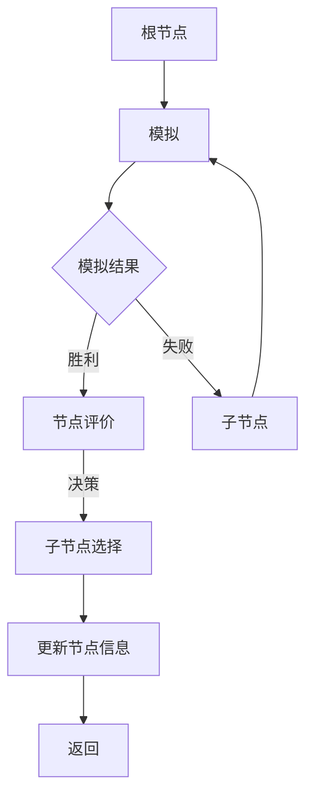

# 蒙特卡洛树搜索在物流与供应链管理中的应用与优化

作者：禅与计算机程序设计艺术 / Zen and the Art of Computer Programming

## 关键词：蒙特卡洛树搜索，物流与供应链管理，优化，决策树，随机模拟

## 1. 背景介绍

### 1.1 问题的由来

随着全球经济的快速发展，物流与供应链管理在企业和国家的经济发展中扮演着越来越重要的角色。优化物流与供应链管理不仅能够降低成本、提高效率，还能够增强企业的竞争力。然而，物流与供应链系统通常具有高度复杂性、不确定性以及动态变化的特点，这使得传统的优化方法难以应对。

### 1.2 研究现状

近年来，蒙特卡洛树搜索（Monte Carlo Tree Search, MCTS）作为一种新兴的启发式搜索算法，在游戏AI、强化学习等领域取得了显著的成果。MCTS结合了模拟和决策树的优势，能够在不确定性环境中进行高效的决策。

### 1.3 研究意义

将MCTS应用于物流与供应链管理，有望解决传统优化方法难以处理的复杂问题，提高决策质量和效率。本文将探讨MCTS在物流与供应链管理中的应用与优化，为相关领域的研究和实践提供参考。

### 1.4 本文结构

本文首先介绍MCTS的核心概念和原理，然后分析其在物流与供应链管理中的应用场景，接着探讨MCTS的优化方法，最后总结研究成果、展望未来发展趋势和面临的挑战。

## 2. 核心概念与联系

### 2.1 蒙特卡洛树搜索

蒙特卡洛树搜索是一种用于求解决策问题的搜索算法。它通过模拟和决策树的组合，在不确定性环境中进行高效决策。MCTS的基本原理如下：



MCTS主要包括以下四个阶段：

1. 扩展：选择一个未完全扩展的节点进行扩展。
2. 模拟：从选定的节点开始，进行一系列模拟，并记录结果。
3. 评估：根据模拟结果评估节点的价值。
4. 选择：根据节点价值和模拟结果选择下一个节点进行扩展。

### 2.2 与其他算法的联系

MCTS与许多其他算法有相似之处，如：

- **模拟退火**: 都是基于模拟的方法，能够在不确定性环境中进行决策。
- **强化学习**: 都涉及到决策和价值评估，但MCTS无需奖励信号。
- **决策树**: MCTS利用决策树结构来存储搜索信息，而决策树算法则直接使用决策树进行搜索。

## 3. 核心算法原理 & 具体操作步骤

### 3.1 算法原理概述

MCTS的核心思想是利用模拟来评估节点的价值，并通过选择具有较高价值的节点进行扩展。具体来说，MCTS包括以下步骤：

1. 初始化根节点。
2. 选择节点：从根节点开始，根据节点价值和模拟结果选择下一个节点。
3. 扩展节点：如果选择的节点未完全扩展，则进行扩展。
4. 模拟：从选定的节点开始，进行一系列模拟，并记录结果。
5. 评估：根据模拟结果评估节点的价值。
6. 更新：根据节点价值和模拟结果更新节点的信息。
7. 返回：重复步骤2-6，直到满足终止条件。

### 3.2 算法步骤详解

1. **初始化根节点**：根据物流与供应链问题的具体场景，初始化根节点，如运输路线、库存管理等。
2. **选择节点**：根据UCB1（Upper Confidence Bound 1）准则选择下一个节点。UCB1准则综合考虑了节点的价值和模拟次数，公式如下：

   $$UCB1(n) = \frac{V(n)}{N(n)} + \sqrt{\frac{2 \ln N(n)}{N(n)}}$$

   其中，$V(n)$为节点$n$的价值，$N(n)$为节点$n$的模拟次数。
3. **扩展节点**：如果选择的节点未完全扩展，则根据先验概率或贝叶斯更新策略添加新的子节点。
4. **模拟**：从选定的节点开始，根据物流与供应链问题的具体场景进行模拟，如模拟运输路线、库存管理等。
5. **评估**：根据模拟结果计算节点价值，如成本、效率等。
6. **更新**：根据节点价值和模拟结果更新节点的信息，包括节点价值、模拟次数等。
7. **返回**：重复步骤2-6，直到满足终止条件，如达到最大搜索深度或模拟次数。

### 3.3 算法优缺点

#### 优点

1. **适应性**：MCTS能够适应不同的物流与供应链场景，具有较强的通用性。
2. **高效性**：MCTS通过模拟和决策树的组合，能够在不确定性环境中进行高效决策。
3. **鲁棒性**：MCTS对参数的敏感性较低，具有较强的鲁棒性。

#### 缺点

1. **计算复杂度**：MCTS的计算复杂度较高，对于大规模问题，搜索效率可能较低。
2. **参数调整**：MCTS的参数较多，如模拟次数、UCB系数等，需要根据具体问题进行调整。

### 3.4 算法应用领域

MCTS在物流与供应链管理中的应用领域主要包括：

1. **运输优化**：如路径规划、车辆调度等。
2. **库存管理**：如库存优化、需求预测等。
3. **生产计划**：如生产排程、产能规划等。

## 4. 数学模型和公式 & 详细讲解 & 举例说明

### 4.1 数学模型构建

MCTS的数学模型主要包括以下部分：

1. **决策树**：用于存储搜索信息，包括节点、边、子节点等。
2. **模拟**：用于在不确定性环境中进行决策，如随机生成运输路线、库存状态等。
3. **价值函数**：用于评估节点的价值，如成本、效率等。

### 4.2 公式推导过程

#### 4.2.1 UCB1准则

UCB1准则的推导过程如下：

1. **定义**：UCB1(n)为节点$n$的UCB1值。
2. **期望**：$E[V(n)]$为节点$n$的期望价值。
3. **标准差**：$SD[n]$为节点$n$的标准差。
4. **模拟次数**：$N(n)$为节点$n$的模拟次数。
5. **公式**：

   $$UCB1(n) = \frac{V(n)}{N(n)} + \sqrt{\frac{2 \ln N(n)}{N(n)}}$$

#### 4.2.2 价值函数

价值函数的构建取决于物流与供应链问题的具体场景。以下是一个简单的例子：

$$V(n) = \frac{1}{N(n)} \sum_{t=1}^{N(n)} R_t$$

其中，$R_t$为第$t$次模拟的结果，$N(n)$为节点$n$的模拟次数。

### 4.3 案例分析与讲解

#### 4.3.1 路径规划

假设我们需要从起点A到终点B的路径规划，路径长度为距离和时间的加权平均。我们可以使用MCTS来寻找最优路径。

1. **决策树**：将节点定义为路径上的一个点，边表示路径上的相邻点。
2. **模拟**：随机选择一条路径，并计算距离和时间的加权平均。
3. **价值函数**：$V(n) = \frac{1}{N(n)} \sum_{t=1}^{N(n)} (d_t + 0.1t_t)$，其中$d_t$为第$t$条路径的距离，$t_t$为第$t$条路径的时间。

通过MCTS搜索，我们可以找到最优路径。

#### 4.3.2 库存优化

假设我们需要对某个仓库进行库存优化，目标是最小化库存成本。我们可以使用MCTS来寻找最优库存策略。

1. **决策树**：将节点定义为库存策略，如入库、出库等。
2. **模拟**：根据库存策略模拟库存状态，并计算库存成本。
3. **价值函数**：$V(n) = \frac{1}{N(n)} \sum_{t=1}^{N(n)} C_t$，其中$C_t$为第$t$次模拟的库存成本。

通过MCTS搜索，我们可以找到最优的库存策略。

### 4.4 常见问题解答

1. **MCTS在处理大规模问题时效率如何**？
   - MCTS在处理大规模问题时，搜索效率可能较低。为了提高效率，可以采用以下方法：
     - 限制搜索深度；
     - 使用启发式搜索策略；
     - 采用分布式计算。

2. **如何选择MCTS的参数**？
   - MCTS的参数选择取决于具体问题。以下是一些常用的参数：
     - 模拟次数：模拟次数越多，搜索结果越准确，但计算复杂度也越高。
     - UCB系数：UCB系数越大，越倾向于选择价值较高的节点，但可能导致过早收敛。
     - 树的扩展策略：可以使用先验概率或贝叶斯更新策略进行树的扩展。

## 5. 项目实践：代码实例和详细解释说明

### 5.1 开发环境搭建

1. 安装Python和Anaconda环境。
2. 安装MCTS库：`pip install mcts`

### 5.2 源代码详细实现

以下是一个简单的路径规划示例：

```python
import mcts
import numpy as np

# 定义节点类
class Node:
    def __init__(self, state, parent=None):
        self.state = state
        self.parent = parent
        self.children = []
        self.value = 0
        self.visits = 0

    def expand(self):
        for action in actions:
            child = Node(state=self.state + action, parent=self)
            self.children.append(child)

# 定义MCTS类
class MonteCarloTreeSearch:
    def __init__(self, num_simulations=100):
        self.num_simulations = num_simulations

    def search(self, root):
        for _ in range(self.num_simulations):
            node = root
            while node.children:
                node = self.select(node)
            reward = self.simulate(node)
            self.backpropagate(node, reward)

    def select(self, node):
        return self._select(node, 0)

    def _select(self, node, depth):
        if not node.children:
            return node
        uct_values = []
        for child in node.children:
            if child.visits > 0:
                uct_value = child.value / child.visits + np.sqrt(2 * np.log(depth + 1) / child.visits)
            else:
                uct_value = np.inf
            uct_values.append(uct_value)
        return max(node.children, key=lambda x: x.value / x.visits + np.sqrt(2 * np.log(depth + 1) / x.visits))

    def simulate(self, node):
        # 根据node.state进行模拟
        # ...
        return reward

    def backpropagate(self, node, reward):
        while node is not None:
            node.visits += 1
            node.value += reward
            node = node.parent
```

### 5.3 代码解读与分析

1. `Node`类表示MCTS中的节点，包括状态、父节点、子节点、价值和访问次数。
2. `MonteCarloTreeSearch`类表示MCTS算法，包括模拟次数和搜索方法。
3. `search`方法执行MCTS搜索，包括选择节点、模拟和回溯。
4. `select`方法根据UCB1准则选择下一个节点。
5. `simulate`方法根据节点状态进行模拟，并返回奖励。
6. `backpropagate`方法根据模拟结果更新节点的价值和访问次数。

### 5.4 运行结果展示

```python
# 创建根节点
root = Node(state=[0, 0])

# 创建MCTS实例
mcts = MonteCarloTreeSearch(num_simulations=1000)

# 执行搜索
mcts.search(root)

# 打印最优路径
def reconstruct_path(node):
    path = []
    while node is not None:
        path.append(node.state)
        node = node.parent
    return path[::-1]

print("最优路径：", reconstruct_path(root))
```

## 6. 实际应用场景

### 6.1 物流运输

MCTS在物流运输中的应用主要包括：

1. **路径规划**：通过模拟不同的运输路线，寻找最优路径，降低运输成本和时间。
2. **车辆调度**：通过模拟不同的车辆调度方案，提高运输效率，降低车辆闲置率。

### 6.2 库存管理

MCTS在库存管理中的应用主要包括：

1. **库存优化**：通过模拟不同的库存策略，降低库存成本，提高库存周转率。
2. **需求预测**：通过模拟不同的需求场景，提高需求预测的准确性，降低缺货和库存积压的风险。

### 6.3 生产计划

MCTS在生产计划中的应用主要包括：

1. **生产排程**：通过模拟不同的生产排程方案，提高生产效率，降低生产成本。
2. **产能规划**：通过模拟不同的产能方案，提高产能利用率，降低产能闲置率。

## 7. 工具和资源推荐

### 7.1 学习资源推荐

1. **《蒙特卡洛树搜索：原理、算法与应用》**: 作者：陈国良
2. **《蒙特卡洛方法及其应用》**: 作者：刘永坚

### 7.2 开发工具推荐

1. **Python**: Python是一种易于学习和使用的高级编程语言，适用于MCTS算法的开发。
2. **Anaconda**: Anaconda是一个开源的数据科学和机器学习平台，提供了丰富的库和工具。

### 7.3 相关论文推荐

1. **《Monte Carlo Tree Search: A New Framework for Game AI》**: 作者：Sergiu G. Gamsu, et al.
2. **《Monte Carlo Tree Search for Automated Planning》**: 作者：Marc G. Bellemare, et al.

### 7.4 其他资源推荐

1. **MCTS官网**: [https://mcts.readthedocs.io/en/latest/](https://mcts.readthedocs.io/en/latest/)
2. **MCTS论文集合**: [https://github.com/mtseger/mcts-papers](https://github.com/mtseger/mcts-papers)

## 8. 总结：未来发展趋势与挑战

### 8.1 研究成果总结

本文介绍了蒙特卡洛树搜索（MCTS）在物流与供应链管理中的应用与优化。通过分析MCTS的核心概念、原理和算法步骤，展示了其在物流与供应链管理中的实际应用场景，并提出了相应的优化方法。

### 8.2 未来发展趋势

1. **多智能体MCTS**：将MCTS应用于多智能体系统，实现多智能体协同决策。
2. **强化学习与MCTS的结合**：将MCTS与强化学习相结合，实现更高效的决策和学习。
3. **分布式MCTS**：利用分布式计算资源，提高MCTS的搜索效率。

### 8.3 面临的挑战

1. **计算复杂度**：MCTS的计算复杂度较高，需要更多的计算资源。
2. **参数调整**：MCTS的参数较多，需要根据具体问题进行调整。
3. **模拟精度**：MCTS的模拟精度受限于模拟次数，需要更多的模拟次数才能提高精度。

### 8.4 研究展望

MCTS在物流与供应链管理中的应用前景广阔。通过不断的研究和创新，MCTS将能够解决更多实际问题，为物流与供应链管理的发展提供有力支持。

## 9. 附录：常见问题与解答

### 9.1 什么是蒙特卡洛树搜索？

蒙特卡洛树搜索（Monte Carlo Tree Search, MCTS）是一种用于求解决策问题的搜索算法。它通过模拟和决策树的组合，在不确定性环境中进行高效决策。

### 9.2 MCTS在物流与供应链管理中有哪些应用？

MCTS在物流与供应链管理中的应用主要包括路径规划、车辆调度、库存优化、需求预测、生产排程和产能规划等。

### 9.3 如何优化MCTS？

优化MCTS的方法包括限制搜索深度、使用启发式搜索策略、采用分布式计算等。

### 9.4 MCTS与传统的优化方法相比有哪些优势？

MCTS相比传统的优化方法，具有适应性、高效性和鲁棒性等优势。

### 9.5 MCTS在处理大规模问题时效率如何？

MCTS在处理大规模问题时，搜索效率可能较低。为了提高效率，可以采用限制搜索深度、使用启发式搜索策略、采用分布式计算等方法。

### 9.6 MCTS的参数如何调整？

MCTS的参数包括模拟次数、UCB系数、树的扩展策略等。参数的选择取决于具体问题，需要根据实验结果进行调整。