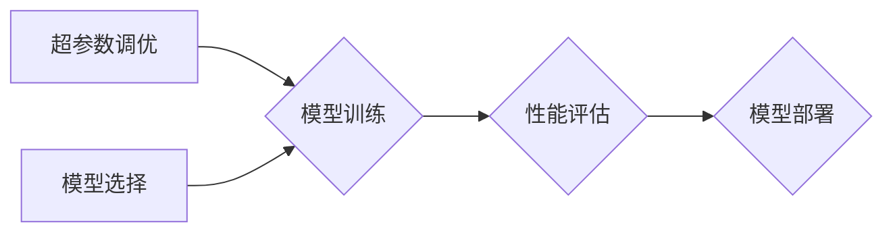

# 超参数调优与模型选择原理与代码实战案例讲解

关键词：超参数调优、模型选择、机器学习、深度学习、贝叶斯优化、网格搜索、随机搜索、自动机器学习

## 1. 背景介绍
### 1.1  问题的由来
在机器学习和深度学习的建模过程中,超参数的选择和模型结构的设计对最终模型性能有着至关重要的影响。然而,手动调试超参数和尝试不同模型结构往往非常耗时耗力,需要大量的人工试错和经验积累。如何高效地进行超参数调优和模型选择,成为一个亟待解决的问题。

### 1.2  研究现状 
目前,超参数调优和模型选择主要有以下几类方法:

1. 手动调试:依靠人工经验,手动尝试不同的超参数组合和模型结构,并根据结果不断调整,直到获得满意的性能。这种方法灵活性高,但非常依赖个人经验,效率低下。

2. 网格搜索(Grid Search):在预设的超参数取值范围内,穷举所有可能的组合,逐一评估模型性能,最终选择表现最优的超参数组合。网格搜索通过暴力枚举,可以找到最优解,但计算量随维度指数级增长。

3. 随机搜索(Random Search):在超参数取值范围内,随机采样一定数量的超参数组合,评估模型性能,选择表现最优的作为最终结果。相比网格搜索,随机搜索以更少的计算量,在更大的参数空间内找到接近最优的解。

4. 贝叶斯优化(Bayesian Optimization):建立超参数与模型性能之间的概率模型(高斯过程),通过不断地在贝叶斯后验中选择下一组最有潜力的超参数进行评估,更新概率模型,逐步逼近最优解。贝叶斯优化兼顾了探索和利用,以相对较少的尝试次数找到全局最优。

5. 类遗传算法(Evolutionary Algorithms):借鉴生物进化论,通过变异、交叉、选择等操作,不断迭代进化超参数种群,最终得到性能最优的超参数组合。

6. 强化学习(Reinforcement Learning):将超参数调优看作一个序贯决策过程,通过学习一个调优策略,在探索和利用间权衡,实现自动调优。

7. 元学习(Meta-Learning):从历史任务中学习并转移知识,指导新任务上的超参数优化和快速适应。

目前,学术界和工业界针对超参数调优和模型选择已经展开了广泛研究,提出了一系列高效的算法。但现有方法仍面临着计算成本高、泛化能力不足等挑战,亟需更多的理论和技术创新。

### 1.3  研究意义
高效的超参数调优和模型选择技术具有重要意义:

1. 提升建模效率:自动化的调优方法可以显著减少手工调试的时间成本,提高建模效率,让研究人员和工程师将更多精力投入在其他核心工作中。

2. 改进模型性能:优化的超参数配置和模型结构能够充分挖掘算法潜力,显著提升模型性能,在学术竞赛和工业部署中取得更优异的结果。

3. 扩大应用范围:自动化的调优工具降低了机器学习的使用门槛,使得非专业人士也能轻松尝试不同算法,将机器学习应用到更广泛的领域。

4. 探索未知空间:高效的调优策略使得我们能够在更大的超参数空间中探索,发现新的最优配置,突破人工调试的局限性,创造出更出色的模型。

5. 理论价值:对超参数调优和模型选择的研究,有助于加深我们对机器学习本质的理解,为进一步完善学习理论提供新的视角。

### 1.4  本文结构
本文将全面探讨超参数调优与模型选择的原理和实践。内容安排如下:

第2部分介绍超参数调优与模型选择涉及的核心概念。

第3部分重点讲解几种主流的超参数调优算法,并给出具体操作步骤。

第4部分从理论层面对相关数学模型和公式进行推导和讲解,并辅以案例帮助理解。

第5部分通过代码实例,演示超参数调优的实战过程。

第6部分讨论超参数调优和模型选择技术在实际场景中的应用情况。

第7部分推荐一些有助于入门和深入理解的学习资源。

第8部分总结全文,并对未来的发展趋势和挑战进行展望。

第9部分附录,解答一些常见问题。

## 2. 核心概念与联系

在开始详细探讨之前,我们有必要先明确几个核心概念:

- 超参数(Hyperparameter):机器学习算法在训练前设定的参数,并不在训练过程中被优化,如学习率、正则化系数、树的深度等。最优超参数的选择需要通过反复试错,对模型性能有决定性影响。

- 模型选择(Model Selection):在给定任务上,从一系列候选模型中选择性能最优的模型。模型选择的目标是权衡模型复杂度和性能,避免过拟合和欠拟合。常见的模型选择方法有交叉验证、Bootstrap等。

- 验证集(Validation Set):将完整数据划分为训练集、验证集和测试集。验证集不参与模型训练,仅用于评估不同超参数/模型下的性能,为超参数调优和模型选择提供依据。

- 泛化性能(Generalization Performance):模型在独立测试集上的性能,反映了模型对新样本的预测能力。泛化性能是超参数调优和模型选择的终极目标。

- 搜索空间(Search Space):超参数取值的范围。搜索空间决定了超参数优化的难度。连续参数的搜索空间是无穷的,而离散参数的搜索空间是有限的组合。

- 目标函数(Objective Function):将超参数映射到模型性能的函数。通常无法显式表达,只能通过训练模型获得其函数值(如验证集误差)。目标函数昂贵且含噪声,需要高效的优化算法。

超参数调优与模型选择是紧密相关的。二者的共同目标是寻找最优模型,区别在于前者调整的是同一模型家族内的参数,如SVM的C和$\gamma$,而后者需要在不同模型间进行选择,如决策树、SVM、神经网络等。从更广义上讲,模型选择也可以看作一种特殊的超参数优化,即将模型类型/结构也当作一种超参数。二者在算法思路上也有诸多相通之处。

## 3. 核心算法原理 & 具体操作步骤
### 3.1  算法原理概述
常见的超参数调优算法可以分为以下几类:

1. 穷举搜索:网格搜索和随机搜索。这类算法通过系统地尝试参数空间内的不同组合,选择验证集性能最优的配置。优点是原理简单,易于实现和并行化;缺点是计算成本高,难以处理高维和连续的搜索空间。

2. 基于模型:贝叶斯优化。这类算法通过学习目标函数的近似模型(代理模型),来指导下一步的搜索方向。优点是以较少的评估次数找到全局最优;缺点是对目标函数的假设可能不准确,优化难度大。

3. 启发式搜索:遗传算法等进化算法。这类算法模仿生物进化,通过种群的迭代优化逼近最优解。优点是适用于非连续、非凸、多峰的搜索空间;缺点是算法实现复杂,计算成本高。

4. 元学习:从历史任务上学习超参数与性能间的映射关系,指导新任务的优化。优点是可显著提高优化效率;缺点是需要足够多的相关历史任务作为先验知识。

不同类型的算法各有优劣,适用于不同的场景。实践中需要根据任务特点和计算资源权衡选择。此外,不同算法之间也可以互相结合,如贝叶斯优化+元学习,进一步提升性能。

### 3.2  算法步骤详解
以下我们以网格搜索、随机搜索、贝叶斯优化为例,详细讲解其算法步骤。

#### 3.2.1 网格搜索
网格搜索的基本步骤如下:
1. 确定待调超参数及其取值范围和粒度,形成m维离散搜索空间
2. 将搜索空间中的所有n个参数组合逐一列举出来,形成n个待评估的配置
3. 对每一个配置,训练模型并在验证集上评估性能,记录其性能分数
4. 选择性能分数最高的配置作为最终的超参数组合

可以看出,网格搜索采取的是暴力穷举策略,系统地覆盖了整个搜索空间。这种做法的优点是conceptually simple,容易实现和并行化,一定能找到搜索空间内的最优解。但其缺点也很明显:计算成本随维度呈指数级增长,难以应用于高维连续空间。此外,网格搜索容易受到粒度选择的影响,粒度太粗可能错过最优解,粒度太细又会显著增加计算量。

#### 3.2.2 随机搜索
随机搜索的思路是:从搜索空间中随机采样一定数量的配置进行评估,而不是遍历所有的组合。具体步骤为:
1. 确定待调超参数的取值范围,形成m维搜索空间(可以是离散的,也可以是连续的)
2. 指定随机采样的数量n(通常远小于搜索空间的大小)
3. 从搜索空间中随机采样n个配置
4. 对每一个配置,训练模型并在验证集上评估性能,记录其性能分数
5. 选择性能分数最高的配置作为最终的超参数组合

随机搜索通过随机采样,在一定程度上克服了网格搜索的维度灾难。特别地,对于低有效维度(对性能影响显著)的问题,随机搜索能以更少的计算资源,覆盖更大的搜索空间,更有可能找到接近最优的解。理论和实践都表明,随机搜索常常优于网格搜索。但随机搜索本质上仍是一种盲目搜索,没有利用先前的评估信息来指导后续的探索,效率有待进一步提高。

#### 3.2.3 贝叶斯优化 
贝叶斯优化利用了先前的评估结果,学习目标函数的近似模型(高斯过程),并用它指导下一步的探索方向。算法如下:
1. 给定搜索空间和目标函数(如验证集误差)
2. 初始化高斯过程模型,评估少量随机采样的参数配置
3. 循环执行以下步骤,直到满足预算或性能要求:
   a) 基于当前的高斯过程后验,选择一组最有潜力的新配置(如maximizing acquisition function)  
   b) 评估新配置的性能,将结果加入已评估集合中
   c) 更新高斯过程模型
4. 返回已评估的最优配置

贝叶斯优化的核心是高斯过程和acquisition function。高斯过程能够拟合出目标函数的后验分布,反映了我们对真实函数的不确定性。而acquisition function则将后验分布映射为一个值,指示了下一个最有潜力的采样点,常见的有Expected Improvement、Upper Confidence Bound等。贝叶斯优化在探索和利用(exploration and exploitation)之间权衡,以相对较少的尝试次数逼近全局最优。

### 3.3  算法优缺点
1. 网格搜索:
   - 优点:简单,易于实现和并行化,对离散搜索空间有效
   - 缺点:计算成本高,难以应用于高维连续空间,受粒度选择影响大
2. 随机搜索:  
   - 优点:相比网格搜索,以更少的计算资源覆盖更