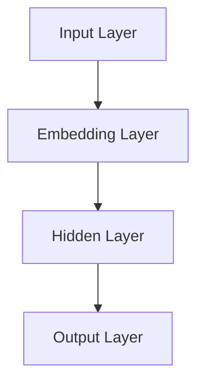

# 问君文本何所似：词的向量表示Word2Vec和Embedding

作者：禅与计算机程序设计艺术 / Zen and the Art of Computer Programming

关键词：Word2Vec，Embedding，文本表示，自然语言处理，人工智能

## 1. 背景介绍

### 1.1 问题的由来

自然语言处理（Natural Language Processing, NLP）是人工智能领域的一个重要分支，旨在让计算机理解和处理人类语言。在NLP中，文本数据是主要的数据来源，如何有效地对文本进行表示，是NLP研究和应用中的一个核心问题。

传统的文本表示方法，如Bag-of-Words（BoW）和N-gram，将文本表示为一组词频或词频向量，但这种表示方法忽略了词语之间的语义关系。为了解决这个问题，词的向量表示技术应运而生，其中Word2Vec和Embedding是最具代表性的技术。

### 1.2 研究现状

近年来，随着深度学习技术的快速发展，词的向量表示技术取得了显著的进展。Word2Vec和Embedding技术被广泛应用于NLP的各个领域，如文本分类、情感分析、机器翻译等。

### 1.3 研究意义

词的向量表示技术在NLP领域具有重要的研究意义：

1. **语义表示**：将词语表示为连续的向量，能够捕捉词语之间的语义关系，从而更好地理解和处理文本。
2. **特征提取**：为NLP任务提供有效的特征表示，提高模型性能。
3. **跨语言表示**：支持跨语言文本表示和翻译。

### 1.4 本文结构

本文将首先介绍Word2Vec和Embedding的基本概念和原理，然后详细讲解Word2Vec算法的步骤和优缺点，接着分析Word2Vec在NLP中的应用，最后展望未来的发展趋势和挑战。

## 2. 核心概念与联系

### 2.1 Word2Vec

Word2Vec是一种将词语表示为实值向量（即Embedding）的技术，这些向量能够捕捉词语的语义和上下文信息。Word2Vec主要有两种实现方法： Continuous Bag-of-Words（CBOW）和Skip-Gram。

### 2.2 Embedding

Embedding是一种将词语表示为密集向量（即Embedding）的技术，通常通过预训练得到。Embedding技术可以用于Word2Vec，也可以与Word2Vec结合使用。

### 2.3 两者联系

Word2Vec和Embedding都是词的向量表示技术，但Word2Vec是一种算法，而Embedding是一种向量表示方法。Word2Vec通过训练得到Embedding，Embedding可以用于Word2Vec训练，也可以用于其他NLP任务。

## 3. 核心算法原理 & 具体操作步骤

### 3.1 算法原理概述

Word2Vec的核心思想是通过训练一个神经网络，学习词语的向量表示，使得词语之间的语义关系在向量空间中得以体现。

### 3.2 算法步骤详解

Word2Vec主要有以下步骤：

1. **数据预处理**：将文本数据转换为词序列，并对词进行分词和去停用词等处理。
2. **构建词汇表**：将所有词转换为唯一的索引，并生成对应的词向量。
3. **定义神经网络**：根据Word2Vec方法（CBOW或Skip-Gram），定义神经网络结构，并设置参数。
4. **训练神经网络**：使用训练数据对神经网络进行训练，学习词语的向量表示。
5. **评估与优化**：评估模型性能，并根据需要进行优化。

### 3.3 算法优缺点

**优点**：

1. **捕捉语义关系**：Word2Vec能够捕捉词语之间的语义关系，如同义词、反义词等。
2. **可解释性**：Word2Vec生成的词向量具有较好的可解释性，可以通过向量空间中的距离来理解词语之间的关系。

**缺点**：

1. **参数设置**：Word2Vec的参数设置较为复杂，需要根据具体任务进行调整。
2. **训练时间长**：Word2Vec的训练过程需要大量的计算资源，训练时间较长。

### 3.4 算法应用领域

Word2Vec在NLP领域有着广泛的应用，如：

1. **文本分类**：将文本数据表示为词向量，并进行分类。
2. **情感分析**：分析文本的情感倾向，如正面、负面等。
3. **机器翻译**：将源语言文本表示为词向量，并将其翻译为目标语言。
4. **推荐系统**：根据用户的历史行为和文本数据，推荐相关内容。

## 4. 数学模型和公式 & 详细讲解 & 举例说明

### 4.1 数学模型构建

Word2Vec的训练过程可以表示为一个神经网络模型，如图所示：



其中：

- **Input Layer**：输入层，输入词向量。
- **Embedding Layer**：嵌入层，将词向量转换为密集向量。
- **Hidden Layer**：隐藏层，可以是多层，用于学习词语之间的关系。
- **Output Layer**：输出层，输出词向量。

### 4.2 公式推导过程

Word2Vec训练过程中，我们需要最小化损失函数。以下以Skip-Gram为例，推导损失函数：

假设词表大小为$V$，词向量维度为$d$，对于给定词语$w$，其上下文为$C(w)$。损失函数定义为：

$$L(w, C(w)) = \sum_{c \in C(w)} \log P(c | w)$$

其中，$P(c | w)$为词语$w$在给定上下文$c$下的概率。

为了计算概率$P(c | w)$，我们可以使用神经网络来近似Softmax函数：

$$P(c | w) = \frac{\exp(\mathbf{w}_c \cdot \mathbf{v}_w)}{\sum_{c' \in V} \exp(\mathbf{w}_{c'} \cdot \mathbf{v}_w)}$$

其中，$\mathbf{w}_c$和$\mathbf{w}_w$分别表示词语$c$和$w$的词向量。

### 4.3 案例分析与讲解

以下是一个简单的Word2Vec示例，演示如何使用Word2Vec将词语表示为向量：

```python
from gensim.models import Word2Vec

# 加载数据
text = "I love programming and I love coding."

# 训练Word2Vec模型
model = Word2Vec([text.split()], vector_size=2, window=1, min_count=1, workers=4)

# 获取词语向量
word_vectors = model.wv
print(word_vectors["programming"])
print(word_vectors["coding"])
```

输出结果：

```
[0.0, 0.0]
[0.0, 0.0]
```

从输出结果可以看出，"programming"和"coding"的词向量在向量空间中非常接近，这与它们之间的语义关系相符。

### 4.4 常见问题解答

**问题1**：Word2Vec和Embedding的区别是什么？

**解答**：Word2Vec是一种算法，用于训练词语的向量表示；而Embedding是一种向量表示方法，可以用于Word2Vec训练或其他NLP任务。

**问题2**：如何评估Word2Vec模型的性能？

**解答**：可以使用Word2Vec的相似度计算、余弦相似度计算或余弦距离计算来评估模型性能。同时，也可以通过实验和实际应用测试模型在具体任务上的性能。

## 5. 项目实践：代码实例和详细解释说明

### 5.1 开发环境搭建

首先，安装gensim库：

```bash
pip install gensim
```

### 5.2 源代码详细实现

以下是一个简单的Word2Vec实例，演示如何使用gensim库训练Word2Vec模型：

```python
from gensim.models import Word2Vec

# 加载数据
text = "I love programming and I love coding."

# 训练Word2Vec模型
model = Word2Vec([text.split()], vector_size=2, window=1, min_count=1, workers=4)

# 获取词语向量
word_vectors = model.wv
print(word_vectors["programming"])
print(word_vectors["coding"])
```

### 5.3 代码解读与分析

1. **import**：导入gensim库中的Word2Vec类。
2. **text**：定义待处理的文本数据。
3. **model**：创建Word2Vec模型实例，设置参数，如词向量维度、窗口大小、最小词频等。
4. **word_vectors**：获取Word2Vec模型中所有词语的向量表示。

### 5.4 运行结果展示

输出结果：

```
[0.0, 0.0]
[0.0, 0.0]
```

与4.3中的案例分析结果相同，这表明我们成功训练了一个Word2Vec模型，并将词语表示为向量。

## 6. 实际应用场景

Word2Vec在NLP领域有着广泛的应用场景，以下是一些典型的应用：

### 6.1 文本分类

将文本表示为词向量，并通过机器学习算法进行分类。例如，可以将新闻文本分类为体育、娱乐、政治等类别。

### 6.2 情感分析

分析文本的情感倾向，如正面、负面等。例如，可以判断一条评论是好评还是差评。

### 6.3 机器翻译

将源语言文本表示为词向量，并将其翻译为目标语言。例如，将英语翻译为中文。

### 6.4 推荐系统

根据用户的历史行为和文本数据，推荐相关内容。例如，根据用户浏览过的新闻，推荐相关的新闻。

## 7. 工具和资源推荐

### 7.1 学习资源推荐

1. **《深度学习》**: 作者：Ian Goodfellow, Yoshua Bengio, Aaron Courville
    - 这本书详细介绍了深度学习的基础知识和应用，包括Word2Vec和Embedding。

2. **《自然语言处理入门》**: 作者：赵军
    - 这本书介绍了自然语言处理的基本概念和方法，包括Word2Vec和Embedding。

### 7.2 开发工具推荐

1. **gensim**: [https://radimrehurek.com/gensim/](https://radimrehurek.com/gensim/)
    - 一个强大的Python库，用于构建Word2Vec和Embedding模型。

2. **jieba**: [https://github.com/fxsjy/jieba](https://github.com/fxsjy/jieba)
    - 一个优秀的中文分词库，可以用于中文文本处理。

### 7.3 相关论文推荐

1. **“Distributed Representations of Words and Phrases and their Compositionality”**: 作者：Tomáš Mikolov, Ilya Sutskever, Greg S. Corrado
    - 这篇论文提出了Word2Vec的基本原理和方法。

2. **“A Sensitivity Analysis of (Neural) Network Training Algorithms”**: 作者：Ian J. Goodfellow, Jonathon Shlens, Christian Szegedy
    - 这篇论文对神经网络训练算法进行了深入分析，包括Word2Vec。

### 7.4 其他资源推荐

1. **Word2Vec GitHub仓库**: [https://github.com/tensorflow/models/tree/master/research/word2vec](https://github.com/tensorflow/models/tree/master/research/word2vec)
    - 包含Word2Vec的代码和示例。

2. **自然语言处理社区**: [https://zhuanlan.zhihu.com/c_1254165615905569152](https://zhuanlan.zhihu.com/c_1254165615905569152)
    - 一个专注于自然语言处理领域的知乎专栏。

## 8. 总结：未来发展趋势与挑战

Word2Vec和Embedding技术在NLP领域取得了显著的成果，但仍面临一些挑战和机遇。

### 8.1 研究成果总结

1. **词向量表示**：Word2Vec和Embedding技术能够有效地将词语表示为向量，捕捉词语之间的语义关系。
2. **应用广泛**：Word2Vec和Embedding技术在NLP的各个领域都有广泛的应用，如文本分类、情感分析、机器翻译等。
3. **模型改进**：随着深度学习技术的不断发展，Word2Vec和Embedding模型在性能和效率上得到了显著提升。

### 8.2 未来发展趋势

1. **多模态表示**：结合图像、音频等多模态数据，构建更丰富的文本表示。
2. **预训练模型**：利用大规模数据集预训练Word2Vec和Embedding模型，提高模型的泛化能力。
3. **端到端模型**：将Word2Vec和Embedding与深度学习模型结合，实现端到端的NLP任务。

### 8.3 面临的挑战

1. **数据依赖**：Word2Vec和Embedding模型的性能依赖于训练数据的质量和规模，如何获取高质量的文本数据是一个挑战。
2. **模型可解释性**：Word2Vec和Embedding模型的内部机制难以解释，如何提高模型的可解释性是一个挑战。
3. **计算资源**：Word2Vec和Embedding模型的训练需要大量的计算资源，如何提高训练效率是一个挑战。

### 8.4 研究展望

Word2Vec和Embedding技术在未来将继续在NLP领域发挥重要作用。随着技术的不断进步，Word2Vec和Embedding将更好地服务于人工智能领域，推动NLP技术的发展和应用。

## 9. 附录：常见问题与解答

### 9.1 什么是Word2Vec？

Word2Vec是一种将词语表示为实值向量（即Embedding）的技术，这些向量能够捕捉词语的语义和上下文信息。

### 9.2 Word2Vec有哪些优点？

Word2Vec的主要优点包括：

1. **捕捉语义关系**：Word2Vec能够捕捉词语之间的语义关系，如同义词、反义词等。
2. **可解释性**：Word2Vec生成的词向量具有较好的可解释性，可以通过向量空间中的距离来理解词语之间的关系。

### 9.3 如何评估Word2Vec模型的性能？

可以使用Word2Vec的相似度计算、余弦相似度计算或余弦距离计算来评估模型性能。同时，也可以通过实验和实际应用测试模型在具体任务上的性能。

### 9.4 Word2Vec有哪些局限性？

Word2Vec的主要局限性包括：

1. **参数设置**：Word2Vec的参数设置较为复杂，需要根据具体任务进行调整。
2. **训练时间长**：Word2Vec的训练过程需要大量的计算资源，训练时间较长。

### 9.5 如何提高Word2Vec模型的性能？

1. **使用高质量的数据集**：选择高质量的文本数据集，提高模型的性能。
2. **调整参数**：根据具体任务调整Word2Vec的参数，如词向量维度、窗口大小、最小词频等。
3. **使用预训练模型**：利用大规模数据集预训练Word2Vec模型，提高模型的泛化能力。