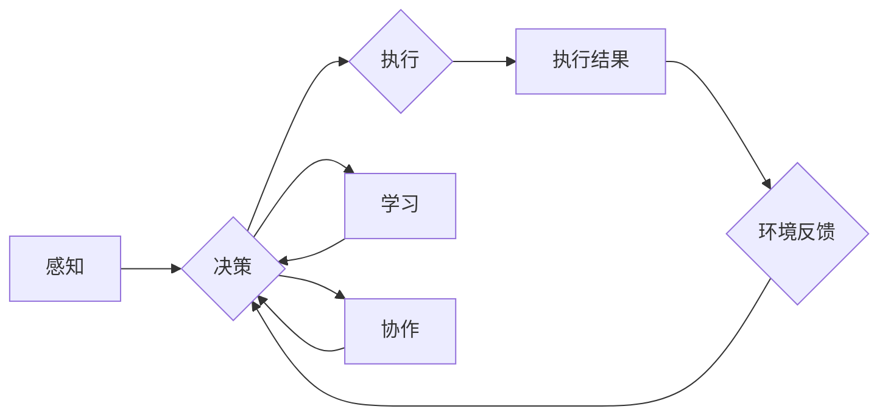

# AI Agent 智能体

## 1. 背景介绍

### 1.1 问题的由来

人工智能（AI）自诞生以来，就承载着人类创造智能机器的愿景。从早期的专家系统到如今的深度学习，AI技术取得了长足的进步。然而，长期以来，AI系统在处理复杂、动态环境时的表现仍然有限。如何让AI具备更强的自主性、适应性和协同能力，成为了当前AI研究的热点问题。

在这种情况下，AI Agent应运而生。Agent是一种能够感知环境、执行行为、并与其他Agent进行交互的智能实体。它被视为构建智能系统的基石，为AI在复杂环境中的自适应、自主和协作提供了可能。

### 1.2 研究现状

近年来，AI Agent研究取得了显著进展。主要研究方向包括：

- **基于规则的Agent**：通过预设的规则库，使Agent具备简单的决策能力。这类Agent适用于结构化、规则明确的环境。
- **基于模型的学习Agent**：利用机器学习算法，使Agent通过学习环境数据，不断优化自身决策策略。这类Agent适用于具有数据支持的环境。
- **基于强化学习的Agent**：通过与环境交互，学习最优策略，使Agent在复杂环境中取得最佳表现。这类Agent适用于动态、不确定的环境。

### 1.3 研究意义

AI Agent研究具有重要的理论意义和应用价值：

- **理论意义**：推动AI领域从符号推理走向数据驱动，丰富AI的理论体系，为构建具有自主性的智能系统提供新的思路。
- **应用价值**：AI Agent在智能交通、智能机器人、智能客服、智能金融等领域具有广泛的应用前景，为解决复杂问题、提高效率提供有力支撑。

### 1.4 本文结构

本文将从以下几个方面对AI Agent进行探讨：

- 核心概念与联系
- 核心算法原理与具体操作步骤
- 数学模型与公式
- 项目实践
- 实际应用场景
- 工具和资源推荐
- 总结与展望

## 2. 核心概念与联系

为了更好地理解AI Agent，我们需要掌握以下几个核心概念：

- **感知**：Agent获取环境信息的手段，如传感器、摄像头、麦克风等。
- **决策**：Agent根据感知到的信息，选择合适的行动策略。
- **执行**：Agent执行所选的行动策略，并产生结果。
- **学习**：Agent根据执行结果和环境反馈，调整自身决策策略。
- **协作**：多个Agent之间通过通信和交互，共同完成任务。

这些概念之间的联系可以用以下流程图表示：



## 3. 核心算法原理 & 具体操作步骤

### 3.1 算法原理概述

AI Agent的核心算法主要包括以下几个方面：

- **感知算法**：用于从环境中提取有用信息，如图像识别、语音识别等。
- **决策算法**：根据感知到的信息，选择合适的行动策略，如基于规则、基于模型学习、基于强化学习等。
- **执行算法**：将决策结果转化为实际行动，如控制机器人运动、发送消息等。
- **学习算法**：根据执行结果和环境反馈，优化Agent的决策策略。
- **协作算法**：实现多个Agent之间的通信和交互。

### 3.2 算法步骤详解

以下以基于强化学习的Agent为例，介绍其具体操作步骤：

1. **定义环境**：描述Agent所处的环境，包括状态空间、动作空间、奖励函数等。
2. **选择算法**：选择合适的强化学习算法，如Q-learning、Sarsa等。
3. **初始化**：初始化Agent的状态、策略等参数。
4. **运行循环**：
    - **感知**：从环境中获取当前状态。
    - **决策**：根据当前状态，选择一个动作。
    - **执行**：执行所选动作，并获取执行结果和奖励。
    - **学习**：根据执行结果和奖励，更新策略参数。
    - **返回**：返回到步骤2，继续进行下一步。
5. **评估**：评估Agent的学习效果，如平均奖励、收敛速度等。

### 3.3 算法优缺点

- **优点**：
  - 灵活性：适用于各种复杂环境。
  - 自适应性：能够根据环境变化调整自身策略。
  - 智能性：能够学习并优化自身行为。

- **缺点**：
  - 训练时间长：需要大量数据和计算资源。
  - 稳定性：在某些情况下，强化学习算法可能陷入局部最优。
  - 难以解释：强化学习算法的决策过程难以解释。

### 3.4 算法应用领域

基于强化学习的Agent在以下领域具有广泛的应用前景：

- **智能机器人**：如自动驾驶、自主导航、无人搬运等。
- **游戏AI**：如电子竞技、棋类游戏等。
- **智能客服**：如智能客服机器人、虚拟助手等。
- **智能金融**：如量化投资、风险评估等。

## 4. 数学模型与公式

### 4.1 数学模型构建

以下以Q-learning算法为例，介绍其数学模型构建：

- **状态空间**：$\mathcal{S}$，所有可能的状态集合。
- **动作空间**：$\mathcal{A}$，所有可能动作集合。
- **策略函数**：$\pi(s)$，表示在状态s下选择动作a的概率。
- **Q值函数**：$Q(s,a)$，表示在状态s下执行动作a，并遵循策略$\pi$获得的最大预期奖励。
- **奖励函数**：$R(s,a)$，表示在状态s下执行动作a获得的即时奖励。

### 4.2 公式推导过程

以下给出Q-learning算法的核心公式：

- **Q值更新**：$Q(s,a) \leftarrow Q(s,a) + \alpha [R(s,a) + \gamma \max_{a'} Q(s',a') - Q(s,a)]$

其中，$\alpha$为学习率，$\gamma$为折扣因子。

### 4.3 案例分析与讲解

以下以一个简单的迷宫为例，介绍Q-learning算法的原理和步骤：

- **环境**：一个4x4的迷宫，起点在左上角，终点在右下角，障碍物在中间。
- **状态空间**：所有可能的位置。
- **动作空间**：向左、向右、向上、向下移动。
- **奖励函数**：到达终点获得10分，否则获得0分。
- **学习率**：$\alpha=0.1$
- **折扣因子**：$\gamma=0.9$

初始时，所有Q值均为0。经过多次探索和重复，Agent最终能够找到到达终点的最优路径。

### 4.4 常见问题解答

**Q1：什么是折扣因子？**

A：折扣因子$\gamma$用于衡量未来奖励的现值。$\gamma$的取值范围在0到1之间，$\gamma$越接近1，未来奖励的现值越高。

**Q2：什么是学习率？**

A：学习率$\alpha$用于控制Q值更新的步长。$\alpha$的取值范围在0到1之间，$\alpha$越接近1，Q值更新速度越快。

**Q3：Q-learning算法适用于所有环境吗？**

A：Q-learning算法适用于具有稳定环境的强化学习问题。对于具有随机性的环境，可能需要使用其他算法，如Sarsa。

## 5. 项目实践：代码实例和详细解释说明

### 5.1 开发环境搭建

以下以Python为例，介绍如何搭建开发环境：

1. 安装Python 3.6及以上版本。
2. 安装PyTorch：`pip install torch torchvision torchaudio`
3. 安装OpenAI Gym：`pip install gym`

### 5.2 源代码详细实现

以下是一个基于PyTorch和OpenAI Gym的Q-learning算法示例：

```python
import gym
import torch
import torch.nn as nn
import torch.optim as optim

# 定义环境
env = gym.make('CartPole-v0')

# 定义Q值网络
class QNetwork(nn.Module):
    def __init__(self, state_dim, action_dim):
        super(QNetwork, self).__init__()
        self.fc1 = nn.Linear(state_dim, 24)
        self.fc2 = nn.Linear(24, action_dim)

    def forward(self, x):
        x = torch.relu(self.fc1(x))
        x = self.fc2(x)
        return x

# 初始化网络和优化器
state_dim = env.observation_space.shape[0]
action_dim = env.action_space.n
q_network = QNetwork(state_dim, action_dim)
optimizer = optim.Adam(q_network.parameters(), lr=0.01)

# 初始化Q值
Q_values = torch.zeros((state_dim, action_dim))

# 设置参数
gamma = 0.99
epsilon = 0.1

# 训练过程
for episode in range(1000):
    state = env.reset()
    state = torch.from_numpy(state).float().unsqueeze(0)

    done = False
    while not done:
        # 随机选择epsilon-greedy策略
        if np.random.random() < epsilon:
            action = env.action_space.sample()
        else:
            with torch.no_grad():
                action = torch.argmax(q_network(state))

        # 执行动作
        next_state, reward, done, _ = env.step(action.item())

        # 转换为torch张量
        next_state = torch.from_numpy(next_state).float().unsqueeze(0)

        # 计算Q值更新
        if done:
            target = reward
        else:
            with torch.no_grad():
                target = reward + gamma * torch.max(q_network(next_state))

        # 更新Q值
        expected_q = q_network(state)[0, action]
        loss = (target - expected_q).pow(2) / 2
        optimizer.zero_grad()
        loss.backward()
        optimizer.step()

        # 更新状态
        state = next_state

# 评估模型
state = env.reset()
state = torch.from_numpy(state).float().unsqueeze(0)
done = False
while not done:
    action = torch.argmax(q_network(state))
    next_state, reward, done, _ = env.step(action.item())
    state = torch.from_numpy(next_state).float().unsqueeze(0)

# 关闭环境
env.close()
```

### 5.3 代码解读与分析

- **导入库**：导入必要的库，包括gym、torch、torch.nn、torch.optim等。
- **定义环境**：创建一个CartPole-v0环境，用于测试Q-learning算法。
- **定义Q值网络**：定义一个全连接神经网络，用于输出Q值。
- **初始化网络和优化器**：初始化Q值网络和Adam优化器。
- **初始化Q值**：将所有Q值初始化为0。
- **设置参数**：设置折扣因子gamma和学习率epsilon。
- **训练过程**：
  - 初始化环境状态。
  - 随机选择epsilon-greedy策略。
  - 执行动作，并获取下一个状态、奖励和终止信号。
  - 计算目标Q值。
  - 更新Q值。
  - 更新状态。
- **评估模型**：使用训练好的模型在环境中进行测试。
- **关闭环境**：关闭环境释放资源。

### 5.4 运行结果展示

运行上述代码，可以看到模型在CartPole-v0环境中的表现。经过多次训练，模型能够迅速学会在环境中稳定运行。

## 6. 实际应用场景

### 6.1 智能机器人

AI Agent在智能机器人领域具有广泛的应用前景，如：

- **自动驾驶**：通过感知车辆周围环境，规划行驶路径，实现自动驾驶。
- **自主导航**：使机器人能够在未知环境中进行导航和避障。
- **无人搬运**：使机器人能够自主搬运货物，提高物流效率。

### 6.2 智能客服

AI Agent在智能客服领域具有以下应用：

- **智能客服机器人**：通过自然语言处理技术，与用户进行对话，解答常见问题。
- **虚拟助手**：为用户提供个性化服务，如日程管理、信息查询等。

### 6.3 智能金融

AI Agent在智能金融领域具有以下应用：

- **量化投资**：通过分析市场数据，制定投资策略。
- **风险评估**：评估投资风险，为投资者提供参考。

### 6.4 未来应用展望

随着AI技术的不断发展，AI Agent将在更多领域得到应用，如：

- **智能教育**：为学习者提供个性化学习方案，提高学习效率。
- **智慧城市**：实现城市基础设施的智能化管理。
- **智能制造**：提高生产效率，降低生产成本。

## 7. 工具和资源推荐

### 7.1 学习资源推荐

- **书籍**：
  - 《人工智能：一种现代的方法》（第4版）
  - 《强化学习：原理与实战》
  - 《深度学习》（第1卷）
- **在线课程**：
  - Coursera：人工智能、机器学习、深度学习等课程
  - edX：人工智能、机器学习、深度学习等课程
  - fast.ai：深度学习实践课程
- **博客和论坛**：
  - 知乎：人工智能、机器学习、深度学习等话题
  - CSDN：人工智能、机器学习、深度学习等博客

### 7.2 开发工具推荐

- **编程语言**：Python、Java
- **开发框架**：PyTorch、TensorFlow、Keras
- **仿真平台**：Unity、Unreal Engine
- **数据集**：Gym、OpenAI Gym、UCI机器学习库

### 7.3 相关论文推荐

- **强化学习**：
  - Q-learning
  - Deep Q-Network (DQN)
  - Policy Gradient
  - Actor-Critic
- **深度学习**：
  - Convolutional Neural Networks (CNN)
  - Recurrent Neural Networks (RNN)
  - Long Short-Term Memory (LSTM)
  - Transformer

### 7.4 其他资源推荐

- **社区**：
  - GitHub
  - Stack Overflow
- **会议**：
  - NeurIPS
  - ICLR
  - ICML
  - ACL

## 8. 总结：未来发展趋势与挑战

### 8.1 研究成果总结

本文对AI Agent的核心概念、原理、算法、应用场景等方面进行了全面介绍。通过学习本文，读者可以了解到AI Agent的原理和应用，为构建智能系统奠定基础。

### 8.2 未来发展趋势

随着AI技术的不断发展，AI Agent将呈现以下发展趋势：

- **更强大的学习能力**：通过深度学习、强化学习等技术，AI Agent将具备更强的学习和适应能力。
- **更广泛的适用范围**：AI Agent将在更多领域得到应用，如智能制造、智慧城市、智能教育等。
- **更智能的决策能力**：AI Agent将具备更智能的决策能力，能够在复杂环境中做出最优选择。

### 8.3 面临的挑战

AI Agent在发展过程中也面临着以下挑战：

- **数据获取**：获取高质量的训练数据仍然是一个难题。
- **模型可解释性**：如何解释AI Agent的决策过程，是一个需要解决的问题。
- **安全性**：如何确保AI Agent的行为符合人类价值观，是一个需要关注的问题。

### 8.4 研究展望

未来，AI Agent研究需要从以下几个方面进行探索：

- **数据获取**：探索新的数据获取方法，如弱监督学习、无监督学习等。
- **模型可解释性**：研究可解释性AI Agent，提高模型的可信度。
- **安全性**：研究安全的AI Agent，防止恶意利用。

相信在科研人员和工程师的共同努力下，AI Agent技术将不断取得突破，为人类社会创造更多价值。

## 9. 附录：常见问题与解答

**Q1：什么是epsilon-greedy策略？**

A：epsilon-greedy策略是一种平衡探索和利用的策略。当epsilon的概率较大时，Agent会随机选择动作进行探索；当epsilon的概率较小时，Agent会选择Q值最大的动作进行利用。

**Q2：如何评估AI Agent的性能？**

A：评估AI Agent的性能可以从以下几个方面进行：

- **奖励累积**：评估Agent在特定任务上的平均奖励。
- **收敛速度**：评估Agent学习到最优策略的速度。
- **泛化能力**：评估Agent在未知环境中的表现。

**Q3：如何防止AI Agent过拟合？**

A：防止AI Agent过拟合可以从以下几个方面进行：

- **数据增强**：通过数据增强技术扩充数据集。
- **正则化**：使用正则化技术，如L2正则化、Dropout等。
- **早停法**：当验证集性能不再提升时，提前停止训练。

**Q4：如何实现多智能体协作？**

A：实现多智能体协作可以从以下几个方面进行：

- **通信机制**：设计合适的通信机制，使智能体之间能够交换信息。
- **协作策略**：设计合适的协作策略，使智能体能够共同完成任务。
- **协调机制**：设计合适的协调机制，解决资源分配和冲突协调问题。

通过不断探索和实践，AI Agent技术将在未来发挥越来越重要的作用，为人类社会创造更多价值。