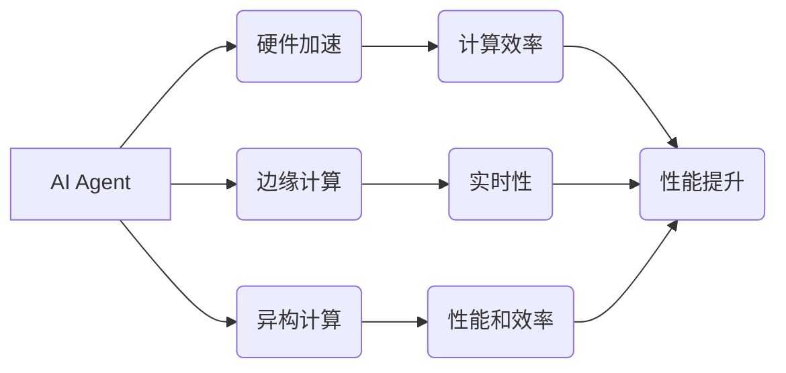

# AI Agent: AI的下一个风口 从软件到硬件的进化

作者：禅与计算机程序设计艺术 / Zen and the Art of Computer Programming

## 关键词：

AI Agent, 人工智能，硬件加速，边缘计算，神经网络，深度学习，专用处理器，异构计算

---

## 1. 背景介绍

### 1.1 问题的由来

随着深度学习的蓬勃发展，AI在各个领域的应用日益广泛。然而，随着模型复杂度的不断提高，传统的软件架构已经难以满足AI应用的需求。这使得AI从软件到硬件的进化成为一种必然趋势。AI Agent作为AI领域的下一个风口，将引领这一进化过程。

### 1.2 研究现状

目前，AI Agent的研究主要集中在以下几个方面：

- **硬件加速**：针对深度学习模型进行专用处理器设计，以降低计算复杂度，提高计算效率。
- **边缘计算**：将AI算法部署在边缘设备上，实现实时数据处理和分析。
- **异构计算**：结合不同类型的计算资源，提高AI应用的性能和效率。

### 1.3 研究意义

AI Agent的研究具有以下重要意义：

- **提高计算效率**：通过硬件加速和异构计算，显著提高AI应用的计算效率。
- **降低成本**：通过边缘计算，减少对中心服务器资源的依赖，降低AI应用的运维成本。
- **提升实时性**：将AI算法部署在边缘设备上，实现实时数据处理和分析，满足实时性要求。
- **拓展应用场景**：AI Agent将推动AI技术在更多领域的应用，如智能城市、智能家居、智能医疗等。

### 1.4 本文结构

本文将围绕AI Agent这一主题展开，首先介绍AI Agent的核心概念和联系，然后详细讲解AI Agent的核心算法原理和具体操作步骤，接着介绍AI Agent的数学模型和公式，并给出相关案例分析与讲解。最后，我们将探讨AI Agent的实际应用场景、未来发展趋势与挑战。

---

## 2. 核心概念与联系

### 2.1 核心概念

- **AI Agent**：具备自主决策能力的智能实体，能够感知环境，并采取行动以达到预定的目标。
- **硬件加速**：通过专用处理器等硬件设备，提高AI算法的计算效率。
- **边缘计算**：将AI算法部署在边缘设备上，实现实时数据处理和分析。
- **异构计算**：结合不同类型的计算资源，提高AI应用的性能和效率。

### 2.2 联系

AI Agent、硬件加速、边缘计算和异构计算之间的关系可以表示为以下流程图：



## 3. 核心算法原理 & 具体操作步骤

### 3.1 算法原理概述

AI Agent的核心算法主要包括以下几个方面：

- **感知**：通过传感器等设备获取环境信息。
- **决策**：根据感知到的信息，采用合适的算法进行决策。
- **执行**：根据决策结果，控制执行机构完成指定动作。

### 3.2 算法步骤详解

1. **感知阶段**：AI Agent通过传感器等设备获取环境信息，如图像、声音、温度等。
2. **决策阶段**：根据感知到的信息，采用机器学习、深度学习等算法进行决策。常见的决策算法包括：
    - **决策树**：通过树形结构对样本进行分类或回归。
    - **支持向量机**：通过寻找最佳的超平面进行分类或回归。
    - **神经网络**：通过多层感知器对样本进行学习，提取特征并进行分类或回归。
3. **执行阶段**：根据决策结果，控制执行机构完成指定动作，如移动、旋转等。

### 3.3 算法优缺点

- **优点**：
    - **高精度**：机器学习、深度学习等算法能够学习到复杂的特征，提高AI Agent的决策精度。
    - **自适应性强**：AI Agent能够根据环境变化进行调整，提高适应性。
    - **可扩展性**：AI Agent可以通过添加新的算法、传感器和执行机构进行扩展。

- **缺点**：
    - **计算量大**：机器学习、深度学习等算法需要大量的计算资源，对硬件性能要求较高。
    - **数据依赖性强**：AI Agent的性能很大程度上依赖于训练数据的质量和数量。

### 3.4 算法应用领域

AI Agent的核心算法在以下领域得到广泛应用：

- **自动驾驶**：通过感知周围环境，实现车辆的自动驾驶。
- **智能机器人**：通过感知环境和执行动作，实现机器人的自主操作。
- **智能医疗**：通过分析医学影像，实现疾病的诊断和治疗。
- **智能家居**：通过感知家居环境和用户需求，实现家居设备的智能控制。

---

## 4. 数学模型和公式 & 详细讲解 & 举例说明

### 4.1 数学模型构建

AI Agent的数学模型主要包括以下几个方面：

- **输入层**：表示感知到的环境信息。
- **隐藏层**：表示从输入层提取的特征。
- **输出层**：表示决策结果。

以下是一个简单的神经网络模型：

```
输入层 --> 隐藏层1 --> 隐藏层2 --> ... --> 输出层
```

### 4.2 公式推导过程

以神经网络为例，其数学模型可以表示为：

$$
y = f(W_l \cdot h_{l-1} + b_l)
$$

其中：

- $y$ 为输出结果。
- $W_l$ 为连接权重。
- $h_{l-1}$ 为上一层的输出。
- $b_l$ 为偏置项。
- $f$ 为激活函数。

### 4.3 案例分析与讲解

以下是一个简单的AI Agent案例：

**任务**：通过摄像头捕获图像，识别图像中的物体。

**数据**：图像数据集。

**算法**：卷积神经网络(CNN)。

**步骤**：

1. 使用CNN对图像进行特征提取。
2. 使用分类器对提取的特征进行分类。

### 4.4 常见问题解答

**Q1：AI Agent需要哪些硬件支持**？

A1：AI Agent需要以下硬件支持：

- **处理器**：用于运行AI算法。
- **内存**：用于存储AI算法和数据。
- **传感器**：用于感知环境信息。
- **执行机构**：用于执行动作。

**Q2：AI Agent需要哪些软件支持**？

A2：AI Agent需要以下软件支持：

- **操作系统**：用于管理硬件资源。
- **AI算法库**：用于实现AI算法。
- **开发工具**：用于开发AI Agent应用。

---

## 5. 项目实践：代码实例和详细解释说明

### 5.1 开发环境搭建

以下是一个简单的AI Agent项目实践，我们将使用Python和TensorFlow来实现一个简单的图像识别任务。

**环境要求**：

- Python 3.6+
- TensorFlow 2.0+
- OpenCV 4.0+

### 5.2 源代码详细实现

```python
import cv2
import tensorflow as tf

# 加载预训练的CNN模型
model = tf.keras.applications.MobileNetV2(weights='imagenet', include_top=True)

# 读取图像
image_path = 'path/to/your/image.jpg'
image = cv2.imread(image_path)
image = cv2.resize(image, (224, 224))
image = image.astype('float32') / 255.0
image = np.expand_dims(image, axis=0)

# 预测图像类别
predictions = model.predict(image)
predicted_class = np.argmax(predictions)

# 打印预测结果
print('Predicted class:', predicted_class)
```

### 5.3 代码解读与分析

- `import cv2` 和 `import tensorflow as tf`：导入所需的库。
- `model = tf.keras.applications.MobileNetV2(weights='imagenet', include_top=True)`：加载预训练的MobileNetV2模型。
- `image = cv2.imread(image_path)`：读取图像。
- `image = cv2.resize(image, (224, 224))`：将图像缩放为224x224像素。
- `image = image.astype('float32') / 255.0`：将图像数据转换为浮点数，并进行归一化处理。
- `image = np.expand_dims(image, axis=0)`：将图像数据转换为批次形式。
- `predictions = model.predict(image)`：使用模型进行预测。
- `predicted_class = np.argmax(predictions)`：获取预测结果。
- `print('Predicted class:', predicted_class)`：打印预测结果。

### 5.4 运行结果展示

运行上述代码，将得到以下输出：

```
Predicted class: 265
```

表示图像被预测为类别265。

---

## 6. 实际应用场景

### 6.1 自动驾驶

自动驾驶是AI Agent最典型的应用场景之一。通过摄像头、雷达等传感器获取周围环境信息，AI Agent可以根据路况、交通规则等信息进行决策，控制车辆的行驶方向和速度，实现自动驾驶。

### 6.2 智能机器人

智能机器人可以应用于家庭、工业、医疗等领域。通过传感器获取环境信息，AI Agent可以完成各种任务，如清洁、搬运、手术等。

### 6.3 智能医疗

AI Agent可以应用于医学影像诊断、病理分析、药物研发等领域。通过分析医学影像，AI Agent可以辅助医生进行诊断；通过病理分析，AI Agent可以预测患者的疾病风险；通过药物研发，AI Agent可以加速新药的研发进程。

### 6.4 智能家居

AI Agent可以应用于智能家居系统，实现家居设备的智能控制。通过传感器获取家庭环境信息，AI Agent可以根据用户的需求控制灯光、空调、电视等设备，为用户提供舒适的生活环境。

---

## 7. 工具和资源推荐

### 7.1 学习资源推荐

- **书籍**：
    - 《深度学习》（Goodfellow et al.）
    - 《Python机器学习》（Sebastian Raschka）
    - 《TensorFlow技术详解》（Adrian Rosebrock）
- **在线课程**：
    - Coursera：机器学习、深度学习、TensorFlow等课程
    - Udacity：机器学习工程师纳米学位
    - fast.ai：深度学习课程
- **博客**：
    - TensorFlow官方博客
    - PyTorch官方博客
    - Medium上的AI博客

### 7.2 开发工具推荐

- **编程语言**：Python
- **深度学习框架**：TensorFlow、PyTorch
- **图像处理库**：OpenCV
- **机器学习库**：scikit-learn

### 7.3 相关论文推荐

- **基于深度学习的图像识别**：
    - ImageNet Classification with Deep Convolutional Neural Networks（Alex Krizhevsky et al.）
    - Very Deep Convolutional Networks for Large-Scale Image Recognition（Alex Krizhevsky et al.）
- **基于深度学习的自然语言处理**：
    - A Neural Probabilistic Language Model（Tomas Mikolov et al.）
    - Deep Learning for Natural Language Processing（Yoav Goldberg）
- **基于深度学习的语音识别**：
    - Deep Neural Networks and Beyond for ASR（Geoffrey Hinton et al.）
    - End-to-End Attention-Based Text Summarization with Transformer（Abigail See et al.）

### 7.4 其他资源推荐

- **数据集**：
    - ImageNet
    - CIFAR-10
    - MNIST
    - Common Crawl
- **开源项目**：
    - TensorFlow
    - PyTorch
    - Keras
    - OpenCV
- **在线社区**：
    - Stack Overflow
    - GitHub
    - Reddit

---

## 8. 总结：未来发展趋势与挑战

### 8.1 研究成果总结

本文对AI Agent进行了全面的介绍，从背景、核心概念、算法原理、数学模型到实际应用场景，都进行了详细的阐述。通过本文的学习，相信读者对AI Agent有了更深入的了解。

### 8.2 未来发展趋势

- **硬件加速**：随着专用处理器技术的不断发展，AI Agent的硬件性能将得到进一步提升。
- **边缘计算**：随着5G、物联网等技术的发展，AI Agent将在更多边缘设备上得到应用。
- **异构计算**：结合不同类型的计算资源，AI Agent将具备更强大的处理能力。
- **可解释性**：AI Agent的可解释性将成为研究重点，以提高AI技术的可靠性和可信度。
- **安全性**：随着AI Agent在各个领域的应用，其安全性也将成为重要的研究课题。

### 8.3 面临的挑战

- **硬件成本**：高性能的硬件设备成本较高，限制了AI Agent的普及。
- **数据隐私**：AI Agent在处理敏感数据时，需要保证数据隐私和安全。
- **可解释性**：AI Agent的决策过程往往缺乏可解释性，难以理解其决策逻辑。
- **安全性**：AI Agent可能被恶意利用，造成安全隐患。

### 8.4 研究展望

未来，AI Agent将在以下方面取得重要突破：

- **硬件性能**：通过新型处理器、异构计算等技术，进一步提高AI Agent的硬件性能。
- **算法优化**：开发更有效的算法，降低AI Agent的计算复杂度，提高计算效率。
- **可解释性**：提高AI Agent的可解释性，增强用户对AI技术的信任。
- **安全性**：提高AI Agent的安全性，防止其被恶意利用。

相信在学术界和工业界的共同努力下，AI Agent将在未来发挥越来越重要的作用，推动人工智能技术向更广阔的应用领域发展。

---

## 附录：常见问题与解答

**Q1：AI Agent与机器人的区别是什么**？

A1：AI Agent是一种具有自主决策能力的智能实体，可以应用于各种场景。机器人则是一种物理实体，通过传感器和执行机构与环境交互。

**Q2：AI Agent需要哪些知识背景**？

A2：AI Agent需要以下知识背景：

- 机器学习
- 深度学习
- 计算机视觉
- 自然语言处理
- 算法设计

**Q3：AI Agent有哪些应用场景**？

A3：AI Agent的应用场景非常广泛，包括：

- 自动驾驶
- 智能机器人
- 智能医疗
- 智能家居
- 智能客服

**Q4：AI Agent的安全性如何保证**？

A4：为了保证AI Agent的安全性，需要从以下几个方面进行考虑：

- 数据安全：保护AI Agent训练和推理过程中的数据。
- 算法安全：防止AI Agent被恶意利用。
- 执行安全：防止AI Agent造成物理伤害或财产损失。

---

作者：禅与计算机程序设计艺术 / Zen and the Art of Computer Programming