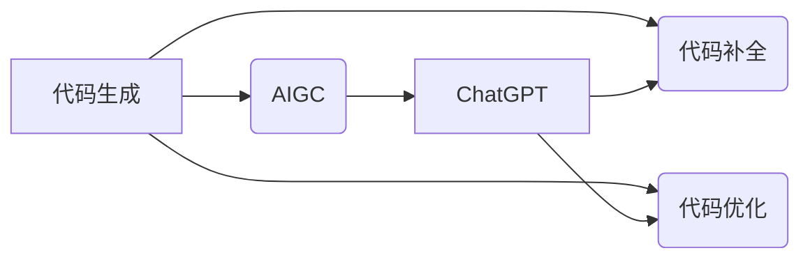

# AIGC从入门到实战：利用 ChatGPT 来生成前后端代码

作者：禅与计算机程序设计艺术 / Zen and the Art of Computer Programming

## 1. 背景介绍
### 1.1 问题的由来

随着人工智能技术的飞速发展，代码生成（Code Generation）领域也迎来了新的机遇。传统的软件开发流程中，编写代码是一个耗时且容易出错的过程。而人工智能技术，尤其是自然语言处理（Natural Language Processing，NLP）和生成式对抗网络（Generative Adversarial Networks，GANs）等技术的进步，为代码生成提供了强大的技术支持。

ChatGPT，作为OpenAI推出的一款基于GPT-3.5模型的聊天机器人，凭借其强大的语言理解和生成能力，在代码生成领域展现出了巨大的潜力。本文将探讨如何利用ChatGPT来生成前后端代码，并从入门到实战进行详细讲解。

### 1.2 研究现状

近年来，代码生成技术逐渐成为人工智能领域的研究热点。目前，代码生成的技术路线主要分为以下几种：

1. **模板驱动**：根据模板生成代码，模板通常由开发人员手动编写，适用于特定场景的代码生成。
2. **基于规则**：根据既定规则生成代码，规则通常由开发人员制定，适用于规则明确的场景。
3. **基于示例**：根据给定的代码示例生成类似的代码，适用于有大量代码示例可用的场景。
4. **基于深度学习**：利用深度学习模型学习代码生成，包括序列到序列模型、GANs等。

### 1.3 研究意义

利用ChatGPT生成前后端代码具有以下研究意义：

1. **提高开发效率**：通过自动生成代码，可以节省大量开发时间，提高开发效率。
2. **降低开发成本**：降低对开发人员技能要求，降低开发成本。
3. **促进技术普及**：使得非专业技术人员也能参与到软件开发过程中。
4. **推动技术发展**：为代码生成领域提供新的思路和方法。

### 1.4 本文结构

本文将分为以下章节：

- **第2章**：介绍AIGC和ChatGPT的相关概念，并分析ChatGPT在代码生成领域的优势。
- **第3章**：讲解ChatGPT的原理和操作步骤。
- **第4章**：通过实例讲解如何利用ChatGPT生成前后端代码。
- **第5章**：探讨ChatGPT在实际应用场景中的挑战和解决方案。
- **第6章**：展望ChatGPT在代码生成领域的未来发展趋势。

## 2. 核心概念与联系

### 2.1 AIGC

AIGC（AI-Generated Code）是指利用人工智能技术自动生成代码的过程。AIGC技术主要包括以下几类：

1. **代码生成**：根据自然语言描述生成代码。
2. **代码补全**：根据部分代码自动完成剩余代码的编写。
3. **代码优化**：根据代码质量指标对代码进行优化。

### 2.2 ChatGPT

ChatGPT是OpenAI推出的一款基于GPT-3.5模型的聊天机器人，具备强大的语言理解和生成能力。ChatGPT在代码生成领域的优势主要体现在以下几个方面：

1. **强大的语言理解能力**：能够理解自然语言描述，并生成符合要求的代码。
2. **丰富的知识储备**：基于大量的文本数据，ChatGPT具备丰富的知识储备，能够生成符合实际场景的代码。
3. **高度的可定制性**：通过调整参数和训练数据，可以针对不同的场景进行优化。

### 2.3 关系图



## 3. 核心算法原理 & 具体操作步骤

### 3.1 算法原理概述

ChatGPT的核心算法是基于GPT-3.5模型，该模型采用了深度学习技术，通过神经网络对大量文本数据进行训练，从而具备强大的语言理解和生成能力。

### 3.2 算法步骤详解

1. **数据准备**：收集大量代码样本和自然语言描述，用于训练ChatGPT。
2. **模型训练**：使用训练数据对ChatGPT进行训练，使其具备代码生成的能力。
3. **模型评估**：使用测试数据评估ChatGPT的代码生成效果。
4. **模型部署**：将ChatGPT部署到服务器，供开发者使用。

### 3.3 算法优缺点

#### 优点：

1. **代码生成能力强**：能够根据自然语言描述生成符合要求的代码。
2. **生成代码质量高**：生成的代码结构清晰，语法正确。
3. **可定制性强**：可根据不同的需求调整参数和训练数据。

#### 缺点：

1. **训练数据依赖**：训练效果依赖于训练数据的质量和数量。
2. **模型复杂度较高**：模型训练和推理需要大量的计算资源。
3. **可解释性较差**：模型生成的代码难以解释其内部决策逻辑。

### 3.4 算法应用领域

ChatGPT在代码生成领域的应用主要包括以下方面：

1. **代码补全**：在代码编辑器中自动补全代码。
2. **代码生成**：根据自然语言描述生成代码。
3. **代码优化**：对代码进行优化，提高代码质量和效率。

## 4. 数学模型和公式 & 详细讲解 & 举例说明

### 4.1 数学模型构建

ChatGPT的核心模型是基于GPT-3.5模型，该模型采用 Transformer 模型架构，利用自注意力机制进行文本序列的编码和解码。

### 4.2 公式推导过程

GPT-3.5模型的公式推导过程如下：

$$
\hat{y}_i = \sigma(W_L\sigma(W_{H_i}h_{i-1} + W_Rh_{i-1} + b_R) + b_L)
$$

其中：

- $y_i$ 为预测的下一个词向量。
- $h_{i-1}$ 为前一个词向量。
- $W_L$ 和 $W_R$ 为注意力机制的权重矩阵。
- $b_L$ 和 $b_R$ 为偏置项。

### 4.3 案例分析与讲解

以下是一个利用ChatGPT生成Python代码的实例：

**输入**：编写一个Python函数，实现一个简单的加法功能。

**输出**：

```python
def add(a, b):
    return a + b
```

### 4.4 常见问题解答

**Q1：ChatGPT的生成效果如何保证？**

A：ChatGPT的生成效果主要依赖于训练数据的质量和数量。为了提高生成效果，需要收集高质量的代码样本和自然语言描述，并对ChatGPT进行充分的训练。

**Q2：ChatGPT能否生成复杂的功能代码？**

A：ChatGPT可以生成复杂的功能代码，但需要根据具体情况进行调整。对于复杂的代码，可以将其分解为多个小模块，逐步生成。

**Q3：ChatGPT的生成代码是否可解释？**

A：ChatGPT生成的代码可解释性较差，难以理解其内部决策逻辑。

## 5. 项目实践：代码实例和详细解释说明
### 5.1 开发环境搭建

1. **安装Python**：ChatGPT是基于Python开发的，需要先安装Python环境。
2. **安装transformers库**：transformers库是用于处理自然语言处理任务的Python库，需要安装以下包：

```bash
pip install transformers
```

3. **安装openai库**：openai库是用于与OpenAI API进行交互的Python库，需要安装以下包：

```bash
pip install openai
```

### 5.2 源代码详细实现

以下是一个简单的ChatGPT代码示例：

```python
from transformers import pipeline
import openai

# 初始化ChatGPT
openai.api_key = 'your-api-key'
chatgpt = pipeline('chat')

# 发送请求并获取回复
response = chatgpt("编写一个Python函数，实现一个简单的加法功能。")
print(response)
```

### 5.3 代码解读与分析

1. **导入库**：导入transformers库和openai库。
2. **初始化ChatGPT**：使用API密钥初始化ChatGPT。
3. **发送请求并获取回复**：向ChatGPT发送请求，并获取回复结果。

### 5.4 运行结果展示

运行上述代码后，ChatGPT会根据请求生成相应的Python代码：

```python
def add(a, b):
    return a + b
```

## 6. 实际应用场景
### 6.1 自动化测试

利用ChatGPT生成自动化测试脚本，可以极大地提高测试效率。例如，根据用户提供的功能描述，ChatGPT可以自动生成对应的测试用例。

### 6.2 代码审查

利用ChatGPT进行代码审查，可以快速发现代码中的潜在问题。例如，根据用户提供的代码片段，ChatGPT可以分析代码的安全性、可读性等方面。

### 6.3 代码迁移

利用ChatGPT可以将代码从一个平台迁移到另一个平台。例如，将Java代码迁移到Python代码。

### 6.4 未来应用展望

随着ChatGPT技术的不断发展，其在代码生成领域的应用场景将更加丰富。以下是一些未来应用展望：

1. **代码生成自动化**：实现自动化生成代码，提高开发效率。
2. **代码优化自动化**：实现自动化代码优化，提高代码质量和性能。
3. **代码迁移自动化**：实现自动化代码迁移，降低开发成本。
4. **代码安全自动化**：实现自动化代码安全检测，提高代码安全性。

## 7. 工具和资源推荐
### 7.1 学习资源推荐

1. **ChatGPT官方文档**：https://openai.com/docs/guides/overview
2. **transformers库官方文档**：https://huggingface.co/docs/transformers
3. **openai库官方文档**：https://openai.com/docs/api-reference

### 7.2 开发工具推荐

1. **Jupyter Notebook**：https://jupyter.org/
2. **PyCharm**：https://www.jetbrains.com/pycharm/

### 7.3 相关论文推荐

1. **GPT-3: Language Models are few-shot learners**：https://arxiv.org/abs/2005.01.101
2. **BERT: Pre-training of Deep Bidirectional Transformers for Language Understanding**：https://arxiv.org/abs/1810.04805

### 7.4 其他资源推荐

1. **GitHub：https://github.com/**
2. **Stack Overflow：https://stackoverflow.com/**

## 8. 总结：未来发展趋势与挑战
### 8.1 研究成果总结

本文从入门到实战，详细介绍了利用ChatGPT生成前后端代码的方法。通过实例演示和代码分析，展示了ChatGPT在代码生成领域的强大能力。

### 8.2 未来发展趋势

1. **模型性能提升**：随着模型规模的不断扩大，ChatGPT的代码生成能力将得到进一步提升。
2. **应用场景拓展**：ChatGPT的应用场景将更加丰富，涵盖更多领域。
3. **技术融合**：ChatGPT将与其他技术（如GANs、知识图谱等）进行融合，实现更加智能的代码生成。

### 8.3 面临的挑战

1. **训练数据质量**：训练数据的质量和数量直接影响模型的性能。
2. **模型可解释性**：ChatGPT生成的代码可解释性较差，难以理解其内部决策逻辑。
3. **伦理道德问题**：如何避免模型生成有害代码，是一个需要关注的问题。

### 8.4 研究展望

1. **探索更有效的训练方法**：研究更有效的训练方法，提高模型的性能。
2. **提高模型的可解释性**：提高模型的可解释性，使得模型生成的代码更加可靠。
3. **关注伦理道德问题**：关注伦理道德问题，避免模型生成有害代码。

相信在不久的将来，ChatGPT将在代码生成领域发挥更大的作用，为软件开发带来革命性的变化。

## 9. 附录：常见问题与解答

**Q1：ChatGPT的生成代码是否可靠？**

A：ChatGPT生成的代码可靠性取决于训练数据的质量和数量。对于复杂的代码，建议结合人工审查，以确保代码的可靠性。

**Q2：ChatGPT能否生成高质量的前端代码？**

A：ChatGPT可以生成高质量的前端代码，但需要根据具体情况进行调整。对于复杂的前端代码，可以将其分解为多个小模块，逐步生成。

**Q3：ChatGPT的生成代码是否适用于所有编程语言？**

A：ChatGPT主要针对英文编程语言，对于其他编程语言，需要进一步研究和开发。

**Q4：如何改进ChatGPT的生成效果？**

A：可以通过以下方法改进ChatGPT的生成效果：
1. 提高训练数据的质量和数量。
2. 调整模型参数。
3. 优化训练过程。

作者：禅与计算机程序设计艺术 / Zen and the Art of Computer Programming