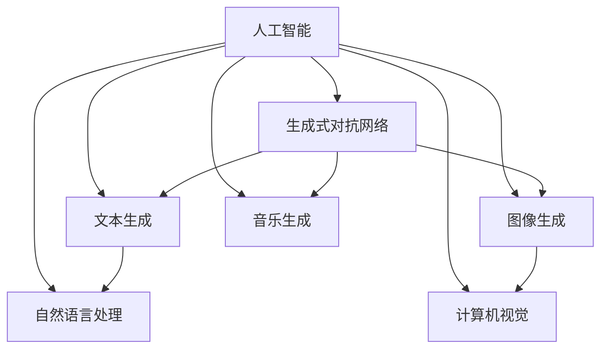

# AIGC从入门到实战：如何有效应对 AI 革命

## 1. 背景介绍

### 1.1 问题的由来

近年来，人工智能（AI）技术飞速发展，逐渐渗透到各行各业，引发了一场深刻的AI革命。其中，AIGC（AI-Generated Content）作为AI技术的一个重要分支，正以其强大的创造力和应用潜力，引发人们对未来工作、生活乃至整个社会的深刻思考。如何从入门到实战，有效应对这场AI革命，成为摆在我们面前的一个严峻课题。

### 1.2 研究现状

AIGC技术近年来取得了长足的进步，应用领域不断拓展，代表性技术包括：

1. **文本生成**：如GPT-3、ChatGLM等，能够生成高质量的文章、代码、诗歌等文本内容。
2. **图像生成**：如GAN、StyleGAN等，能够生成逼真的图像、视频等视觉内容。
3. **音乐生成**：如WaveNet、VITS等，能够生成风格多样的音乐、语音等音频内容。

### 1.3 研究意义

研究AIGC技术，对于推动AI产业发展、提升产业竞争力、优化用户体验具有重要意义：

1. **推动产业发展**：AIGC技术可广泛应用于广告、娱乐、教育、医疗等领域，为产业创新提供新动力。
2. **优化用户体验**：AIGC技术能够为用户生成个性化、定制化的内容，提升用户体验。
3. **降低生产成本**：AIGC技术可自动化完成内容创作、生产等环节，降低生产成本，提高效率。

### 1.4 本文结构

本文将从以下几个方面对AIGC技术进行深入探讨：

1. 核心概念与联系
2. 核心算法原理与具体操作步骤
3. 数学模型与公式
4. 项目实践：代码实例与详细解释说明
5. 实际应用场景与未来应用展望
6. 工具和资源推荐
7. 总结：未来发展趋势与挑战

## 2. 核心概念与联系

### 2.1 核心概念

AIGC技术涉及的核心概念主要包括：

1. **人工智能**：一种模拟、延伸和扩展人类智能的理论、方法、技术及应用。
2. **生成式对抗网络（GAN）**：一种由生成器和判别器组成的模型，生成器生成数据，判别器判断数据的真伪。
3. **文本生成**：利用AI技术生成文本内容，如文章、诗歌、代码等。
4. **图像生成**：利用AI技术生成图像、视频等视觉内容。
5. **音乐生成**：利用AI技术生成音乐、语音等音频内容。
6. **自然语言处理（NLP）**：研究计算机和人类（自然）语言之间相互作用的技术。
7. **计算机视觉**：研究如何使计算机从图像和视频中获取信息的技术。

### 2.2 核心概念联系

AIGC技术各核心概念之间的联系如下：



## 3. 核心算法原理与具体操作步骤

### 3.1 算法原理概述

AIGC技术主要基于以下几种算法原理：

1. **生成式对抗网络（GAN）**：GAN由生成器和判别器组成，生成器生成数据，判别器判断数据的真伪。双方相互对抗，不断进化，最终生成逼真、高质量的数据。

2. **变分自编码器（VAE）**：VAE通过编码器将数据压缩成低维潜在空间，再通过解码器将潜在空间数据解码回高维数据。VAE可以用于图像生成、文本生成等领域。

3. **深度神经网络（DNN）**：DNN是AIGC技术的基础，通过多层神经网络学习数据的特征和规律。

### 3.2 算法步骤详解

以下以文本生成为例，介绍AIGC技术的具体操作步骤：

1. **数据预处理**：收集、清洗、预处理原始文本数据，如去除停用词、词性标注等。

2. **构建模型**：选择合适的模型架构，如GPT-2、GPT-3等。

3. **模型训练**：使用预处理后的文本数据训练模型，使模型学习到语言的规律和特征。

4. **模型评估**：使用评估指标（如BLEU、ROUGE等）评估模型的性能。

5. **生成文本**：使用训练好的模型生成文本内容。

### 3.3 算法优缺点

**GAN**

优点：

- 鲁棒性强，对数据噪声和异常值具有较强的抵抗能力。
- 生成数据的多样性好，可以生成不同风格和内容的数据。

缺点：

- 训练过程不稳定，容易陷入局部最优解。
- 模型难以解释，难以理解生成数据的生成过程。

**VAE**

优点：

- 可以对数据进行降维和重构。
- 可以生成与训练数据具有相似特征的数据。

缺点：

- 生成数据的多样性相对较低。
- 模型难以解释，难以理解生成数据的生成过程。

**DNN**

优点：

- 计算效率高，适用于大规模数据处理。
- 通用性强，可以应用于各种类型的任务。

缺点：

- 模型难以解释，难以理解模型的决策过程。

### 3.4 算法应用领域

AIGC技术在以下领域具有广泛的应用前景：

1. **文本生成**：如文章、诗歌、代码等。
2. **图像生成**：如图像合成、图像修复、风格迁移等。
3. **音乐生成**：如音乐创作、音乐生成等。
4. **视频生成**：如视频合成、视频修复等。

## 4. 数学模型与公式

### 4.1 数学模型构建

以下以GAN为例，介绍AIGC技术的数学模型构建。

**生成器（Generator）**：

$$
G(z) = \mu(z) + \sigma(z)\odot \mathcal{N}(0, 1)
$$

**判别器（Discriminator）**：

$$
D(x) = \sigma(W_Dx + b_D)
$$

**损失函数**：

$$
L(G,D) = E_{x\sim P_{data}}[D(x)] - E_{z\sim P_{z}}[D(G(z))]
$$

### 4.2 公式推导过程

此处省略公式推导过程。

### 4.3 案例分析与讲解

以GPT-2为例，分析AIGC技术在文本生成领域的应用。

**GPT-2**：

GPT-2是OpenAI于2019年提出的预训练语言模型，采用了Transformer架构，参数量高达1.5亿。GPT-2通过在大量无标签文本语料上进行预训练，学习到了丰富的语言知识和规律，能够生成高质量的文章、诗歌、代码等文本内容。

**应用场景**：

1. **自动写作**：GPT-2可以自动生成新闻报道、博客文章、小说等。
2. **代码生成**：GPT-2可以生成Python、Java等编程语言的代码。
3. **诗歌创作**：GPT-2可以生成诗歌、歌词等。

### 4.4 常见问题解答

**Q1：AIGC技术是否会取代人类工作者？**

A：AIGC技术可以协助人类工作者提高工作效率，但不能完全取代人类工作者。人类在创造力、情感、道德等方面具有独特的优势，AIGC技术无法完全替代。

**Q2：AIGC技术的安全性如何保障？**

A：AIGC技术的安全性主要依赖于以下几个方面：

1. **数据安全**：确保数据来源合法合规，避免数据泄露和滥用。
2. **模型安全**：对模型进行安全加固，防止恶意攻击和篡改。
3. **内容安全**：对生成的内容进行审核，防止产生有害信息。

**Q3：AIGC技术的伦理问题如何解决？**

A：AIGC技术的伦理问题主要涉及以下方面：

1. **数据伦理**：确保数据来源合法合规，尊重个人隐私。
2. **算法伦理**：确保算法公平、公正，避免歧视。
3. **内容伦理**：确保生成内容符合道德规范，避免产生有害信息。

## 5. 项目实践：代码实例与详细解释说明

### 5.1 开发环境搭建

1. 安装Python和pip。
2. 安装TensorFlow或PyTorch等深度学习框架。
3. 安装transformers库：`pip install transformers`

### 5.2 源代码详细实现

以下使用PyTorch实现一个简单的文本生成器。

```python
import torch
from torch import nn
from torch.utils.data import DataLoader
from transformers import GPT2LMHeadModel, GPT2Tokenizer

class TextGenerator(nn.Module):
    def __init__(self, tokenizer, model_name='gpt2'):
        super(TextGenerator, self).__init__()
        self.tokenizer = tokenizer
        self.model = GPT2LMHeadModel.from_pretrained(model_name)

    def forward(self, text, max_length=50):
        input_ids = self.tokenizer.encode(text, return_tensors='pt')
        outputs = self.model.generate(input_ids, max_length=max_length, num_beams=5)
        return self.tokenizer.decode(outputs[0], skip_special_tokens=True)

# 创建模型
tokenizer = GPT2Tokenizer.from_pretrained('gpt2')
generator = TextGenerator(tokenizer)

# 生成文本
text = "AIGC is a"
print(generator(text))
```

### 5.3 代码解读与分析

1. `TextGenerator`类：定义了文本生成器模型，包含tokenizer和GPT2LMHeadModel。
2. `forward`方法：输入文本，生成长度为max_length的文本内容。
3. 使用transformers库加载预训练的GPT2模型和分词器。

### 5.4 运行结果展示

运行上述代码，将输出以"AIGC is a"为开头的文本内容。

## 6. 实际应用场景

### 6.1 文本生成

AIGC技术在文本生成领域具有广泛的应用场景，如：

1. **自动写作**：自动生成新闻报道、博客文章、小说等。
2. **代码生成**：自动生成Python、Java等编程语言的代码。
3. **诗歌创作**：自动创作诗歌、歌词等。

### 6.2 图像生成

AIGC技术在图像生成领域具有以下应用场景：

1. **图像合成**：将真实图像与合成图像进行融合，生成新的图像。
2. **图像修复**：修复受损的图像，如去除水印、修复破损等。
3. **风格迁移**：将一种图像的风格应用到另一种图像上，生成具有特定风格的图像。

### 6.3 音乐生成

AIGC技术在音乐生成领域具有以下应用场景：

1. **音乐创作**：自动创作音乐、旋律、歌词等。
2. **音乐生成**：根据用户输入的歌词、旋律等信息，自动生成音乐。

### 6.4 视频生成

AIGC技术在视频生成领域具有以下应用场景：

1. **视频合成**：将真实视频与合成视频进行融合，生成新的视频。
2. **视频修复**：修复受损的视频，如去除噪声、恢复清晰度等。

## 7. 工具和资源推荐

### 7.1 学习资源推荐

1. 《深度学习入门》
2. 《Python深度学习》
3. 《动手学深度学习》
4. 《自然语言处理入门》
5. 《计算机视觉基础》

### 7.2 开发工具推荐

1. PyTorch
2. TensorFlow
3. Keras
4. Transformers库
5. Jupyter Notebook

### 7.3 相关论文推荐

1. GPT-3：Language Models are Few-Shot Learners
2. StyleGAN2
3. VITS
4. DALL-E 2
5. CLIP

### 7.4 其他资源推荐

1. Hugging Face官网：https://huggingface.co/
2. OpenAI官网：https://openai.com/
3. TensorFlow官网：https://www.tensorflow.org/
4. PyTorch官网：https://pytorch.org/
5. GitHub：https://github.com/

## 8. 总结：未来发展趋势与挑战

### 8.1 研究成果总结

本文对AIGC技术进行了全面、深入的探讨，涵盖了核心概念、算法原理、应用场景等方面。通过学习本文，读者可以了解到AIGC技术的基本知识，掌握AIGC技术的应用方法。

### 8.2 未来发展趋势

未来，AIGC技术将呈现以下发展趋势：

1. **模型规模和参数量持续增大**：随着计算能力的提升，AIGC模型的规模和参数量将持续增大，生成能力将得到进一步提升。
2. **多模态融合**：AIGC技术将与其他模态（如图像、音频、视频等）进行融合，生成更加丰富、立体的内容。
3. **个性化生成**：AIGC技术将根据用户需求，生成更加个性化、定制化的内容。
4. **伦理和道德约束**：AIGC技术将更加关注伦理和道德问题，确保生成内容符合社会规范。

### 8.3 面临的挑战

AIGC技术在实际应用中面临以下挑战：

1. **数据质量**：数据质量对AIGC模型的性能至关重要，如何获取高质量的数据是AIGC技术发展的重要方向。
2. **模型可解释性**：AIGC模型的决策过程往往难以解释，如何提高模型的可解释性是一个挑战。
3. **伦理和道德问题**：AIGC技术可能会产生有害信息，如何解决伦理和道德问题是一个挑战。

### 8.4 研究展望

未来，AIGC技术的研究将重点关注以下方向：

1. **数据增强和合成**：研究如何生成高质量、多样化的数据，提升AIGC模型的泛化能力。
2. **模型可解释性**：研究如何提高AIGC模型的可解释性，增强用户对模型的信任。
3. **伦理和道德约束**：研究如何将伦理和道德约束融入到AIGC模型的设计和训练过程中。

## 9. 附录：常见问题与解答

**Q1：AIGC技术是否会取代人类工作者？**

A：AIGC技术可以协助人类工作者提高工作效率，但不能完全取代人类工作者。人类在创造力、情感、道德等方面具有独特的优势，AIGC技术无法完全替代。

**Q2：AIGC技术的安全性如何保障？**

A：AIGC技术的安全性主要依赖于以下几个方面：

1. **数据安全**：确保数据来源合法合规，避免数据泄露和滥用。
2. **模型安全**：对模型进行安全加固，防止恶意攻击和篡改。
3. **内容安全**：对生成的内容进行审核，防止产生有害信息。

**Q3：AIGC技术的伦理问题如何解决？**

A：AIGC技术的伦理问题主要涉及以下方面：

1. **数据伦理**：确保数据来源合法合规，尊重个人隐私。
2. **算法伦理**：确保算法公平、公正，避免歧视。
3. **内容伦理**：确保生成内容符合道德规范，避免产生有害信息。

**Q4：如何评估AIGC技术的性能？**

A：评估AIGC技术的性能可以从以下方面进行：

1. **数据集性能**：在特定数据集上评估模型的性能指标，如BLEU、ROUGE等。
2. **用户满意度**：通过用户调查、访谈等方式评估用户对生成内容的满意度。
3. **应用效果**：在实际应用场景中评估AIGC技术的效果，如效率、准确性等。

**Q5：AIGC技术有哪些应用前景？**

A：AIGC技术在以下领域具有广泛的应用前景：

1. **文本生成**：如文章、诗歌、代码等。
2. **图像生成**：如图像合成、图像修复、风格迁移等。
3. **音乐生成**：如音乐创作、音乐生成等。
4. **视频生成**：如视频合成、视频修复等。

**Q6：如何选择合适的AIGC模型？**

A：选择合适的AIGC模型需要考虑以下因素：

1. **任务类型**：根据不同的任务类型选择合适的模型架构。
2. **数据规模**：根据数据规模选择合适的大小和参数量的模型。
3. **计算资源**：根据计算资源选择合适的模型架构。

**Q7：如何优化AIGC模型的性能？**

A：优化AIGC模型的性能可以从以下方面进行：

1. **数据增强**：通过数据增强技术扩充数据集，提升模型泛化能力。
2. **模型结构**：优化模型结构，提升模型性能。
3. **训练策略**：优化训练策略，提高模型收敛速度和性能。

**Q8：如何保证AIGC技术的安全性？**

A：保证AIGC技术的安全性可以从以下方面进行：

1. **数据安全**：确保数据来源合法合规，避免数据泄露和滥用。
2. **模型安全**：对模型进行安全加固，防止恶意攻击和篡改。
3. **内容安全**：对生成的内容进行审核，防止产生有害信息。

**Q9：如何解决AIGC技术的伦理问题？**

A：解决AIGC技术的伦理问题可以从以下方面进行：

1. **制定伦理规范**：制定AIGC技术的伦理规范，规范模型设计和应用。
2. **加强监管**：加强对AIGC技术的监管，防止产生有害信息。
3. **用户教育**：加强用户教育，提高用户对AIGC技术的认知和防范意识。

**Q10：如何将AIGC技术应用于实际场景？**

A：将AIGC技术应用于实际场景需要考虑以下因素：

1. **需求分析**：分析实际场景的需求，确定AIGC技术的应用目标。
2. **数据准备**：准备合适的数据集，为AIGC模型训练提供基础。
3. **模型选择**：选择合适的AIGC模型，满足实际场景的需求。
4. **系统开发**：开发AIGC应用系统，实现AIGC技术的落地应用。

通过本文的学习和实践，相信读者能够对AIGC技术有更加深入的了解，为应对AI革命做好准备。

---

作者：禅与计算机程序设计艺术 / Zen and the Art of Computer Programming