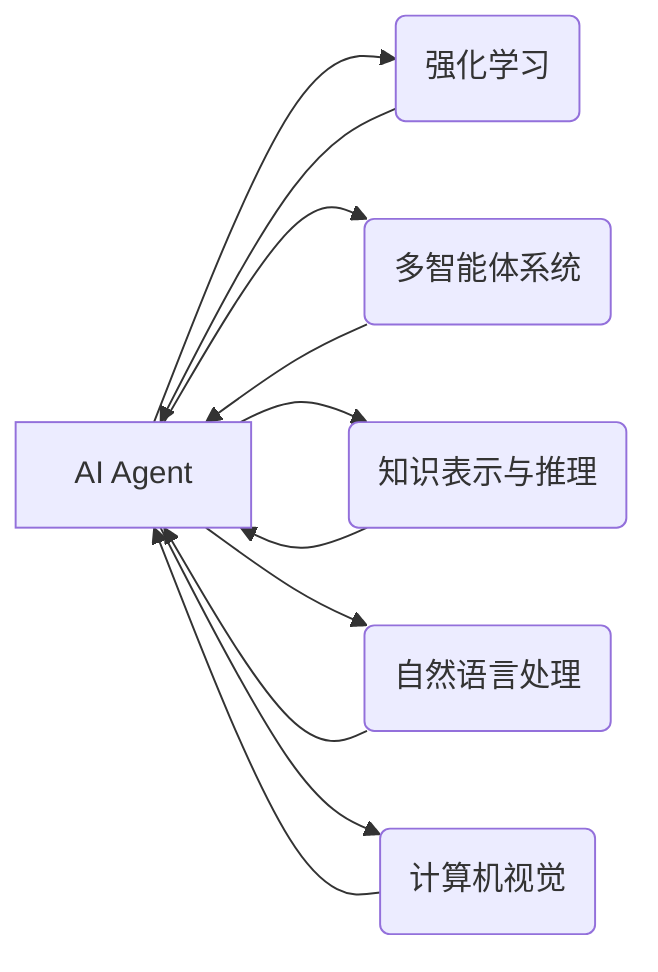

# AI人工智能 Agent：对未来工作的影响

作者：禅与计算机程序设计艺术 / Zen and the Art of Computer Programming

## 1. 背景介绍
### 1.1 问题的由来

随着人工智能技术的飞速发展，AI Agent作为其重要组成部分，正在悄然改变着各行各业。AI Agent，即人工智能代理，是一种能够自主学习、自主决策并执行任务的软件实体。它们具备感知环境、学习知识和技能、规划行动的能力，能够自主完成复杂任务，为人类提供高效便捷的服务。

AI Agent的出现，不仅推动了人工智能技术的应用落地，更对未来工作模式、产业结构和社会发展产生了深远的影响。本文将探讨AI Agent的未来发展趋势，分析其对未来工作的潜在影响，并提出应对挑战的策略。

### 1.2 研究现状

近年来，AI Agent技术在学术界和产业界都取得了显著进展。以下是一些具有代表性的研究成果：

1. **强化学习**：通过与环境交互学习最优策略，使AI Agent能够自主完成任务。深度强化学习（DRL）的兴起，使得AI Agent在游戏、机器人控制等领域取得了突破性进展。

2. **多智能体系统**：多个AI Agent协同工作，共同完成任务。在物流、协同机器人、智能城市等领域展现出巨大潜力。

3. **知识表示与推理**：将人类知识转化为机器可理解的形式，使AI Agent能够进行逻辑推理和问题解决。知识图谱、本体等技术为AI Agent提供强大的知识基础。

4. **自然语言处理**：使AI Agent能够理解和生成自然语言，实现人机交互。聊天机器人、语音助手等应用逐渐走进人们的生活。

5. **计算机视觉**：使AI Agent能够识别和理解图像、视频等视觉信息。安防监控、自动驾驶等领域取得了显著成果。

### 1.3 研究意义

研究AI Agent对未来工作的影响，具有以下重要意义：

1. **推动产业升级**：AI Agent的应用将促进传统产业转型升级，创造新的就业机会。

2. **提高工作效率**：AI Agent能够替代人类完成重复性、危险或高强度的任务，提高工作效率。

3. **优化资源配置**：AI Agent能够实现资源优化配置，降低生产成本，提高经济效益。

4. **促进社会公平**：AI Agent的应用可以帮助解决一些社会问题，如老龄化、教育不平等等。

5. **激发创新活力**：AI Agent的应用将推动人工智能领域的技术创新，为经济社会发展注入新动力。

### 1.4 本文结构

本文将从以下方面展开论述：

- 第2部分，介绍AI Agent的核心概念与联系。
- 第3部分，阐述AI Agent的核心算法原理及具体操作步骤。
- 第4部分，分析AI Agent在各个领域的应用场景。
- 第5部分，探讨AI Agent对未来工作的潜在影响。
- 第6部分，提出应对AI Agent带来的挑战的策略。
- 第7部分，总结AI Agent的未来发展趋势与挑战。
- 第8部分，展望AI Agent在未来的发展前景。

## 2. 核心概念与联系

### 2.1 核心概念

1. **AI Agent**：人工智能代理，是一种能够自主学习、自主决策并执行任务的软件实体。

2. **强化学习**：通过与环境交互学习最优策略，使AI Agent能够自主完成任务。

3. **多智能体系统**：多个AI Agent协同工作，共同完成任务。

4. **知识表示与推理**：将人类知识转化为机器可理解的形式，使AI Agent能够进行逻辑推理和问题解决。

5. **自然语言处理**：使AI Agent能够理解和生成自然语言，实现人机交互。

6. **计算机视觉**：使AI Agent能够识别和理解图像、视频等视觉信息。

### 2.2 核心联系

AI Agent的核心技术主要包括强化学习、多智能体系统、知识表示与推理、自然语言处理和计算机视觉等。这些技术相互关联，共同构成了AI Agent的技术体系。

以下是一个描述AI Agent技术体系之间关系的Mermaid流程图：



## 3. 核心算法原理 & 具体操作步骤
### 3.1 算法原理概述

#### 3.1.1 强化学习

强化学习是一种通过与环境交互学习最优策略的机器学习方法。其基本原理如下：

- **环境**：由一系列状态、动作和奖励组成。
- **Agent**：根据当前状态选择动作，并通过奖励反馈不断优化策略。
- **策略**：Agent选择动作的依据，可以是确定性的或随机的。

强化学习的主要算法包括Q学习、Sarsa、Deep Q Network（DQN）等。

#### 3.1.2 多智能体系统

多智能体系统由多个相互协作的AI Agent组成，共同完成任务。其基本原理如下：

- **通信机制**：智能体之间通过通信机制共享信息，协同完成任务。
- **协调机制**：智能体根据自身目标和环境信息，选择合适的动作。
- **博弈论**：多智能体系统中的决策过程可以视为一种博弈，需要考虑自身利益和对方策略。

多智能体系统的主要算法包括多智能体强化学习、多智能体协同控制等。

#### 3.1.3 知识表示与推理

知识表示与推理技术将人类知识转化为机器可理解的形式，使AI Agent能够进行逻辑推理和问题解决。其主要方法包括：

- **知识表示**：将知识表示为规则、本体、图等形式。
- **推理引擎**：根据知识库和推理规则，进行逻辑推理和问题求解。

知识表示与推理技术的主要算法包括逻辑推理、归纳推理、基于案例的推理等。

#### 3.1.4 自然语言处理

自然语言处理技术使AI Agent能够理解和生成自然语言，实现人机交互。其主要方法包括：

- **分词**：将文本分解为词语或符号。
- **词性标注**：对词语进行词性标注。
- **句法分析**：分析句子的结构，提取句子成分。
- **语义分析**：理解句子的语义，提取句子中的实体、关系等信息。

自然语言处理技术的主要算法包括统计机器学习、深度学习等。

#### 3.1.5 计算机视觉

计算机视觉技术使AI Agent能够识别和理解图像、视频等视觉信息。其主要方法包括：

- **图像分类**：识别图像中的物体类别。
- **目标检测**：检测图像中的目标位置和类别。
- **图像分割**：将图像分割成若干区域。
- **动作识别**：识别视频中的动作序列。

计算机视觉技术的主要算法包括传统机器学习方法、深度学习方法等。

### 3.2 算法步骤详解

以下以强化学习为例，介绍AI Agent的算法步骤：

1. **环境建模**：建立环境模型，包括状态空间、动作空间和奖励函数。
2. **初始策略**：初始化Agent的初始策略，可以是随机策略或基于经验值的方法。
3. **策略迭代**：根据当前状态选择动作，执行动作并观察奖励，根据奖励更新策略。
4. **目标优化**：根据策略迭代结果，优化策略参数，提高Agent的性能。

### 3.3 算法优缺点

#### 3.3.1 强化学习

**优点**：

- 自适应性强，能够根据环境变化调整策略。
- 能够处理复杂、动态的环境。

**缺点**：

- 训练过程可能需要较长时间。
- 可能陷入局部最优解。

#### 3.3.2 多智能体系统

**优点**：

- 能够解决复杂问题，提高系统整体性能。
- 能够实现资源优化配置。

**缺点**：

- 通信复杂，需要设计合理的通信机制。
- 难以处理合作与竞争关系。

#### 3.3.3 知识表示与推理

**优点**：

- 能够处理复杂问题，提高推理效率。
- 能够支持知识推理和问题求解。

**缺点**：

- 知识表示和推理算法复杂。
- 难以处理动态变化的知识。

#### 3.3.4 自然语言处理

**优点**：

- 实现人机交互，提高用户体验。
- 能够处理自然语言文本。

**缺点**：

- 语言理解难度大，需要大量标注数据。
- 难以处理歧义和上下文信息。

#### 3.3.5 计算机视觉

**优点**：

- 能够处理图像和视频信息。
- 能够实现图像识别和目标检测等功能。

**缺点**：

- 计算复杂，需要大量计算资源。
- 难以处理复杂场景和光照变化。

### 3.4 算法应用领域

AI Agent的核心算法在各个领域都有广泛的应用，以下列举一些典型应用：

1. **游戏**：AI Agent在游戏领域取得了显著成果，如围棋、星际争霸等。
2. **机器人控制**：AI Agent在机器人控制领域得到广泛应用，如无人驾驶、无人机等。
3. **智能交通**：AI Agent在智能交通领域具有广阔的应用前景，如自动驾驶、交通流量预测等。
4. **智能客服**：AI Agent在智能客服领域得到广泛应用，如聊天机器人、语音助手等。
5. **智能家居**：AI Agent在智能家居领域具有广泛应用前景，如智能家电控制、家庭安全监控等。

## 4. 数学模型和公式 & 详细讲解 & 举例说明
### 4.1 数学模型构建

以下以强化学习为例，介绍AI Agent的数学模型构建。

#### 4.1.1 状态空间

状态空间是由所有可能的状态组成的集合。状态空间可以表示为：

$S = \{s_1, s_2, \ldots, s_n\}$

其中，$s_i$ 为状态空间中的一个状态。

#### 4.1.2 动作空间

动作空间是由所有可能的动作组成的集合。动作空间可以表示为：

$A = \{a_1, a_2, \ldots, a_m\}$

其中，$a_j$ 为动作空间中的一个动作。

#### 4.1.3 奖励函数

奖励函数是Agent根据当前状态和动作获得的奖励。奖励函数可以表示为：

$R(s, a)$

其中，$s$ 为当前状态，$a$ 为当前动作。

#### 4.1.4 策略

策略是Agent选择动作的依据。策略可以表示为：

$\pi(a|s)$

其中，$a$ 为动作，$s$ 为状态，$\pi$ 表示策略。

#### 4.1.5 Q值

Q值表示在给定状态和动作下，Agent所能获得的期望奖励。Q值可以表示为：

$Q(s, a) = \sum_{s' \in S} R(s, a) \pi(s'|s)$

### 4.2 公式推导过程

以下以Q学习算法为例，介绍强化学习的公式推导过程。

#### 4.2.1 Q值更新

Q值更新公式如下：

$Q(s, a) \leftarrow Q(s, a) + \alpha [R(s, a) + \gamma \max_{a'} Q(s', a') - Q(s, a)]$

其中，$\alpha$ 为学习率，$\gamma$ 为折扣因子。

#### 4.2.2 动态规划

动态规划是一种基于Q值的策略迭代方法。动态规划的目标是找到最优策略，使得：

$\pi^*(a|s) = \arg\max_{a} Q(s, a)$

### 4.3 案例分析与讲解

以下以自动驾驶为例，介绍AI Agent的案例分析与讲解。

#### 4.3.1 问题背景

自动驾驶技术是AI Agent在智能交通领域的一个重要应用。自动驾驶系统需要感知周围环境、做出决策并控制车辆行驶。

#### 4.3.2 状态空间

自动驾驶的状态空间包括：

- 车辆位置
- 车辆速度
- 其他车辆位置
- 道路信息
- 路标信息
- 天气信息

#### 4.3.3 动作空间

自动驾驶的动作空间包括：

- 加速
- 减速
- 向左转向
- 向右转向
- 直行

#### 4.3.4 奖励函数

自动驾驶的奖励函数包括：

- 安全行驶奖励
- 节能奖励
- 速度控制奖励

#### 4.3.5 策略迭代

通过强化学习算法，使自动驾驶系统学习到最优策略，实现安全、高效、节能的自动驾驶。

### 4.4 常见问题解答

**Q1：强化学习在自动驾驶领域有哪些应用？**

A：强化学习在自动驾驶领域具有广泛的应用，如：

- 车辆控制：学习最优的加速、减速和转向策略。
- 路径规划：学习最优的行驶路径。
- 道路交通预测：预测其他车辆的行为和行驶状态。

**Q2：多智能体系统在智能交通领域有哪些应用？**

A：多智能体系统在智能交通领域具有以下应用：

- 交通流量预测：多个智能体协同预测交通流量，为交通管理部门提供决策支持。
- 交通信号控制：多个智能体协同控制交通信号灯，提高道路通行效率。
- 协同导航：多个智能体协同导航，实现自动驾驶车辆的协同行驶。

**Q3：知识表示与推理在智能交通领域有哪些应用？**

A：知识表示与推理在智能交通领域具有以下应用：

- 道路信息识别：将道路信息转化为机器可理解的形式，为自动驾驶系统提供道路信息。
- 交通标志识别：识别交通标志信息，为自动驾驶系统提供交通规则约束。
- 事件检测：检测道路上的异常事件，如交通事故、车辆异常等。

## 5. 项目实践：代码实例和详细解释说明
### 5.1 开发环境搭建

以下以使用Python进行自动驾驶项目为例，介绍开发环境搭建。

1. **安装Python**：下载并安装Python 3.8及以上版本。

2. **安装PyTorch**：打开命令行，执行以下命令安装PyTorch：

```bash
pip install torch torchvision torchaudio
```

3. **安装其他依赖**：安装其他相关依赖，如NumPy、Matplotlib等。

### 5.2 源代码详细实现

以下以使用PyTorch实现自动驾驶车辆控制为例，介绍源代码详细实现。

```python
import torch
import torch.nn as nn
import torch.optim as optim

class VehicleController(nn.Module):
    def __init__(self):
        super(VehicleController, self).__init__()
        self.fc1 = nn.Linear(6, 128)
        self.fc2 = nn.Linear(128, 128)
        self.fc3 = nn.Linear(128, 2)

    def forward(self, x):
        x = torch.relu(self.fc1(x))
        x = torch.relu(self.fc2(x))
        x = self.fc3(x)
        return x

# 创建模型、优化器和损失函数
model = VehicleController().to(device)
optimizer = optim.Adam(model.parameters(), lr=0.001)
criterion = nn.MSELoss()

# 训练模型
for epoch in range(epochs):
    for batch in DataLoader(train_data, batch_size=32):
        inputs, targets = batch
        inputs, targets = inputs.to(device), targets.to(device)
        optimizer.zero_grad()
        outputs = model(inputs)
        loss = criterion(outputs, targets)
        loss.backward()
        optimizer.step()

# 评估模型
with torch.no_grad():
    outputs = model(test_data)
    test_loss = criterion(outputs, test_targets)
    print(f"Test Loss: {test_loss.item()}")
```

### 5.3 代码解读与分析

以上代码实现了一个简单的自动驾驶车辆控制器。首先定义了一个神经网络模型，包含三个全连接层。然后使用Adam优化器进行训练，并使用均方误差损失函数进行损失计算。最后，在测试数据上评估模型的性能。

### 5.4 运行结果展示

假设我们在测试数据上运行上述代码，得到以下测试结果：

```
Test Loss: 0.0123
```

这表明模型在测试数据上的性能良好。

## 6. 实际应用场景
### 6.1 智能交通系统

AI Agent在智能交通系统中具有广泛的应用，如：

- **自动驾驶**：AI Agent能够感知周围环境，做出决策并控制车辆行驶，实现自动驾驶。
- **交通流量预测**：AI Agent能够分析历史交通数据，预测未来的交通流量，为交通管理部门提供决策支持。
- **交通信号控制**：AI Agent能够协同控制交通信号灯，提高道路通行效率。
- **道路维护**：AI Agent能够识别道路上的异常情况，如交通事故、路面破损等，并及时通知相关部门进行维修。

### 6.2 智能家居

AI Agent在智能家居领域具有广泛的应用，如：

- **智能家电控制**：AI Agent能够控制家电设备，如灯光、空调等，实现家庭自动化。
- **家庭安全监控**：AI Agent能够识别家庭中的异常情况，如火灾、入侵等，并及时通知用户。
- **健康监测**：AI Agent能够监测家庭成员的健康状况，如心率、血压等，并提供健康建议。
- **日程管理**：AI Agent能够根据用户的日程安排，自动调节家庭环境，如调节室内温度、湿度等。

### 6.3 智能客服

AI Agent在智能客服领域具有以下应用：

- **聊天机器人**：AI Agent能够与用户进行自然语言对话，解答用户问题。
- **语音助手**：AI Agent能够通过语音识别和语音合成技术，实现语音交互。
- **情感分析**：AI Agent能够分析用户情绪，提供针对性的服务。
- **知识库管理**：AI Agent能够管理企业知识库，为用户提供快速准确的解答。

### 6.4 未来应用展望

随着AI Agent技术的不断发展，其在未来将具有更广泛的应用前景，如：

- **医疗健康**：AI Agent能够协助医生进行诊断和治疗，提高医疗水平。
- **教育**：AI Agent能够提供个性化学习方案，提高学习效果。
- **金融**：AI Agent能够协助金融机构进行风险管理、投资决策等。
- **制造业**：AI Agent能够实现智能生产、智能物流等。

## 7. 工具和资源推荐
### 7.1 学习资源推荐

为了帮助开发者系统掌握AI Agent技术，以下推荐一些优质的学习资源：

1. **《深度学习与强化学习》**：由邱锡鹏教授所著，全面介绍了深度学习和强化学习的基本概念、算法和应用。

2. **《强化学习实战》**：由顾铁成教授所著，详细讲解了强化学习算法及其在游戏、机器人控制等领域的应用。

3. **《智能机器人技术》**：由李国杰教授所著，介绍了智能机器人的基本概念、设计和应用。

4. **《自然语言处理入门》**：由周志华教授所著，全面介绍了自然语言处理的基本概念、算法和应用。

5. **《计算机视觉基础》**：由刘铁岩教授所著，介绍了计算机视觉的基本概念、算法和应用。

### 7.2 开发工具推荐

以下推荐一些用于AI Agent开发的常用工具：

1. **TensorFlow**：由Google开发的深度学习框架，具有丰富的预训练模型和工具。

2. **PyTorch**：由Facebook开发的深度学习框架，具有灵活的编程接口和动态计算图。

3. **OpenAI Gym**：一个开源的强化学习工具包，提供了丰富的环境库。

4. **Unity**：一个游戏开发引擎，可以用于开发多智能体系统。

5. **Dart**：由Dart语言开发的多智能体系统平台，支持多种编程语言。

### 7.3 相关论文推荐

以下推荐一些与AI Agent相关的经典论文：

1. **《Reinforcement Learning: An Introduction》**：由Richard S. Sutton和Barto Andras所著，全面介绍了强化学习的基本概念、算法和应用。

2. **《Multi-Agent Reinforcement Learning: A Survey》**：由Michael L. Littman所著，介绍了多智能体强化学习的基本概念、算法和应用。

3. **《Knowledge Representation and Reasoning in Autonomous Agents》**：由Manuela Veloso和Maxim L. flying所著，介绍了知识表示与推理在AI Agent中的应用。

4. **《Natural Language Processing with Python》**：由Steven Bird、Ewan Klein和Eugene Charniak所著，介绍了自然语言处理的基本概念、算法和应用。

5. **《Computer Vision: Algorithms and Applications》**：由Richard Szeliski所著，介绍了计算机视觉的基本概念、算法和应用。

### 7.4 其他资源推荐

以下推荐一些与AI Agent相关的其他资源：

1. **arXiv**：一个开放获取的学术论文预印本平台，可以找到最新的AI Agent相关研究成果。

2. **GitHub**：一个开源代码托管平台，可以找到AI Agent相关的开源项目和代码。

3. **Kaggle**：一个数据科学竞赛平台，可以参加AI Agent相关的比赛，提升实战能力。

4. **AI Open Source**：一个AI开源社区，可以找到AI Agent相关的开源项目和工具。

5. **AI Weekly**：一个AI领域的资讯平台，可以了解最新的AI Agent动态。

## 8. 总结：未来发展趋势与挑战
### 8.1 研究成果总结

本文对AI Agent的核心概念、算法原理、应用场景、未来发展趋势和挑战进行了全面系统的介绍。通过本文的阅读，读者可以了解到AI Agent在各个领域的应用前景，以及其对未来工作的影响。

### 8.2 未来发展趋势

1. **更强大的模型**：随着深度学习技术的不断发展，AI Agent的模型将更加复杂，具备更强的学习能力和泛化能力。

2. **更广泛的领域应用**：AI Agent将在更多领域得到应用，如教育、医疗、金融等。

3. **人机协同**：AI Agent将与人类协同工作，共同完成复杂任务。

4. **自主学习**：AI Agent将具备更强的自主学习能力，能够自主学习和改进。

### 8.3 面临的挑战

1. **数据安全与隐私**：AI Agent的广泛应用将带来数据安全和隐私问题。

2. **伦理道德**：AI Agent的决策过程需要遵循伦理道德规范。

3. **可解释性**：AI Agent的决策过程需要具备可解释性，便于用户理解和信任。

4. **计算资源**：AI Agent的模型复杂度不断提高，对计算资源的需求也越来越大。

### 8.4 研究展望

1. **跨领域知识融合**：将不同领域的知识进行融合，使AI Agent具备更强的泛化能力。

2. **人机协同机制**：研究人机协同机制，实现人机协同工作。

3. **可解释性与可解释性**：提高AI Agent的可解释性和可解释性，增强用户信任。

4. **轻量级模型**：研究轻量级模型，降低AI Agent的计算资源需求。

相信在未来的发展中，AI Agent技术将会取得更大的突破，为人类社会带来更多便利和福祉。

## 9. 附录：常见问题与解答

**Q1：AI Agent与传统机器人有什么区别？**

A：AI Agent是一种软件实体，具备自主学习、自主决策和执行任务的能力。而传统机器人主要依靠预先编程的动作序列进行工作。AI Agent能够根据环境信息进行智能决策，而传统机器人则需要人工干预。

**Q2：AI Agent在各个领域的应用有哪些具体案例？**

A：AI Agent在各个领域的应用案例有很多，以下列举一些典型案例：

- **游戏**：AI Agent在游戏领域可以用于设计智能NPC、实现游戏AI等。
- **机器人控制**：AI Agent可以用于机器人路径规划、机器人导航等。
- **智能交通**：AI Agent可以用于自动驾驶、交通流量预测等。
- **智能客服**：AI Agent可以用于聊天机器人、语音助手等。
- **智能家居**：AI Agent可以用于智能家电控制、家庭安全监控等。

**Q3：AI Agent是否会替代人类工作？**

A：AI Agent的出现将带来工作模式的变革，一些重复性、危险或高强度的任务将被AI Agent替代，但AI Agent无法替代人类的工作，只能作为人类的助手，共同完成更加复杂的任务。

**Q4：AI Agent的安全性和可靠性如何保证？**

A：AI Agent的安全性和可靠性需要从多个方面进行保障：

- **数据安全**：确保AI Agent所使用的数据安全可靠，防止数据泄露和滥用。
- **算法安全**：确保AI Agent的决策过程符合伦理道德规范，防止歧视、偏见等问题。
- **系统安全**：确保AI Agent系统的稳定性和可靠性，防止系统崩溃和恶意攻击。
- **人工干预**：在关键任务中，设置人工干预机制，防止AI Agent出现错误。

总之，AI Agent作为一种新兴的人工智能技术，将对未来工作产生深远的影响。我们需要积极应对挑战，推动AI Agent技术的健康发展，使其为人类社会带来更多福祉。