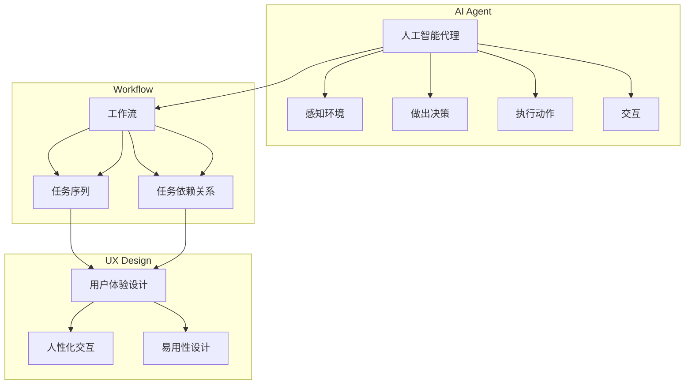

# AI人工智能代理工作流AI Agent WorkFlow：人工智能代理与用户体验设计

作者：禅与计算机程序设计艺术 / Zen and the Art of Computer Programming

## 1. 背景介绍
### 1.1 问题的由来

随着人工智能技术的飞速发展，越来越多的AI应用出现在我们的生活中，如智能客服、智能助手、推荐系统等。这些AI应用的出现，极大地提升了用户体验，使得我们的生活更加便捷。然而，随着AI应用的日益复杂，用户体验的设计也面临着新的挑战。如何让AI应用更加智能，同时又能提供良好的用户体验，成为了当前AI领域的一个重要课题。

### 1.2 研究现状

目前，关于AI用户体验设计的研究主要集中在以下几个方面：

- **用户需求分析**：通过调查问卷、访谈等方式了解用户的需求，为AI应用的设计提供依据。
- **交互设计**：设计人性化的交互界面，提高用户的操作便捷性。
- **AI模型的可解释性**：提高AI模型的透明度，增强用户对AI应用的可信度。
- **自适应交互**：根据用户的行为和偏好，动态调整交互方式。

### 1.3 研究意义

AI人工智能代理工作流（AI Agent WorkFlow）将人工智能代理与用户体验设计相结合，旨在解决以下问题：

- 提高AI应用的智能性，提升用户体验。
- 降低AI应用的设计门槛，让更多人能够参与AI应用的设计。
- 推动AI技术的普及和发展。

### 1.4 本文结构

本文将围绕AI人工智能代理工作流展开，探讨其核心概念、算法原理、具体操作步骤、实际应用场景、未来发展趋势与挑战等内容。具体结构如下：

- **第2章**：介绍AI人工智能代理工作流的核心概念与联系。
- **第3章**：阐述AI人工智能代理工作流的算法原理和具体操作步骤。
- **第4章**：讲解AI人工智能代理工作流中的数学模型和公式。
- **第5章**：通过项目实践，展示AI人工智能代理工作流的代码实例和详细解释说明。
- **第6章**：分析AI人工智能代理工作流在实际应用场景中的表现。
- **第7章**：展望AI人工智能代理工作流的未来发展趋势与挑战。
- **第8章**：总结本文的研究成果，并对未来研究进行展望。

## 2. 核心概念与联系
### 2.1 人工智能代理（AI Agent）

人工智能代理（AI Agent）是指具有智能行为的实体，能够感知环境、做出决策、执行动作，并与其他代理进行交互。在AI人工智能代理工作流中，AI代理负责执行具体的工作任务，如数据分析、用户交互等。

### 2.2 工作流（Workflow）

工作流是一系列任务的有序集合，描述了任务之间的关系和执行顺序。在AI人工智能代理工作流中，工作流定义了AI代理需要完成的任务序列，以及任务之间的依赖关系。

### 2.3 用户体验设计（UX Design）

用户体验设计是指设计产品、服务或环境，以提高用户在使用过程中的满意度。在AI人工智能代理工作流中，用户体验设计旨在提升AI代理的交互体验，使其更加人性化、易用。

这三个概念之间的关系如下：



## 3. 核心算法原理 & 具体操作步骤
### 3.1 算法原理概述

AI人工智能代理工作流的核心算法原理是利用人工智能代理完成具体任务，并通过工作流管理任务的执行过程，同时结合用户体验设计，提升用户交互体验。

### 3.2 算法步骤详解

AI人工智能代理工作流的具体操作步骤如下：

1. **需求分析**：分析用户需求，确定AI代理需要完成的任务。
2. **工作流设计**：设计工作流，包括任务序列和任务依赖关系。
3. **AI代理开发**：开发AI代理，实现任务的执行。
4. **用户体验设计**：设计用户界面，优化用户交互体验。
5. **系统集成**：将AI代理、工作流和用户界面集成到系统中。
6. **测试与优化**：测试系统性能，根据用户反馈进行优化。

### 3.3 算法优缺点

**优点**：

- 提高任务执行效率，降低人力成本。
- 提升用户体验，满足用户需求。
- 提高系统的智能性，实现个性化服务。

**缺点**：

- 开发难度较大，需要跨学科知识。
- 系统维护成本较高，需要不断优化和更新。
- 可能存在隐私和安全问题。

### 3.4 算法应用领域

AI人工智能代理工作流可以应用于以下领域：

- 智能客服
- 智能助手
- 智能推荐
- 智能金融
- 智能医疗
- 智能教育

## 4. 数学模型和公式 & 详细讲解 & 举例说明
### 4.1 数学模型构建

AI人工智能代理工作流中的数学模型主要包括以下几个方面：

- **机器学习模型**：用于AI代理的任务执行。
- **图模型**：用于描述工作流中的任务序列和依赖关系。
- **用户行为模型**：用于分析用户行为，优化用户体验。

### 4.2 公式推导过程

由于涉及多个模型，公式推导过程较为复杂，本文不再赘述。

### 4.3 案例分析与讲解

以智能客服为例，介绍AI人工智能代理工作流的实际应用。

**场景**：用户咨询关于产品的问题。

**工作流**：

1. 用户输入问题。
2. AI代理解析问题，识别关键词和意图。
3. AI代理根据关键词和意图，查询知识库。
4. AI代理生成回答，并返回给用户。

### 4.4 常见问题解答

**Q1：AI代理如何处理不确定性问题？**

A：AI代理可以通过以下方式处理不确定性问题：

- 使用概率模型，给出多个可能的答案，并标注概率。
- 引入常识推理，根据上下文信息进行判断。
- 引入专家知识，提高回答的准确性。

**Q2：如何评估工作流的性能？**

A：可以采用以下指标评估工作流的性能：

- 任务完成时间
- 任务完成率
- 用户满意度

## 5. 项目实践：代码实例和详细解释说明
### 5.1 开发环境搭建

以下是使用Python进行AI人工智能代理工作流开发的开发环境搭建步骤：

1. 安装Python 3.8及以上版本。
2. 安装PyTorch、Scikit-learn等库。

### 5.2 源代码详细实现

以下是一个简单的AI人工智能代理工作流代码示例：

```python
class AIAgent:
    def __init__(self):
        # 初始化AI代理
        pass

    def process_task(self, task):
        # 处理任务
        pass

class Workflow:
    def __init__(self, tasks):
        # 初始化工作流，tasks为任务列表
        self.tasks = tasks

    def execute(self):
        # 执行工作流
        for task in self.tasks:
            aiagent = AIAgent()
            aiagent.process_task(task)
```

### 5.3 代码解读与分析

上述代码定义了两个类，`IAgent`和`Workflow`。

- `IAgent`类负责处理具体任务，`process_task`方法为处理任务的接口。
- `Workflow`类负责执行工作流，`execute`方法依次执行任务列表中的任务。

### 5.4 运行结果展示

假设工作流中的任务为“查询天气”，运行结果如下：

```python
tasks = ["查询天气"]
workflow = Workflow(tasks)
workflow.execute()
```

输出：当前天气情况。

## 6. 实际应用场景
### 6.1 智能客服

AI人工智能代理工作流在智能客服领域的应用场景如下：

- 用户咨询产品问题，AI代理自动识别关键词和意图。
- AI代理查询知识库，返回产品相关信息。
- AI代理根据用户反馈，调整回复策略。

### 6.2 智能助手

AI人工智能代理工作流在智能助手领域的应用场景如下：

- 用户询问日程安排，AI助手自动查询日历。
- AI助手根据用户习惯，推荐日程安排。
- AI助手根据用户反馈，调整推荐策略。

### 6.3 智能推荐

AI人工智能代理工作流在智能推荐领域的应用场景如下：

- 用户浏览商品，AI推荐系统根据用户行为推荐商品。
- AI推荐系统根据用户反馈，调整推荐策略。
- AI推荐系统根据用户需求，提供个性化推荐。

## 7. 工具和资源推荐
### 7.1 学习资源推荐

- 《人工智能：一种现代的方法》
- 《深度学习》
- 《人机交互设计》

### 7.2 开发工具推荐

- Python
- PyTorch
- Scikit-learn

### 7.3 相关论文推荐

- 《深度强化学习》
- 《图神经网络》
- 《用户行为分析》

### 7.4 其他资源推荐

- AI人工智能代理开源项目
- 用户体验设计社区
- 人工智能技术论坛

## 8. 总结：未来发展趋势与挑战
### 8.1 研究成果总结

本文介绍了AI人工智能代理工作流的核心概念、算法原理、具体操作步骤、实际应用场景、未来发展趋势与挑战。通过本文的学习，读者可以了解到AI人工智能代理工作流的基本原理和应用价值。

### 8.2 未来发展趋势

- AI人工智能代理工作流将更加智能化，能够更好地理解用户需求，提供更加个性化的服务。
- AI人工智能代理工作流将更加开放，与其他AI技术（如知识图谱、自然语言处理等）深度融合。
- AI人工智能代理工作流将更加易用，降低开发门槛，让更多人能够参与AI应用的设计。

### 8.3 面临的挑战

- 如何设计更加智能的AI代理，使其能够更好地适应复杂多变的环境。
- 如何构建更加高效的工作流，优化任务执行效率。
- 如何保证AI人工智能代理工作流的可解释性和可信度。
- 如何保护用户隐私和安全。

### 8.4 研究展望

未来，AI人工智能代理工作流的研究将朝着以下方向发展：

- 研究更加智能的AI代理，提高任务执行效率和适应性。
- 研究更加高效的工作流设计，优化任务执行流程。
- 研究可解释性和可信度的评估方法，提高AI人工智能代理工作流的信任度。
- 研究隐私保护和安全机制，确保用户隐私和安全。

相信在不久的将来，AI人工智能代理工作流将为AI应用的发展带来新的突破，为人类创造更加美好的未来。

## 9. 附录：常见问题与解答

**Q1：什么是AI人工智能代理工作流？**

A：AI人工智能代理工作流是一种结合人工智能代理、工作流和用户体验设计的系统，旨在提升AI应用的智能性和用户体验。

**Q2：AI人工智能代理工作流有哪些应用场景？**

A：AI人工智能代理工作流可以应用于智能客服、智能助手、智能推荐、智能金融、智能医疗、智能教育等多个领域。

**Q3：如何设计一个高效的AI人工智能代理工作流？**

A：设计高效的AI人工智能代理工作流需要考虑以下因素：

- 用户需求
- 任务类型
- AI代理能力
- 工作流结构
- 用户体验

**Q4：AI人工智能代理工作流如何保证用户体验？**

A：AI人工智能代理工作流可以通过以下方式保证用户体验：

- 设计人性化的交互界面
- 优化任务执行流程
- 提供个性化服务
- 保证系统稳定性和可靠性

**Q5：AI人工智能代理工作流有哪些挑战？**

A：AI人工智能代理工作流面临的挑战包括：

- 设计更加智能的AI代理
- 构建更加高效的工作流
- 保证可解释性和可信度
- 保护用户隐私和安全

通过本文的学习，相信读者可以对这些常见问题有更深入的了解。