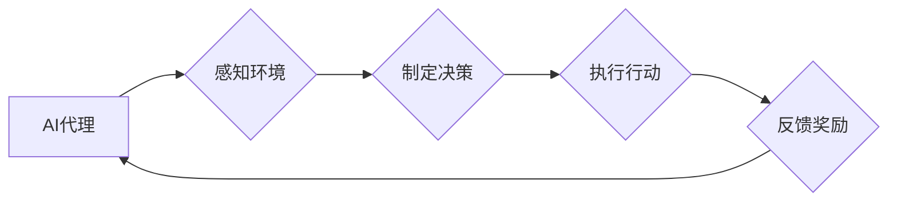

# AI人工智能代理工作流AI Agent WorkFlow：使用强化学习优化代理工作流

作者：禅与计算机程序设计艺术 / Zen and the Art of Computer Programming

## 1. 背景介绍

### 1.1 问题的由来

随着人工智能技术的不断发展，越来越多的企业和组织开始探索如何将AI技术应用于实际业务流程中。AI代理（AI Agent）作为一种模拟人类智能行为的实体，能够自动执行任务、做出决策，并在复杂的业务环境中与人类或其他系统进行交互。然而，在实际应用中，AI代理的工作流程往往存在效率低下、效果不理想等问题，制约了AI技术在业务流程中的应用效果。

### 1.2 研究现状

近年来，强化学习（Reinforcement Learning, RL）作为一种有效的机器学习技术，被广泛应用于AI代理工作流程的优化。通过强化学习，AI代理可以根据环境反馈和奖励信号，不断调整自己的行为策略，从而在复杂的工作流程中找到最优的行动路径。

### 1.3 研究意义

研究AI代理工作流优化技术，对于推动AI技术在实际业务流程中的应用具有重要意义。通过使用强化学习优化AI代理工作流，可以实现以下目标：

- 提高工作流程的执行效率，降低人力成本。
- 提升工作流程的执行质量，减少错误率和返工率。
- 增强工作流程的适应性，应对复杂多变的环境。
- 推动AI技术与业务流程深度融合，实现智能化、自动化管理。

### 1.4 本文结构

本文将围绕AI人工智能代理工作流优化技术展开，主要内容包括：

- 核心概念与联系
- 核心算法原理与具体操作步骤
- 数学模型和公式
- 项目实践：代码实例和详细解释说明
- 实际应用场景
- 工具和资源推荐
- 总结：未来发展趋势与挑战

## 2. 核心概念与联系

### 2.1 关键概念

为了更好地理解AI人工智能代理工作流优化技术，以下介绍一些关键概念：

- **AI代理（AI Agent）**：一种模拟人类智能行为的实体，能够感知环境、制定决策、执行行动，并与其他实体进行交互。
- **工作流（WorkFlow）**：一组有序的活动序列，用于实现特定业务目标。
- **强化学习（Reinforcement Learning, RL）**：一种机器学习技术，通过让智能体在环境中不断尝试、学习和优化行为策略，以实现目标。
- **状态（State）**：描述AI代理所处环境的特征。
- **动作（Action）**：AI代理能够执行的行为。
- **奖励（Reward）**：环境对AI代理行为的反馈信号。

### 2.2 关联关系

AI代理工作流优化技术中的各个概念之间存在紧密的联系，如下所示：



AI代理通过感知环境获取状态信息，制定相应的动作策略，执行行动后获取奖励信号，并以此作为下一步决策的依据。这个过程不断循环，使AI代理不断学习和优化行为策略。

## 3. 核心算法原理 & 具体操作步骤

### 3.1 算法原理概述

强化学习是一种通过与环境交互，不断学习最优行为策略的机器学习技术。在AI代理工作流优化中，强化学习通常采用以下步骤：

1. **定义环境**：明确AI代理所在的环境，包括状态、动作、奖励等要素。
2. **设计策略**：制定AI代理的行动规则，用于根据当前状态选择动作。
3. **学习与优化**：通过与环境交互，不断调整策略参数，以最大化长期奖励。

### 3.2 算法步骤详解

以下是AI代理工作流优化中强化学习算法的具体步骤：

**Step 1：定义环境**

- 确定状态空间和动作空间。
- 设计状态、动作、奖励的定义和计算方法。

**Step 2：设计策略**

- 设计基于强化学习的策略函数，用于根据当前状态选择动作。
- 可采用确定性策略（如ε-greedy策略）或随机策略。

**Step 3：学习与优化**

- 初始化策略参数。
- 使用蒙特卡洛方法、Q-learning、深度Q网络（DQN）等算法进行学习。
- 根据奖励信号调整策略参数。

### 3.3 算法优缺点

**优点**：

- 能够适应复杂多变的环境，提高工作流程的适应性。
- 通过优化策略参数，实现工作流程的自动化和智能化。
- 能够根据实际效果动态调整策略，提高工作流程的执行效率。

**缺点**：

- 需要大量的训练数据和学习时间。
- 策略优化过程可能陷入局部最优，难以达到全局最优。

### 3.4 算法应用领域

强化学习在AI代理工作流优化中的应用领域广泛，以下列举一些典型场景：

- 工业自动化：优化生产线上的设备调度、物料搬运等工作流程。
- 供应链管理：优化库存管理、物流配送等工作流程。
- 财务管理：优化投资组合、风险管理等工作流程。
- 客户服务：优化客户接待、投诉处理等工作流程。
- 基于AI的推荐系统：优化个性化推荐、广告投放等工作流程。

## 4. 数学模型和公式 & 详细讲解 & 举例说明

### 4.1 数学模型构建

在强化学习中，常用的数学模型包括：

- **马尔可夫决策过程（MDP）**：描述AI代理与环境交互的过程，包括状态空间、动作空间、状态转移概率、奖励函数等。

$$
\text{MDP} = \{S, A, P, R, \gamma\}
$$

其中：

- $S$：状态空间
- $A$：动作空间
- $P$：状态转移概率
- $R$：奖励函数
- $\gamma$：折扣因子

- **Q函数（Q-value）**：描述AI代理在特定状态下采取特定动作的期望长期奖励。

$$
Q(s,a) = \sum_{s'} P(s'|s,a) \cdot \gamma \cdot R(s',a')
$$

其中：

- $s$：当前状态
- $a$：当前动作
- $s'$：下一状态
- $a'$：下一动作
- $P(s'|s,a)$：在状态 $s$ 下采取动作 $a$ 后进入状态 $s'$ 的概率
- $\gamma$：折扣因子，用于考虑未来奖励的现值

### 4.2 公式推导过程

以下以Q-learning算法为例，介绍Q函数的推导过程。

Q-learning是一种基于值函数的强化学习算法，其核心思想是学习Q值，即：

$$
Q(s,a) = \mathbb{E}[R_{t+1} + \gamma \cdot Q(s',a') | s, a]
$$

其中：

- $R_{t+1}$：在 $t+1$ 时刻获得的奖励
- $s'$：在 $t+1$ 时刻的状态
- $a'$：在 $t+1$ 时刻的动作
- $\gamma$：折扣因子

通过迭代更新Q值，Q-learning算法最终能够学习到最优策略。

### 4.3 案例分析与讲解

以下以一个简单的机器人导航任务为例，介绍如何使用Q-learning算法进行AI代理工作流优化。

假设机器人需要在二维平面中从起点 $A$ 移动到终点 $B$，可以执行以下动作：

- 向上移动
- 向下移动
- 向左移动
- 向右移动

环境定义如下：

- 状态空间：二维平面上的坐标点 $(x,y)$
- 动作空间：向上移动、向下移动、向左移动、向右移动
- 奖励函数：到达终点 $B$ 获得奖励 $+1$，否则获得奖励 $-1$
- 状态转移概率：在当前位置执行动作后，以一定概率到达相邻位置

采用Q-learning算法进行训练，经过一定次数的迭代后，机器人能够学会从起点 $A$ 移动到终点 $B$ 的最优路径。

### 4.4 常见问题解答

**Q1：如何选择合适的折扣因子 $\gamma$？**

A：折扣因子 $\gamma$ 的选择对强化学习算法的性能有一定影响。一般来说，较小的 $\gamma$ 会使奖励信号对当前决策的影响减小，而较大的 $\gamma$ 则会使奖励信号对当前决策的影响增大。在实际应用中，需要根据具体任务和数据特点进行选择，通常在0.9到0.99之间。

**Q2：如何处理连续动作空间？**

A：对于连续动作空间，可以采用动作空间量化技术，将连续的动作空间离散化为有限的动作集合，然后采用Q-learning等算法进行训练。

**Q3：如何处理不可达状态？**

A：对于不可达状态，可以将其定义为特殊的虚拟状态，并设置对应的奖励函数和状态转移概率。

## 5. 项目实践：代码实例和详细解释说明

### 5.1 开发环境搭建

为了实现AI代理工作流优化，需要搭建以下开发环境：

- Python 3.x及以上版本
- PyTorch 1.x及以上版本
- Gym环境

### 5.2 源代码详细实现

以下是一个使用PyTorch和Gym环境实现Q-learning算法的示例代码：

```python
import gym
import numpy as np
import torch
import torch.nn as nn
import torch.optim as optim

# 创建环境
env = gym.make('CartPole-v0')

# 定义网络结构
class QNetwork(nn.Module):
    def __init__(self):
        super(QNetwork, self).__init__()
        self.fc1 = nn.Linear(4, 24)
        self.fc2 = nn.Linear(24, 24)
        self.fc3 = nn.Linear(24, 2)

    def forward(self, x):
        x = torch.relu(self.fc1(x))
        x = torch.relu(self.fc2(x))
        x = self.fc3(x)
        return x

# 初始化网络和优化器
q_network = QNetwork().to(device)
optimizer = optim.Adam(q_network.parameters(), lr=0.01)

# 定义折扣因子
gamma = 0.99

# Q-learning训练
def train(num_episodes):
    for episode in range(num_episodes):
        state = env.reset()
        done = False
        while not done:
            # 前向传播
            q_values = q_network(torch.from_numpy(state).float().to(device))
            action = np.argmax(q_values.data.cpu().numpy())

            # 执行动作
            next_state, reward, done, _ = env.step(action)
            next_q_values = q_network(torch.from_numpy(next_state).float().to(device))

            # 计算目标Q值
            if done:
                target = reward
            else:
                target = reward + gamma * torch.max(next_q_values).item()

            # 反向传播
            q_values[0][action] = target

            # 更新网络参数
            optimizer.zero_grad()
            q_values.backward()
            optimizer.step()

            # 更新状态
            state = next_state

# 运行训练
train(1000)

# 保存模型
torch.save(q_network.state_dict(), 'q_network.pth')
```

### 5.3 代码解读与分析

- 首先，导入必要的库和模块。
- 创建环境，选择CartPole-v0环境作为训练目标。
- 定义网络结构，包含两个全连接层和一个输出层，用于计算Q值。
- 初始化网络和优化器，设置学习率。
- 定义折扣因子，用于计算目标Q值。
- 定义Q-learning训练函数，包括状态初始化、动作选择、执行动作、计算目标Q值、反向传播、更新网络参数等步骤。
- 运行训练，迭代1000次。
- 保存训练好的网络模型。

### 5.4 运行结果展示

运行以上代码后，可以在CartPole-v0环境中观察训练过程。经过一定次数的迭代后，机器人能够学会稳定地在环境中完成目标。

## 6. 实际应用场景

### 6.1 智能制造

在智能制造领域，AI代理工作流优化可以应用于以下场景：

- 生产线调度：根据生产订单、设备状态、物料库存等因素，自动优化生产线上的设备调度，提高生产效率。
- 质量检测：对产品进行质量检测，识别出不合格品，并优化检测流程，降低不良品率。
- 设备维护：根据设备运行状态和故障历史，预测设备故障，并优化维护计划，降低设备故障率。

### 6.2 供应链管理

在供应链管理领域，AI代理工作流优化可以应用于以下场景：

- 库存管理：根据销售预测、订单数量等因素，优化库存管理策略，降低库存成本。
- 物流配送：根据订单信息、运输成本、道路状况等因素，优化物流配送路线，降低物流成本。
- 风险管理：根据历史数据和市场信息，预测供应链风险，并优化风险管理策略，降低风险损失。

### 6.3 金融风控

在金融风控领域，AI代理工作流优化可以应用于以下场景：

- 信用评估：根据客户信息、交易记录等因素，评估客户信用风险，优化信贷审批流程。
- 欺诈检测：根据交易数据、用户行为等因素，检测交易欺诈行为，提高欺诈检测效果。
- 风险预警：根据市场数据、经济指标等因素，预测市场风险，并发出预警信号。

### 6.4 未来应用展望

随着AI技术的不断发展，AI代理工作流优化将在更多领域得到应用，以下列举一些未来应用展望：

- 智能交通：优化交通信号灯控制、公共交通调度等工作流程，提高交通效率，降低交通拥堵。
- 智能家居：优化家庭设备使用、能源管理等工作流程，提高家居舒适度，降低能耗。
- 智能医疗：优化医疗诊断、治疗方案、患者管理等工作流程，提高医疗服务质量，降低医疗成本。

## 7. 工具和资源推荐

### 7.1 学习资源推荐

为了帮助开发者掌握AI代理工作流优化技术，以下推荐一些学习资源：

- 《强化学习：原理与实战》
- 《深度强化学习》
- 《深度学习：卷积神经网络与RNN》
- Hugging Face官网：https://huggingface.co/
- OpenAI官网：https://openai.com/

### 7.2 开发工具推荐

为了实现AI代理工作流优化，以下推荐一些开发工具：

- PyTorch：https://pytorch.org/
- TensorFlow：https://www.tensorflow.org/
- Gym：https://gym.openai.com/

### 7.3 相关论文推荐

以下推荐一些与AI代理工作流优化相关的论文：

- “Deep Reinforcement Learning for Autonomous Navigation” by Tom Schaul et al.
- “Deep Deterministic Policy Gradient” by Tom Schaul et al.
- “Asynchronous Advantage Actor-Critic” by Schaul et al.
- “Prioritized Experience Replay” by van Seijen et al.

### 7.4 其他资源推荐

以下推荐一些与AI代理工作流优化相关的其他资源：

- 强化学习开源项目：https://github.com/openai/baselines
- 智能代理开源项目：https://github.com/huawei-noah/GammaFlow
- 人工智能社区：https://zhuanlan.zhihu.com/c_125220243

## 8. 总结：未来发展趋势与挑战

### 8.1 研究成果总结

本文对AI人工智能代理工作流优化技术进行了系统介绍，包括核心概念、算法原理、实际应用场景等。通过学习本文，读者可以了解AI代理工作流优化技术的基本原理和应用方法，为在实践项目中应用该技术提供参考。

### 8.2 未来发展趋势

随着AI技术的不断发展，AI代理工作流优化技术将呈现以下发展趋势：

- 模型性能不断提升：随着深度学习、强化学习等技术的不断发展，AI代理工作流优化模型的性能将得到进一步提升。
- 应用领域不断拓展：AI代理工作流优化技术将应用于更多领域，如智能制造、供应链管理、金融风控等。
- 跨领域融合：AI代理工作流优化技术将与知识图谱、自然语言处理等技术进行融合，实现更加智能、高效的工作流程。

### 8.3 面临的挑战

虽然AI代理工作流优化技术在许多领域取得了显著成果，但仍面临以下挑战：

- 计算资源需求：训练和部署AI代理工作流优化模型需要大量的计算资源，这限制了其在实际应用中的普及。
- 数据质量和标注：高质量的数据和标注对于训练有效的AI代理工作流优化模型至关重要，但获取高质量数据成本高昂。
- 模型可解释性：AI代理工作流优化模型通常被视为“黑盒”，其决策过程难以解释，这限制了其在某些领域的应用。

### 8.4 研究展望

为了解决上述挑战，未来的研究可以从以下方面展开：

- 研究更加高效的训练和推理算法，降低计算资源需求。
- 探索数据增强、主动学习等技术，提高数据质量和标注效率。
- 研究可解释性强的AI代理工作流优化模型，提高模型的可信度和应用范围。

通过不断探索和创新，相信AI代理工作流优化技术将在未来发挥更大的作用，推动各行各业实现智能化、自动化发展。

## 9. 附录：常见问题与解答

**Q1：什么是AI代理？**

A：AI代理是一种模拟人类智能行为的实体，能够感知环境、制定决策、执行行动，并与其他实体进行交互。

**Q2：什么是工作流？**

A：工作流是一组有序的活动序列，用于实现特定业务目标。

**Q3：什么是强化学习？**

A：强化学习是一种机器学习技术，通过让智能体在环境中不断尝试、学习和优化行为策略，以实现目标。

**Q4：如何选择合适的折扣因子 $\gamma$？**

A：折扣因子 $\gamma$ 的选择对强化学习算法的性能有一定影响。一般来说，较小的 $\gamma$ 会使奖励信号对当前决策的影响减小，而较大的 $\gamma$ 则会使奖励信号对当前决策的影响增大。在实际应用中，需要根据具体任务和数据特点进行选择，通常在0.9到0.99之间。

**Q5：如何处理连续动作空间？**

A：对于连续动作空间，可以采用动作空间量化技术，将连续的动作空间离散化为有限的动作集合，然后采用Q-learning等算法进行训练。

**Q6：如何处理不可达状态？**

A：对于不可达状态，可以将其定义为特殊的虚拟状态，并设置对应的奖励函数和状态转移概率。