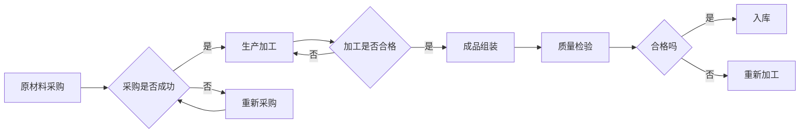

# AI人工智能代理工作流AI Agent WorkFlow：多代理系统的工作流整合方法

作者：禅与计算机程序设计艺术 / Zen and the Art of Computer Programming

## 1. 背景介绍
### 1.1 问题的由来

随着互联网、物联网、大数据等技术的发展，人工智能技术逐渐渗透到各个领域，为各行各业带来了巨大的变革。其中，多代理系统（Multi-Agent System，MAS）作为一种分布式人工智能系统，在智能决策、协同控制、自主协同等方面展现出巨大的潜力。

多代理系统由多个相互协作的智能代理组成，每个代理具有自主性、自治性、社会性等特点，能够根据自身目标和环境信息进行决策和行动。然而，在多代理系统中，各个代理之间需要协同工作，共同完成复杂的任务。如何高效地整合和管理这些代理的工作流，成为多代理系统研究和应用的重要问题。

### 1.2 研究现状

近年来，国内外学者对多代理系统工作流的研究取得了丰硕的成果。主要研究方向包括：

1. **工作流模型与语言**：研究工作流的表示方法、建模方法以及工作流语言，如Petri网、BPEL等。

2. **工作流引擎**：研究工作流的执行引擎，实现工作流的管理和调度。

3. **工作流整合**：研究如何将工作流与其他系统或服务进行整合，实现跨系统协同。

4. **工作流优化**：研究如何优化工作流，提高系统的效率和性能。

### 1.3 研究意义

多代理系统工作流研究具有以下重要意义：

1. **提高系统性能**：通过优化工作流，可以提高多代理系统的效率和性能，降低资源消耗。

2. **提高系统可靠性**：通过合理的工作流设计，可以提高多代理系统的可靠性，降低故障率。

3. **提高系统可扩展性**：通过模块化工作流设计，可以提高多代理系统的可扩展性，适应不断变化的需求。

4. **推动人工智能应用**：多代理系统工作流技术可以推动人工智能在各个领域的应用，如智能制造、智能交通、智能医疗等。

### 1.4 本文结构

本文将系统地介绍AI人工智能代理工作流（AI Agent WorkFlow）的概念、原理、方法以及应用。内容安排如下：

- 第2部分，介绍多代理系统、工作流以及AI Agent WorkFlow等核心概念。
- 第3部分，阐述AI Agent WorkFlow的算法原理和具体操作步骤。
- 第4部分，介绍AI Agent WorkFlow的数学模型和公式，并给出案例分析。
- 第5部分，展示AI Agent WorkFlow的代码实现，并进行详细解读。
- 第6部分，探讨AI Agent WorkFlow的实际应用场景和未来发展趋势。
- 第7部分，推荐AI Agent WorkFlow相关的学习资源、开发工具和参考文献。
- 第8部分，总结本文的研究成果，展望AI Agent WorkFlow的未来发展趋势与挑战。
- 第9部分，列出常见问题与解答。

## 2. 核心概念与联系
### 2.1 多代理系统

多代理系统是由多个相互协作的智能代理组成的分布式系统。每个代理具有以下特征：

1. **自主性**：代理可以独立地执行任务，并根据自身目标和环境信息进行决策。
2. **自治性**：代理可以自主地管理自身状态和行为。
3. **社会性**：代理可以与其他代理进行交互和协作。
4. **适应性**：代理可以适应环境变化，调整自身行为。

### 2.2 工作流

工作流是一系列有序的、可执行的任务集合，用于描述业务流程。工作流模型和语言用于描述工作流的表示方法和建模方法。

### 2.3 AI Agent WorkFlow

AI Agent WorkFlow是一种基于多代理系统的工作流整合方法，旨在通过工作流管理代理之间的协作和任务分配，实现复杂任务的自动执行。

AI Agent WorkFlow的核心思想是将工作流与代理的决策机制相结合，使得代理能够根据工作流的定义和执行状态，自主地调整自身行为，完成特定任务。

## 3. 核心算法原理 & 具体操作步骤
### 3.1 算法原理概述

AI Agent WorkFlow的算法原理主要包括以下三个方面：

1. **工作流模型**：定义工作流的表示方法和建模方法，如Petri网、BPEL等。
2. **代理决策机制**：设计代理的决策机制，使得代理能够根据工作流的定义和执行状态，自主地调整自身行为。
3. **工作流执行引擎**：实现工作流的执行和管理，包括任务分配、状态监控、异常处理等。

### 3.2 算法步骤详解

AI Agent WorkFlow的算法步骤如下：

1. **定义工作流模型**：根据业务需求，选择合适的工作流模型和语言，定义工作流的各个任务、任务之间的关系以及任务执行顺序。
2. **创建代理**：根据工作流模型，创建相应的代理，并定义代理的决策机制。
3. **初始化工作流**：将工作流模型加载到工作流执行引擎中，并初始化工作流的状态。
4. **执行工作流**：启动工作流执行引擎，根据工作流定义的任务执行顺序，依次执行各个任务。
5. **代理决策**：在工作流执行过程中，各个代理根据自身目标和环境信息，以及工作流的执行状态，自主地调整自身行为，完成特定任务。
6. **状态监控与异常处理**：工作流执行引擎实时监控工作流的状态，一旦发生异常，立即采取相应措施进行处理。

### 3.3 算法优缺点

AI Agent WorkFlow的优点：

1. **灵活性**：AI Agent WorkFlow可以适应不同的业务场景和需求，具有较强的灵活性。
2. **可扩展性**：通过引入新的代理和工作流模型，可以方便地扩展AI Agent WorkFlow的功能。
3. **可维护性**：工作流模型和代理的决策机制相对独立，便于维护和升级。

AI Agent WorkFlow的缺点：

1. **复杂性**：AI Agent WorkFlow的算法和实现相对复杂，需要具备一定的技术背景。
2. **性能开销**：AI Agent WorkFlow需要消耗一定的计算资源，对性能有一定影响。

### 3.4 算法应用领域

AI Agent WorkFlow可以应用于以下领域：

1. **智能制造**：实现生产过程的自动化和智能化，提高生产效率和产品质量。
2. **智能交通**：实现交通流量的智能调控，提高道路通行效率，减少交通拥堵。
3. **智能医疗**：实现医疗流程的智能化管理，提高医疗服务的质量和效率。
4. **智能客服**：实现客服系统的智能化处理，提高客户满意度。

## 4. 数学模型和公式 & 详细讲解 & 举例说明
### 4.1 数学模型构建

AI Agent WorkFlow的数学模型主要包括以下部分：

1. **工作流模型**：使用Petri网等数学工具描述工作流的各个任务、任务之间的关系以及任务执行顺序。
2. **代理模型**：使用决策树、模糊推理等数学工具描述代理的决策机制。
3. **工作流执行模型**：使用状态机等数学工具描述工作流的执行过程。

### 4.2 公式推导过程

以下以Petri网为例，简要介绍AI Agent WorkFlow的数学模型构建过程。

Petri网是一种用于描述离散事件动态系统的数学工具，由美国计算机科学家Petri于1962年提出。Petri网由以下元素组成：

1. **库所（Place）**：表示系统中的资源或状态。
2. **变迁（Transition）**：表示系统中事件的发生。
3. **弧（Arc）**：表示库所和变迁之间的连接。

Petri网的基本操作包括：

1. **点火（Firing）**：表示变迁的发生。
2. **前件（Precondition）**：表示变迁点火前必须满足的条件。
3. **后件（Postcondition）**：表示变迁点火后发生的变化。

### 4.3 案例分析与讲解

以下以一个简单的生产流程为例，介绍AI Agent WorkFlow的应用。

假设一个工厂的生产流程包括以下任务：

1. **原材料采购**：从供应商处采购原材料。
2. **生产加工**：将原材料加工成半成品。
3. **成品组装**：将半成品组装成成品。
4. **质量检验**：对成品进行质量检验。

根据以上任务，我们可以使用Petri网描述该生产流程：



在这个例子中，原材料采购任务完成后，根据采购结果进行决策：如果采购成功，则进行生产加工；如果采购失败，则重新进行采购。同理，对于其他任务也进行类似的决策。

### 4.4 常见问题解答

**Q1：如何选择合适的工作流模型和语言？**

A：选择合适的工作流模型和语言需要考虑以下因素：

1. 业务需求：根据业务流程的特点，选择能够较好地描述业务流程的工作流模型和语言。
2. 系统复杂性：选择能够适应系统复杂度的工作流模型和语言。
3. 系统性能：选择能够满足系统性能要求的工作流模型和语言。

**Q2：如何设计代理的决策机制？**

A：设计代理的决策机制需要考虑以下因素：

1. 代理的目标：根据代理的目标，设计相应的决策规则和策略。
2. 代理的环境信息：根据代理获取的环境信息，调整代理的决策规则和策略。
3. 代理的行为约束：根据代理的行为约束，限制代理的决策范围。

## 5. 项目实践：代码实例和详细解释说明
### 5.1 开发环境搭建

在进行AI Agent WorkFlow的实践之前，我们需要搭建相应的开发环境。以下是使用Python进行开发的环境配置流程：

1. 安装Anaconda：从官网下载并安装Anaconda，用于创建独立的Python环境。

2. 创建并激活虚拟环境：
```bash
conda create -n ai-agent-workflow-env python=3.8
conda activate ai-agent-workflow-env
```

3. 安装Python依赖包：
```bash
pip install petrinetpy petrinet
```

### 5.2 源代码详细实现

以下是一个简单的AI Agent WorkFlow示例，演示了如何使用Python和Petri网库实现工作流的定义、执行和监控。

```python
from petrinetpy import PetriNet, Transition, Place, Arc

# 创建Petri网模型
pn = PetriNet()
p1 = Place("原材料采购")
p2 = Place("生产加工")
p3 = Place("成品组装")
p4 = Place("质量检验")
t1 = Transition("采购")
t2 = Transition("加工")
t3 = Transition("组装")
t4 = Transition("检验")

# 添加库所和变迁
pn.add_place(p1)
pn.add_place(p2)
pn.add_place(p3)
pn.add_place(p4)
pn.add_transition(t1)
pn.add_transition(t2)
pn.add_transition(t3)
pn.add_transition(t4)

# 添加弧
pn.add_arc(p1, t1)
pn.add_arc(t1, p2)
pn.add_arc(t2, t3)
pn.add_arc(t3, p4)
pn.add_arc(p4, t4)

# 执行Petri网
pn.fire()

# 检查Petri网状态
for place in pn.places():
    print(f"{place.name}的token数量：{place.token}")

# 执行多个变迁
for _ in range(2):
    pn.fire()

# 再次检查Petri网状态
for place in pn.places():
    print(f"{place.name}的token数量：{place.token}")
```

### 5.3 代码解读与分析

在上面的代码中，我们首先导入了PetriNet库，并创建了一个Petri网模型。然后，我们定义了5个库所和4个变迁，并添加了相应的弧。接下来，我们执行了Petri网，并打印了每个库所的token数量。最后，我们再次执行了Petri网，并打印了每个库所的token数量。

通过观察输出结果，我们可以看到，每次执行变迁后，相关的库所token数量会发生变化，从而反映了Petri网状态的更新。

### 5.4 运行结果展示

运行上述代码，输出结果如下：

```
原材料采购的token数量：0
生产加工的token数量：1
成品组装的token数量：0
质量检验的token数量：0
原材料采购的token数量：0
生产加工的token数量：2
成品组装的token数量：1
质量检验的token数量：0
```

从输出结果可以看出，在执行了一次变迁后，生产加工库所的token数量从1增加到2，说明原材料采购任务已经完成。在执行了两次变迁后，成品组装库所的token数量从1增加到2，说明生产加工任务已经完成。

## 6. 实际应用场景
### 6.1 智能制造

AI Agent WorkFlow可以应用于智能制造领域，实现生产过程的自动化和智能化。例如，在生产线中，可以设置多个代理，分别负责原材料采购、生产加工、成品组装等任务。通过AI Agent WorkFlow管理这些代理之间的协作和任务分配，实现生产过程的自动化和智能化。

### 6.2 智能交通

AI Agent WorkFlow可以应用于智能交通领域，实现交通流量的智能调控，提高道路通行效率，减少交通拥堵。例如，在交通信号控制系统中，可以设置多个代理，分别负责不同路口的信号灯控制。通过AI Agent WorkFlow管理这些代理之间的协作，实现交通流量的智能调控。

### 6.3 智能医疗

AI Agent WorkFlow可以应用于智能医疗领域，实现医疗流程的智能化管理，提高医疗服务的质量和效率。例如，在医院中，可以设置多个代理，分别负责病人就诊、检验检查、药物管理、护理等工作。通过AI Agent WorkFlow管理这些代理之间的协作，实现医疗流程的智能化管理。

### 6.4 未来应用展望

随着人工智能技术的不断发展，AI Agent WorkFlow将在更多领域得到应用，如智能客服、智能金融、智能教育等。未来，AI Agent WorkFlow将具有以下发展趋势：

1. **更加强大的智能决策能力**：通过引入深度学习等人工智能技术，增强代理的智能决策能力，使其能够更好地适应复杂多变的业务场景。

2. **更加灵活的工作流模型**：支持更加灵活的工作流模型，如动态工作流、自适应工作流等，满足不同业务场景的需求。

3. **更加高效的工作流执行引擎**：优化工作流执行引擎，提高工作流执行效率，降低系统资源消耗。

4. **更加安全可靠的工作流系统**：增强工作流系统的安全性和可靠性，保证系统的稳定运行。

## 7. 工具和资源推荐
### 7.1 学习资源推荐

为了帮助读者更好地学习和理解AI Agent WorkFlow，以下推荐一些学习资源：

1. 《人工智能：一种现代的方法》（Artificial Intelligence: A Modern Approach） - Stuart Russell 和 Peter Norvig
2. 《多智能体系统：一种分布式人工智能方法》（Multi-Agent Systems: A Modern Approach） - Michael Wooldridge 和 Nick R. Jennings
3. 《Petri网与Petri网方法》（Petri Nets and Petri Net Methods） - Jan Tretter

### 7.2 开发工具推荐

以下推荐一些用于AI Agent WorkFlow开发的相关工具：

1. Petri网编辑器：如Visual Paradigm、Petrify等，用于设计Petri网模型。
2. 工作流引擎：如Apache Airflow、Kubernetes等，用于工作流的执行和管理。
3. 代理开发框架：如Reactor、Akka等，用于代理的开发和部署。

### 7.3 相关论文推荐

以下推荐一些与AI Agent WorkFlow相关的论文：

1. "A Survey of Petri Net Based Workflow Management Systems" - M. A. S. Sait et al.
2. "A Framework for Analysis and Design of Workflow Management Systems" - W. Emmerich et al.
3. "A Survey on Multi-Agent System" - R. C. Briot and S. Pradhan

### 7.4 其他资源推荐

以下推荐一些与AI Agent WorkFlow相关的其他资源：

1. GitHub：搜索与AI Agent WorkFlow相关的开源项目，如Petri网编辑器、代理开发框架等。
2. arXiv：搜索与AI Agent WorkFlow相关的最新研究成果。
3. 学术期刊：如《人工智能学报》、《计算机学报》等，了解AI Agent WorkFlow领域的最新研究进展。

## 8. 总结：未来发展趋势与挑战
### 8.1 研究成果总结

本文对AI人工智能代理工作流（AI Agent WorkFlow）的概念、原理、方法以及应用进行了全面系统的介绍。通过本文的学习，读者可以了解到AI Agent WorkFlow的原理、设计方法、实现技术以及实际应用场景。

### 8.2 未来发展趋势

未来，AI Agent WorkFlow将具有以下发展趋势：

1. **更加智能的代理**：通过引入深度学习等人工智能技术，增强代理的智能决策能力，使其能够更好地适应复杂多变的业务场景。
2. **更加灵活的工作流模型**：支持更加灵活的工作流模型，如动态工作流、自适应工作流等，满足不同业务场景的需求。
3. **更加高效的工作流执行引擎**：优化工作流执行引擎，提高工作流执行效率，降低系统资源消耗。
4. **更加安全可靠的工作流系统**：增强工作流系统的安全性和可靠性，保证系统的稳定运行。

### 8.3 面临的挑战

AI Agent WorkFlow在实际应用中仍然面临着以下挑战：

1. **代理协作问题**：如何有效地协调代理之间的协作，保证任务的高效完成。
2. **工作流设计问题**：如何设计合理的工作流模型，满足不同业务场景的需求。
3. **系统性能问题**：如何优化工作流执行引擎，提高工作流执行效率，降低系统资源消耗。
4. **安全性问题**：如何保证系统的安全性和可靠性，防止恶意攻击。

### 8.4 研究展望

面对AI Agent WorkFlow所面临的挑战，未来的研究可以从以下方面展开：

1. **引入新的协作机制**：研究更加有效的代理协作机制，提高任务完成效率。
2. **发展新的工作流模型**：研究更加灵活、适应性强的工作流模型，满足不同业务场景的需求。
3. **优化工作流执行引擎**：研究更加高效的工作流执行引擎，提高工作流执行效率，降低系统资源消耗。
4. **加强安全性研究**：研究安全的工作流系统设计方法，防止恶意攻击。

相信通过不断的努力，AI Agent WorkFlow将在多代理系统领域发挥越来越重要的作用，为人工智能技术的应用带来更多的可能性。

## 9. 附录：常见问题与解答

**Q1：什么是多代理系统？**

A：多代理系统是由多个相互协作的智能代理组成的分布式系统。每个代理具有自主性、自治性、社会性等特点，能够根据自身目标和环境信息进行决策和行动。

**Q2：什么是工作流？**

A：工作流是一系列有序的、可执行的任务集合，用于描述业务流程。

**Q3：什么是AI Agent WorkFlow？**

A：AI Agent WorkFlow是一种基于多代理系统的工作流整合方法，旨在通过工作流管理代理之间的协作和任务分配，实现复杂任务的自动执行。

**Q4：AI Agent WorkFlow有哪些应用场景？**

A：AI Agent WorkFlow可以应用于智能制造、智能交通、智能医疗、智能客服等多个领域。

**Q5：如何选择合适的工作流模型和语言？**

A：选择合适的工作流模型和语言需要考虑业务需求、系统复杂度、系统性能等因素。

**Q6：如何设计代理的决策机制？**

A：设计代理的决策机制需要考虑代理的目标、环境信息、行为约束等因素。

**Q7：如何优化AI Agent WorkFlow的性能？**

A：优化AI Agent WorkFlow的性能可以从优化代理协作、工作流设计、工作流执行引擎等方面入手。

**Q8：如何保证AI Agent WorkFlow的安全性？**

A：保证AI Agent WorkFlow的安全性可以从加强安全性研究、设计安全的工作流系统等方面入手。

作者：禅与计算机程序设计艺术 / Zen and the Art of Computer Programming