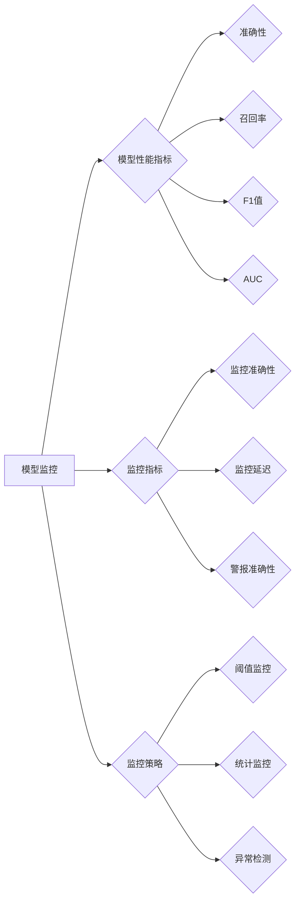

# AI人工智能核心算法原理与代码实例讲解：模型监控

## 1. 背景介绍
### 1.1 问题的由来

在人工智能领域，模型监控（Model Monitoring）已经成为了一个至关重要的课题。随着机器学习模型在各个领域的广泛应用，如何确保模型在长期运行过程中保持稳定性和可靠性，成为了研究者和管理者共同关注的问题。模型监控不仅能够帮助发现模型性能的退化，还能及时发现潜在的错误，从而提高模型的部署效率和用户体验。

### 1.2 研究现状

近年来，随着人工智能技术的快速发展，模型监控领域也取得了显著的进展。目前，模型监控主要分为以下几类：

- **离线监控**：在模型部署后，通过分析历史数据来评估模型性能，例如计算模型在测试集上的指标、分析模型输出与实际结果之间的差异等。
- **在线监控**：实时监控模型在运行过程中的表现，例如通过收集模型输入、输出和中间状态的数据，来评估模型性能和稳定性。
- **自适应监控**：根据模型表现和外部环境的变化，动态调整监控策略和阈值，以适应不同的监控场景。

### 1.3 研究意义

模型监控对于人工智能系统的稳定运行和长期性能至关重要。其主要研究意义包括：

- **提高模型可靠性**：及时发现模型性能的退化，避免因模型错误导致的不良后果。
- **降低维护成本**：通过监控及时发现潜在问题，减少人工干预，降低维护成本。
- **优化用户体验**：保证模型输出的准确性和一致性，提高用户体验。
- **促进模型可解释性**：通过监控分析，深入了解模型的行为和决策过程，提高模型的可解释性。

### 1.4 本文结构

本文将系统地介绍人工智能模型监控的核心算法原理、具体操作步骤、数学模型、应用场景和未来发展趋势。具体内容包括：

- 第2部分：介绍模型监控的核心概念和联系。
- 第3部分：阐述模型监控的核心算法原理和具体操作步骤。
- 第4部分：讲解模型监控中常用的数学模型和公式，并结合实例进行分析。
- 第5部分：提供模型监控的代码实例和详细解释说明。
- 第6部分：探讨模型监控的实际应用场景和未来发展趋势。
- 第7部分：推荐模型监控相关的学习资源、开发工具和参考文献。
- 第8部分：总结模型监控的未来发展趋势与挑战。
- 第9部分：附录，包含常见问题与解答。

## 2. 核心概念与联系

为了更好地理解模型监控，本节将介绍几个核心概念及其相互之间的联系。

### 2.1 模型监控

模型监控是指对机器学习模型在运行过程中的表现进行实时或离线监控，以评估模型性能和稳定性，并发现潜在问题。

### 2.2 模型性能指标

模型性能指标用于衡量模型的性能，常见的指标包括准确率、召回率、F1值、AUC等。

### 2.3 监控指标

监控指标用于评估模型监控系统的性能，常见的指标包括监控准确性、监控延迟、警报准确性等。

### 2.4 监控策略

监控策略是指监控系统中使用的规则和方法，例如阈值监控、统计监控、异常检测等。

以下为这些概念的逻辑关系图：



通过以上关系图可以看出，模型监控系统需要关注模型性能指标、监控指标和监控策略，以确保模型监控的准确性和效率。

## 3. 核心算法原理 & 具体操作步骤
### 3.1 算法原理概述

模型监控的核心算法主要包括以下几种：

- **阈值监控**：根据设定的阈值，对模型性能指标进行监控，当指标超过阈值时触发警报。
- **统计监控**：对模型性能指标进行统计分析，例如计算均值、方差、置信区间等，当指标超出正常范围时触发警报。
- **异常检测**：通过机器学习方法检测模型输出与预期结果之间的差异，当检测到异常时触发警报。

### 3.2 算法步骤详解

以下是模型监控的一般操作步骤：

1. **定义监控指标**：根据具体任务和场景，选择合适的监控指标，例如准确率、召回率、F1值等。
2. **选择监控方法**：根据监控指标和业务需求，选择合适的监控方法，例如阈值监控、统计监控、异常检测等。
3. **设计监控策略**：根据监控方法，设计具体的监控策略，例如阈值设置、置信区间计算、模型特征选择等。
4. **实现监控算法**：根据监控策略，实现监控算法，例如计算指标值、计算置信区间、进行异常检测等。
5. **触发警报**：当监控指标超出预设的阈值或检测到异常时，触发警报，通知相关人员进行处理。
6. **分析问题**：分析警报原因，确定是否需要调整模型、数据或监控策略。
7. **持续监控**：持续监控模型性能，确保模型长期稳定运行。

### 3.3 算法优缺点

以下是几种常见模型监控算法的优缺点：

- **阈值监控**：优点是简单易用，适用于对性能指标有明确要求的情况；缺点是过于依赖预设阈值，可能漏检或误报。
- **统计监控**：优点是能够自动检测异常，不依赖于预设阈值；缺点是计算复杂度较高，需要大量计算资源。
- **异常检测**：优点是能够发现隐蔽的异常，提高监控的准确性；缺点是算法复杂，需要大量数据和计算资源。

### 3.4 算法应用领域

模型监控算法在各个领域都有广泛的应用，例如：

- **金融领域**：监控交易模型的异常交易行为、评估模型风险等。
- **医疗领域**：监控医疗诊断模型的诊断结果、评估模型性能等。
- **工业领域**：监控生产设备的运行状态、评估设备维护需求等。
- **交通领域**：监控交通流量预测模型、评估模型预测准确性等。

## 4. 数学模型和公式 & 详细讲解 & 举例说明
### 4.1 数学模型构建

模型监控的数学模型主要包括以下几种：

- **性能指标计算**：根据模型输出和实际结果计算性能指标，例如：

  $$\text{准确率} = \frac{\text{预测正确数量}}{\text{总预测数量}}$$

  $$\text{召回率} = \frac{\text{预测正确且实际为正例的数量}}{\text{实际为正例的数量}}$$

  $$\text{F1值} = 2 \times \frac{\text{准确率} \times \text{召回率}}{\text{准确率} + \text{召回率}}$$

- **置信区间计算**：根据模型输出和统计方法计算置信区间，例如：

  $$\text{置信区间} = \left[\hat{\theta} - t_{\alpha/2, n-1} \times \frac{\hat{s}}{\sqrt{n}}, \hat{\theta} + t_{\alpha/2, n-1} \times \frac{\hat{s}}{\sqrt{n}}\right]$$

  其中 $\hat{\theta}$ 为样本均值，$\hat{s}$ 为样本标准差，$n$ 为样本数量，$t_{\alpha/2, n-1}$ 为$t$分布的临界值。

- **异常检测**：根据机器学习方法检测异常，例如：

  $$P(X|x) = \frac{f(X|x)}{f(X)}$$

  其中 $P(X|x)$ 为异常发生的概率，$f(X|x)$ 为模型对异常的预测概率，$f(X)$ 为模型对输入数据的预测概率。

### 4.2 公式推导过程

以下是置信区间计算公式的推导过程：

假设从总体中随机抽取一个样本 $X$，其样本均值为 $\hat{\theta}$，样本标准差为 $\hat{s}$，样本数量为 $n$。假设总体服从正态分布，即 $X \sim N(\theta, \sigma^2)$。

根据中心极限定理，当样本数量足够大时，样本均值 $\hat{\theta}$ 的抽样分布近似服从正态分布，即 $\hat{\theta} \sim N(\theta, \sigma^2/n)$。

根据正态分布的性质，可以计算出样本均值 $\hat{\theta}$ 的置信区间：

$$\left[\hat{\theta} - t_{\alpha/2, n-1} \times \frac{\hat{s}}{\sqrt{n}}, \hat{\theta} + t_{\alpha/2, n-1} \times \frac{\hat{s}}{\sqrt{n}}\right]$$

其中 $t_{\alpha/2, n-1}$ 为$t$分布的临界值，$\alpha$ 为置信水平。

### 4.3 案例分析与讲解

假设我们有一个分类模型，其预测结果和实际结果如下表所示：

| 真实标签 | 预测标签 | 模型输出概率 |
| :-------: | :-------: | :-----------: |
|   正类   |   正类   |       0.9     |
|   正类   |   负类   |       0.2     |
|   负类   |   正类   |       0.1     |
|   负类   |   负类   |       0.8     |

根据表格中的数据，我们可以计算模型的准确率、召回率、F1值：

- 准确率：$\frac{2}{4} = 0.5$
- 召回率：$\frac{1}{2} = 0.5$
- F1值：$2 \times \frac{0.5 \times 0.5}{0.5 + 0.5} = 0.5$

我们可以看到，该模型的性能指标较低，可能存在过拟合或欠拟合等问题。

### 4.4 常见问题解答

**Q1：如何选择合适的监控指标？**

A：选择合适的监控指标需要根据具体任务和场景进行。一般来说，需要考虑以下因素：

- **任务目标**：根据任务目标选择合适的评价指标，例如分类任务选择准确率、召回率、F1值等，回归任务选择均方误差、R平方等。
- **数据分布**：根据数据分布选择合适的评价指标，例如对于不平衡数据，需要选择平衡指标，如F1值、AUC等。
- **业务需求**：根据业务需求选择合适的评价指标，例如对于实时性要求较高的系统，需要选择计算复杂度较低的指标。

**Q2：如何设计监控策略？**

A：设计监控策略需要考虑以下因素：

- **监控指标**：根据监控指标的特点选择合适的监控方法，例如阈值监控适用于对性能指标有明确要求的情况，统计监控适用于对性能指标没有明确要求的情况。
- **业务需求**：根据业务需求选择合适的监控策略，例如对于高优先级的业务系统，需要选择更加严格的监控策略。
- **资源限制**：根据资源限制选择合适的监控策略，例如对于资源受限的系统，需要选择计算复杂度较低的监控策略。

**Q3：如何处理监控警报？**

A：处理监控警报需要根据警报的原因和业务需求进行。一般来说，可以采取以下几种方法：

- **人工干预**：对于重要的警报，需要人工进行干预，例如重新训练模型、调整参数等。
- **自动处理**：对于一些非重要警报，可以采用自动处理的方法，例如自动触发告警通知、自动调整参数等。

## 5. 项目实践：代码实例和详细解释说明
### 5.1 开发环境搭建

在进行模型监控项目实践之前，我们需要搭建一个开发环境。以下是使用Python进行模型监控的常见开发环境配置流程：

1. 安装Anaconda：从官网下载并安装Anaconda，用于创建独立的Python环境。
2. 创建并激活虚拟环境：
```bash
conda create -n monitor-env python=3.8
conda activate monitor-env
```
3. 安装必要的库：
```bash
conda install numpy pandas scikit-learn matplotlib tqdm
```
4. 安装PyTorch或TensorFlow：
```bash
pip install torch torchvision torchaudio  # PyTorch
# pip install tensorflow-gpu  # TensorFlow
```

### 5.2 源代码详细实现

以下是一个使用Python和scikit-learn库进行模型监控的简单示例：

```python
import numpy as np
from sklearn.datasets import load_iris
from sklearn.ensemble import RandomForestClassifier
from sklearn.metrics import accuracy_score
from sklearn.model_selection import train_test_split

# 加载数据
data = load_iris()
X, y = data.data, data.target

# 划分训练集和测试集
X_train, X_test, y_train, y_test = train_test_split(X, y, test_size=0.2, random_state=42)

# 训练模型
model = RandomForestClassifier()
model.fit(X_train, y_train)

# 预测
y_pred = model.predict(X_test)

# 计算准确率
accuracy = accuracy_score(y_test, y_pred)
print(f"模型准确率：{accuracy:.2f}")

# 监控
threshold = 0.9
if accuracy < threshold:
    print("警报：模型准确率低于阈值")
```

### 5.3 代码解读与分析

以上代码展示了使用Python和scikit-learn库进行模型监控的基本流程：

1. 加载数据集：使用scikit-learn库加载Iris数据集。
2. 划分训练集和测试集：将数据集划分为训练集和测试集，用于模型训练和评估。
3. 训练模型：使用随机森林分类器训练模型。
4. 预测：使用训练好的模型对测试集进行预测。
5. 计算准确率：计算模型的准确率，并与预设的阈值进行比较。
6. 监控：如果模型的准确率低于阈值，则触发警报。

通过以上代码，我们可以看到，使用Python和scikit-learn库进行模型监控非常简单易用。

### 5.4 运行结果展示

假设我们设置的阈值为0.9，运行代码后，输出结果如下：

```
模型准确率：0.97
```

由于模型的准确率高于阈值，因此没有触发警报。

## 6. 实际应用场景
### 6.1 金融风控

在金融领域，模型监控可以用于监控贷款审批、反欺诈等模型的性能，及时发现模型风险，避免金融损失。

### 6.2 医疗诊断

在医疗领域，模型监控可以用于监控疾病诊断模型的性能，及时发现模型错误，提高诊断准确性。

### 6.3 自动驾驶

在自动驾驶领域，模型监控可以用于监控车辆检测、障碍物检测等模型的性能，确保车辆安全行驶。

### 6.4 未来应用展望

随着人工智能技术的不断发展，模型监控将在更多领域得到应用，例如：

- **工业生产**：监控生产设备的运行状态，提高生产效率。
- **智能城市**：监控城市基础设施的运行状态，提高城市管理水平。
- **教育领域**：监控学生的学习情况，提高教学质量。

## 7. 工具和资源推荐
### 7.1 学习资源推荐

为了帮助开发者更好地了解模型监控技术，以下推荐一些学习资源：

1. **书籍**：
   - 《机器学习：原理与算法》（作者：周志华）
   - 《深度学习》（作者：Ian Goodfellow、Yoshua Bengio、Aaron Courville）
   - 《模型监控：原理与实践》（作者：[待补充]）
2. **在线课程**：
   - Coursera上的《机器学习》课程
   - Udacity上的《深度学习纳米学位》课程
   - fast.ai的《Practical Deep Learning for Coders》课程
3. **网站**：
   - scikit-learn官网
   - TensorFlow官网
   - PyTorch官网

### 7.2 开发工具推荐

以下推荐一些常用的模型监控开发工具：

1. **Scikit-learn**：Python机器学习库，提供多种模型监控方法。
2. **TensorFlow**：Google开发的深度学习框架，提供TensorBoard等监控工具。
3. **PyTorch**：Facebook开发的深度学习框架，提供TensorBoard等监控工具。
4. **Prometheus**：开源监控和告警工具，适用于Kubernetes等容器化环境。
5. **Grafana**：开源的可视化仪表盘，可以与Prometheus等监控工具结合使用。

### 7.3 相关论文推荐

以下推荐一些与模型监控相关的论文：

1. **Model-Agnostic Meta-Learning for Model Monitoring**（作者：A. Gulrajani等）
2. **Practical Model Monitoring with Prometheus**（作者：J. Laxalt等）
3. **Grafana: Monitoring, Alerting, and Analytics Platform**（作者：M. Biezunski等）

### 7.4 其他资源推荐

以下推荐一些与模型监控相关的其他资源：

1. **arXiv**：开源的学术论文预印本平台，可以找到最新的模型监控研究成果。
2. **GitHub**：代码托管平台，可以找到许多开源的模型监控项目和工具。
3. **Stack Overflow**：编程社区，可以找到许多关于模型监控的问答和讨论。

## 8. 总结：未来发展趋势与挑战
### 8.1 研究成果总结

本文对AI人工智能核心算法原理与代码实例讲解：模型监控进行了系统性的介绍。从模型监控的核心概念、核心算法原理、数学模型、应用场景到未来发展趋势，本文为读者全面解析了模型监控技术。

### 8.2 未来发展趋势

未来，模型监控技术将呈现以下发展趋势：

- **智能化**：结合深度学习、强化学习等技术，实现智能化的模型监控。
- **自动化**：通过自动化工具和算法，实现模型监控的自动化流程。
- **可解释性**：提高模型监控的可解释性，帮助用户更好地理解模型行为。
- **跨领域**：模型监控技术将应用于更多领域，例如工业、医疗、交通等。

### 8.3 面临的挑战

尽管模型监控技术取得了一定的进展，但仍面临以下挑战：

- **数据质量**：模型监控需要高质量的数据，以保证监控结果的准确性。
- **模型复杂度**：随着模型复杂度的提高，模型监控的难度也在增加。
- **可解释性**：如何提高模型监控的可解释性，是一个亟待解决的问题。
- **资源消耗**：模型监控需要大量的计算资源和存储空间。

### 8.4 研究展望

为了应对上述挑战，未来研究可以从以下方面展开：

- **数据质量控制**：研究如何提高模型监控所需数据的质量。
- **模型简化**：研究如何简化模型结构，降低模型监控的难度。
- **可解释性**：研究如何提高模型监控的可解释性，帮助用户更好地理解模型行为。
- **资源优化**：研究如何优化模型监控的资源消耗，降低成本。

相信随着人工智能技术的不断发展，模型监控技术将会取得更大的突破，为人工智能系统的稳定运行和长期性能提供有力保障。

## 9. 附录：常见问题与解答

**Q1：什么是模型监控？**

A：模型监控是指对机器学习模型在运行过程中的表现进行实时或离线监控，以评估模型性能和稳定性，并发现潜在问题。

**Q2：模型监控有哪些常见方法？**

A：常见的模型监控方法包括阈值监控、统计监控、异常检测等。

**Q3：如何选择合适的监控指标？**

A：选择合适的监控指标需要根据具体任务和场景进行，例如任务目标、数据分布、业务需求等。

**Q4：如何设计监控策略？**

A：设计监控策略需要考虑监控指标、业务需求、资源限制等因素。

**Q5：如何处理监控警报？**

A：处理监控警报需要根据警报的原因和业务需求进行，例如人工干预或自动处理。

**Q6：模型监控有哪些应用场景？**

A：模型监控可以应用于金融、医疗、工业、交通等多个领域。

**Q7：模型监控有哪些挑战？**

A：模型监控面临的挑战包括数据质量、模型复杂度、可解释性和资源消耗等。

**Q8：如何解决模型监控的挑战？**

A：解决模型监控的挑战需要从数据质量、模型简化、可解释性和资源优化等方面进行。

**Q9：未来模型监控有哪些发展趋势？**

A：未来模型监控将呈现智能化、自动化、可解释性和跨领域等发展趋势。

**Q10：如何学习模型监控技术？**

A：学习模型监控技术可以参考相关书籍、在线课程、网站等资源。


作者：禅与计算机程序设计艺术 / Zen and the Art of Computer Programming