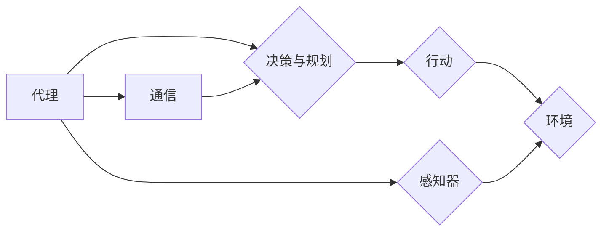

# AI人工智能深度学习算法：代理通信与协作模型概览

作者：禅与计算机程序设计艺术 / Zen and the Art of Computer Programming

## 1. 背景介绍
### 1.1 问题的由来

随着人工智能技术的快速发展，深度学习在各个领域都取得了显著的成果。然而，在实际应用中，深度学习模型往往面临着以下挑战：

1. **代理个体能力有限**：单个代理（Agent）可能只具备特定的功能，难以解决复杂问题。
2. **协作困难**：多个代理之间需要协同工作，但缺乏有效的通信和协调机制。
3. **环境复杂性**：现实世界环境复杂多变，代理需要具备适应和应对复杂环境的能力。

为了解决上述问题，研究人员提出了代理通信与协作模型，通过构建多个智能代理之间的通信和协作机制，实现更强大的智能行为。

### 1.2 研究现状

近年来，代理通信与协作模型在以下几个方面取得了显著进展：

1. **通信协议**：研究人员提出了多种通信协议，如多智能体通信协议（MASCP）、分布式通信协议（DCP）等。
2. **协作策略**：针对不同任务，研究人员设计了多种协作策略，如集中式、分布式、混合式等。
3. **环境感知**：代理通过感知环境信息，学习适应和利用环境资源。
4. **决策与规划**：代理通过决策和规划，实现复杂任务的目标。

### 1.3 研究意义

代理通信与协作模型具有以下研究意义：

1. **提升智能体能力**：通过协作，多个代理可以共同完成复杂任务，提升整体性能。
2. **提高鲁棒性**：代理可以相互学习和适应，提高对环境变化的鲁棒性。
3. **拓展应用领域**：代理通信与协作模型可以应用于智能交通、智能制造、智慧城市等领域。

### 1.4 本文结构

本文将围绕以下内容展开：

1. 介绍代理通信与协作模型的核心概念和联系。
2. 阐述代理通信与协作模型的核心算法原理和具体操作步骤。
3. 分析代理通信与协作模型在各个领域的应用。
4. 探讨代理通信与协作模型的未来发展趋势与挑战。

## 2. 核心概念与联系

本节将介绍代理通信与协作模型的核心概念，并阐述它们之间的联系。

### 2.1 代理（Agent）

代理是具有自主性、适应性、社会性的智能体。它可以通过感知环境信息，自主地做出决策，并与其他代理进行交互。

### 2.2 通信（Communication）

通信是指代理之间交换信息的过程。通信协议定义了代理之间如何进行信息交换。

### 2.3 协作（Collaboration）

协作是指多个代理共同完成某个任务的过程。协作策略定义了代理之间的协作方式和协作目标。

### 2.4 环境感知（Environment Perception）

环境感知是指代理通过感知器获取环境信息的过程。

### 2.5 决策与规划（Decision and Planning）

决策与规划是指代理根据感知到的环境信息和预定的目标，制定行动策略的过程。

这些概念之间的联系可以用以下图表示：



## 3. 核心算法原理 & 具体操作步骤
### 3.1 算法原理概述

代理通信与协作模型主要包括以下三个部分：

1. **通信协议**：定义代理之间如何交换信息。
2. **协作策略**：定义代理之间的协作方式和协作目标。
3. **决策与规划算法**：定义代理如何根据环境信息和目标制定行动策略。

### 3.2 算法步骤详解

以下是代理通信与协作模型的具体操作步骤：

1. **初始化**：创建多个代理，并为每个代理分配初始状态。
2. **感知**：每个代理通过感知器获取环境信息。
3. **通信**：代理之间根据通信协议交换信息。
4. **决策**：每个代理根据环境信息和目标，使用决策与规划算法制定行动策略。
5. **行动**：代理根据行动策略执行行动。
6. **评估**：根据行动结果，评估代理的性能。
7. **迭代**：重复步骤2-6，直到达到终止条件。

### 3.3 算法优缺点

代理通信与协作模型的优点如下：

1. **可扩展性**：可以扩展到任意数量的代理。
2. **可适应性**：代理可以根据环境变化动态调整策略。
3. **可扩展性**：可以应用于各种不同的任务。

代理通信与协作模型的缺点如下：

1. **通信开销**：代理之间需要频繁交换信息，导致通信开销较大。
2. **同步问题**：代理需要保持同步，以避免冲突和竞争。
3. **复杂性**：算法设计相对复杂，需要综合考虑多个因素。

### 3.4 算法应用领域

代理通信与协作模型可以应用于以下领域：

1. **智能交通**：用于交通信号控制、自动驾驶、智能导航等。
2. **智能制造**：用于机器人协作、生产线优化、质量控制等。
3. **智慧城市**：用于智能调度、环境监测、应急响应等。
4. **游戏AI**：用于多人在线游戏、虚拟现实等。

## 4. 数学模型和公式 & 详细讲解 & 举例说明
### 4.1 数学模型构建

代理通信与协作模型可以构建以下数学模型：

1. **状态模型**：描述代理的当前状态，如位置、速度、资源等。
2. **通信模型**：描述代理之间的通信过程，如信道模型、信源模型等。
3. **决策模型**：描述代理的决策过程，如决策树、贝叶斯网络等。

### 4.2 公式推导过程

以下是一个简单的例子，说明如何构建通信模型：

设代理 $A$ 和代理 $B$ 之间的信道为 $C$，信源为 $S$，则信道模型可以表示为：

$$
P(C=c|S=s) = p(c|s)
$$

其中，$c$ 为信道输出，$s$ 为信源输入。

### 4.3 案例分析与讲解

以下是一个简单的例子，说明如何使用代理通信与协作模型进行路径规划：

假设有两个代理需要从点 $A$ 移动到点 $B$。代理之间使用基于距离的通信协议，并使用A*算法进行路径规划。

1. **初始化**：两个代理分别位于点 $A$ 和点 $B$。
2. **感知**：每个代理感知到自身位置和目标位置。
3. **通信**：代理之间根据距离交换位置信息。
4. **决策**：每个代理使用A*算法计算从自身位置到目标位置的路径。
5. **行动**：代理根据计算出的路径进行移动。
6. **评估**：根据移动距离，评估代理的性能。

### 4.4 常见问题解答

**Q1：如何设计有效的通信协议？**

A：设计有效的通信协议需要考虑以下因素：

1. **通信信道**：选择合适的通信信道，如无线信道、有线信道等。
2. **通信协议**：选择合适的通信协议，如基于距离的通信协议、基于时间的通信协议等。
3. **通信开销**：最小化通信开销，提高通信效率。

**Q2：如何设计有效的协作策略？**

A：设计有效的协作策略需要考虑以下因素：

1. **协作目标**：明确协作目标，如最小化整体时间、最大化收益等。
2. **协作方式**：选择合适的协作方式，如集中式、分布式、混合式等。
3. **协作约束**：考虑协作过程中的约束条件，如资源限制、时间限制等。

**Q3：如何设计有效的决策与规划算法？**

A：设计有效的决策与规划算法需要考虑以下因素：

1. **决策目标**：明确决策目标，如最小化风险、最大化收益等。
2. **决策方法**：选择合适的决策方法，如基于规则的决策、基于模型的决策等。
3. **规划方法**：选择合适的规划方法，如A*算法、遗传算法等。

## 5. 项目实践：代码实例和详细解释说明
### 5.1 开发环境搭建

以下是一个简单的代理通信与协作模型项目，使用Python编写：

```python
# 导入必要的库
import random
from heapq import heappush, heappop

# 定义代理类
class Agent:
    def __init__(self, position):
        self.position = position
        self.path = []

    def move(self, direction):
        self.position += direction

    def plan(self, target):
        # 使用A*算法规划路径
        ...

# 创建代理
agent1 = Agent((0, 0))
agent2 = Agent((5, 5))

# 定义A*算法
def a_star(start, end):
    ...

# 定义目标位置
target = (10, 10)

# 求解路径
path1 = a_star((0, 0), target)
path2 = a_star((5, 5), target)

# 执行动作
for direction in path1:
    agent1.move(direction)
for direction in path2:
    agent2.move(direction)
```

### 5.2 源代码详细实现

以下是对上述代码的详细解释：

1. `Agent` 类定义了代理类，包括位置和路径属性，以及 `move` 和 `plan` 方法。
2. `move` 方法根据方向移动代理位置。
3. `plan` 方法使用A*算法规划从当前位置到目标位置的路径。
4. `a_star` 函数实现了A*算法，使用优先队列存储待扩展节点。
5. 创建两个代理，分别位于 (0, 0) 和 (5, 5)。
6. 定义目标位置为 (10, 10)。
7. 使用 `a_star` 函数求解从当前位置到目标位置的路径。
8. 执行路径规划，使代理移动到目标位置。

### 5.3 代码解读与分析

以上代码演示了如何使用Python实现一个简单的代理通信与协作模型。在实际应用中，可以根据具体需求进行扩展，如增加通信机制、协作策略等。

### 5.4 运行结果展示

运行上述代码，可以看到代理从起始位置移动到目标位置，实现了路径规划的目标。

## 6. 实际应用场景
### 6.1 智能交通

代理通信与协作模型可以应用于智能交通领域，实现以下功能：

1. **交通信号控制**：多个代理协同控制交通信号灯，优化交通流量。
2. **自动驾驶**：多个自动驾驶车辆协同行驶，提高行驶效率和安全性。
3. **智能导航**：为行人和车辆提供智能导航服务。

### 6.2 智能制造

代理通信与协作模型可以应用于智能制造领域，实现以下功能：

1. **机器人协作**：多个机器人协同完成复杂任务，提高生产效率。
2. **生产线优化**：优化生产线布局，提高生产效率。
3. **质量控制**：多个代理协同进行质量控制，提高产品质量。

### 6.3 智慧城市

代理通信与协作模型可以应用于智慧城市领域，实现以下功能：

1. **智能调度**：优化城市资源调度，提高资源利用率。
2. **环境监测**：多个代理协同监测环境，提高环境质量。
3. **应急响应**：多个代理协同进行应急响应，提高应急效率。

### 6.4 未来应用展望

随着人工智能技术的不断发展，代理通信与协作模型将在更多领域得到应用，如：

1. **医疗健康**：实现远程医疗、智能诊断、个性化治疗等功能。
2. **教育**：实现个性化学习、智能辅导、虚拟课堂等功能。
3. **金融**：实现智能投顾、风险管理、欺诈检测等功能。

## 7. 工具和资源推荐
### 7.1 学习资源推荐

以下是一些学习代理通信与协作模型的资源：

1. **《多智能体系统：通信与协作》**：介绍了多智能体系统的基本概念、通信协议和协作策略。
2. **《深度学习与强化学习》**：介绍了深度学习和强化学习在多智能体系统中的应用。
3. **《智能交通系统》**：介绍了智能交通系统中的多智能体通信与协作技术。

### 7.2 开发工具推荐

以下是一些开发代理通信与协作模型的工具：

1. **Python**：Python是一种易于学习和使用的编程语言，可用于开发多智能体系统。
2. **ROS**：ROS（Robot Operating System）是一个开源的机器人操作系统，提供了一系列开发工具和库。
3. **MATLAB**：MATLAB是一种强大的数学计算工具，可用于开发多智能体系统。

### 7.3 相关论文推荐

以下是一些关于代理通信与协作模型的相关论文：

1. **《A Framework for Multi-Agent Communication Protocols》**：介绍了多智能体通信协议的框架。
2. **《Distributed Coordination of Multi-Agent Systems》**：介绍了多智能体系统的分布式协作策略。
3. **《Multi-Agent Reinforcement Learning》**：介绍了多智能体强化学习。

### 7.4 其他资源推荐

以下是一些其他资源：

1. **多智能体系统社区**：http://www.multipleagent.org/
2. **ROS官网**：http://www.ros.org/
3. **MATLAB官网**：http://www.mathworks.com/

## 8. 总结：未来发展趋势与挑战
### 8.1 研究成果总结

本文介绍了代理通信与协作模型的核心概念、算法原理、应用场景和未来发展趋势。通过构建多个智能代理之间的通信和协作机制，代理通信与协作模型能够实现更强大的智能行为，在各个领域都有广泛的应用前景。

### 8.2 未来发展趋势

以下是一些代理通信与协作模型的未来发展趋势：

1. **多模态信息融合**：将语音、图像、文本等多种模态信息融合到代理通信与协作模型中。
2. **强化学习**：将强化学习技术应用于代理通信与协作模型，实现更智能的行为。
3. **分布式计算**：利用分布式计算技术，提高代理通信与协作模型的性能和可扩展性。

### 8.3 面临的挑战

以下是一些代理通信与协作模型面临的挑战：

1. **通信开销**：代理之间需要频繁交换信息，导致通信开销较大。
2. **同步问题**：代理需要保持同步，以避免冲突和竞争。
3. **算法复杂度**：代理通信与协作模型的算法设计相对复杂，需要进一步优化。

### 8.4 研究展望

随着人工智能技术的不断发展，代理通信与协作模型将在更多领域得到应用。未来，研究人员需要进一步探索以下研究方向：

1. **降低通信开销**：研究高效的通信协议和压缩技术，降低通信开销。
2. **提高同步效率**：研究高效的同步机制，提高同步效率。
3. **优化算法设计**：研究更高效的算法设计，降低算法复杂度。
4. **跨领域应用**：将代理通信与协作模型应用于更多领域，如医疗、教育、金融等。

通过不断探索和创新，代理通信与协作模型将为人工智能领域带来更多突破，推动人工智能技术的发展和应用。

## 9. 附录：常见问题与解答

**Q1：什么是代理通信与协作模型？**

A：代理通信与协作模型是指通过构建多个智能代理之间的通信和协作机制，实现更强大的智能行为。

**Q2：代理通信与协作模型有哪些应用场景？**

A：代理通信与协作模型可以应用于智能交通、智能制造、智慧城市、医疗健康、教育、金融等领域。

**Q3：如何设计有效的通信协议？**

A：设计有效的通信协议需要考虑通信信道、通信协议和通信开销等因素。

**Q4：如何设计有效的协作策略？**

A：设计有效的协作策略需要考虑协作目标、协作方式和协作约束等因素。

**Q5：如何设计有效的决策与规划算法？**

A：设计有效的决策与规划算法需要考虑决策目标、决策方法和规划方法等因素。

通过本文的介绍，相信读者对代理通信与协作模型有了更深入的了解。希望本文能够为读者在相关领域的学习和研究提供一些参考和启示。

作者：禅与计算机程序设计艺术 / Zen and the Art of Computer Programming