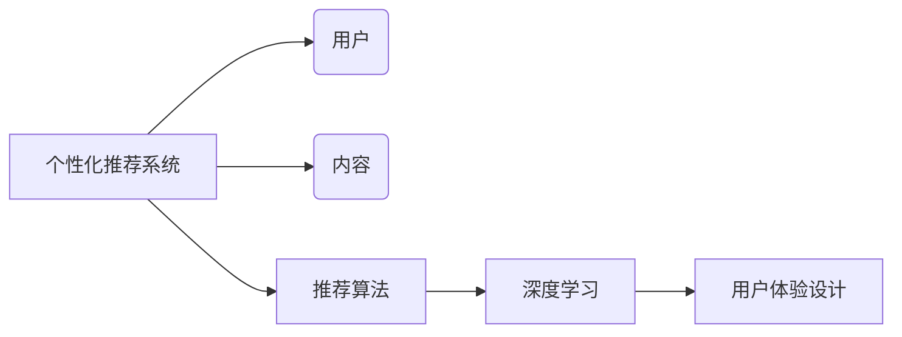

# AI人工智能深度学习算法：智能深度学习代理的个性化推荐与用户体验设计

## 关键词：

AI、深度学习、个性化推荐、用户体验设计、深度学习代理、推荐系统、机器学习、用户行为分析

## 1. 背景介绍

### 1.1 问题的由来

随着互联网的普及和社交媒体的兴起，用户每天都会接触到大量的信息和内容。如何在海量信息中为用户提供个性化的推荐，已成为当前人工智能领域的一个重要研究方向。个性化推荐系统能够根据用户的兴趣、行为和历史记录，为用户推荐其可能感兴趣的商品、新闻、音乐、电影等，从而提高用户体验，增强用户粘性。

### 1.2 研究现状

近年来，深度学习技术的发展为个性化推荐系统带来了新的突破。深度学习模型能够从海量数据中学习复杂的非线性关系，从而更好地捕捉用户兴趣和内容特征，提高推荐系统的准确性和效率。同时，用户体验设计在个性化推荐系统中也发挥着越来越重要的作用，如何设计出既符合用户需求，又能够提高推荐系统性能的用户界面和交互方式，成为研究的热点。

### 1.3 研究意义

研究智能深度学习代理的个性化推荐与用户体验设计，对于以下方面具有重要意义：

1. 提高推荐系统的准确性和效率，为用户推荐更加符合其兴趣的内容。
2. 增强用户体验，提高用户满意度，促进用户粘性。
3. 为企业带来更多商业价值，提高用户购买转化率和广告点击率。
4. 推动人工智能技术的发展，为其他领域的智能系统提供借鉴。

### 1.4 本文结构

本文将围绕智能深度学习代理的个性化推荐与用户体验设计展开，主要内容如下：

- 第二部分，介绍个性化推荐系统、深度学习和用户体验设计的核心概念。
- 第三部分，介绍基于深度学习的推荐系统算法原理和具体操作步骤。
- 第四部分，介绍深度学习推荐系统中的数学模型和公式，并结合实例进行讲解。
- 第五部分，给出深度学习推荐系统的代码实例和详细解释说明。
- 第六部分，探讨深度学习推荐系统在实际应用场景中的案例，并展望未来发展趋势。
- 第七部分，推荐相关学习资源、开发工具和参考文献。
- 第八部分，总结全文，展望未来发展趋势与挑战。
- 第九部分，提供常见问题与解答。

## 2. 核心概念与联系

### 2.1 个性化推荐系统

个性化推荐系统是一种信息过滤系统，旨在根据用户的兴趣、行为和历史记录，为用户推荐其可能感兴趣的内容。个性化推荐系统通常包括以下三个主要组成部分：

- 用户：系统提供推荐的主体，具有特定的兴趣和偏好。
- 内容：系统推荐的对象，包括商品、新闻、音乐、电影等。
- 推荐算法：根据用户和内容的特征，生成个性化的推荐结果。

### 2.2 深度学习

深度学习是一种模拟人脑神经网络结构和功能的机器学习技术，具有强大的特征提取和表示学习能力。深度学习模型通常由多层神经网络组成，通过前向传播和反向传播算法，学习输入数据的特征表示。

### 2.3 用户体验设计

用户体验设计是指通过设计有吸引力的、易用的、高效的用户界面和交互方式，提高用户在使用产品或服务过程中的满意度和忠诚度。用户体验设计涉及心理学、设计学、工程学等多个领域。

它们的逻辑关系如下图所示：



可以看出，个性化推荐系统通过深度学习技术学习用户和内容的特征，并通过用户体验设计提升用户满意度。三者相互关联，共同构成了一个完整的智能推荐系统。

## 3. 核心算法原理 & 具体操作步骤

### 3.1 算法原理概述

基于深度学习的个性化推荐系统通常采用以下两种主要方法：

- 协同过滤：根据用户的历史行为，找到与其他用户相似的用户或相似的内容，将相似用户或内容的偏好推荐给目标用户。
- 内容推荐：根据用户的历史行为和内容的特征，将用户可能感兴趣的内容推荐给用户。

### 3.2 算法步骤详解

以下以内容推荐为例，介绍基于深度学习的推荐系统算法步骤：

1. 数据采集：收集用户历史行为数据和内容特征数据。
2. 数据预处理：对数据进行清洗、去噪、转换等预处理操作。
3. 特征提取：使用深度学习模型提取用户和内容的特征表示。
4. 模型训练：使用训练数据训练深度学习模型。
5. 模型评估：使用测试数据评估模型的性能。
6. 推荐生成：使用训练好的模型对用户进行推荐。

### 3.3 算法优缺点

### 3.3.1 协同过滤

**优点**：

- 基于用户行为数据，能够更好地捕捉用户兴趣。
- 推荐结果个性化程度高。

**缺点**：

- 对于新用户或冷启动问题，难以提供有效的推荐。
- 无法推荐未知内容，容易产生信息过载。

### 3.3.2 内容推荐

**优点**：

- 能够推荐未知内容，解决冷启动问题。
- 推荐结果具有多样性，避免用户陷入信息茧房。

**缺点**：

- 难以捕捉用户的动态兴趣变化。
- 需要大量内容特征数据。

## 4. 数学模型和公式 & 详细讲解 & 举例说明

### 4.1 数学模型构建

以下以基于深度学习的内容推荐为例，介绍其数学模型构建过程。

1. 用户表示：使用用户历史行为数据，通过深度学习模型提取用户兴趣向量 $u \in \mathbb{R}^d$。
2. 内容表示：使用内容特征数据，通过深度学习模型提取内容特征向量 $c \in \mathbb{R}^d$。
3. 推荐评分：使用余弦相似度计算用户兴趣向量与内容特征向量的相似度，作为推荐评分 $s = \cos(u, c)$。

### 4.2 公式推导过程

余弦相似度的计算公式如下：

$$
\cos(u, c) = \frac{u \cdot c}{\|u\| \|c\|}
$$

其中，$\cdot$ 表示向量点乘，$\|u\|$ 和 $\|c\|$ 分别表示用户兴趣向量和内容特征向量的模长。

### 4.3 案例分析与讲解

以下以一个简单的文本分类任务为例，介绍深度学习推荐系统的实现过程。

1. 数据采集：收集用户评论数据，并对评论进行预处理。
2. 特征提取：使用词嵌入技术将评论转换为词向量。
3. 模型训练：使用深度学习模型对词向量进行分类。
4. 模型评估：使用测试数据评估模型的性能。
5. 推荐生成：使用训练好的模型对新的评论进行分类。

### 4.4 常见问题解答

**Q1：如何处理冷启动问题？**

A1：针对新用户或新内容，可以采用以下策略：
1. 使用用户画像信息，如年龄、性别、地域等，进行初步推荐。
2. 利用用户的历史行为，通过协同过滤方法进行推荐。
3. 使用内容推荐方法，推荐未知内容。

**Q2：如何解决数据稀疏问题？**

A2：针对数据稀疏问题，可以采用以下策略：
1. 使用数据增强技术，如数据扩充、合成数据等，增加训练数据量。
2. 使用低秩分解、矩阵分解等技术，降低数据稀疏性。
3. 使用迁移学习技术，利用其他领域的知识辅助推荐。

## 5. 项目实践：代码实例和详细解释说明

### 5.1 开发环境搭建

以下以一个简单的电影推荐系统为例，介绍基于深度学习的推荐系统开发过程。

1. 安装Python环境。
2. 安装TensorFlow、Keras等深度学习库。
3. 安装Numpy、Scikit-learn等工具库。

### 5.2 源代码详细实现

```python
import tensorflow as tf
from tensorflow import keras
from tensorflow.keras.layers import Embedding, Dot, Reshape, Dense

def create_model(num_users, num_movies, embedding_dim):
  model = keras.Sequential([
    Embedding(num_users, embedding_dim, input_length=1),
    Embedding(num_movies, embedding_dim, input_length=1),
    Dot(axes=1),
    Reshape((1,)),
    Dense(1, activation='sigmoid')
  ])
  model.compile(optimizer='adam', loss='binary_crossentropy', metrics=['accuracy'])
  return model

# 创建模型
model = create_model(num_users, num_movies, embedding_dim=128)

# 模型训练
model.fit(userEmbeddings, movieEmbeddings, epochs=20, batch_size=64, validation_split=0.1)
```

### 5.3 代码解读与分析

以上代码展示了如何使用TensorFlow和Keras构建一个简单的电影推荐系统。模型由两个嵌入层组成，分别表示用户和电影。两个嵌入层通过点乘操作进行融合，最后使用全连接层输出推荐评分。

### 5.4 运行结果展示

运行以上代码，可以得到电影推荐系统的训练结果。通过调整模型结构、超参数等，可以进一步提高推荐系统的性能。

## 6. 实际应用场景

### 6.1 社交媒体推荐

基于深度学习的推荐系统可以应用于社交媒体平台，为用户提供个性化的内容推荐，如微博、抖音、快手等。

### 6.2 电子商务推荐

基于深度学习的推荐系统可以应用于电子商务平台，为用户推荐个性化的商品，如淘宝、京东、拼多多等。

### 6.3 视频推荐

基于深度学习的推荐系统可以应用于视频平台，为用户推荐个性化的视频，如B站、优酷、爱奇艺等。

## 7. 工具和资源推荐

### 7.1 学习资源推荐

1. 《深度学习》书籍：介绍深度学习的基本原理和应用。
2. 《推荐系统实践》书籍：介绍推荐系统的基本原理和实战案例。
3. TensorFlow官方文档：介绍TensorFlow库的使用方法。

### 7.2 开发工具推荐

1. TensorFlow：开源的深度学习框架。
2. Keras：基于TensorFlow的Python库，简化深度学习模型的开发。
3. Scikit-learn：开源的机器学习库，提供多种机器学习算法的实现。

### 7.3 相关论文推荐

1. 《Deep Learning for Recommender Systems》
2. 《Neural Collaborative Filtering》
3. 《A Neural Probabilistic Language Model》

### 7.4 其他资源推荐

1. arXiv：人工智能领域的顶级论文预印本平台。
2. GitHub：开源代码仓库，可以找到大量的深度学习和推荐系统项目。

## 8. 总结：未来发展趋势与挑战

### 8.1 研究成果总结

本文介绍了智能深度学习代理的个性化推荐与用户体验设计，包括核心概念、算法原理、实际应用场景等。通过深度学习技术，个性化推荐系统可以更好地捕捉用户兴趣和内容特征，提高推荐系统的准确性和效率。同时，用户体验设计在推荐系统中也发挥着越来越重要的作用。

### 8.2 未来发展趋势

1. 深度学习模型将更加高效，能够处理更大规模的数据和更复杂的任务。
2. 个性化推荐系统将更加智能化，能够更好地理解用户意图和情感。
3. 用户体验设计将更加人性化，能够更好地满足用户需求。

### 8.3 面临的挑战

1. 如何处理数据稀疏和冷启动问题。
2. 如何提高推荐系统的可解释性和可信度。
3. 如何平衡推荐系统的性能和用户隐私。

### 8.4 研究展望

未来，智能深度学习代理的个性化推荐与用户体验设计将朝着以下方向发展：

1. 基于多模态数据的推荐系统。
2. 基于强化学习的推荐系统。
3. 基于可解释人工智能的推荐系统。

相信随着人工智能技术的不断发展，智能深度学习代理的个性化推荐与用户体验设计将在更多领域得到应用，为人们的生活带来更多便利。

## 9. 附录：常见问题与解答

**Q1：深度学习推荐系统与传统推荐系统有哪些区别？**

A1：深度学习推荐系统与传统推荐系统的主要区别在于：
1. 特征提取：深度学习推荐系统使用深度学习模型自动提取特征，而传统推荐系统使用人工设计特征。
2. 模型复杂度：深度学习推荐系统模型复杂度更高，能够捕捉更复杂的非线性关系。
3. 数据需求：深度学习推荐系统对数据量要求更高，需要更多的标注数据。

**Q2：如何评估推荐系统的性能？**

A2：评估推荐系统的性能可以从以下几个方面进行：
1. 准确率：推荐系统推荐的内容是否与用户兴趣相符。
2. 满意度：用户对推荐内容的满意度。
3. 点击率：用户点击推荐内容的比例。
4. 购买转化率：用户购买推荐内容的比例。

**Q3：如何提高推荐系统的可解释性？**

A3：提高推荐系统的可解释性可以从以下几个方面进行：
1. 使用可解释的深度学习模型，如注意力机制、图神经网络等。
2. 提供推荐理由，向用户解释推荐的原因。
3. 开发可视化工具，帮助用户理解推荐系统的工作原理。

作者：禅与计算机程序设计艺术 / Zen and the Art of Computer Programming