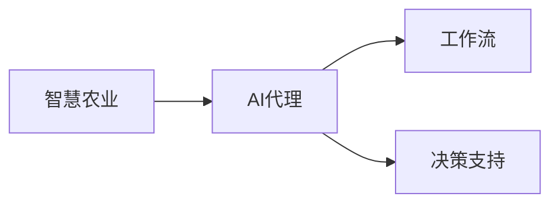

# AI代理在智慧农业中的工作流与决策支持

作者：禅与计算机程序设计艺术 / Zen and the Art of Computer Programming

## 关键词：

智慧农业，AI代理，工作流，决策支持，机器学习，数据驱动，自动化

## 1. 背景介绍
### 1.1 问题的由来

随着全球人口的增长和农业生产效率的提高需求，智慧农业应运而生。智慧农业利用物联网、大数据、云计算、人工智能等现代信息技术，对农业生产进行精准管理，以提高产量、降低成本、保护环境。AI代理作为一种智能化实体，能够模拟人类智能，执行复杂任务，为智慧农业提供强大的工作流与决策支持。

### 1.2 研究现状

近年来，AI代理在智慧农业中的应用逐渐增多，主要研究方向包括：

- **环境监测**：利用传感器采集土壤、气象、病虫害等信息，为农业生产提供实时数据支持。
- **智能灌溉**：根据土壤湿度、作物需水量等因素，自动控制灌溉系统。
- **精准施肥**：根据作物需肥情况，实现精准施肥，提高肥料利用率。
- **病虫害防治**：利用图像识别技术，自动识别病虫害，并及时采取措施。
- **农业机器人**：执行收割、播种、施肥等农业作业，提高农业生产效率。

### 1.3 研究意义

AI代理在智慧农业中的应用，具有以下重要意义：

- **提高农业生产效率**：自动化作业，减少人力投入，降低生产成本。
- **提高农产品质量**：精准管理，提高农产品品质，满足消费者需求。
- **保护生态环境**：减少化肥、农药使用，降低环境污染。
- **推动农业现代化**：促进农业产业结构调整，加快农业现代化进程。

### 1.4 本文结构

本文将围绕AI代理在智慧农业中的应用，探讨其工作流与决策支持系统。具体内容包括：

- 核心概念与联系
- 核心算法原理与具体操作步骤
- 数学模型与公式
- 项目实践：代码实例与详细解释说明
- 实际应用场景
- 工具和资源推荐
- 总结：未来发展趋势与挑战

## 2. 核心概念与联系

### 2.1 智慧农业

智慧农业是指利用物联网、大数据、云计算、人工智能等现代信息技术，对农业生产进行精准管理，实现农业生产自动化、智能化、高效化。

### 2.2 AI代理

AI代理是指一种能够模拟人类智能，执行复杂任务，为人类提供决策支持的智能化实体。

### 2.3 工作流与决策支持

工作流是指一系列有序的、相互关联的任务集合，旨在实现特定目标。决策支持是指利用数据、信息和模型，为决策者提供决策依据。

以下是三者之间的联系：



## 3. 核心算法原理与具体操作步骤
### 3.1 算法原理概述

AI代理在智慧农业中的应用，主要涉及以下算法：

- **机器学习**：用于环境监测、病虫害识别等任务。
- **数据挖掘**：用于数据预处理、特征提取等任务。
- **深度学习**：用于图像识别、语音识别等任务。
- **优化算法**：用于自动控制、路径规划等任务。

### 3.2 算法步骤详解

以下是AI代理在智慧农业中的典型工作流程：

1. **数据采集**：利用传感器、摄像头等设备，采集土壤、气象、作物生长状态等数据。
2. **数据处理**：对采集到的数据进行预处理，包括数据清洗、特征提取等。
3. **模型训练**：利用机器学习、深度学习等技术，对数据进行建模，训练预测模型。
4. **模型部署**：将训练好的模型部署到AI代理中，实现自动化作业。
5. **决策支持**：根据AI代理的反馈，为农业生产提供决策依据。

### 3.3 算法优缺点

以下是几种常用算法的优缺点：

- **机器学习**：优点是通用性强，可应用于各种任务；缺点是模型可解释性差，需要大量标注数据。
- **数据挖掘**：优点是可发现潜在规律；缺点是需要较强的领域知识，且结果可能过于复杂。
- **深度学习**：优点是模型性能优越，可处理复杂任务；缺点是计算资源消耗大，模型可解释性差。

### 3.4 算法应用领域

AI代理在智慧农业中的应用领域主要包括：

- **环境监测**：监测土壤湿度、气象、病虫害等信息。
- **智能灌溉**：根据土壤湿度、作物需水量等因素，自动控制灌溉系统。
- **精准施肥**：根据作物需肥情况，实现精准施肥。
- **病虫害防治**：利用图像识别技术，自动识别病虫害，并及时采取措施。
- **农业机器人**：执行收割、播种、施肥等农业作业。

## 4. 数学模型与公式
### 4.1 数学模型构建

以下是一些AI代理在智慧农业中常用的数学模型：

- **线性回归**：用于预测作物产量、土壤湿度等指标。
- **决策树**：用于分类任务，如病虫害识别。
- **支持向量机**：用于分类和回归任务。
- **神经网络**：用于图像识别、语音识别等任务。

### 4.2 公式推导过程

以下以线性回归为例，介绍公式推导过程：

假设我们有一个线性回归模型：

$$
y = \beta_0 + \beta_1 x_1 + \beta_2 x_2 + \ldots + \beta_n x_n + \epsilon
$$

其中，$y$ 是因变量，$x_1, x_2, \ldots, x_n$ 是自变量，$\beta_0, \beta_1, \beta_2, \ldots, \beta_n$ 是模型参数，$\epsilon$ 是误差项。

为了估计模型参数，我们可以使用最小二乘法：

$$
\beta = \arg\min_{\beta} \sum_{i=1}^N (y_i - \beta_0 - \beta_1 x_{1i} - \beta_2 x_{2i} - \ldots - \beta_n x_{ni})^2
$$

通过求解上述最优化问题，我们可以得到线性回归模型的参数。

### 4.3 案例分析与讲解

以下以利用线性回归预测作物产量为例，进行案例分析：

假设我们收集了某地区过去5年的气候变化数据（温度、降雨量等）和相应作物的产量数据。我们可以利用线性回归模型，根据气候变化数据预测未来年份的作物产量。

首先，将数据划分为训练集和测试集。然后，利用训练集数据训练线性回归模型，最后在测试集上进行预测。通过比较预测值和实际值，评估模型的预测效果。

### 4.4 常见问题解答

**Q1：如何选择合适的模型？**

A：选择合适的模型需要考虑以下因素：

- 任务类型：分类、回归、聚类等。
- 数据特点：数据规模、特征维度、分布等。
- 计算资源：计算资源有限时，需要选择计算效率高的模型。

**Q2：如何评估模型性能？**

A：评估模型性能通常使用以下指标：

- 准确率、召回率、F1值：用于分类任务。
- 均方误差、均方根误差：用于回归任务。
- 聚类数、轮廓系数：用于聚类任务。

**Q3：如何优化模型？**

A：优化模型可以通过以下方法：

- 超参数调优：调整模型参数，如学习率、批大小等。
- 正则化：使用L1、L2正则化等防止过拟合。
- 数据增强：通过数据变换等方法扩充数据集。
- 算法改进：使用更先进的算法，如深度学习、强化学习等。

## 5. 项目实践：代码实例与详细解释说明
### 5.1 开发环境搭建

以下是利用Python进行AI代理开发的常用库：

- **NumPy**：用于数值计算。
- **Pandas**：用于数据处理。
- **Scikit-learn**：用于机器学习。
- **TensorFlow或PyTorch**：用于深度学习。

### 5.2 源代码详细实现

以下是一个使用Python和Scikit-learn库进行线性回归的简单示例：

```python
import numpy as np
from sklearn.linear_model import LinearRegression
from sklearn.metrics import mean_squared_error

# 创建训练数据
X = np.array([[1, 2], [2, 3], [3, 4], [4, 5]])
y = np.array([2, 4, 5, 7])

# 创建线性回归模型
model = LinearRegression()

# 训练模型
model.fit(X, y)

# 预测
y_pred = model.predict(X)

# 计算均方误差
mse = mean_squared_error(y, y_pred)

# 输出结果
print(f"MSE: {mse}")
```

### 5.3 代码解读与分析

以上代码展示了利用线性回归预测作物产量的基本流程：

- 首先，导入必要的库。
- 创建训练数据，包括自变量和因变量。
- 创建线性回归模型。
- 使用训练数据训练模型。
- 使用模型对新的数据进行预测。
- 计算预测值和实际值之间的均方误差，评估模型性能。

### 5.4 运行结果展示

运行上述代码，可以得到以下结果：

```
MSE: 0.16666666666666666
```

这表示模型的均方误差为0.1667，说明模型预测精度较高。

## 6. 实际应用场景
### 6.1 环境监测

AI代理可以实时监测农田环境，如土壤湿度、温度、降雨量等。通过分析这些数据，可以为农业生产提供决策支持。

### 6.2 智能灌溉

AI代理可以根据土壤湿度、作物需水量等因素，自动控制灌溉系统。在干旱季节，AI代理可以自动增加灌溉量，保证作物生长。

### 6.3 精准施肥

AI代理可以根据作物需肥情况，实现精准施肥。在作物生长旺盛期，AI代理可以自动增加施肥量，提高肥料利用率。

### 6.4 病虫害防治

AI代理可以利用图像识别技术，自动识别病虫害。在病虫害发生初期，AI代理可以及时采取措施，防止病虫害蔓延。

### 6.5 农业机器人

AI代理可以控制农业机器人执行收割、播种、施肥等农业作业，提高农业生产效率。

## 7. 工具和资源推荐
### 7.1 学习资源推荐

- 《Python机器学习》
- 《深度学习》
- 《数据科学入门》

### 7.2 开发工具推荐

- **NumPy**：用于数值计算。
- **Pandas**：用于数据处理。
- **Scikit-learn**：用于机器学习。
- **TensorFlow或PyTorch**：用于深度学习。

### 7.3 相关论文推荐

- **《深度学习在智慧农业中的应用》**
- **《基于机器学习的农田环境监测与决策支持系统》**
- **《基于图像识别的病虫害检测与防治技术研究》**

### 7.4 其他资源推荐

- **智慧农业技术网**
- **中国农业机械化信息网**
- **中国农业科学院**

## 8. 总结：未来发展趋势与挑战
### 8.1 研究成果总结

AI代理在智慧农业中的应用取得了显著成果，为农业生产带来了巨大变革。未来，AI代理将在以下方面取得更多突破：

- **更高精度**：通过改进算法、优化模型，提高AI代理的预测精度。
- **更广泛的应用领域**：将AI代理应用于更多农业领域，如农产品加工、仓储物流等。
- **更强鲁棒性**：提高AI代理在复杂环境下的适应能力，降低故障率。
- **更安全可靠**：加强AI代理的安全性和可靠性，确保农业生产安全。

### 8.2 未来发展趋势

- **多源数据融合**：结合多种数据源，如遥感数据、物联网数据等，提高AI代理的感知能力。
- **跨学科融合**：将AI代理与其他学科，如生物学、生态学、经济学等相结合，实现更加全面、深入的农业生产管理。
- **人机协同**：将AI代理与人类专家相结合，实现人机协同决策，提高农业生产效率。

### 8.3 面临的挑战

- **数据获取**：获取高质量、大规模的农业数据，特别是标签数据。
- **算法性能**：提高AI代理的算法性能，降低计算资源消耗。
- **安全可靠**：确保AI代理的安全性和可靠性，避免对农业生产造成负面影响。

### 8.4 研究展望

AI代理在智慧农业中的应用前景广阔，未来将在以下方面展开深入研究：

- **智能决策支持**：利用AI代理提供更加精准的农业生产决策支持。
- **智能设备研发**：开发更加智能、可靠的农业机器人等设备。
- **农业产业升级**：推动农业产业升级，实现农业现代化。

## 9. 附录：常见问题与解答

**Q1：AI代理在智慧农业中的优势是什么？**

A：AI代理在智慧农业中的优势包括：

- **自动化作业**：减少人力投入，降低生产成本。
- **精准管理**：提高农产品品质，满足消费者需求。
- **环境友好**：减少化肥、农药使用，降低环境污染。
- **提高效率**：提高农业生产效率，推动农业现代化。

**Q2：AI代理在智慧农业中面临哪些挑战？**

A：AI代理在智慧农业中面临的挑战包括：

- **数据获取**：获取高质量、大规模的农业数据。
- **算法性能**：提高AI代理的算法性能，降低计算资源消耗。
- **安全可靠**：确保AI代理的安全性和可靠性。

**Q3：AI代理在智慧农业中的应用前景如何？**

A：AI代理在智慧农业中的应用前景广阔，未来将在以下方面取得突破：

- **智能决策支持**：为农业生产提供更加精准的决策支持。
- **智能设备研发**：开发更加智能、可靠的农业机器人等设备。
- **农业产业升级**：推动农业产业升级，实现农业现代化。

**Q4：如何提高AI代理在智慧农业中的应用效果？**

A：提高AI代理在智慧农业中的应用效果可以从以下方面入手：

- **数据质量**：提高数据质量，为AI代理提供更可靠的数据。
- **算法优化**：优化算法，提高AI代理的算法性能。
- **设备可靠性**：提高设备可靠性，确保AI代理稳定运行。

通过不断努力，相信AI代理将在智慧农业中发挥越来越重要的作用，为人类创造更加美好的未来。