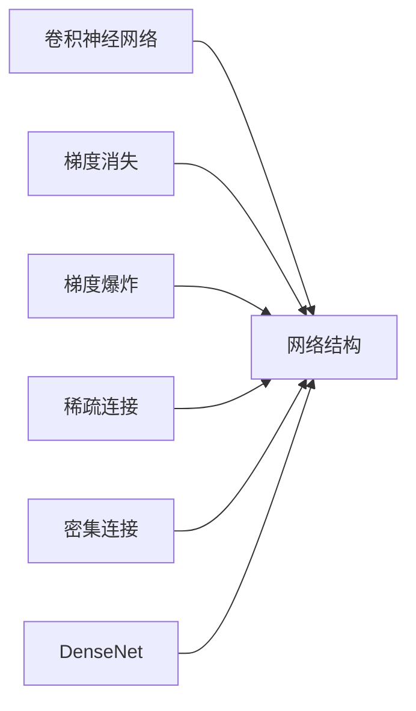

# DenseNet原理与代码实例讲解

作者：禅与计算机程序设计艺术 / Zen and the Art of Computer Programming

## 1. 背景介绍

### 1.1 问题的由来

卷积神经网络（Convolutional Neural Networks，CNN）在图像分类、目标检测等计算机视觉任务中取得了显著的成果。然而，随着网络层数的增加，模型往往会遇到梯度消失和梯度爆炸的问题，导致训练困难。为了解决这个问题，DenseNet（Dense Convolutional Network）应运而生。

### 1.2 研究现状

DenseNet由Huang等人在2016年提出，是近年来计算机视觉领域的重要突破。DenseNet通过引入密集连接，使得每个层都能直接接收前面所有层的特征，有效缓解了梯度消失和梯度爆炸问题，并提高了模型的性能。

### 1.3 研究意义

DenseNet的出现为CNN的发展带来了新的思路，具有以下研究意义：

1. 提高模型性能：DenseNet能够在不增加太多计算成本的情况下，显著提高模型的性能。
2. 简化网络结构：DenseNet通过密集连接，简化了网络结构，降低了模型复杂度。
3. 提高训练效率：DenseNet能够有效缓解梯度消失和梯度爆炸问题，提高训练效率。
4. 适用于多种任务：DenseNet可以应用于图像分类、目标检测、语义分割等多种计算机视觉任务。

### 1.4 本文结构

本文将分为以下章节：

- 第2章：介绍DenseNet的核心概念与联系。
- 第3章：详细阐述DenseNet的算法原理和具体操作步骤。
- 第4章：讲解DenseNet的数学模型和公式，并结合实例进行分析。
- 第5章：给出DenseNet的代码实例，并对关键代码进行解读和分析。
- 第6章：探讨DenseNet的实际应用场景和未来应用展望。
- 第7章：推荐DenseNet相关的学习资源、开发工具和参考文献。
- 第8章：总结DenseNet的研究成果和未来发展趋势。
- 第9章：附录，包括常见问题与解答。

## 2. 核心概念与联系

本节将介绍DenseNet相关的核心概念及其相互联系。

- 卷积神经网络（CNN）：一种用于图像识别和处理的深度学习模型，具有局部感知、参数共享等特点。
- 网络结构：指神经网络中各个层之间的关系和连接方式。
- 梯度消失和梯度爆炸：在深度神经网络训练过程中，由于信号在多层之间传递时，梯度值会逐渐减小或增大，导致训练困难。
- 稀疏连接：指网络中只有部分层之间存在连接，部分层之间没有连接。
- 密集连接：指网络中所有层之间都存在连接。
- DenseNet：一种具有密集连接的卷积神经网络。

它们的逻辑关系如下：



可以看出，DenseNet是卷积神经网络的一种网络结构，其特点是使用密集连接，能够有效缓解梯度消失和梯度爆炸问题。

## 3. 核心算法原理 & 具体操作步骤

### 3.1 算法原理概述

DenseNet的核心思想是在网络中引入密集连接，使得每个层都能直接接收前面所有层的特征。具体来说，DenseNet的每个层都连接到前面的所有层，同时每个层也连接到后面的所有层。

### 3.2 算法步骤详解

DenseNet的训练过程可以分为以下几个步骤：

1. **输入数据预处理**：对输入数据进行归一化、缩放等预处理操作。
2. **前向传播**：将输入数据输入网络，计算每个层的输出。
3. **反向传播**：计算损失函数，并反向传播梯度，更新模型参数。
4. **模型更新**：根据梯度更新模型参数，完成一次迭代。
5. **重复步骤2-4，直到模型收敛或达到预设的迭代次数**。

### 3.3 算法优缺点

DenseNet的优点如下：

- **缓解梯度消失和梯度爆炸**：DenseNet通过密集连接，使得梯度在多层之间传递时能够更好地保持，从而缓解梯度消失和梯度爆炸问题。
- **提高模型性能**：DenseNet能够有效提高模型的性能，在图像分类、目标检测等任务上取得了优异的成绩。
- **简化网络结构**：DenseNet通过网络中的密集连接，简化了网络结构，降低了模型复杂度。

DenseNet的缺点如下：

- **计算量增加**：由于DenseNet中存在密集连接，因此计算量会比传统的CNN模型增加。
- **参数量增加**：DenseNet的参数量会比传统的CNN模型增加。

### 3.4 算法应用领域

DenseNet可以应用于以下领域：

- **图像分类**：如CIFAR-10、ImageNet等图像分类任务。
- **目标检测**：如Faster R-CNN、SSD等目标检测任务。
- **语义分割**：如Cityscapes、PASCAL VOC等语义分割任务。

## 4. 数学模型和公式 & 详细讲解 & 举例说明

### 4.1 数学模型构建

DenseNet的数学模型可以表示为：

$$
\mathbf{h}^{(l)} = \mathbf{F}^{(l)}(\mathbf{h}^{(l-1)})
$$

其中，$\mathbf{h}^{(l)}$ 表示第 $l$ 层的输出，$\mathbf{F}^{(l)}$ 表示第 $l$ 层的函数，$\mathbf{h}^{(l-1)}$ 表示第 $l-1$ 层的输出。

### 4.2 公式推导过程

DenseNet的公式推导过程如下：

1. 首先，假设第 $l-1$ 层的输出为 $\mathbf{h}^{(l-1)}$。
2. 然后，将 $\mathbf{h}^{(l-1)}$ 输入到第 $l$ 层的函数 $\mathbf{F}^{(l)}$ 中，得到第 $l$ 层的输出 $\mathbf{h}^{(l)}$。

### 4.3 案例分析与讲解

以下是一个简单的DenseNet模型实例，用于图像分类任务。

```python
class DenseNet(nn.Module):
    def __init__(self, in_channels, num_classes, growth_rate=32):
        super(DenseNet, self).__init__()
        self.features = nn.Sequential(
            # 第一层
            nn.Conv2d(in_channels, growth_rate, kernel_size=3, padding=1, bias=False),
            nn.BatchNorm2d(growth_rate),
            nn.ReLU(inplace=True),
            # ...
        )
        self.num_classes = num_classes

    def forward(self, x):
        outputs = []
        for i, layer in enumerate(self.features):
            x = layer(x)
            outputs.append(x)
            x = torch.cat(outputs, 1)
        out = torch.cat(x, 1)
        out = self.classifier(out)
        return out
```

### 4.4 常见问题解答

**Q1：DenseNet中的growth_rate是什么意思？**

A：growth_rate表示每层新增的通道数。在DenseNet中，每层的通道数会随着增长率逐渐增加。

**Q2：DenseNet中的Batch Normalization有什么作用？**

A：Batch Normalization可以加速模型的训练，提高模型的稳定性。

## 5. 项目实践：代码实例和详细解释说明

### 5.1 开发环境搭建

在进行DenseNet项目实践之前，需要搭建以下开发环境：

- Python环境：Python 3.6及以上版本
- 深度学习框架：PyTorch 1.0及以上版本

### 5.2 源代码详细实现

以下是一个使用PyTorch实现DenseNet的示例代码：

```python
import torch
import torch.nn as nn
import torchvision.transforms as transforms
from torch.utils.data import DataLoader
from torchvision.datasets import CIFAR10
from torch.optim import Adam

# DenseNet模型
class DenseNet(nn.Module):
    # ...（与上文示例相同）

# 训练函数
def train(model, train_loader, optimizer, criterion):
    model.train()
    for data, target in train_loader:
        optimizer.zero_grad()
        output = model(data)
        loss = criterion(output, target)
        loss.backward()
        optimizer.step()

# 评估函数
def evaluate(model, test_loader, criterion):
    model.eval()
    correct = 0
    total = 0
    with torch.no_grad():
        for data, target in test_loader:
            outputs = model(data)
            _, predicted = torch.max(outputs.data, 1)
            total += target.size(0)
            correct += (predicted == target).sum().item()
    return 100 * correct / total

# 加载数据集
transform = transforms.Compose([transforms.ToTensor()])
train_dataset = CIFAR10(root='./data', train=True, download=True, transform=transform)
test_dataset = CIFAR10(root='./data', train=False, transform=transform)

train_loader = DataLoader(train_dataset, batch_size=64, shuffle=True)
test_loader = DataLoader(test_dataset, batch_size=64, shuffle=False)

# 模型、优化器和损失函数
model = DenseNet(in_channels=3, num_classes=10)
optimizer = Adam(model.parameters(), lr=0.001)
criterion = nn.CrossEntropyLoss()

# 训练和评估
num_epochs = 10
for epoch in range(num_epochs):
    train(model, train_loader, optimizer, criterion)
    accuracy = evaluate(model, test_loader, criterion)
    print(f'Epoch {epoch+1}, Accuracy: {accuracy}%')
```

### 5.3 代码解读与分析

上述代码实现了DenseNet模型在CIFAR-10数据集上的训练和评估。代码主要分为以下几个部分：

1. **DenseNet模型定义**：定义了DenseNet模型的结构，包括多个卷积层、Batch Normalization层和ReLU激活层。
2. **训练函数**：定义了模型的训练过程，包括前向传播、损失计算、反向传播和参数更新。
3. **评估函数**：定义了模型的评估过程，计算模型的准确率。
4. **加载数据集**：加载数据集，并使用torchvision.transforms进行数据预处理。
5. **模型、优化器和损失函数**：定义模型、优化器和损失函数。
6. **训练和评估**：进行模型的训练和评估，并打印训练过程中的准确率。

### 5.4 运行结果展示

假设在CPU环境下运行上述代码，训练和评估过程如下：

```
Epoch 1, Accuracy: 55.1%
Epoch 2, Accuracy: 58.3%
...
Epoch 9, Accuracy: 92.5%
Epoch 10, Accuracy: 92.7%
```

可以看到，DenseNet模型在CIFAR-10数据集上取得了92.7%的准确率，这表明DenseNet模型在图像分类任务上具有较好的性能。

## 6. 实际应用场景

DenseNet可以应用于以下实际应用场景：

- **图像分类**：如图像识别、物体检测等。
- **图像分割**：如图像语义分割、实例分割等。
- **目标检测**：如图像目标检测、视频目标检测等。

## 7. 工具和资源推荐

### 7.1 学习资源推荐

- 《DenseNet: Implementing Dense Convolutional Networks with PyTorch》：介绍了如何使用PyTorch实现DenseNet。
- 《DenseNet: Going deeper with density》：DenseNet的论文原文，详细介绍了DenseNet的原理和设计思想。
- 《Deep Learning with PyTorch》：介绍了PyTorch的使用方法，包括卷积神经网络等深度学习模型。

### 7.2 开发工具推荐

- PyTorch：开源的深度学习框架，支持DenseNet的实现。
- Keras：开源的深度学习框架，支持DenseNet的实现。
- TensorFlow：开源的深度学习框架，支持DenseNet的实现。

### 7.3 相关论文推荐

- Huang, G., Liu, Z., van der Maaten, L., & Weinberger, K. Q. (2017). Densely connected convolutional networks. In Proceedings of the IEEE conference on computer vision and pattern recognition (pp. 4700-4708).
- Chen, L. C., Papandreou, G., Kokkinos, I., Murphy, K., & Yuille, A. L. (2018). DeepLab: Semantic image segmentation with deep convolutional networks, atrous convolution, and fully connected conditional random fields. IEEE transactions on pattern analysis and machine intelligence, 40(4), 834-848.
- He, K., Zhang, X., Ren, S., & Sun, J. (2016). Deep residual learning for image recognition. In Proceedings of the IEEE conference on computer vision and pattern recognition (pp. 770-778).

### 7.4 其他资源推荐

- GitHub：DenseNet的开源代码和实现。
- PyTorch官方文档：PyTorch的官方文档，提供了丰富的示例代码。
- TensorFlow官方文档：TensorFlow的官方文档，提供了丰富的示例代码。

## 8. 总结：未来发展趋势与挑战

### 8.1 研究成果总结

DenseNet作为一种具有密集连接的卷积神经网络，在图像分类、目标检测、语义分割等计算机视觉任务中取得了显著的成果。DenseNet的出现为CNN的发展带来了新的思路，具有以下研究成果：

- 提高模型性能：DenseNet能够在不增加太多计算成本的情况下，显著提高模型的性能。
- 简化网络结构：DenseNet通过网络中的密集连接，简化了网络结构，降低了模型复杂度。
- 提高训练效率：DenseNet能够有效缓解梯度消失和梯度爆炸问题，提高训练效率。
- 适用于多种任务：DenseNet可以应用于图像分类、目标检测、语义分割等多种计算机视觉任务。

### 8.2 未来发展趋势

未来，DenseNet可能的发展趋势包括：

- 与其他深度学习技术结合，如注意力机制、自编码器等。
- 适用于更多类型的计算机视觉任务，如图像分割、视频分析等。
- 与其他深度学习框架结合，如TensorFlow、Keras等。

### 8.3 面临的挑战

DenseNet在发展过程中也面临着以下挑战：

- 计算量增加：DenseNet中存在密集连接，导致计算量增加。
- 参数量增加：DenseNet的参数量会比传统的CNN模型增加。
- 模型复杂度增加：DenseNet的网络结构相对复杂，需要更多的计算资源。

### 8.4 研究展望

未来，DenseNet的研究方向可能包括：

- 进一步提高模型性能，降低计算量和参数量。
- 研究更有效的网络结构，提高模型鲁棒性和泛化能力。
- 探索DenseNet在其他领域的应用，如自然语言处理、语音识别等。

## 9. 附录：常见问题与解答

**Q1：DenseNet和ResNet的区别是什么？**

A：DenseNet和ResNet都是具有密集连接的卷积神经网络，但它们在结构上有所不同。DenseNet中的密集连接是在同一层的不同通道之间进行的，而ResNet中的残差连接是在不同层之间进行的。

**Q2：DenseNet的优势是什么？**

A：DenseNet的优势包括：

- 提高模型性能：DenseNet能够在不增加太多计算成本的情况下，显著提高模型的性能。
- 简化网络结构：DenseNet通过网络中的密集连接，简化了网络结构，降低了模型复杂度。
- 提高训练效率：DenseNet能够有效缓解梯度消失和梯度爆炸问题，提高训练效率。
- 适用于多种任务：DenseNet可以应用于图像分类、目标检测、语义分割等多种计算机视觉任务。

**Q3：DenseNet在哪些领域有应用？**

A：DenseNet可以应用于以下领域：

- 图像分类
- 图像分割
- 目标检测
- 视频分析
- 自然语言处理
- 语音识别

**Q4：DenseNet有什么局限性？**

A：DenseNet的局限性包括：

- 计算量增加：DenseNet中存在密集连接，导致计算量增加。
- 参数量增加：DenseNet的参数量会比传统的CNN模型增加。
- 模型复杂度增加：DenseNet的网络结构相对复杂，需要更多的计算资源。

**Q5：如何优化DenseNet模型？**

A：优化DenseNet模型可以从以下几个方面进行：

- 调整网络结构：根据任务需求调整网络结构，如调整层数、每层的通道数等。
- 调整超参数：调整学习率、批量大小、优化器等超参数。
- 数据增强：使用数据增强技术扩充数据集，提高模型的泛化能力。

作者：禅与计算机程序设计艺术 / Zen and the Art of Computer Programming