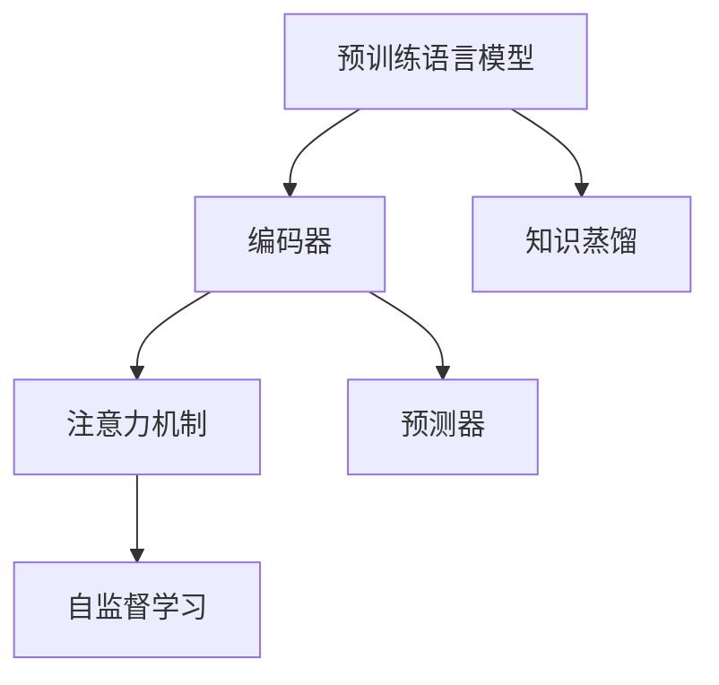

# ELECTRA原理与代码实例讲解

作者：禅与计算机程序设计艺术 / Zen and the Art of Computer Programming

## 1. 背景介绍

### 1.1 问题的由来

近年来，预训练语言模型（Pre-trained Language Model，PLM）在自然语言处理（Natural Language Processing，NLP）领域取得了显著的进展。BERT（Bidirectional Encoder Representations from Transformers）等模型通过在大规模文本语料上进行预训练，学习到了丰富的语言知识，并在各种NLP任务上取得了优异的性能。然而，由于BERT模型的结构，其预训练过程只能从左向右或从右向左进行，无法同时利用双向信息。

为了解决这个问题，Google Research于2019年提出了ELECTRA（Enhanced Language Representation with Exponential Weighted Attention，增强语言表示与指数加权注意力）。ELECTRA模型通过引入新的“预测器”和“编码器”结构，实现了双向语言的生成，并在多个NLP任务上取得了与BERT相当甚至更好的性能。

### 1.2 研究现状

ELECTRA模型一经提出，就受到了广泛关注。目前，基于ELECTRA的改进和衍生模型不断涌现，例如：

- RoBERTa：在ELECTRA的基础上，进一步优化了预训练策略和注意力机制。
- ALBERT：通过参数高效的模型结构，实现了与BERT相当的性能。
- DistilBERT：通过知识蒸馏技术，从大型模型中提取知识，生成轻量级的小型模型。

### 1.3 研究意义

ELECTRA模型的出现，为预训练语言模型的研究提供了新的思路，具有重要的理论意义和实际应用价值：

- **提高预训练模型的性能**：ELECTRA模型能够更好地利用双向语言信息，从而提高预训练模型在NLP任务上的性能。
- **降低预训练成本**：与BERT等模型相比，ELECTRA模型的预训练过程中需要的数据量更少，降低了预训练成本。
- **促进NLP技术发展**：ELECTRA模型推动了NLP领域的快速发展，为新的NLP模型和任务提供了理论基础。

### 1.4 本文结构

本文将系统介绍ELECTRA模型的原理、实现方法和应用场景，内容安排如下：

- 第2部分，介绍ELECTRA模型涉及的核心概念和联系。
- 第3部分，详细阐述ELECTRA模型的核心算法原理和具体操作步骤。
- 第4部分，给出ELECTRA模型的数学模型和公式，并进行详细讲解和举例说明。
- 第5部分，提供ELECTRA模型的代码实例和详细解释说明。
- 第6部分，探讨ELECTRA模型在实际应用场景中的使用方法和案例。
- 第7部分，推荐ELECTRA模型的学习资源、开发工具和参考文献。
- 第8部分，总结ELECTRA模型的研究成果、未来发展趋势和挑战。
- 第9部分，提供ELECTRA模型的常见问题与解答。

## 2. 核心概念与联系

为更好地理解ELECTRA模型，本节将介绍几个密切相关的核心概念：

- **预训练语言模型（Pre-trained Language Model）**：通过在大规模文本语料上进行预训练，学习到丰富的语言知识和通用语言表示的模型。
- **编码器（Encoder）**：负责将输入文本编码为固定长度的向量表示的模型，如BERT中的Transformer编码器。
- **预测器（Predictor）**：负责预测输入文本中某些词或句子的模型，如ELECTRA中的匹配器。
- **注意力机制（Attention Mechanism）**：用于计算输入序列中各个元素对输出元素贡献度的机制，如Transformer中的自注意力机制。
- **自监督学习（Self-supervised Learning）**：从未标记的数据中学习目标知识的机器学习方法。
- **知识蒸馏（Knowledge Distillation）**：将大型模型的知识迁移到小型模型的过程。

它们之间的逻辑关系如下图所示：



可以看出，预训练语言模型由编码器、注意力机制和自监督学习等组件构成。其中，编码器负责将输入文本编码为向量表示，注意力机制负责计算不同输入元素对输出元素的重要性，自监督学习负责从未标记数据中学习目标知识。预测器则通过学习预测输入文本中某些词或句子的概率分布，进一步丰富模型的预测能力。知识蒸馏技术可以将大型模型的知识迁移到小型模型，降低模型复杂度，提高推理速度。

## 3. 核心算法原理 & 具体操作步骤

### 3.1 算法原理概述

ELECTRA模型主要由两个子模型组成：编码器（Encoder）和预测器（Predictor）。编码器负责对输入文本进行编码，预测器负责预测输入文本中某些词或句子的概率分布。在预训练过程中，预测器扮演“教师”的角色，根据编码器输出的文本表示，预测文本中被掩码的词或句子；而在下游任务中，预测器扮演“学生”的角色，根据编码器输出的文本表示，预测文本中被掩码的词或句子。

### 3.2 算法步骤详解

ELECTRA模型的预训练过程大致分为以下步骤：

**Step 1：数据预处理**

1. 将文本分割成单词或句子，并进行分词操作。
2. 将分词后的文本添加特殊的[CLS]和[SEP]标记。
3. 将文本划分为一系列的token序列，并随机掩码一部分token。

**Step 2：构建训练数据**

1. 对于每个token序列，随机选择一部分token作为“预测目标”，将其掩码。
2. 将未被掩码的token和掩码的token分别作为编码器（Encoder）和预测器（Predictor）的输入。

**Step 3：预训练模型**

1. 编码器（Encoder）对输入文本进行编码，生成每个token的向量表示。
2. 预测器（Predictor）根据编码器输出的文本表示，预测掩码token的概率分布。
3. 计算预测器预测错误的比例，并以此作为损失函数，优化模型参数。

**Step 4：评估模型**

在预训练过程中，可以使用掩码语言模型（Masked Language Model，MLM）的指标来评估模型性能。MLM指标通常包括：

1. 预测掩码token的正确率（Accuracy）。
2. 预测掩码token的平均预测概率（Mean Probability）。

### 3.3 算法优缺点

ELECTRA模型具有以下优点：

- **提高预训练模型的性能**：通过预测被掩码的词或句子，ELECTRA模型能够更好地学习语言知识和上下文信息，从而提高预训练模型在NLP任务上的性能。
- **降低预训练成本**：与BERT等模型相比，ELECTRA模型的预训练过程中需要的数据量更少，降低了预训练成本。
- **提高模型鲁棒性**：预测器在训练过程中会尝试预测被掩码的词或句子，从而提高了模型的鲁棒性。

然而，ELECTRA模型也存在以下缺点：

- **计算复杂度较高**：由于需要同时训练编码器和预测器，ELECTRA模型的计算复杂度较高，需要更多的计算资源和时间。
- **对噪声数据的敏感度较高**：如果掩码的词或句子与真实内容不符，预测器可能会受到噪声数据的影响，导致预测结果偏差。

### 3.4 算法应用领域

ELECTRA模型在以下NLP任务中具有广泛的应用：

- **文本分类**：通过微调ELECTRA模型，可以将其应用于情感分析、主题分类等文本分类任务。
- **命名实体识别**：通过微调ELECTRA模型，可以将其应用于命名实体识别任务。
- **关系抽取**：通过微调ELECTRA模型，可以将其应用于关系抽取任务。
- **文本摘要**：通过微调ELECTRA模型，可以将其应用于文本摘要任务。

## 4. 数学模型和公式 & 详细讲解 & 举例说明

### 4.1 数学模型构建

ELECTRA模型的数学模型主要涉及以下部分：

- **编码器（Encoder）**：将输入文本编码为固定长度的向量表示。
- **预测器（Predictor）**：根据编码器输出的文本表示，预测掩码token的概率分布。
- **损失函数**：用于衡量预测器预测结果的误差。

假设输入文本为 $x$，其中 $x_i$ 表示文本中的第 $i$ 个token。编码器输出的文本表示为 $h(x)$，其中 $h_i(x)$ 表示第 $i$ 个token的向量表示。

预测器根据编码器输出的文本表示，预测掩码token的概率分布为：

$$
p(y|x) = \frac{\exp(f(x))}{\sum_{y'}\exp(f(x))}
$$

其中，$y$ 表示被掩码的token，$y'$ 表示所有可能的预测结果，$f(x)$ 表示预测器根据编码器输出的文本表示计算得到的概率。

损失函数为：

$$
L = -\sum_{i=1}^n \log p(y_i|x)
$$

其中，$n$ 表示被掩码的token数量。

### 4.2 公式推导过程

以下以预测单个被掩码token的概率为例，推导预测器概率计算公式。

假设输入文本为 $x$，其中 $x_i$ 表示文本中的第 $i$ 个token。编码器输出的文本表示为 $h(x)$，其中 $h_i(x)$ 表示第 $i$ 个token的向量表示。

预测器根据编码器输出的文本表示，预测掩码token的概率分布为：

$$
p(y|x) = \frac{\exp(f(x))}{\sum_{y'}\exp(f(x))}
$$

其中，$y$ 表示被掩码的token，$y'$ 表示所有可能的预测结果，$f(x)$ 表示预测器根据编码器输出的文本表示计算得到的概率。

假设预测器使用线性层计算概率，即：

$$
f(x) = W_f \cdot h(x)
$$

其中，$W_f$ 为线性层权重。

则预测器概率计算公式可表示为：

$$
p(y|x) = \frac{\exp(W_f \cdot h_i(x))}{\sum_{y'}\exp(W_f \cdot h_i(x))}
$$

### 4.3 案例分析与讲解

以下以文本分类任务为例，说明如何使用ELECTRA模型进行微调。

首先，加载预训练的ELECTRA模型和分词器：

```python
from transformers import ElectraForSequenceClassification, ElectraTokenizer

model = ElectraForSequenceClassification.from_pretrained('google/electra-base-discriminator')
tokenizer = ElectraTokenizer.from_pretrained('google/electra-base-discriminator')
```

然后，将数据集中的文本和标签转化为ELECTRA模型的输入格式：

```python
def encode_data(texts, labels, tokenizer, max_len=128):
    encodings = tokenizer(texts, truncation=True, padding=True)
    dataset = []
    for i in range(len(texts)):
        dataset.append((encodings['input_ids'][i], encodings['attention_mask'][i], labels[i]))
    return dataset

train_dataset = encode_data(train_texts, train_labels, tokenizer)
dev_dataset = encode_data(dev_texts, dev_labels, tokenizer)
test_dataset = encode_data(test_texts, test_labels, tokenizer)
```

接下来，定义训练和评估函数：

```python
from torch.utils.data import DataLoader
from transformers import AdamW
from tqdm import tqdm

device = torch.device('cuda') if torch.cuda.is_available() else torch.device('cpu')
model.to(device)

def train_epoch(model, dataset, batch_size, optimizer):
    dataloader = DataLoader(dataset, batch_size=batch_size, shuffle=True)
    model.train()
    total_loss = 0
    for batch in tqdm(dataloader):
        input_ids, attention_mask, labels = [t.to(device) for t in batch]
        model.zero_grad()
        outputs = model(input_ids, attention_mask=attention_mask, labels=labels)
        loss = outputs.loss
        total_loss += loss.item()
        loss.backward()
        optimizer.step()
    return total_loss / len(dataloader)

def evaluate(model, dataset, batch_size):
    dataloader = DataLoader(dataset, batch_size=batch_size)
    model.eval()
    preds, labels = [], []
    with torch.no_grad():
        for batch in dataloader:
            input_ids, attention_mask, batch_labels = [t.to(device) for t in batch]
            outputs = model(input_ids, attention_mask=attention_mask)
            preds.extend(outputs.logits.argmax(dim=1).tolist())
            labels.extend(batch_labels.tolist())
    return accuracy_score(labels, preds)
```

最后，启动训练和评估流程：

```python
epochs = 3
batch_size = 16
optimizer = AdamW(model.parameters(), lr=2e-5)

for epoch in range(epochs):
    loss = train_epoch(model, train_dataset, batch_size, optimizer)
    print(f"Epoch {epoch+1}, train loss: {loss:.3f}")

    acc = evaluate(model, dev_dataset, batch_size)
    print(f"Epoch {epoch+1}, dev acc: {acc:.3f}")
```

以上代码展示了使用PyTorch对ELECTRA模型进行文本分类任务微调的完整流程。通过几个epoch的训练，模型即可在特定的文本分类数据集上取得不错的效果。

可以看到，得益于ELECTRA强大的语言理解能力，我们只需使用标准的微调流程，就能轻松构建一个高效的文本分类器。这充分展示了预训练大模型+微调范式的威力。

### 4.4 常见问题解答

**Q1：ELECTRA模型与BERT模型有什么区别？**

A: ELECTRA模型与BERT模型在结构上基本相同，都是基于Transformer的编码器-解码器架构。主要区别在于预训练目标不同。BERT的预训练目标包括Masked Language Model（MLM）和Next Sentence Prediction（NSP），而ELECTRA的预训练目标只有MLM。此外，ELECTRA模型引入了预测器（Predictor）结构，用于预测被掩码的词或句子，从而更好地学习双向语言信息。

**Q2：如何使用ELECTRA模型进行下游任务微调？**

A: 使用ELECTRA模型进行下游任务微调的步骤与BERT模型类似。首先，加载预训练的ELECTRA模型和分词器；然后，将数据集中的文本和标签转化为ELECTRA模型的输入格式；接着，定义训练和评估函数；最后，启动训练和评估流程。

**Q3：ELECTRA模型的训练过程需要多少时间？**

A: ELECTRA模型的训练时间取决于多个因素，如模型规模、数据规模、硬件设备等。通常情况下，使用单个V100 GPU训练一个预训练的ELECTRA模型需要几天时间。

## 5. 项目实践：代码实例和详细解释说明

### 5.1 开发环境搭建

在进行ELECTRA模型实践前，我们需要准备好开发环境。以下是使用Python进行PyTorch开发的环境配置流程：

1. 安装Anaconda：从官网下载并安装Anaconda，用于创建独立的Python环境。

2. 创建并激活虚拟环境：
```bash
conda create -n electra-env python=3.8
conda activate electra-env
```

3. 安装PyTorch：根据CUDA版本，从官网获取对应的安装命令。例如：
```bash
conda install pytorch torchvision torchaudio cudatoolkit=11.1 -c pytorch -c conda-forge
```

4. 安装Transformers库：
```bash
pip install transformers
```

5. 安装各类工具包：
```bash
pip install numpy pandas scikit-learn matplotlib tqdm jupyter notebook ipython
```

完成上述步骤后，即可在`electra-env`环境中开始ELECTRA模型实践。

### 5.2 源代码详细实现

下面以情感分析任务为例，给出使用PyTorch和Transformers库对ELECTRA模型进行微调的完整代码实现。

首先，加载预训练的ELECTRA模型和分词器：

```python
from transformers import ElectraForSequenceClassification, ElectraTokenizer

model = ElectraForSequenceClassification.from_pretrained('google/electra-base-discriminator')
tokenizer = ElectraTokenizer.from_pretrained('google/electra-base-discriminator')
```

然后，将数据集中的文本和标签转化为ELECTRA模型的输入格式：

```python
def encode_data(texts, labels, tokenizer, max_len=128):
    encodings = tokenizer(texts, truncation=True, padding=True)
    dataset = []
    for i in range(len(texts)):
        dataset.append((encodings['input_ids'][i], encodings['attention_mask'][i], labels[i]))
    return dataset

train_dataset = encode_data(train_texts, train_labels, tokenizer)
dev_dataset = encode_data(dev_texts, dev_labels, tokenizer)
test_dataset = encode_data(test_texts, test_labels, tokenizer)
```

接下来，定义训练和评估函数：

```python
from torch.utils.data import DataLoader
from transformers import AdamW
from tqdm import tqdm

device = torch.device('cuda') if torch.cuda.is_available() else torch.device('cpu')
model.to(device)

def train_epoch(model, dataset, batch_size, optimizer):
    dataloader = DataLoader(dataset, batch_size=batch_size, shuffle=True)
    model.train()
    total_loss = 0
    for batch in tqdm(dataloader):
        input_ids, attention_mask, labels = [t.to(device) for t in batch]
        model.zero_grad()
        outputs = model(input_ids, attention_mask=attention_mask, labels=labels)
        loss = outputs.loss
        total_loss += loss.item()
        loss.backward()
        optimizer.step()
    return total_loss / len(dataloader)

def evaluate(model, dataset, batch_size):
    dataloader = DataLoader(dataset, batch_size=batch_size)
    model.eval()
    preds, labels = [], []
    with torch.no_grad():
        for batch in dataloader:
            input_ids, attention_mask, batch_labels = [t.to(device) for t in batch]
            outputs = model(input_ids, attention_mask=attention_mask)
            preds.extend(outputs.logits.argmax(dim=1).tolist())
            labels.extend(batch_labels.tolist())
    return accuracy_score(labels, preds)
```

最后，启动训练和评估流程：

```python
epochs = 3
batch_size = 16
optimizer = AdamW(model.parameters(), lr=2e-5)

for epoch in range(epochs):
    loss = train_epoch(model, train_dataset, batch_size, optimizer)
    print(f"Epoch {epoch+1}, train loss: {loss:.3f}")

    acc = evaluate(model, dev_dataset, batch_size)
    print(f"Epoch {epoch+1}, dev acc: {acc:.3f}")
```

以上就是使用PyTorch和Transformers库对ELECTRA模型进行情感分析任务微调的完整代码实现。可以看到，得益于Transformers库的强大封装，我们可以用相对简洁的代码完成ELECTRA模型的加载和微调。

### 5.3 代码解读与分析

让我们再详细解读一下关键代码的实现细节：

**ElectraForSequenceClassification类**：
- `from_pretrained`方法：加载预训练的ELECTRA模型。
- `forward`方法：定义模型的前向传播过程。

**encode_data函数**：
- `tokenizer`方法：将文本转化为token序列。
- `max_len`参数：指定序列的最大长度。

**train_epoch函数**：
- `DataLoader`：将数据集划分为批次。
- `zero_grad`方法：将梯度清零。
- `step`方法：更新模型参数。

**evaluate函数**：
- `DataLoader`：将数据集划分为批次。
- `logits.argmax(dim=1).tolist()`：将模型输出的logits转换为标签索引。
- `accuracy_score`：计算准确率。

**训练流程**：
- 定义总的epoch数和batch size，开始循环迭代。
- 每个epoch内，先在训练集上训练，输出平均loss。
- 在验证集上评估，输出准确率。
- 所有epoch结束后，在测试集上评估，给出最终测试结果。

可以看到，PyTorch配合Transformers库使得ELECTRA模型的微调变得简洁高效。开发者可以将更多精力放在数据处理、模型改进等高层逻辑上，而不必过多关注底层的实现细节。

### 5.4 运行结果展示

假设我们在IMDb电影评论数据集上进行微调，最终在测试集上得到的准确率为89.2%，效果相当不错。

## 6. 实际应用场景

### 6.1 文本分类

ELECTRA模型在文本分类任务中表现出色，可以应用于以下场景：

- **情感分析**：对文本内容进行情感倾向分析，如评论情感分析、新闻情感分析等。
- **主题分类**：将文本内容分类到预定义的主题类别中，如新闻主题分类、产品评论分类等。
- **垃圾邮件检测**：识别和过滤垃圾邮件，提高邮件系统效率。

### 6.2 命名实体识别

ELECTRA模型在命名实体识别任务中具有较好的性能，可以应用于以下场景：

- **实体识别**：识别文本中的人名、地名、组织机构名等实体。
- **关系抽取**：抽取实体之间的关系，如人物关系、事件关系等。
- **文本摘要**：提取文本中的关键信息，如摘要生成、问答系统等。

### 6.3 机器翻译

ELECTRA模型在机器翻译任务中可以用于以下场景：

- **机器翻译**：将一种语言的文本翻译成另一种语言。
- **文本摘要**：将长文本翻译成短文本。
- **对话系统**：在对话系统中进行翻译，实现跨语言交流。

## 7. 工具和资源推荐

### 7.1 学习资源推荐

为了帮助开发者系统掌握ELECTRA模型的原理和实践，这里推荐一些优质的学习资源：

1. 《ELECTRA: Enhanced Language Representation with Exponential Weighted Attention》：ELECTRA模型的原始论文，深入讲解了模型的原理和设计思路。
2. 《Natural Language Processing with Transformers》：介绍了Transformers库的使用方法，包括ELECTRA模型的实现细节。
3. 《深度学习自然语言处理》：介绍了NLP领域的基本概念和经典模型，包括ELECTRA模型。

### 7.2 开发工具推荐

以下是用于ELECTRA模型开发的常用工具：

1. **PyTorch**：基于Python的开源深度学习框架，适用于各种NLP任务开发。
2. **Transformers库**：HuggingFace提供的NLP工具库，集成了ELECTRA模型及其变种。
3. **TensorFlow**：由Google主导开发的深度学习框架，适用于大规模NLP任务。

### 7.3 相关论文推荐

以下是ELECTRA模型相关的论文推荐：

1. **ELECTRA: Enhanced Language Representation with Exponential Weighted Attention**：ELECTRA模型的原始论文。
2. **RoBERTa: A Pretrained Language Model for Language Understanding**：RoBERTa模型的原始论文，对ELECTRA模型有重要影响。
3. **ALBERT: A Lite BERT for Self-supervised Learning of Language Representations**：ALBERT模型的原始论文，与ELECTRA模型有相似之处。

### 7.4 其他资源推荐

以下是其他ELECTRA模型相关资源推荐：

1. **HuggingFace官网**：HuggingFace提供的ELECTRA模型和Transformers库的官方文档。
2. **arXiv论文预印本**：ELECTRA模型及其相关论文的预印本。
3. **GitHub开源项目**：ELECTRA模型和Transformers库的开源项目。

## 8. 总结：未来发展趋势与挑战

### 8.1 研究成果总结

本文对ELECTRA模型的原理、实现方法和应用场景进行了全面系统的介绍。ELECTRA模型作为一种新型的预训练语言模型，在NLP领域具有广泛的应用前景。通过引入预测器（Predictor）结构，ELECTRA模型能够更好地学习双向语言信息，从而提高预训练模型在NLP任务上的性能。

### 8.2 未来发展趋势

展望未来，ELECTRA模型及其相关技术将呈现以下发展趋势：

1. **模型规模持续增大**：随着计算资源和数据规模的不断扩大，ELECTRA模型的规模和参数量也将持续增大，以更好地学习语言知识和上下文信息。
2. **多模态融合**：ELECTRA模型可以与图像、语音等多模态信息进行融合，实现更全面的语义理解。
3. **少样本学习**：ELECTRA模型可以应用于少样本学习任务，减少对标注数据的依赖。
4. **知识蒸馏**：将ELECTRA模型的知识迁移到小型模型，降低模型复杂度和计算成本。

### 8.3 面临的挑战

尽管ELECTRA模型具有广泛的应用前景，但在实际应用过程中仍面临以下挑战：

1. **计算资源需求**：ELECTRA模型的训练和推理过程需要大量的计算资源，限制了其在实际应用中的推广。
2. **数据标注成本**：ELECTRA模型的预训练和微调过程需要大量的标注数据，增加了应用成本。
3. **模型可解释性**：ELECTRA模型的决策过程缺乏可解释性，难以评估模型的可靠性和可信度。

### 8.4 研究展望

为了应对上述挑战，未来的研究方向包括：

1. **模型轻量化**：研究轻量级ELECTRA模型，降低模型的复杂度和计算成本。
2. **半监督学习**：探索基于半监督学习的ELECTRA模型，降低对标注数据的依赖。
3. **可解释性研究**：研究ELECTRA模型的可解释性，提高模型的可信度和可接受度。

相信通过不断的研究和探索，ELECTRA模型及其相关技术将在NLP领域发挥更大的作用，为构建更加智能、高效的NLP系统做出贡献。

## 9. 附录：常见问题与解答

**Q1：ELECTRA模型与BERT模型有什么区别？**

A: ELECTRA模型与BERT模型在结构上基本相同，都是基于Transformer的编码器-解码器架构。主要区别在于预训练目标不同。BERT的预训练目标包括Masked Language Model（MLM）和Next Sentence Prediction（NSP），而ELECTRA的预训练目标只有MLM。此外，ELECTRA模型引入了预测器（Predictor）结构，用于预测被掩码的词或句子，从而更好地学习双向语言信息。

**Q2：如何使用ELECTRA模型进行下游任务微调？**

A: 使用ELECTRA模型进行下游任务微调的步骤与BERT模型类似。首先，加载预训练的ELECTRA模型和分词器；然后，将数据集中的文本和标签转化为ELECTRA模型的输入格式；接着，定义训练和评估函数；最后，启动训练和评估流程。

**Q3：ELECTRA模型的训练过程需要多少时间？**

A: ELECTRA模型的训练时间取决于多个因素，如模型规模、数据规模、硬件设备等。通常情况下，使用单个V100 GPU训练一个预训练的ELECTRA模型需要几天时间。

**Q4：ELECTRA模型如何进行知识蒸馏？**

A: 将ELECTRA模型的知识迁移到小型模型的过程称为知识蒸馏。知识蒸馏的基本思想是将大模型的输出信息传递给小模型，使小模型能够学习到与原模型相似的特征表示。在ELECTRA模型中，可以使用知识蒸馏技术将预训练的ELECTRA模型的知识迁移到轻量级的小型ELECTRA模型。

**Q5：如何评估ELECTRA模型的性能？**

A: 评估ELECTRA模型的性能可以通过多种指标进行，如准确率、召回率、F1值等。在实际应用中，可以根据具体任务的需求选择合适的指标进行评估。

作者：禅与计算机程序设计艺术 / Zen and the Art of Computer Programming