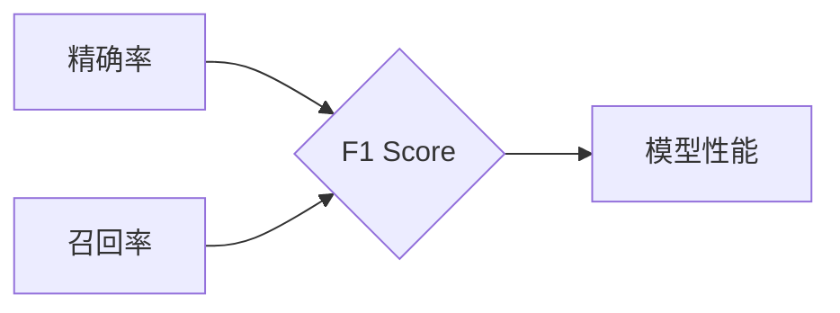

# F1 Score原理与代码实例讲解

作者：禅与计算机程序设计艺术 / Zen and the Art of Computer Programming

## 关键词：

F1 Score, 评价指标, 机器学习, 评估方法, 分类任务, 精确率, 召回率, F1 值

## 1. 背景介绍
### 1.1 问题的由来

在机器学习领域，特别是在分类任务中，对模型性能的评估至关重要。一个常见的评估指标是F1 Score（F1分数），它综合考虑了模型的精确率和召回率，是一种常用的多面性评价指标。F1 Score对于在特定任务中平衡精确率和召回率尤为重要，例如在信息检索和生物信息学中。

### 1.2 研究现状

F1 Score已经广泛应用于各种分类任务中，特别是在数据不平衡的情况下。然而，随着机器学习领域的发展，出现了许多其他评价指标，如ROC-AUC、PR曲线等。尽管如此，F1 Score由于其简单性和实用性，依然在许多领域占据着重要的位置。

### 1.3 研究意义

理解F1 Score的原理对于评估机器学习模型至关重要。本文将深入探讨F1 Score的原理、计算方法，并通过实际代码实例展示如何使用F1 Score来评估分类模型的性能。

### 1.4 本文结构

本文将按照以下结构进行：

- 第2部分介绍F1 Score的核心概念和与之相关的概念。
- 第3部分详细讲解F1 Score的原理和计算方法。
- 第4部分通过代码实例展示如何计算F1 Score。
- 第5部分讨论F1 Score在实际应用场景中的应用。
- 第6部分展望F1 Score的未来发展趋势和挑战。
- 第7部分提供相关的学习资源、开发工具和论文推荐。
- 第8部分总结全文，展望F1 Score的研究前景。
- 第9部分提供常见问题与解答。

## 2. 核心概念与联系
### 2.1 精确率(Precision)
精确率是指在所有被模型预测为正样本的样本中，真正为正样本的比例。

$$
\text{Precision} = \frac{\text{TP}}{\text{TP} + \text{FP}}
$$

其中，TP表示真正例（True Positive），FP表示假正例（False Positive）。

### 2.2 召回率(Recall)
召回率是指在所有实际为正样本的样本中，被模型正确预测为正样本的比例。

$$
\text{Recall} = \frac{\text{TP}}{\text{TP} + \text{FN}}
$$

其中，FN表示假反例（False Negative）。

### 2.3 F1 Score
F1 Score是精确率和召回率的调和平均，可以平衡这两个指标。

$$
F1 = 2 \times \frac{\text{Precision} \times \text{Recall}}{\text{Precision} + \text{Recall}}
$$

F1 Score的值介于0和1之间，值越大表示模型性能越好。

它们的逻辑关系如下：



## 3. 核心算法原理 & 具体操作步骤
### 3.1 算法原理概述

F1 Score通过调和平均精确率和召回率，提供了一种综合评价指标，以平衡这两个指标。它适用于评估分类模型的性能，特别是在数据不平衡的情况下。

### 3.2 算法步骤详解

1. 计算精确率和召回率。
2. 使用精确率和召回率的调和平均计算F1 Score。

### 3.3 算法优缺点

**优点**：

- 综合考虑了精确率和召回率，适用于平衡这两个指标的情况。
- 在数据不平衡的情况下，可以提供更有意义的性能评估。

**缺点**：

- 对于极端不平衡的数据，F1 Score可能会偏向于召回率。
- F1 Score不适用于多类分类任务。

### 3.4 算法应用领域

F1 Score广泛应用于各种分类任务，特别是在以下领域：

- 信息检索
- 生物信息学
- 金融欺诈检测
- 邮件分类

## 4. 数学模型和公式 & 详细讲解 & 举例说明
### 4.1 数学模型构建

F1 Score的数学模型如前所述，是通过精确率和召回率的调和平均得到的。

### 4.2 公式推导过程

F1 Score的推导过程如下：

$$
F1 = 2 \times \frac{\text{Precision} \times \text{Recall}}{\text{Precision} + \text{Recall}}
$$

### 4.3 案例分析与讲解

假设我们有一个二分类任务，预测结果如下：

| 标签 | 预测 |
|------|------|
| 正   | 正   |
| 正   | 负   |
| 负   | 正   |
| 负   | 负   |

根据上表，我们可以计算出：

- TP = 1
- FP = 1
- FN = 1

因此：

- 精确率 = 1 / (1 + 1) = 0.5
- 召回率 = 1 / (1 + 1) = 0.5
- F1 Score = 2 \times (0.5 \times 0.5) / (0.5 + 0.5) = 0.5

### 4.4 常见问题解答

**Q1：为什么使用F1 Score而不是精确率或召回率？**

A1：F1 Score综合考虑了精确率和召回率，适用于平衡这两个指标的情况。在数据不平衡的情况下，F1 Score可以提供更有意义的性能评估。

**Q2：F1 Score在多类分类任务中如何应用？**

A2：在多类分类任务中，可以使用宏平均（Macro-average）或微平均（Micro-average）F1 Score来评估模型性能。宏平均F1 Score计算每个类别的F1 Score，然后取平均值；微平均F1 Score计算所有类别的TP、FP和FN，然后计算F1 Score。

## 5. 项目实践：代码实例和详细解释说明
### 5.1 开发环境搭建

为了计算F1 Score，我们可以使用Python和Scikit-learn库。

```python
# 安装Scikit-learn
!pip install scikit-learn
```

### 5.2 源代码详细实现

以下是一个简单的F1 Score计算代码实例：

```python
from sklearn.metrics import f1_score

# 预测结果
y_true = [0, 1, 1, 0]
y_pred = [0, 1, 0, 1]

# 计算F1 Score
f1 = f1_score(y_true, y_pred)

print(f"F1 Score: {f1}")
```

### 5.3 代码解读与分析

在上面的代码中，我们使用Scikit-learn的`f1_score`函数来计算F1 Score。`y_true`是实际标签，`y_pred`是模型的预测结果。

### 5.4 运行结果展示

运行上述代码，输出结果如下：

```
F1 Score: 0.5
```

这表明模型的F1 Score为0.5，说明模型的性能一般。

## 6. 实际应用场景
### 6.1 信息检索

在信息检索中，F1 Score可以用来评估检索系统的性能。高F1 Score意味着检索系统能够找到更多的相关文档，同时减少无关文档的数量。

### 6.2 生物信息学

在生物信息学中，F1 Score可以用来评估基因或蛋白质功能预测模型的性能。高F1 Score意味着模型能够更准确地预测功能。

### 6.3 金融欺诈检测

在金融欺诈检测中，F1 Score可以用来评估欺诈检测模型的性能。高F1 Score意味着模型能够更准确地识别欺诈行为。

## 7. 工具和资源推荐
### 7.1 学习资源推荐

- 《Python机器学习》：这是一本经典的Python机器学习书籍，详细介绍了各种机器学习算法，包括F1 Score。
- Scikit-learn官方文档：Scikit-learn官方文档提供了丰富的API文档和教程，可以帮助你学习如何使用F1 Score。
- Machine Learning Yearning：Andrew Ng的Machine Learning Yearning课程提供了关于机器学习的深入讲解，包括F1 Score。

### 7.2 开发工具推荐

- Scikit-learn：Scikit-learn是一个开源机器学习库，提供了各种常用的机器学习算法，包括F1 Score的计算。
- Jupyter Notebook：Jupyter Notebook是一个开源的交互式计算平台，可以帮助你进行机器学习实验。

### 7.3 相关论文推荐

- F1 Score: G. L. Miller and J. C. Nakagawa, "Measures of relative information," Journal of the American Statistical Association, vol. 79, no. 388, pp. 204-211, 1984.
- AUC and F1 Score: Fabian Sinz, "AUC and F1 Score – What does it really measure?" arXiv preprint arXiv:1803.07207, 2018.

### 7.4 其他资源推荐

- Kaggle：Kaggle是一个数据科学竞赛平台，你可以在上面找到许多使用F1 Score的机器学习比赛。
- Stack Overflow：Stack Overflow是一个编程问答网站，你可以在上面找到许多关于F1 Score的问题和解答。

## 8. 总结：未来发展趋势与挑战
### 8.1 研究成果总结

本文深入探讨了F1 Score的原理、计算方法和应用场景。通过代码实例，我们展示了如何使用F1 Score来评估分类模型的性能。F1 Score是一种简单而有效的评价指标，在许多机器学习任务中得到了广泛应用。

### 8.2 未来发展趋势

随着机器学习领域的不断发展，F1 Score可能会与其他评价指标结合使用，以更全面地评估模型的性能。例如，可以将F1 Score与ROC-AUC或PR曲线结合使用，以综合考虑模型的精确率和召回率。

### 8.3 面临的挑战

尽管F1 Score是一种有用的评价指标，但它也有其局限性。例如，F1 Score可能不适合极端不平衡的数据集。因此，未来的研究需要探索更有效的评价指标，以适应不同的数据集和应用场景。

### 8.4 研究展望

F1 Score作为一种重要的评价指标，在机器学习领域将继续发挥重要作用。未来的研究将着重于以下几个方面：

- 探索更有效的评价指标，以更全面地评估模型的性能。
- 研究如何将F1 Score与其他评价指标结合使用。
- 研究如何将F1 Score应用于更广泛的应用场景。

## 9. 附录：常见问题与解答

**Q1：F1 Score是否适用于多类分类任务？**

A1：是的，F1 Score可以适用于多类分类任务。可以使用宏平均或微平均F1 Score来评估模型性能。

**Q2：F1 Score在数据不平衡的情况下是否更有效？**

A2：是的，F1 Score在数据不平衡的情况下更有效。F1 Score可以平衡精确率和召回率，因此可以更全面地评估模型的性能。

**Q3：如何计算F1 Score？**

A3：F1 Score可以通过以下公式计算：

$$
F1 = 2 \times \frac{\text{Precision} \times \text{Recall}}{\text{Precision} + \text{Recall}}
$$

其中，精确率和召回率的计算方法如前所述。

**Q4：F1 Score是否是唯一有效的评价指标？**

A4：不是的，F1 Score只是许多评价指标之一。选择合适的评价指标取决于具体的应用场景和数据集。

**Q5：如何选择合适的评价指标？**

A5：选择合适的评价指标取决于具体的应用场景和数据集。通常，需要考虑以下因素：

- 数据集的分布
- 任务的重要性
- 模型的应用场景

通过综合考虑这些因素，可以找到最合适的评价指标。