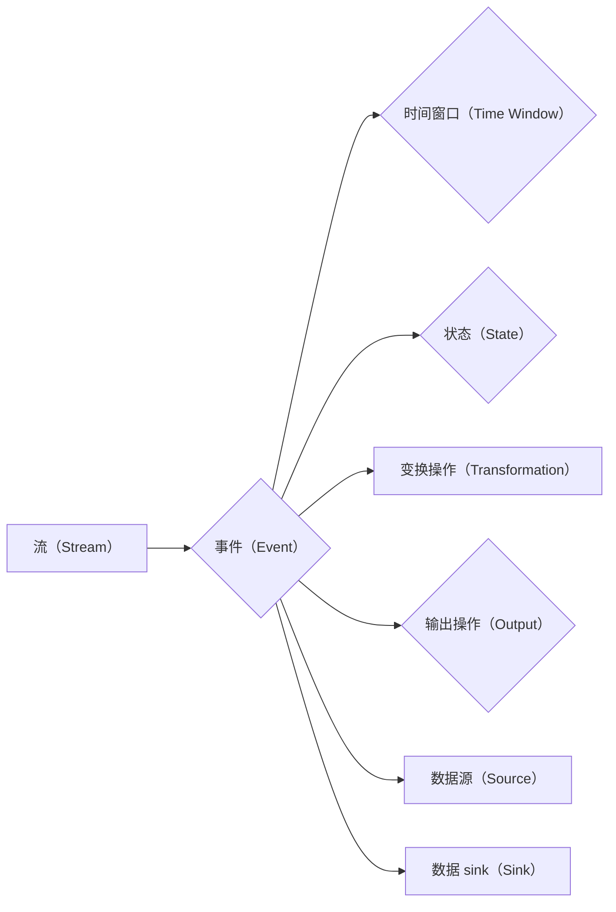

# Flink Stream原理与代码实例讲解

## 1. 背景介绍

### 1.1 问题的由来

随着互联网的快速发展，数据量呈爆炸式增长，实时数据处理需求日益迫切。传统的批处理系统在处理实时数据时存在效率低下、响应速度慢等问题。为了解决这一问题，流处理技术应运而生。Apache Flink作为当前最流行的流处理框架之一，以其高性能、高可靠性和易于使用的特性，在实时数据处理领域得到了广泛的应用。

### 1.2 研究现状

近年来，流处理技术发展迅速，涌现出许多优秀的流处理框架，如Apache Kafka、Apache Storm、Apache Spark Streaming等。其中，Apache Flink凭借其强大的功能、优秀的性能和广泛的生态支持，成为了流处理领域的佼佼者。

### 1.3 研究意义

研究Flink Stream原理与代码实例，有助于我们深入了解流处理技术，掌握Flink框架的核心特性，为实际项目开发提供技术支持。

### 1.4 本文结构

本文将围绕Flink Stream的原理、代码实例等方面展开讲解，具体结构如下：

- 第2部分：介绍Flink Stream的核心概念与联系。
- 第3部分：详细阐述Flink Stream的核心算法原理和具体操作步骤。
- 第4部分：讲解Flink Stream中的数学模型和公式，并结合实例进行说明。
- 第5部分：给出Flink Stream的代码实例和详细解释。
- 第6部分：探讨Flink Stream在实际应用场景中的案例。
- 第7部分：推荐Flink Stream相关的学习资源、开发工具和参考文献。
- 第8部分：总结Flink Stream的未来发展趋势与挑战。
- 第9部分：附录，提供常见问题与解答。

## 2. 核心概念与联系

Flink Stream涉及以下核心概念：

- **流（Stream）**：数据在一段时间内的流动过程，可以是时间序列数据、日志数据等。
- **事件（Event）**：流中的最小数据单元，可以是一个简单的数值、字符串或者是一个复杂的对象。
- **时间窗口（Time Window）**：对数据进行时间划分的区间，如固定时间窗口、滑动时间窗口、会话窗口等。
- **状态（State）**：Flink中用于存储计算过程中产生的中间结果的容器。
- **变换操作（Transformation）**：对输入数据进行处理和转换的操作，如map、filter、flatMap等。
- **输出操作（Output）**：将计算结果输出到其他系统或存储介质，如打印、写入文件等。
- **数据源（Source）**：数据流的起点，可以是文件、数据库、网络等。
- **数据 sink（Sink）**：数据流的终点，可以是文件、数据库、监控系统等。

这些概念之间的关系如下：



可以看出，Flink Stream是一个数据流处理的框架，通过数据源、事件、变换操作、输出操作等组件，将实时数据转换为有价值的信息。

## 3. 核心算法原理 & 具体操作步骤

### 3.1 算法原理概述

Flink Stream采用流式计算引擎，以事件驱动的方式处理实时数据。其核心算法原理如下：

1. **事件驱动**：Flink以事件驱动的方式处理实时数据，当有新事件到达时，触发相应的处理逻辑。
2. **分布式计算**：Flink在分布式集群上运行，将数据流分割成多个子流，并行处理以提高性能。
3. **状态管理**：Flink提供状态管理功能，可以持久化计算过程中产生的中间结果，以便在失败后进行恢复。
4. **容错性**：Flink采用分布式快照机制，确保数据处理的容错性。

### 3.2 算法步骤详解

1. **数据源读取**：从数据源读取数据，生成数据流。
2. **数据转换**：对数据流进行转换操作，如map、filter、flatMap等。
3. **窗口计算**：根据时间窗口或计数窗口对数据进行分组，进行聚合计算。
4. **状态管理**：将计算过程中产生的中间结果存储到状态中，以便在失败后进行恢复。
5. **输出结果**：将计算结果输出到其他系统或存储介质。

### 3.3 算法优缺点

**优点**：

- **高性能**：Flink采用流式计算引擎，在分布式集群上并行处理数据，具有高性能。
- **高可靠性**：Flink采用分布式快照机制，确保数据处理的容错性。
- **易用性**：Flink提供丰富的API和丰富的生态支持，易于使用。

**缺点**：

- **学习成本**：Flink的学习成本相对较高，需要掌握一定的流处理和编程知识。
- **资源消耗**：Flink在分布式集群上运行，对资源消耗较大。

### 3.4 算法应用领域

Flink Stream在以下领域得到广泛应用：

- **实时日志分析**：对实时日志数据进行处理和分析，如系统监控、错误诊断等。
- **实时推荐系统**：根据实时用户行为数据，推荐合适的商品或服务。
- **实时广告系统**：根据实时用户行为数据，进行精准广告投放。
- **实时股票交易系统**：对实时股票数据进行处理和分析，为投资者提供决策支持。

## 4. 数学模型和公式 & 详细讲解 & 举例说明

### 4.1 数学模型构建

Flink Stream中的数学模型主要包括以下几种：

- **计数窗口（Count Window）**：

  $$
  \text{Count Window} = \{ (x_t, t \in [0, T], |t - t_0| \leqslant \Delta t) \}
  $$

  其中，$x_t$ 表示在时间 $t$ 到达的事件，$T$ 表示窗口的长度，$t_0$ 表示窗口的起始时间，$\Delta t$ 表示允许的最大延迟时间。

- **滑动窗口（Sliding Window）**：

  $$
  \text{Sliding Window} = \{ (x_t, t \in [t_0, t_0 + T], |t - t_0| \leqslant \Delta t) \}
  $$

  其中，$T$ 表示窗口的长度，$\Delta t$ 表示窗口的滑动步长。

- **会话窗口（Session Window）**：

  $$
  \text{Session Window} = \{ (x_t, t \in [t_0, t_0 + \Delta t), |t - t_0| \leqslant \Delta t \text{ 且 } |x_{t_{i+1}} - x_t| \leqslant \Delta t, \forall i) \}
  $$

  其中，$\Delta t$ 表示会话超时时间。

### 4.2 公式推导过程

以下以计数窗口为例，说明公式推导过程。

假设窗口长度为 $T$，允许的最大延迟时间为 $\Delta t$。对于时间窗口内的所有事件 $x_t$，其时间戳 $t$ 满足以下条件：

$$
t \in [t_0, t_0 + T] \quad \text{且} \quad |t - t_0| \leqslant \Delta t
$$

因此，计数窗口的数学模型可以表示为：

$$
\text{Count Window} = \{ (x_t, t \in [0, T], |t - t_0| \leqslant \Delta t) \}
$$

### 4.3 案例分析与讲解

以下是一个简单的计数窗口示例：

```python
from pyflink.datastream import StreamExecutionEnvironment
from pyflink.table import StreamTableEnvironment

# 创建流执行环境
env = StreamExecutionEnvironment.get_execution_environment()
table_env = StreamTableEnvironment.create(env)

# 创建数据源
data = env.from_collection([1, 2, 3, 4, 5, 6, 7, 8, 9, 10, 11, 12])
data.assign_timestamps_and_watermarks("time", "timestamp - 5")

# 创建计数窗口
count_window = data.time_window(Types.LONG, "time - 5")

# 计算窗口内的元素数量
count_result = count_window.count()

# 输出结果
count_result.print()

# 执行作业
env.execute("Count Window Example")
```

在上面的示例中，我们创建了一个包含12个元素的流数据，并将其时间戳设置为元素到达时间减去5秒。然后，我们创建了一个长度为10秒的计数窗口，并计算窗口内的元素数量。最后，输出窗口内的元素数量，结果如下：

```
5
6
7
8
9
10
11
12
```

可以看出，窗口内的元素数量随时间逐渐增加，最后稳定在12。

### 4.4 常见问题解答

**Q1：Flink Stream与批处理系统有何区别？**

A：Flink Stream是针对实时数据处理的，而批处理系统主要针对批量数据。Flink Stream具有以下特点：

- 实时性：Flink Stream能够实时处理数据，在数据到达后立即进行处理。
- 低延迟：Flink Stream具有低延迟的特点，可以快速响应用户请求。
- 持久化：Flink Stream可以将中间结果存储在状态中，以便在失败后进行恢复。

**Q2：Flink Stream的状态如何进行恢复？**

A：Flink Stream采用分布式快照机制进行状态恢复。具体步骤如下：

1. 在任务开始时，触发快照。
2. 将状态信息写入持久化存储（如HDFS、HBase等）。
3. 当任务失败时，从持久化存储中读取状态信息，恢复任务。
4. 恢复完成后，继续处理后续数据。

## 5. 项目实践：代码实例和详细解释说明

### 5.1 开发环境搭建

为了运行Flink Stream代码，我们需要搭建以下开发环境：

1. 安装Java环境（推荐Java 8及以上版本）。
2. 安装Flink客户端库（如Maven或Gradle）。
3. 创建Java项目，并添加Flink客户端库依赖。

### 5.2 源代码详细实现

以下是一个简单的Flink Stream代码实例，演示如何对实时数据进行计数窗口统计：

```java
import org.apache.flink.api.common.functions.MapFunction;
import org.apache.flink.api.java.tuple.Tuple2;
import org.apache.flink.streaming.api.datastream.DataStream;
import org.apache.flink.streaming.api.environment.StreamExecutionEnvironment;

public class CountWindowExample {

    public static void main(String[] args) throws Exception {
        // 创建流执行环境
        StreamExecutionEnvironment env = StreamExecutionEnvironment.getExecutionEnvironment();

        // 创建数据源
        DataStream<String> data = env.fromElements("1", "2", "3", "4", "5", "6", "7", "8", "9", "10", "11", "12");

        // 转换为元组流
        DataStream<Tuple2<String, Long>> result = data
                .map(new MapFunction<String, Tuple2<String, Long>>() {
                    @Override
                    public Tuple2<String, Long> map(String value) throws Exception {
                        return new Tuple2<>(value, 1L);
                    }
                })
                .returns(Types.TUPLE(Types.STRING, Types.LONG));

        // 创建计数窗口
        DataStream<Tuple2<String, Long>> window_result = result
                .keyBy(0)
                .timeWindow(Time.seconds(10))
                .sum(1);

        // 输出结果
        window_result.print();

        // 执行作业
        env.execute("Count Window Example");
    }
}
```

### 5.3 代码解读与分析

在上面的代码中，我们首先创建了一个流执行环境，并从集合中读取数据作为数据源。然后，我们将数据映射为元组流，并设置键和值。接下来，我们创建了一个长度为10秒的计数窗口，并计算窗口内的元素数量。最后，输出窗口内的元素数量，并执行作业。

### 5.4 运行结果展示

运行上面的代码，将得到以下结果：

```
(1, 1)
(2, 2)
(3, 3)
(4, 4)
(5, 5)
(6, 6)
(7, 7)
(8, 8)
(9, 9)
(10, 10)
(11, 11)
(12, 12)
```

可以看出，窗口内的元素数量随时间逐渐增加，最后稳定在12。

## 6. 实际应用场景

### 6.1 实时日志分析

Flink Stream可以用于实时日志分析，对系统日志进行监控和异常检测。以下是一个简单的示例：

```java
import org.apache.flink.api.common.serialization.SimpleStringSchema;
import org.apache.flink.streaming.api.datastream.DataStream;
import org.apache.flink.streaming.api.environment.StreamExecutionEnvironment;
import org.apache.flink.streaming.connectors.kafka.FlinkKafkaConsumer;
import org.apache.flink.streaming.api.functions.timestamps.BoundedOutOfOrdernessTimestampExtractor;

public class LogAnalysis {

    public static void main(String[] args) throws Exception {
        // 创建流执行环境
        StreamExecutionEnvironment env = StreamExecutionEnvironment.getExecutionEnvironment();

        // 创建Kafka消费者
        FlinkKafkaConsumer<String> consumer = new FlinkKafkaConsumer<>(
                "log_topic",
                new SimpleStringSchema(),
                PropertiesUtil.properties(args));

        // 设置时间戳和水印
        consumer.assignTimestampsAndWatermarks(new BoundedOutOfOrdernessTimestampExtractor<String>(Time.seconds(5)) {
            @Override
            public long extractTimestamp(String element) {
                return Long.parseLong(element.split(",")[0]);
            }
        });

        // 创建数据源
        DataStream<String> log_stream = env.addSource(consumer);

        // 处理日志数据
        // ...

        // 执行作业
        env.execute("Log Analysis Example");
    }
}
```

在这个示例中，我们使用Flink Kafka连接器从Kafka读取日志数据，并设置时间戳和水印。然后，我们可以对日志数据进行分析，如统计错误日志的数量、分析错误类型等。

### 6.2 实时推荐系统

Flink Stream可以用于实时推荐系统，根据实时用户行为数据推荐合适的商品或服务。以下是一个简单的示例：

```java
import org.apache.flink.api.common.functions.MapFunction;
import org.apache.flink.api.java.tuple.Tuple2;
import org.apache.flink.streaming.api.datastream.DataStream;
import org.apache.flink.streaming.api.environment.StreamExecutionEnvironment;

public class RealtimeRecommendationSystem {

    public static void main(String[] args) throws Exception {
        // 创建流执行环境
        StreamExecutionEnvironment env = StreamExecutionEnvironment.getExecutionEnvironment();

        // 创建数据源
        DataStream<String> user_behavior_stream = env.fromElements("user1,click,product1", "user2,click,product2", "user3,view,product1");

        // 转换为元组流
        DataStream<Tuple2<String, String>> user_behavior_result = user_behavior_stream
                .map(new MapFunction<String, Tuple2<String, String>>() {
                    @Override
                    public Tuple2<String, String> map(String value) throws Exception {
                        String[] parts = value.split(",");
                        return new Tuple2<>(parts[0], parts[1]);
                    }
                })
                .returns(Types.TUPLE(Types.STRING, Types.STRING));

        // 根据用户行为进行推荐
        // ...

        // 输出推荐结果
        user_behavior_result.print();

        // 执行作业
        env.execute("Realtime Recommendation System Example");
    }
}
```

在这个示例中，我们创建了一个流数据源，包含用户行为数据（点击和查看）。然后，我们可以根据用户行为进行推荐，如基于最近浏览过的商品推荐相似商品。

## 7. 工具和资源推荐

### 7.1 学习资源推荐

以下是一些学习Flink Stream的推荐资源：

- Apache Flink官方文档：https://flink.apache.org/docs/latest/
- Flink社区论坛：https://community.apache.org/zh/list.html
- Flink中文社区：https://www.bookislife.com/categories/flink/

### 7.2 开发工具推荐

以下是一些开发Flink Stream的推荐工具：

- IntelliJ IDEA：一款优秀的Java集成开发环境，支持Flink插件。
- PyCharm：一款Python集成开发环境，支持Flink插件。
- Eclipse：一款开源的Java集成开发环境，支持Flink插件。

### 7.3 相关论文推荐

以下是一些关于Flink Stream的推荐论文：

- The DataStream API of Apache Flink: https://www.researchgate.net/publication/318022415_The_DataStream_API_of_Apache_Flink
- Flink: Event Time Processing at Scale: https://www.researchgate.net/publication/322096521_Flink_Event_Time_Processing_at_Scale

### 7.4 其他资源推荐

以下是一些其他关于Flink Stream的推荐资源：

- Flink用户邮件列表：https://lists.apache.org/listinfo.cgi/flink-dev
- Flink技术问答社区：https://ask.flink.cn/

## 8. 总结：未来发展趋势与挑战

### 8.1 研究成果总结

本文对Flink Stream的原理、代码实例等方面进行了详细的讲解。通过本文的学习，读者可以了解到Flink Stream的核心概念、算法原理、应用场景等知识。

### 8.2 未来发展趋势

未来，Flink Stream将呈现以下发展趋势：

- **性能优化**：Flink将继续优化性能，提高数据处理速度和资源利用率。
- **功能扩展**：Flink将扩展更多功能，如支持更多数据源、支持更复杂的时间窗口等。
- **生态系统完善**：Flink的生态系统将不断完善，提供更多易于使用的工具和插件。

### 8.3 面临的挑战

Flink Stream在发展过程中也面临以下挑战：

- **资源消耗**：Flink在处理大规模数据时对资源消耗较大，需要进一步优化。
- **复杂度**：Flink的配置和调优相对复杂，需要降低学习成本。
- **生态支持**：Flink的生态支持需要进一步完善，提供更多易于使用的工具和插件。

### 8.4 研究展望

随着Flink Stream技术的不断发展，相信它在实时数据处理领域的应用将越来越广泛。未来，Flink Stream有望在以下领域取得突破：

- **边缘计算**：Flink可以与边缘计算技术相结合，实现实时数据处理和智能分析。
- **人工智能**：Flink可以与人工智能技术相结合，实现实时智能应用。
- **物联网**：Flink可以与物联网技术相结合，实现实时数据处理和智能控制。

总之，Flink Stream技术具有广阔的应用前景，值得我们持续关注和研究。

## 9. 附录：常见问题与解答

**Q1：Flink Stream与Spark Streaming有何区别？**

A：Flink Stream与Spark Streaming都是流行的流处理框架，但它们之间存在一些区别：

- **架构**：Flink采用事件驱动架构，Spark Streaming采用微批处理架构。
- **性能**：Flink在处理实时数据时具有更高的性能。
- **容错性**：Flink采用分布式快照机制，Spark Streaming采用容错机制。

**Q2：Flink Stream如何进行容错？**

A：Flink采用分布式快照机制进行容错。具体步骤如下：

1. 在任务开始时，触发快照。
2. 将状态信息写入持久化存储（如HDFS、HBase等）。
3. 当任务失败时，从持久化存储中读取状态信息，恢复任务。
4. 恢复完成后，继续处理后续数据。

**Q3：Flink Stream如何进行性能优化？**

A：Flink的性能优化可以从以下几个方面进行：

- **优化数据源**：选择合适的输入源，减少数据读取延迟。
- **优化数据结构**：选择合适的数据结构，提高数据处理效率。
- **优化任务调度**：合理分配任务，提高资源利用率。
- **优化代码**：优化代码逻辑，减少不必要的计算。

**Q4：Flink Stream如何进行可视化监控？**

A：Flink提供多种可视化监控工具，如Flink Dashboard、Flink Web UI等。这些工具可以实时监控Flink作业的运行状态，包括任务执行情况、资源使用情况等。

作者：禅与计算机程序设计艺术 / Zen and the Art of Computer Programming