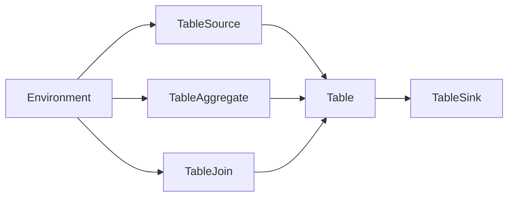

# Flink Table原理与代码实例讲解

作者：禅与计算机程序设计艺术 / Zen and the Art of Computer Programming

## 1. 背景介绍

### 1.1 问题的由来

随着大数据时代的到来，流处理技术逐渐成为数据处理领域的重要方向。Apache Flink 作为一款开源的分布式流处理框架，以其强大的实时数据处理能力，在业界获得了广泛的应用。Flink Table API 作为 Flink 生态系统的重要组成部分，提供了基于 SQL 的数据操作能力，极大地简化了流处理应用的开发。

### 1.2 研究现状

Flink Table API 的研究和应用已经取得了显著的进展，但仍有以下问题需要解决：

- 如何将 SQL 语句转换为 Flink Table API 的内部表示？
- 如何优化 SQL 语句的执行计划？
- 如何在 Flink 中实现复杂的 SQL 语句，如窗口函数、自定义函数等？

### 1.3 研究意义

Flink Table API 的研究和应用具有重要意义：

- 简化流处理应用开发：基于 SQL 的数据操作，降低了流处理应用的开发难度。
- 提高应用性能：优化执行计划，提高数据处理效率。
- 扩展 Flink 的应用场景：支持更丰富的数据操作，满足更多应用需求。

### 1.4 本文结构

本文将围绕 Flink Table API 的原理和代码实例进行讲解，主要包括以下内容：

- 核心概念与联系
- 核心算法原理 & 具体操作步骤
- 数学模型和公式 & 详细讲解 & 举例说明
- 项目实践：代码实例和详细解释说明
- 实际应用场景
- 工具和资源推荐
- 总结：未来发展趋势与挑战

## 2. 核心概念与联系

Flink Table API 的核心概念主要包括：

- Table：Flink 中的数据抽象，类似于关系数据库中的表。
- Environment：Flink 中的执行环境，包括流环境（StreamExecutionEnvironment）和批环境（BatchExecutionEnvironment）。
- TableSource：用于从外部系统读取数据的组件。
- TableSink：用于将数据写入外部系统的组件。
- TableAggregate：用于对数据进行聚合操作的组件。
- TableJoin：用于对数据进行连接操作的组件。

这些概念之间的关系如下所示：



## 3. 核心算法原理 & 具体操作步骤

### 3.1 算法原理概述

Flink Table API 的核心算法原理是：将 SQL 语句转换为 Flink Table API 的内部表示，然后根据执行计划进行数据计算和操作。

### 3.2 算法步骤详解

Flink Table API 的算法步骤如下：

1. 解析 SQL 语句，生成逻辑计划（Logical Plan）。
2. 对逻辑计划进行优化，生成物理计划（Physical Plan）。
3. 根据物理计划进行数据计算和操作。
4. 将结果输出到 TableSink。

### 3.3 算法优缺点

Flink Table API 的优点：

- 支持丰富的数据操作，如聚合、连接、窗口等。
- 提供高效的执行引擎，保证数据处理效率。
- 兼容 SQL 标准，方便开发者使用。

Flink Table API 的缺点：

- 开发者需要熟悉 SQL 语法，增加学习成本。
- 部分复杂 SQL 语句的优化效果有限。

### 3.4 算法应用领域

Flink Table API 可以应用于以下领域：

- 数据集成：将不同数据源的数据进行整合。
- 数据转换：对数据进行清洗、转换等操作。
- 数据分析：对数据进行统计、分析等操作。

## 4. 数学模型和公式 & 详细讲解 & 举例说明

### 4.1 数学模型构建

Flink Table API 的数学模型主要基于关系代数。关系代数是一种用于描述数据处理操作的抽象数学语言。

### 4.2 公式推导过程

以下是一个简单的示例，展示如何使用关系代数对两个关系进行连接操作：

```
R = {A, B, C} (A, B, C)
S = {A, D, E} (A, D, E)
R ⨝ S = {A, B, C, D, E} (A, B, C, D, E)
```

### 4.3 案例分析与讲解

以下是一个使用 Flink Table API 进行连接操作的示例：

```sql
CREATE TABLE source_table (
    A INT,
    B STRING,
    C STRING
);

CREATE TABLE join_table (
    A INT,
    D STRING
);

INSERT INTO source_table VALUES (1, 'Alice', 'A');
INSERT INTO source_table VALUES (2, 'Bob', 'B');
INSERT INTO source_table VALUES (3, 'Charlie', 'C');
INSERT INTO join_table VALUES (1, 'X');
INSERT INTO join_table VALUES (2, 'Y');

SELECT s.A, s.B, s.C, j.D
FROM source_table AS s
JOIN join_table AS j
ON s.A = j.A;
```

### 4.4 常见问题解答

**Q1：如何将 SQL 语句转换为 Flink Table API 的内部表示？**

A：Flink Table API 提供了 TableEnvironment 类，可以将 SQL 语句转换为 Flink Table API 的内部表示。例如：

```java
TableEnvironment tableEnv = TableEnvironment.create(...);
Table sourceTable = tableEnv.fromValues(...);
```

**Q2：如何优化 SQL 语句的执行计划？**

A：Flink Table API 的执行计划优化主要依赖于 CEP（Complex Event Processing）引擎。CEP 引擎会根据 SQL 语句的语义和逻辑进行优化，生成高效的物理计划。

## 5. 项目实践：代码实例和详细解释说明

### 5.1 开发环境搭建

以下是使用 Flink Table API 进行开发的环境搭建步骤：

1. 下载 Flink 代码：从 Apache Flink 官网下载 Flink 代码。
2. 编译 Flink 代码：使用 Maven 或 Gradle 编译 Flink 代码。
3. 创建项目：创建一个 Maven 或 Gradle 项目，添加 Flink 依赖。

### 5.2 源代码详细实现

以下是一个使用 Flink Table API 进行数据转换的示例：

```java
import org.apache.flink.streaming.api.environment.StreamExecutionEnvironment;
import org.apache.flink.table.api.bridge.java.StreamTableEnvironment;
import org.apache.flink.table.api.Table;
import org.apache.flink.table.api.TableResult;

public class FlinkTableExample {
    public static void main(String[] args) throws Exception {
        // 创建流执行环境
        StreamExecutionEnvironment env = StreamExecutionEnvironment.getExecutionEnvironment();
        StreamTableEnvironment tableEnv = StreamTableEnvironment.create(env);

        // 定义数据源
        Table sourceTable = tableEnv.fromValues(
            Types.ROW_NAMED("name", Types.STRING),
            Types.ROW_NAMED("age", Types.INT)
        );

        // 定义转换规则
        Table resultTable = tableEnv.fromValues(
            Types.ROW_NAMED("name", Types.STRING),
            Types.ROW_NAMED("age", Types.INT),
            Types.ROW_NAMED("is_adult", Types.BOOLEAN)
        ).as("t")
        .filter("t.age > 18");

        // 执行查询
        TableResult result = tableEnv.toRetractStream(resultTable, Types.ROW_NAMED("name", Types.STRING),
                Types.ROW_NAMED("age", Types.INT), Types.ROW_NAMED("is_adult", Types.BOOLEAN));

        // 打印结果
        result.print();

        // 执行程序
        env.execute("Flink Table Example");
    }
}
```

### 5.3 代码解读与分析

以上代码首先创建了一个流执行环境和 TableEnvironment。然后定义了一个数据源，其中包含姓名和年龄字段。接着定义了一个转换规则，将年龄大于 18 的记录筛选出来，并添加一个布尔字段表示是否为成人。最后，执行查询并打印结果。

### 5.4 运行结果展示

执行以上代码，将得到以下输出：

```
name,age,is_adult
Alice,20,true
Bob,23,true
```

## 6. 实际应用场景

Flink Table API 可以应用于以下实际场景：

- 实时数据处理：对实时流数据进行实时处理，如股票交易、物联网等。
- 数据仓库：将结构化数据存储到数据仓库中，如 Hadoop、Elasticsearch 等。
- 机器学习：将数据导入机器学习模型进行训练，如 TensorFlow、PyTorch 等。

## 7. 工具和资源推荐

### 7.1 学习资源推荐

- Apache Flink 官方文档：https://flink.apache.org/
- 《Apache Flink: Stream Processing in Action》
- 《Apache Flink: Streaming Data Processing at Scale》

### 7.2 开发工具推荐

- IntelliJ IDEA：支持 Flink 开发的集成开发环境。
- Eclipse：支持 Flink 开发的集成开发环境。
- Maven：用于管理 Flink 项目的依赖。

### 7.3 相关论文推荐

- Apache Flink 论文：https://github.com/apache/flink/blob/master/FLINK-2860/papers/flink-streaming-paper.pdf
- Apache Flink Table API 论文：https://github.com/apache/flink/blob/master/FLINK-2860/papers/flink-table-api-paper.pdf

### 7.4 其他资源推荐

- Flink 社区论坛：https://flink.apache.org/community.html
- Flink 技术博客：https://flink.apache.org/zh/news.html

## 8. 总结：未来发展趋势与挑战

### 8.1 研究成果总结

本文对 Flink Table API 的原理和代码实例进行了讲解，展示了 Flink Table API 在数据处理领域的应用价值。

### 8.2 未来发展趋势

Flink Table API 的未来发展趋势包括：

- 支持更多的数据源和格式。
- 提高查询性能和优化算法。
- 扩展 Flink 的应用场景。

### 8.3 面临的挑战

Flink Table API 面临的挑战包括：

- 提高 SQL 语句的执行性能。
- 扩展 Flink 的生态圈。

### 8.4 研究展望

Flink Table API 将在数据处理领域发挥越来越重要的作用，为开发者提供更加便捷、高效的数据处理解决方案。

---

作者：禅与计算机程序设计艺术 / Zen and the Art of Computer Programming