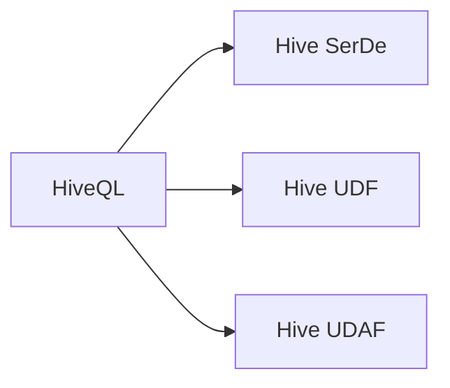

# Hive UDF自定义函数原理与代码实例讲解

作者：禅与计算机程序设计艺术 / Zen and the Art of Computer Programming

## 1. 背景介绍

### 1.1 问题的由来

Hive 是 Apache Hadoop 生态系统中的一个重要组件，它提供了一套基于 SQL 的数据查询语言，允许用户在 Hadoop 集群上对大数据进行查询和分析。然而，Hive 的内置函数库有限，无法满足所有用户的具体需求。为了解决这个问题，Hive 提供了用户自定义函数（User Defined Functions，简称 UDF）的功能，允许用户根据自身需求开发定制化的函数。

### 1.2 研究现状

随着大数据技术的快速发展，Hive UDF 已经成为了数据分析人员解决特定问题的重要工具。许多开源社区和商业公司都提供了丰富的 UDF 库，覆盖了数据转换、数据清洗、数据校验等多个方面。同时，随着 Python、Java、Scala 等语言的流行，开发 UDF 变得更加简单易行。

### 1.3 研究意义

Hive UDF 的研究意义主要体现在以下几个方面：

- **扩展 Hive 函数库**：通过开发 UDF，可以扩展 Hive 的函数库，满足用户在特定场景下的需求。
- **提高数据分析效率**：针对特定场景优化的 UDF 可以提高数据分析的效率。
- **降低开发成本**：使用 UDF 可以避免重复开发，降低数据分析项目的开发成本。
- **提高数据分析的灵活性**：UDF 可以根据用户需求灵活定制，提高数据分析的灵活性。

### 1.4 本文结构

本文将首先介绍 Hive UDF 的核心概念与联系，然后详细讲解 UDF 的原理和开发步骤，并通过具体的代码实例进行讲解。最后，本文将探讨 UDF 的应用场景和未来发展趋势。

## 2. 核心概念与联系

### 2.1 Hive UDF 的核心概念

Hive UDF 是指用户定义的函数，它允许用户在 Hive 中使用自定义的函数。UDF 可以使用 Java、Python、Scala 等语言编写，并可以通过 HiveQL 调用。

### 2.2 UDF 的联系

- **HiveQL**：Hive 的查询语言，用于对 Hive 数据进行查询和分析。
- **Hive SerDe**：Hive 的序列化和反序列化机制，用于将数据转换为 Hive 可识别的格式。
- **Hive UDF**：用户自定义的函数，用于扩展 Hive 的函数库。
- **Hive UDAF**：用户自定义的聚合函数，用于对数据进行聚合操作。

以下是 UDF、HiveQL、Hive SerDe 和 Hive UDAF 之间的逻辑关系：



## 3. 核心算法原理 & 具体操作步骤

### 3.1 算法原理概述

Hive UDF 的原理是将用户编写的函数封装成 jar 包，然后在 Hive 中注册并使用。当 HiveQL 查询调用 UDF 时，Hive 会将查询语句中的函数调用转换为对应的 Java 调用，并将参数传递给 UDF，UDF 完成计算后返回结果。

### 3.2 算法步骤详解

开发 Hive UDF 的步骤如下：

1. **定义 UDF 类**：使用 Java 语言定义一个继承自 `org.apache.hadoop.hive.ql.exec.UDF` 的类。
2. **重写 `evaluate` 方法**：在 UDF 类中重写 `evaluate` 方法，该方法负责实现 UDF 的功能。
3. **编译并打包**：将 UDF 类编译成 class 文件，并打包成 jar 包。
4. **在 Hive 中注册**：使用 `ADD JAR` 语句在 Hive 中注册 jar 包。
5. **使用 UDF**：在 HiveQL 查询中使用 UDF。

### 3.3 算法优缺点

Hive UDF 的优点如下：

- **灵活性强**：可以开发任意功能的 UDF，满足用户的特定需求。
- **易于开发**：使用 Java 语言开发，技术门槛较低。

Hive UDF 的缺点如下：

- **性能较低**：与 Hive 内置函数相比，UDF 的性能可能较低。
- **可移植性较差**：UDF 依赖于 Java 环境，可移植性较差。

### 3.4 算法应用领域

Hive UDF 可以应用于以下领域：

- **数据转换**：将一种数据类型转换为另一种数据类型，例如将字符串转换为日期。
- **数据清洗**：去除数据中的噪声，例如去除空值、重复值等。
- **数据校验**：验证数据的正确性，例如验证电话号码、身份证号码等。

## 4. 数学模型和公式 & 详细讲解 & 举例说明

### 4.1 数学模型构建

Hive UDF 的核心是 `evaluate` 方法，该方法可以看作是一个数学模型。以下是一个简单的 UDF 示例，该 UDF 用于计算两个数的和：

```java
public class SumUDF extends UDF {
    public BigDecimal evaluate(BigDecimal a, BigDecimal b) {
        return a.add(b);
    }
}
```

在上面的代码中，`evaluate` 方法接受两个 `BigDecimal` 类型的参数，并返回它们的和。

### 4.2 公式推导过程

上述 UDF 的公式推导过程非常简单，即：

$$
\text{和} = a + b
$$

### 4.3 案例分析与讲解

以下是一个更复杂的 UDF 示例，该 UDF 用于计算字符串的长度：

```java
public class LengthUDF extends UDF {
    public Integer evaluate(String str) {
        return str.length();
    }
}
```

在上面的代码中，`evaluate` 方法接受一个 `String` 类型的参数，并返回该字符串的长度。

### 4.4 常见问题解答

**Q1：如何处理 UDF 的异常情况？**

A：在 `evaluate` 方法中，可以使用 try-catch 语句捕获异常，并根据异常类型返回不同的值，例如返回 `null` 或抛出自定义异常。

**Q2：如何访问 UDF 的上下文信息？**

A：UDF 可以通过 ` getCurrent()` 方法访问当前上下文信息，例如当前表的名称、当前行的行号等。

## 5. 项目实践：代码实例和详细解释说明

### 5.1 开发环境搭建

以下是使用 Java 语言开发 Hive UDF 的环境搭建步骤：

1. 安装 Java 开发环境：下载并安装 Java 开发环境，例如 JDK 1.8。
2. 安装 Maven：下载并安装 Maven，用于构建 UDF 项目。
3. 创建 UDF 项目：使用 Maven 创建一个 Java 项目，并添加 Hive 依赖。

### 5.2 源代码详细实现

以下是一个简单的 UDF 示例，该 UDF 用于计算两个数的和：

```java
import org.apache.hadoop.hive.ql.exec.UDF;
import org.apache.hadoop.hive.ql.exec.UDFArgumentException;
import org.apache.hadoop.hive.ql.metadata.HiveException;
import org.apache.hadoop.hive.ql.udf.UDFType;
import org.apache.hadoop.io.BigDecimal;
import org.apache.hadoop.io.DoubleWritable;
import org.apache.hadoop.io.Text;

@UDFType(deterministic = true, deterministicWithSameTypeArgs = true, stateful = false)
public class SumUDF extends UDF {
    public BigDecimal evaluate(BigDecimal a, BigDecimal b) throws UDFArgumentException {
        if (a == null || b == null) {
            throw new UDFArgumentException("Input parameters cannot be null");
        }
        return a.add(b);
    }
}
```

### 5.3 代码解读与分析

在上面的代码中，`@UDFType` 注解用于指定 UDF 的类型，`evaluate` 方法实现 UDF 的功能。`evaluate` 方法接受两个 `BigDecimal` 类型的参数，并返回它们的和。

### 5.4 运行结果展示

以下是一个使用 UDF 的 HiveQL 查询示例：

```sql
SELECT SumUDF(col1, col2) FROM mytable;
```

在上面的查询中，`SumUDF` 是注册的 UDF，`col1` 和 `col2` 是查询表中的列。

## 6. 实际应用场景

### 6.1 数据转换

以下是一个数据转换的场景，该场景用于将字符串日期转换为日期类型：

```java
import org.apache.hadoop.hive.ql.exec.UDF;
import org.apache.hadoop.hive.ql.metadata.HiveException;
import org.apache.hadoop.hive.ql.udf.UDFType;
import org.apache.hadoop.io.Text;
import java.text.SimpleDateFormat;
import java.util.Date;

@UDFType(deterministic = true, deterministicWithSameTypeArgs = true, stateful = false)
public class StringToDateUDF extends UDF {
    public Date evaluate(String str) throws HiveException {
        try {
            SimpleDateFormat sdf = new SimpleDateFormat("yyyy-MM-dd");
            return sdf.parse(str);
        } catch (Exception e) {
            throw new HiveException("Invalid date format");
        }
    }
}
```

### 6.2 数据清洗

以下是一个数据清洗的场景，该场景用于去除字符串中的空格：

```java
import org.apache.hadoop.hive.ql.exec.UDF;
import org.apache.hadoop.hive.ql.metadata.HiveException;
import org.apache.hadoop.hive.ql.udf.UDFType;
import org.apache.hadoop.io.Text;

@UDFType(deterministic = true, deterministicWithSameTypeArgs = true, stateful = false)
public class TrimUDF extends UDF {
    public Text evaluate(Text str) throws HiveException {
        if (str == null) {
            return null;
        }
        return new Text(str.toString().trim());
    }
}
```

### 6.4 未来应用展望

随着大数据技术的不断发展，Hive UDF 将在以下方面得到进一步的应用：

- **支持更多编程语言**：除了 Java，Hive UDF 将支持更多编程语言，例如 Python、Scala 等。
- **支持更丰富的函数类型**：Hive UDF 将支持更丰富的函数类型，例如 UDF、UDAF、UDTF 等。
- **提高性能**：通过优化 UDF 的执行效率，提高 Hive 查询的性能。

## 7. 工具和资源推荐

### 7.1 学习资源推荐

- Apache Hive 官方文档：https://hive.apache.org/
- Hive UDF 开发指南：https://cwiki.apache.org/confluence/display/Hive/LanguageManual+UDF
- Java UDF 开发指南：https://docs.oracle.com/javase/tutorial/java/i18n/strings.html

### 7.2 开发工具推荐

- IntelliJ IDEA：一款功能强大的 Java 集成开发环境，支持 Maven 构建 UDF 项目。
- Eclipse：一款开源的 Java 集成开发环境，也支持 Maven 构建 UDF 项目。

### 7.3 相关论文推荐

- Apache Hive: A Data Warehouse Solution Based on Hadoop：介绍了 Hive 的基本原理和功能。
- Hive: Beyond MapReduce and the DataFlow Paradigm：介绍了 Hive 的设计理念和架构。

### 7.4 其他资源推荐

- Apache Hive 社区：https://cwiki.apache.org/confluence/display/Hive/Home
- Apache Hadoop 社区：https://hadoop.apache.org/

## 8. 总结：未来发展趋势与挑战

### 8.1 研究成果总结

本文介绍了 Hive UDF 的核心概念、原理、开发步骤和代码实例。通过本文的学习，读者可以了解到 Hive UDF 的基本用法，并能够根据自身需求开发定制化的函数。

### 8.2 未来发展趋势

随着大数据技术的不断发展，Hive UDF 将在以下方面得到进一步的发展：

- **支持更多编程语言**：除了 Java，Hive UDF 将支持更多编程语言，例如 Python、Scala 等。
- **支持更丰富的函数类型**：Hive UDF 将支持更丰富的函数类型，例如 UDF、UDAF、UDTF 等。
- **提高性能**：通过优化 UDF 的执行效率，提高 Hive 查询的性能。

### 8.3 面临的挑战

Hive UDF 在未来的发展中仍面临着以下挑战：

- **性能优化**：如何提高 UDF 的执行效率，降低对 Hive 查询性能的影响。
- **易用性提升**：如何简化 UDF 的开发和使用过程，降低用户的学习成本。
- **安全性保障**：如何保障 UDF 的安全性，避免恶意代码的攻击。

### 8.4 研究展望

随着大数据技术的不断发展，Hive UDF 将在以下方面得到进一步的研究：

- **基于云的 UDF 服务**：将 UDF 作为云服务提供，方便用户使用。
- **基于机器学习的 UDF**：利用机器学习技术自动生成 UDF，提高 UDF 的开发效率。
- **基于知识的 UDF**：将知识库与 UDF 相结合，实现更加智能的数据分析。

## 9. 附录：常见问题与解答

**Q1：如何将 UDF 部署到 Hive 集群？**

A：将 UDF 打包成 jar 包后，使用 `ADD JAR` 语句将 jar 包添加到 Hive 集群的类路径中。

**Q2：如何调试 UDF？**

A：可以使用调试工具（如 IntelliJ IDEA、Eclipse 等）对 UDF 进行调试。

**Q3：如何优化 UDF 的性能？**

A：可以通过以下方法优化 UDF 的性能：
- 优化代码逻辑，减少不必要的计算。
- 使用高效的算法和数据结构。
- 使用并行计算技术。

**Q4：如何测试 UDF？**

A：可以编写测试用例，使用测试工具（如 JUnit 等）对 UDF 进行测试。

通过本文的学习，读者可以了解到 Hive UDF 的基本用法和开发技巧，并能够根据自身需求开发定制化的函数。相信随着大数据技术的不断发展，Hive UDF 将在数据分析领域发挥越来越重要的作用。

---

作者：禅与计算机程序设计艺术 / Zen and the Art of Computer Programming