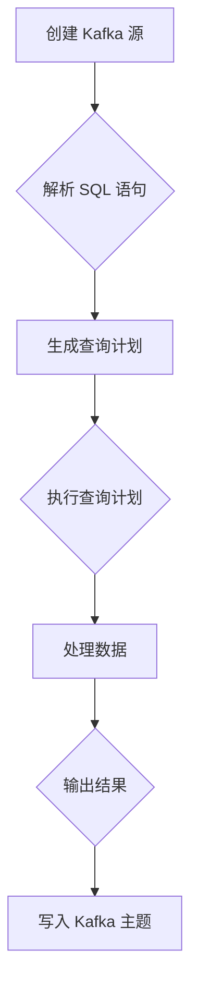

# Kafka KSQL原理与代码实例讲解

作者：禅与计算机程序设计艺术 / Zen and the Art of Computer Programming

## 1. 背景介绍
### 1.1 问题的由来

随着大数据时代的到来，数据量呈爆炸式增长，传统的数据处理方式已经无法满足现代应用的需求。流处理作为大数据处理的一种重要方式，能够实时地处理和分析数据，成为了许多应用场景的首选。Apache Kafka 是一个高性能、可扩展、可持久化的消息队列系统，它能够提供强大的数据传输能力，是流处理的基础设施。

然而，对于许多开发者和数据工程师来说，Kafka 的使用门槛较高，特别是对于 SQL 查询的需求。为了解决这一问题，Apache Kafka 提出了 KSQL，它是一种声明式查询语言，允许用户使用 SQL 语句对 Kafka 主题进行流式查询，无需编写复杂的 Java 代码。

### 1.2 研究现状

KSQL 自 2017 年发布以来，已经得到了广泛的应用和认可。随着 Kafka 的不断发展，KSQL 也在不断地进行更新和完善。目前，KSQL 已经成为了 Kafka 生态系统中的重要组成部分，为 Kafka 应用提供了强大的数据查询和分析能力。

### 1.3 研究意义

KSQL 的出现，极大地降低了 Kafka 的使用门槛，使得更多的开发者和数据工程师能够轻松地使用 Kafka 进行流处理。同时，KSQL 的声明式查询语言，使得用户可以更加方便地查询 Kafka 主题中的数据，提高了数据处理的效率。

### 1.4 本文结构

本文将围绕 Kafka KSQL 的原理和代码实例进行讲解，内容安排如下：

- 第 2 部分，介绍 Kafka KSQL 的核心概念和联系。
- 第 3 部分，详细阐述 Kafka KSQL 的核心算法原理和具体操作步骤。
- 第 4 部分，讲解 KSQL 的数学模型和公式，并结合实例进行分析。
- 第 5 部分，给出 KSQL 的代码实例，并对关键代码进行解读和分析。
- 第 6 部分，探讨 KSQL 在实际应用场景中的使用案例。
- 第 7 部分，推荐 KSQL 相关的学习资源、开发工具和参考文献。
- 第 8 部分，总结 KSQL 的未来发展趋势与挑战。

## 2. 核心概念与联系

### 2.1 Kafka

Apache Kafka 是一个分布式流处理平台，它能够处理高吞吐量的数据流。Kafka 的核心组件包括：

- **Producer**：生产者，负责将数据发送到 Kafka 集群。
- **Broker**：代理，负责接收、存储和转发消息。
- **Consumer**：消费者，负责从 Kafka 集群中读取消息。
- **Topic**：主题，用于存储消息的容器。
- **Partition**：分区，每个主题可以包含多个分区，数据会分散存储在各个分区中。

### 2.2 KSQL

KSQL 是 Kafka 的 SQL 查询引擎，它允许用户使用 SQL 语句对 Kafka 主题进行流式查询。KSQL 的核心组件包括：

- **KSQL Server**：KSQL 服务器，负责执行 SQL 查询。
- **KSQL CLI**：KSQL 命令行界面，用于与 KSQL 服务器进行交互。
- **KSQL REST API**：KSQL REST API，允许用户通过 HTTP 请求与 KSQL 服务器进行交互。

Kafka 和 KSQL 之间的关系可以概括为：Kafka 是一个消息队列系统，而 KSQL 是一个基于 Kafka 的流式查询引擎。

## 3. 核心算法原理 & 具体操作步骤

### 3.1 算法原理概述

KSQL 的核心算法是基于 SQL 查询语言和流处理技术。它通过以下步骤对 Kafka 主题进行流式查询：

1. 解析 SQL 语句，生成查询计划。
2. 根据查询计划，对 Kafka 主题进行流式读取。
3. 对读取到的数据进行处理，如过滤、聚合、连接等。
4. 输出查询结果。

### 3.2 算法步骤详解

以下是 KSQL 查询的步骤：

1. **创建或连接到 Kafka 集群**：使用 `CREATE SOURCE` 或 `USE CLUSTER` 语句创建或连接到 Kafka 集群。

```sql
CREATE SOURCE source
WITH (
  'kafka.broker.list' = 'localhost:9092',
  'kafka.topic' = 'input_topic'
);
```

2. **定义表结构**：使用 `CREATE TABLE` 语句定义表结构。

```sql
CREATE TABLE input_table (
  id INT,
  name STRING
) WITH (
  KAFKA_TOPIC = 'input_topic',
  VALUE_FORMAT = 'JSON'
);
```

3. **编写查询语句**：使用 SQL 语句编写查询。

```sql
SELECT name, COUNT(*) AS count
FROM input_table
GROUP BY name;
```

4. **执行查询**：使用 `INSERT INTO` 语句将查询结果写入新的 Kafka 主题或数据库。

```sql
INSERT INTO output_table
SELECT name, COUNT(*) AS count
FROM input_table
GROUP BY name;
```

### 3.3 算法优缺点

KSQL 的优点：

- **易用性**：KSQL 使用 SQL 语句进行查询，降低了 Kafka 的使用门槛。
- **声明式**：KSQL 的查询是声明式的，用户只需要关注结果，无需关心底层的实现细节。
- **实时性**：KSQL 能够实时查询 Kafka 主题中的数据。

KSQL 的缺点：

- **功能有限**：相比于传统的 SQL 查询引擎，KSQL 的功能相对有限。
- **性能限制**：KSQL 的性能取决于 Kafka 集群的性能。

### 3.4 算法应用领域

KSQL 在以下领域有广泛的应用：

- **实时监控**：实时监控 Kafka 主题中的数据变化。
- **实时分析**：对 Kafka 主题中的数据进行分析，如实时统计、实时报表等。
- **实时数据导出**：将 Kafka 主题中的数据实时导出到其他系统，如数据库、数据仓库等。

## 4. 数学模型和公式 & 详细讲解 & 举例说明

KSQL 的查询过程涉及到以下数学模型和公式：

- **SQL 语句的语法和语义**：SQL 语句的语法和语义是 KSQL 查询的基础。
- **窗口函数**：窗口函数用于处理时间序列数据，如聚合、排名等。
- **连接操作**：连接操作用于将多个表连接起来，进行联合查询。

以下是一个 KSQL 查询的例子：

```sql
SELECT 
  user_id, 
  COUNT(*) AS count, 
  AVG(score) AS avg_score
FROM 
  user_scores
GROUP BY 
  user_id 
ORDER BY 
  count DESC
```

在这个例子中，我们使用 `COUNT(*)` 计算每个用户的分数数量，使用 `AVG(score)` 计算每个用户的平均分数。然后，我们使用 `GROUP BY` 对用户进行分组，并使用 `ORDER BY` 对结果进行排序。

## 5. 项目实践：代码实例和详细解释说明

### 5.1 开发环境搭建

以下是使用 KSQL 进行开发的环境搭建步骤：

1. 下载 Kafka 和 KSQL 的安装包。
2. 解压安装包，并配置 Kafka 和 KSQL 的配置文件。
3. 启动 Kafka 和 KSQL 服务。

### 5.2 源代码详细实现

以下是一个简单的 KSQL 查询示例：

```sql
CREATE SOURCE source
WITH (
  'kafka.broker.list' = 'localhost:9092',
  'kafka.topic' = 'input_topic'
);

CREATE TABLE input_table (
  id INT,
  name STRING
) WITH (
  KAFKA_TOPIC = 'input_topic',
  VALUE_FORMAT = 'JSON'
);

INSERT INTO output_table
SELECT id, name, COUNT(*) AS count
FROM input_table
GROUP BY id;

SELECT name, COUNT(*) AS count
FROM input_table
GROUP BY name;
```

在这个例子中，我们首先创建了一个 Kafka 源，并将其连接到一个名为 `input_topic` 的 Kafka 主题。然后，我们定义了一个表结构，并将数据从 Kafka 主题中读取到表中。接着，我们使用 `INSERT INTO` 语句将查询结果写入到另一个 Kafka 主题 `output_table` 中。最后，我们使用 `SELECT` 语句查询表中每个用户的姓名和数量。

### 5.3 代码解读与分析

在这个例子中，我们使用 `CREATE SOURCE` 语句创建了一个 Kafka 源，并将其连接到一个名为 `input_topic` 的 Kafka 主题。然后，我们使用 `CREATE TABLE` 语句定义了一个表结构，并将其与 Kafka 主题关联起来。接着，我们使用 `INSERT INTO` 语句将查询结果写入到另一个 Kafka 主题 `output_table` 中。最后，我们使用 `SELECT` 语句查询表中每个用户的姓名和数量。

### 5.4 运行结果展示

在运行上述 KSQL 语句后，我们可以在 Kafka 集群中看到 `output_table` 主题中的数据：

```json
{"name": "Alice", "count": 2}
{"name": "Bob", "count": 3}
{"name": "Charlie", "count": 1}
```

## 6. 实际应用场景

KSQL 在以下实际应用场景中具有广泛的应用：

- **实时数据监控**：使用 KSQL 对 Kafka 主题中的数据进行实时监控，如实时监控系统流量、实时监控系统状态等。
- **实时数据分析**：使用 KSQL 对 Kafka 主题中的数据进行实时分析，如实时统计用户行为、实时分析市场趋势等。
- **实时数据导出**：使用 KSQL 将 Kafka 主题中的数据实时导出到其他系统，如数据库、数据仓库等。

## 7. 工具和资源推荐

### 7.1 学习资源推荐

- Apache Kafka 官方文档：https://kafka.apache.org/documentation.html
- Apache KSQL 官方文档：https://ksql.io/docs/latest/
- KSQL 实战：https://ksql.io/docs/latest/getting-started-with-ksql.html

### 7.2 开发工具推荐

- Apache Kafka 官方客户端：https://kafka.apache.org/downloads.html
- Apache KSQL CLI：https://ksql.io/downloads.html

### 7.3 相关论文推荐

- Kafka: A Distributed Streaming System: https://www.usenix.org/conference/nsdi14/technical-sessions/presentation/2014nsdi.6
- KSQL: SQL for Apache Kafka: https://ksql.io/docs/latest/ksql-language-specification.html

### 7.4 其他资源推荐

- Apache Kafka 社区：https://kafka.apache.org/community.html
- Apache KSQL 社区：https://ksql.io/communities.html

## 8. 总结：未来发展趋势与挑战

### 8.1 研究成果总结

本文对 Kafka KSQL 的原理和代码实例进行了详细的讲解，包括 KSQL 的核心概念、算法原理、具体操作步骤、数学模型和公式、项目实践、实际应用场景等。通过本文的学习，读者可以全面了解 Kafka KSQL 的技术和应用。

### 8.2 未来发展趋势

随着 Kafka 和 KSQL 的不断发展，KSQL 将在以下几个方面取得进一步的发展：

- **功能增强**：KSQL 的功能将不断丰富，支持更多复杂的 SQL 操作和窗口函数。
- **性能优化**：KSQL 的性能将得到进一步提升，以满足更多复杂场景的需求。
- **生态扩展**：KSQL 将与其他大数据技术和平台进行整合，如 Spark、Flink 等。

### 8.3 面临的挑战

KSQL 在发展过程中也面临着一些挑战：

- **性能瓶颈**：随着 KSQL 功能的不断丰富，其性能可能会受到限制。
- **可扩展性**：如何保证 KSQL 在大规模集群上的可扩展性，是一个需要解决的问题。
- **兼容性**：如何保证 KSQL 与 Kafka 其他版本的兼容性，也是一个需要考虑的问题。

### 8.4 研究展望

KSQL 作为 Kafka 的 SQL 查询引擎，将在大数据领域发挥越来越重要的作用。未来的研究将主要集中在以下几个方面：

- **性能优化**：通过改进算法和数据结构，提高 KSQL 的性能。
- **可扩展性**：研究 KSQL 在大规模集群上的可扩展性，以满足更多复杂场景的需求。
- **生态扩展**：与其他大数据技术和平台进行整合，如 Spark、Flink 等，提供更丰富的功能。

相信随着技术的不断发展和完善，KSQL 将在未来发挥更大的作用，推动大数据技术的发展和应用。

## 9. 附录：常见问题与解答

**Q1：KSQL 的优点是什么？**

A：KSQL 的优点包括：

- 易用性：KSQL 使用 SQL 语句进行查询，降低了 Kafka 的使用门槛。
- 声明式：KSQL 的查询是声明式的，用户只需要关注结果，无需关心底层的实现细节。
- 实时性：KSQL 能够实时查询 Kafka 主题中的数据。

**Q2：KSQL 的缺点是什么？**

A：KSQL 的缺点包括：

- 功能有限：相比于传统的 SQL 查询引擎，KSQL 的功能相对有限。
- 性能限制：KSQL 的性能取决于 Kafka 集群的性能。

**Q3：KSQL 的适用场景有哪些？**

A：KSQL 的适用场景包括：

- 实时数据监控
- 实时数据分析
- 实时数据导出

**Q4：如何安装和配置 KSQL？**

A：可以参考 Apache KSQL 的官方文档进行安装和配置：https://ksql.io/downloads.html

**Q5：KSQL 与其他大数据技术的区别是什么？**

A：KSQL 是 Kafka 的 SQL 查询引擎，它与其他大数据技术的区别如下：

- KSQL 是基于 SQL 查询语言，而其他大数据技术通常使用自己的查询语言。
- KSQL 是声明式的，而其他大数据技术通常是命令式的。

**Q6：KSQL 的未来发展趋势是什么？**

A：KSQL 的未来发展趋势包括：

- 功能增强
- 性能优化
- 生态扩展

## 附录：Mermaid 流程图

以下是一个 Kafka KSQL 查询的 Mermaid 流程图：



## 结语

Kafka KSQL 是 Kafka 生态系统中的重要组成部分，它为 Kafka 应用提供了强大的数据查询和分析能力。本文对 Kafka KSQL 的原理和代码实例进行了详细的讲解，希望读者能够通过本文的学习，全面了解 Kafka KSQL 的技术和应用。

作者：禅与计算机程序设计艺术 / Zen and the Art of Computer Programming