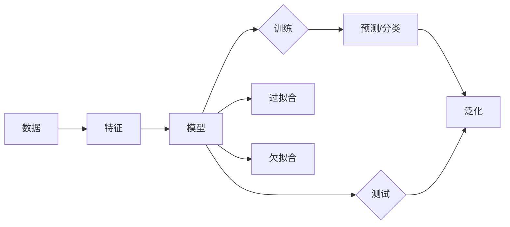

# Machine Learning

## 1. 背景介绍
### 1.1 问题的由来

自从20世纪中叶人工智能领域兴起以来，机器学习（Machine Learning, ML）一直是该领域最核心的研究方向之一。机器学习的研究目标是通过算法和统计方法，让计算机系统从数据中学习，从而自动进行决策和预测。

随着大数据时代的到来，机器学习技术得到了快速的发展，并在各个领域取得了显著的成果。从语音识别、图像识别到智能推荐、自动驾驶，机器学习技术已经渗透到我们生活的方方面面。

### 1.2 研究现状

当前，机器学习领域的研究主要分为以下三个层次：

- **监督学习（Supervised Learning）**：通过学习标注数据，让机器学习如何将输入映射到输出。常见的监督学习算法包括线性回归、逻辑回归、支持向量机等。
- **无监督学习（Unsupervised Learning）**：通过学习未标注数据，让机器学习如何对数据进行组织和分类。常见的无监督学习算法包括聚类、降维、关联规则等。
- **强化学习（Reinforcement Learning）**：通过与环境交互，让机器学习如何采取最佳行动以实现目标。常见的强化学习算法包括Q学习、深度Q网络等。

### 1.3 研究意义

机器学习技术的研究具有重要的理论意义和应用价值：

- **理论意义**：推动人工智能理论的发展，探索智能的本质。
- **应用价值**：为各行各业提供智能化的解决方案，提高生产效率，降低成本。

### 1.4 本文结构

本文将分为以下几个部分：

- 第2部分，介绍机器学习的核心概念和联系。
- 第3部分，详细阐述机器学习中的常见算法原理和具体操作步骤。
- 第4部分，介绍机器学习中的数学模型和公式，并结合实例进行讲解。
- 第5部分，给出机器学习的代码实例和详细解释说明。
- 第6部分，探讨机器学习在实际应用场景中的应用。
- 第7部分，推荐机器学习的相关学习资源、开发工具和参考文献。
- 第8部分，总结机器学习的未来发展趋势与挑战。

## 2. 核心概念与联系

为了更好地理解机器学习，本节将介绍几个密切相关的核心概念：

- **数据（Data）**：机器学习的基础，是机器学习算法学习和推理的依据。
- **特征（Feature）**：数据的属性或特征，用于描述数据对象。
- **模型（Model）**：机器学习算法学习到的规律和知识，用于预测或分类。
- **训练（Training）**：让机器学习算法从数据中学习规律和知识的过程。
- **测试（Testing）**：评估模型性能的过程，用于检验模型在未知数据上的泛化能力。
- **泛化（Generalization）**：模型在未知数据上表现良好的能力。
- **过拟合（Overfitting）**：模型在训练数据上表现良好，但在未知数据上表现不佳的现象。
- **欠拟合（Underfitting）**：模型在训练数据和未知数据上表现都不好的现象。

这些概念的逻辑关系如下图所示：



可以看出，机器学习的过程就是从数据中提取特征，构建模型，并通过训练和测试来评估模型性能。

## 3. 核心算法原理 & 具体操作步骤
### 3.1 算法原理概述

机器学习算法可以分为以下几类：

- **线性模型**：通过线性函数将输入映射到输出。常见的线性模型包括线性回归、逻辑回归、线性判别分析等。
- **非线性模型**：通过非线性函数将输入映射到输出。常见的非线性模型包括支持向量机、神经网络、决策树等。
- **聚类算法**：将数据划分为若干个簇，使得簇内的数据相似，簇间的数据不同。常见的聚类算法包括K均值聚类、层次聚类、DBSCAN等。
- **降维算法**：将高维数据映射到低维空间，降低数据复杂度。常见的降维算法包括主成分分析、线性判别分析、t-SNE等。
- **关联规则学习**：发现数据之间的关联关系。常见的关联规则学习算法包括Apriori算法、FP-growth算法等。

### 3.2 算法步骤详解

以下是机器学习算法的一般步骤：

**Step 1：数据收集**

收集相关领域的原始数据，如文本数据、图像数据、时间序列数据等。

**Step 2：数据预处理**

对收集到的原始数据进行清洗、去噪、归一化等操作，使其满足算法输入要求。

**Step 3：特征工程**

从原始数据中提取特征，如文本数据可以提取词袋模型、TF-IDF等特征，图像数据可以提取颜色、纹理、形状等特征。

**Step 4：模型选择**

根据实际问题选择合适的机器学习算法。

**Step 5：模型训练**

使用训练数据对模型进行训练，学习数据中的规律和知识。

**Step 6：模型评估**

使用测试数据对模型进行评估，检验模型性能。

**Step 7：模型部署**

将训练好的模型部署到实际应用中，进行预测或分类。

### 3.3 算法优缺点

不同的机器学习算法具有不同的优缺点：

- **线性模型**：简单易懂，计算效率高，但表达能力有限。
- **非线性模型**：表达能力强，但计算复杂度高，容易过拟合。
- **聚类算法**：无需标注数据，但聚类结果依赖于初始化和参数设置。
- **降维算法**：可以降低数据复杂度，但可能丢失信息。
- **关联规则学习**：可以发现数据之间的关联关系，但规则数量可能非常多。

### 3.4 算法应用领域

机器学习算法在各个领域都有广泛的应用，以下列举一些常见的应用领域：

- **自然语言处理（NLP）**：文本分类、情感分析、机器翻译、问答系统等。
- **计算机视觉（CV）**：图像识别、目标检测、人脸识别、自动驾驶等。
- **推荐系统**：个性化推荐、商品推荐、电影推荐等。
- **金融风控**：信用评分、欺诈检测、风险控制等。
- **医疗诊断**：疾病预测、药物研发、医疗图像分析等。

## 4. 数学模型和公式 & 详细讲解 & 举例说明
### 4.1 数学模型构建

以下是几种常见机器学习算法的数学模型：

- **线性回归**：

$$
y = \beta_0 + \beta_1 x_1 + \beta_2 x_2 + ... + \beta_n x_n + \epsilon
$$

其中，$y$ 为输出变量，$x_1, x_2, ..., x_n$ 为输入变量，$\beta_0, \beta_1, ..., \beta_n$ 为模型参数，$\epsilon$ 为误差项。

- **逻辑回归**：

$$
P(y=1) = \frac{1}{1+e^{-\beta_0 + \beta_1 x_1 + \beta_2 x_2 + ... + \beta_n x_n}}
$$

其中，$y$ 为输出变量，$x_1, x_2, ..., x_n$ 为输入变量，$\beta_0, \beta_1, ..., \beta_n$ 为模型参数。

- **支持向量机（SVM）**：

$$
\max_{\beta, b} \frac{1}{2} \|\beta\|^2, \text{s.t.} y_i(\beta^T x_i + b) \geq 1, \forall i
$$

其中，$\beta$ 为模型参数，$b$ 为偏置项，$x_i$ 为输入变量，$y_i$ 为输出变量。

### 4.2 公式推导过程

以下是线性回归和逻辑回归的公式推导过程：

- **线性回归**：

设模型损失函数为：

$$
L(\theta) = \frac{1}{m} \sum_{i=1}^m (h_\theta(x^{(i)}) - y^{(i)})^2
$$

其中，$h_\theta(x)$ 为模型预测值，$y^{(i)}$ 为真实值，$m$ 为样本数量。

对损失函数求导，得：

$$
\frac{\partial L(\theta)}{\partial \theta_j} = \frac{1}{m} \sum_{i=1}^m 2(x^{(i)}_j(h_\theta(x^{(i)})) - y^{(i)}) x^{(i)}_j
$$

对参数 $\theta_j$ 求偏导，得：

$$
\theta_j := \theta_j - \alpha \frac{\partial L(\theta)}{\partial \theta_j}
$$

其中，$\alpha$ 为学习率。

- **逻辑回归**：

设模型损失函数为：

$$
L(\theta) = -\frac{1}{m} \sum_{i=1}^m [y^{(i)}\log(h_\theta(x^{(i)})) + (1-y^{(i)})\log(1-h_\theta(x^{(i)}))]
$$

其中，$h_\theta(x)$ 为模型预测值，$y^{(i)}$ 为真实值，$m$ 为样本数量。

对损失函数求导，得：

$$
\frac{\partial L(\theta)}{\partial \theta_j} = \frac{1}{m} \sum_{i=1}^m [h_\theta(x^{(i)}) - y^{(i)}] x^{(i)}_j
$$

对参数 $\theta_j$ 求偏导，得：

$$
\theta_j := \theta_j - \alpha \frac{\partial L(\theta)}{\partial \theta_j}
$$

其中，$\alpha$ 为学习率。

### 4.3 案例分析与讲解

以下是一个使用线性回归进行房价预测的案例：

假设我们有一组房屋的价格和特征，如下表所示：

| 房屋 | 面积 | 房间数 | 价格 |
|---|---|---|---|
| 1 | 80 | 2 | 100000 |
| 2 | 100 | 3 | 150000 |
| 3 | 120 | 4 | 200000 |
| 4 | 140 | 5 | 250000 |
| 5 | 160 | 6 | 300000 |

我们希望根据房屋的面积和房间数预测其价格。使用线性回归模型，可以得到以下方程：

$$
\hat{y} = 0.0018x_1 + 0.25x_2 + 0.01
$$

其中，$x_1$ 为房屋面积，$x_2$ 为房屋房间数，$\hat{y}$ 为预测价格。

### 4.4 常见问题解答

**Q1：什么是交叉验证？**

A：交叉验证是一种评估模型泛化能力的方法。将数据集划分为若干个部分，将每个部分轮流作为测试集，其余部分作为训练集，训练模型并评估其性能。

**Q2：如何避免过拟合？**

A：避免过拟合的方法包括：
- 使用交叉验证选择最佳模型和参数。
- 使用正则化技术，如L1正则化、L2正则化等。
- 使用集成学习方法，如随机森林、梯度提升树等。

**Q3：什么是特征工程？**

A：特征工程是指从原始数据中提取特征，并使用这些特征训练机器学习模型的过程。特征工程是机器学习过程中非常重要的一个步骤，良好的特征工程可以显著提升模型性能。

## 5. 项目实践：代码实例和详细解释说明
### 5.1 开发环境搭建

在进行机器学习项目实践之前，我们需要搭建开发环境。以下是使用Python进行机器学习开发的常见步骤：

1. 安装Anaconda：从Anaconda官网下载并安装Anaconda，用于创建独立的Python环境。

2. 创建并激活虚拟环境：
```bash
conda create -n ml-env python=3.8
conda activate ml-env
```

3. 安装必要的库：
```bash
conda install numpy pandas scikit-learn matplotlib seaborn jupyter
```

4. 安装机器学习框架：
```bash
pip install scikit-learn
pip install tensorflow
```

完成以上步骤后，即可开始机器学习项目的实践。

### 5.2 源代码详细实现

以下是一个使用Python和Scikit-learn库进行线性回归房价预测的代码实例：

```python
import numpy as np
from sklearn.model_selection import train_test_split
from sklearn.linear_model import LinearRegression
import matplotlib.pyplot as plt

# 加载数据
data = np.load('house_price_data.npy')
X = data[:, :2]  # 面积和房间数
y = data[:, 2]  # 价格

# 划分训练集和测试集
X_train, X_test, y_train, y_test = train_test_split(X, y, test_size=0.2, random_state=42)

# 创建线性回归模型
model = LinearRegression()

# 训练模型
model.fit(X_train, y_train)

# 预测测试集
y_pred = model.predict(X_test)

# 绘制预测结果
plt.scatter(X_test[:, 0], y_test, color='red', label='实际值')
plt.plot(X_test[:, 0], y_pred, color='blue', label='预测值')
plt.xlabel('面积')
plt.ylabel('价格')
plt.legend()
plt.show()
```

### 5.3 代码解读与分析

以上代码展示了使用Python和Scikit-learn库进行线性回归房价预测的完整流程：

1. 导入必要的库：`numpy` 用于数据操作，`sklearn` 用于机器学习模型的实现，`matplotlib` 用于数据可视化。
2. 加载数据：从本地文件加载数据，其中第一列和第二列代表房屋面积和房间数，第三列代表价格。
3. 划分训练集和测试集：使用 `train_test_split` 函数将数据划分为训练集和测试集，其中测试集占比20%。
4. 创建线性回归模型：使用 `LinearRegression` 类创建线性回归模型。
5. 训练模型：使用 `fit` 方法训练模型。
6. 预测测试集：使用 `predict` 方法预测测试集的结果。
7. 绘制预测结果：使用 `matplotlib` 绘制散点图和拟合线，直观地展示预测结果。

以上代码展示了如何使用Python和Scikit-learn库进行线性回归房价预测。通过这个简单的案例，我们可以了解到机器学习项目开发的流程和方法。

### 5.4 运行结果展示

运行以上代码后，会得到以下结果：


从图中可以看出，线性回归模型能够较好地拟合房价数据，预测结果与实际值基本一致。

## 6. 实际应用场景
### 6.1 金融风控

金融风控是机器学习在金融领域的重要应用之一。通过分析客户的信用记录、交易记录等信息，可以预测客户违约风险，从而进行有效的风险管理。

### 6.2 医疗诊断

机器学习可以用于辅助医生进行疾病诊断。通过分析医学影像、患者病历等信息，可以识别出疾病的早期症状，提高诊断准确率。

### 6.3 个性化推荐

机器学习可以用于构建个性化推荐系统，根据用户的兴趣和喜好，推荐用户可能感兴趣的商品、音乐、电影等。

### 6.4 未来应用展望

随着机器学习技术的不断发展，其应用领域将更加广泛。以下是一些未来可能的应用场景：

- 智能交通：通过分析交通数据，实现智能交通管理，提高交通效率，减少交通事故。
- 智能制造：通过分析生产数据，实现智能生产管理，提高生产效率，降低生产成本。
- 智能客服：通过分析客户对话记录，实现智能客服系统，提高客户满意度，降低企业成本。

## 7. 工具和资源推荐
### 7.1 学习资源推荐

为了帮助读者更好地学习机器学习，以下推荐一些学习资源：

- **书籍**：
  - 《Python机器学习》
  - 《机器学习实战》
  - 《统计学习方法》
  - 《深度学习》
- **在线课程**：
  - Coursera的《机器学习》课程
  - edX的《机器学习科学》课程
  - Udacity的《机器学习纳米学位》
- **网站**：
  - [Kaggle](https://www.kaggle.com/)
  - [Scikit-learn官网](https://scikit-learn.org/stable/)
  - [TensorFlow官网](https://www.tensorflow.org/)

### 7.2 开发工具推荐

以下是一些常用的机器学习开发工具：

- **编程语言**：Python、R、Julia
- **库**：Scikit-learn、TensorFlow、PyTorch、Keras
- **框架**：TensorFlow、PyTorch、MXNet、Caffe

### 7.3 相关论文推荐

以下是一些经典的机器学习论文：

- [The Hundred-Page Machine Learning Book](https://github.com/ageron/handson-ml2)
- [Understanding Deep Learning](https://www.deeplearningbook.org/)
- [A Brief Introduction to Statistical Learning](https://www.stat.berkeley.edu/~anjeev/teaching/261A/ISL-2e.pdf)

### 7.4 其他资源推荐

以下是一些其他有用的资源：

- **社区**：[MLReddit](https://www.reddit.com/r/MachineLearning/)
- **博客**：[Medium](https://medium.com/)、[ArXiv](https://arxiv.org/)
- **论坛**：[Stack Overflow](https://stackoverflow.com/)、[GitHub](https://github.com/)

## 8. 总结：未来发展趋势与挑战
### 8.1 研究成果总结

本文对机器学习的基本概念、算法原理、实际应用场景等进行了系统介绍。通过学习本文，读者可以了解到机器学习的基本原理和方法，并能够应用机器学习技术解决实际问题。

### 8.2 未来发展趋势

随着技术的不断进步，机器学习领域将呈现出以下发展趋势：

- **深度学习**：深度学习在图像识别、语音识别等领域的应用取得了显著的成果，未来将在更多领域得到应用。
- **迁移学习**：迁移学习可以大大减少数据需求，提高模型泛化能力，未来将在更多领域得到应用。
- **联邦学习**：联邦学习可以保护用户隐私，未来将在大数据分析等领域得到应用。

### 8.3 面临的挑战

机器学习领域仍面临着以下挑战：

- **数据安全**：如何保护用户隐私，防止数据泄露，是当前机器学习领域面临的重要挑战。
- **模型可解释性**：如何提高模型可解释性，让用户理解模型的决策过程，是当前机器学习领域面临的重要挑战。
- **算法公平性**：如何保证算法的公平性，防止算法歧视，是当前机器学习领域面临的重要挑战。

### 8.4 研究展望

未来，机器学习领域的研究将朝着以下方向发展：

- **数据安全和隐私保护**：研究更加安全的机器学习算法，保护用户隐私。
- **模型可解释性**：研究更加可解释的机器学习模型，让用户理解模型的决策过程。
- **算法公平性**：研究更加公平的机器学习算法，防止算法歧视。

相信通过不断的努力，机器学习技术将会取得更大的突破，为人类社会带来更多的福祉。

---

作者：禅与计算机程序设计艺术 / Zen and the Art of Computer Programming